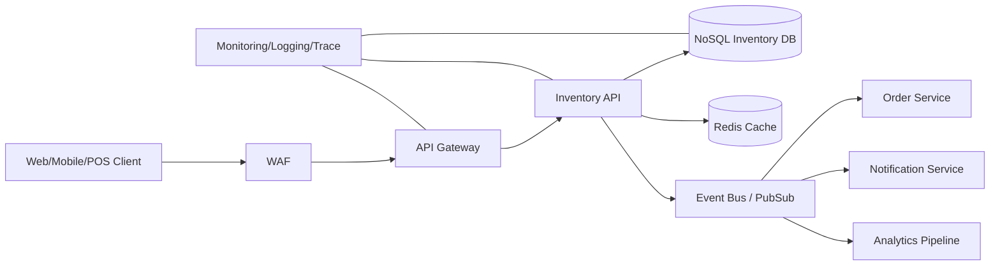

[[Home]]

# Cloud Engineer Magazine (2026-05-18)

## 1) 今日のアプリ
**リアルタイム在庫同期付きD2CコマースAPI**

ECサイト・モバイルアプリ・店舗POSから在庫を更新し、在庫引当を数秒以内で反映するAPI基盤を作る。

---

## 2) 要件整理
### 機能要件
- 商品一覧/在庫照会API
- 注文確定時の在庫引当（重複引当防止）
- 在庫更新イベント配信（EC/アプリ/POSへ）
- 管理者向け在庫調整バッチ

### 非機能要件
- **可用性**: API 99.95%以上、リージョン障害時はRTO 30分以内
- **性能**: 在庫照会 P95 < 150ms、在庫更新の伝播 < 5秒
- **セキュリティ**: 最小権限IAM、KMS暗号化、WAF、監査ログ保全
- **コスト**: 平常時はサーバレス中心、セール時だけ自動スケール

---

## 3) 推奨アーキテクチャ（なぜその構成か）
**方針: 単一クラウド本番（AWS）+ 他クラウドで同等構成を学習比較**

- 読み取りトラフィックが大きいので、NoSQL + キャッシュで低遅延化
- 書き込み整合性は「在庫引当API」を単一責務に集約し、条件付き更新で競合防止
- 非同期連携（イベント駆動）でPOS/通知/分析を疎結合化
- サーバレス優先により、通常負荷で運用負担とコストを最小化

---

## 4) クラウド別実装マップ
### AWS での実装サービス
- API: **Amazon API Gateway** + **AWS Lambda**
- 在庫DB: **Amazon DynamoDB**（条件付き書き込み）
- イベント: **Amazon EventBridge**（または SNS/SQS）
- キャッシュ: **Amazon ElastiCache for Redis**
- 認証: **Amazon Cognito**
- 監視: **Amazon CloudWatch** + **AWS X-Ray**
- セキュリティ: **AWS WAF**, **AWS KMS**, **IAM**

### OCI での実装サービス
- API: **OCI API Gateway** + **OCI Functions**
- 在庫DB: **OCI NoSQL Database**
- イベント: **OCI Events** + **OCI Streaming**
- キャッシュ: **OCI Cache with Redis**
- 認証: **OCI IAM**（IDドメイン）
- 監視: **OCI Monitoring** + **OCI Logging** + **Application Performance Monitoring**
- セキュリティ: **OCI Web Application Firewall**, **OCI Vault**, **IAM Policies**

### GCP での実装サービス
- API: **API Gateway** + **Cloud Run**（または Cloud Functions）
- 在庫DB: **Firestore（Native mode）** または **Bigtable**（高スループット時）
- イベント: **Pub/Sub**
- キャッシュ: **Memorystore for Redis**
- 認証: **Identity Platform** または **IAM + IAP 構成**
- 監視: **Cloud Monitoring** + **Cloud Logging** + **Cloud Trace**
- セキュリティ: **Cloud Armor**, **Cloud KMS**, **IAM**

**トレードオフ（短評）**
- DynamoDB: 条件付き更新とオンデマンドが強い。単純在庫APIに向く。
- OCI NoSQL: 低運用でイベント連携しやすい。OCI統合重視なら有力。
- Firestore: 開発速度が高い。超高TPSかつ厳密なアクセスパターンならBigtable検討。

---

## 5) システム構成図（Mermaid）

---

## 6) データフロー / 認証・認可 / 監視運用の要点
- **データフロー**
  1. クライアントが在庫照会 → API → Cache hitで即応答
  2. miss時はNoSQL参照し、TTL付きでRedisへ格納
  3. 注文確定時、条件付き更新で在庫を減算（失敗時は409返却）
  4. 成功イベントを配信し、下流サービスが購読

- **認証・認可**
  - エンドユーザーはOIDC/OAuth2トークン
  - サービス間はIAMロール/サービスアカウントで署名付き呼び出し
  - 書き込み系APIは最小権限 + 管理系操作はMFA必須

- **監視運用**
  - SLI: API成功率、P95遅延、在庫更新イベント遅延
  - アラート: 5xx急増、DLQ滞留、NoSQLスロットリング
  - 監査: APIアクセスログ/管理操作ログを長期保管

---

## 7) コスト最適化ポイント（初期・成長期）
- **初期**
  - サーバレス課金（Lambda/Functions/Cloud Run）を優先
  - NoSQLはオンデマンドから開始
  - Redisは最小ノード + TTL短めでメモリ節約

- **成長期**
  - 安定トラフィック後に予約/コミット割引を検討
  - ホットキー分析でパーティション設計を見直し
  - 非同期処理をまとめ、下流の呼び出し回数を削減

---

## 8) 障害時の設計（DR/バックアップ/フェイルオーバー）
- マルチAZは前提
- NoSQLはPITR/バックアップ有効化
- イベントはDLQを必須化し再処理手順をRunbook化
- リージョンDR:
  - IaCで待機リージョンを迅速展開
  - DNS/Global LB切替
  - RPOはイベント再投入で最小化

---

## 9) 学習ポイント（今日覚えるクラウド機能）
1. **条件付き書き込み**で在庫二重引当を防ぐ設計
2. **イベント駆動**で疎結合・再処理可能な構成にする
3. **WAF + IAM最小権限 + KMS** の secure-by-default

---

## 10) 30〜60分ミニ演習
1. 在庫APIのエンドポイントを3つ定義（GET /stock, POST /reserve, POST /release）
2. `reserve` の擬似コードで条件付き更新ロジックを書く
3. イベントスキーマ（`stock.reserved.v1`）をJSONで作る
4. 失敗時（在庫不足/イベント配信失敗）のリトライ・DLQ方針を5行で整理

---

## 11) 公式ドキュメント参照リンク（AWS/OCI/GCP）
### AWS
- https://docs.aws.amazon.com/apigateway/
- https://docs.aws.amazon.com/lambda/
- https://docs.aws.amazon.com/amazondynamodb/
- https://docs.aws.amazon.com/eventbridge/
- https://docs.aws.amazon.com/AmazonElastiCache/latest/red-ug/WhatIs.html
- https://docs.aws.amazon.com/waf/
- https://docs.aws.amazon.com/IAM/latest/UserGuide/introduction.html

### OCI
- https://docs.oracle.com/en-us/iaas/Content/APIGateway/home.htm
- https://docs.oracle.com/en-us/iaas/Content/Functions/home.htm
- https://docs.oracle.com/en-us/iaas/nosql-database/index.html
- https://docs.oracle.com/en-us/iaas/Content/Events/home.htm
- https://docs.oracle.com/en-us/iaas/Content/Streaming/home.htm
- https://docs.oracle.com/en-us/iaas/Content/Redis/home.htm
- https://docs.oracle.com/en-us/iaas/Content/Identity/home.htm

### GCP
- https://docs.cloud.google.com/api-gateway/docs
- https://docs.cloud.google.com/run/docs
- https://docs.cloud.google.com/firestore/docs
- https://docs.cloud.google.com/pubsub/docs
- https://docs.cloud.google.com/memorystore/docs/redis
- https://docs.cloud.google.com/armor/docs
- https://docs.cloud.google.com/iam/docs
