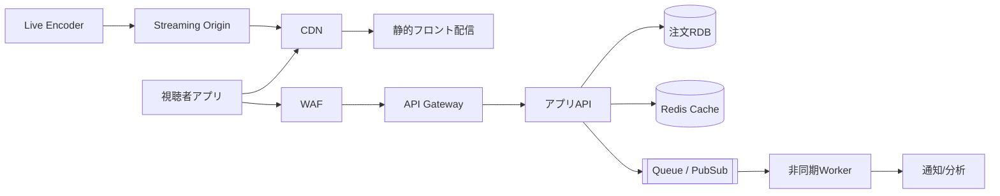

[[Home]]

# Cloud Engineer Magazine — 2026-05-19

## 1) 今日のアプリ
**ライブ配信EC（Live Commerce）基盤**  
配信を見ながら商品を購入できるモバイル/Webアプリ。

---

## 2) 要件整理
### 機能要件
- 低遅延ライブ動画配信（数秒以内）
- 商品カタログ表示・在庫確認
- 配信中のチャット/リアクション
- 購入フロー（カート/決済）
- 配信アーカイブ保存

### 非機能要件
- **可用性:** 配信停止を最小化（AZ/リージョン障害に備える）
- **性能:** 視聴1万同時接続を想定、突発トラフィック吸収
- **セキュリティ:** IAM最小権限、WAF、暗号化、監査ログ
- **コスト:** 平常時は小さく、配信イベント時だけスケール

---

## 3) 推奨アーキテクチャ（なぜその構成か）
**方針: マルチクラウド比較しやすい「分離型」設計**
- 動画配信面（CDN/ストリーミング）と業務面（商品/注文）を分離
- stateless API + managed DB/queue で運用負荷を下げる
- CDN前段でオフロードし、オリジン負荷を抑制
- 非同期処理（注文イベント、通知、分析）でピーク耐性を確保

**理由**
- ライブ配信はスパイクが大きい → オートスケール + CDN必須
- 購入系は整合性重視 → RDB中心 + イベント駆動で拡張
- 監視/監査はクラウド標準機能で実装し、初期から運用品質を担保

---

## 4) クラウド別実装マップ
### AWS
- フロント: CloudFront + S3（静的配信）
- API: API Gateway + AWS Lambda（または ECS/Fargate）
- 認証: Amazon Cognito
- 注文DB: Amazon Aurora (MySQL/PostgreSQL)
- キャッシュ: ElastiCache (Redis)
- 非同期: SQS + EventBridge
- 動画: AWS Elemental MediaLive / MediaPackage
- 監視: CloudWatch + X-Ray + CloudTrail
- 防御: AWS WAF + Shield

### OCI
- フロント: OCI CDN + Object Storage
- API: API Gateway + OCI Functions（または OKE）
- 認証: OCI IAM Identity Domains
- 注文DB: Autonomous Database / MySQL HeatWave
- キャッシュ: OCI Cache with Redis
- 非同期: OCI Queue + Events
- 動画: OCI Media Services
- 監視: Monitoring + Logging + Audit
- 防御: OCI WAF + Cloud Guard

### GCP
- フロント: Cloud CDN + Cloud Storage
- API: API Gateway + Cloud Run（または GKE）
- 認証: Identity Platform（または IAM + IAP）
- 注文DB: Cloud SQL（必要に応じ Spanner）
- キャッシュ: Memorystore (Redis)
- 非同期: Pub/Sub + Eventarc + Cloud Tasks
- 動画: Transcoder API + Media CDN（配信形態に応じ選択）
- 監視: Cloud Monitoring + Cloud Logging + Cloud Audit Logs
- 防御: Cloud Armor + reCAPTCHA Enterprise

---

## 5) システム構成図（Mermaid）

---

## 6) データフロー / 認証・認可 / 監視運用
- **データフロー:**
  1. 視聴者はCDN経由で配信視聴
  2. 商品取得/購入APIはAPI Gateway経由
  3. 注文確定イベントをQueue/PubSubへ投入
  4. Workerが在庫更新・通知・分析処理を非同期実行
- **認証・認可:**
  - OIDCベース認証（Cognito / Identity Domains / Identity Platform）
  - APIはJWT検証 + サービス間IAMロールで最小権限
  - 管理系操作はMFA必須、秘密情報はSecrets Manager系で管理
- **監視運用:**
  - REDメトリクス（Rate/Error/Duration）と配信QoE（再生開始時間/バッファ率）
  - 構成変更とAPI操作を監査ログへ集約
  - SLO違反にアラート、Runbookで一次対応標準化

---

## 7) コスト最適化ポイント（初期・成長期）
- **初期:**
  - サーバレス優先（Lambda/Functions/Cloud Run）
  - DBは最小構成 + 自動バックアップ
  - CDNキャッシュTTL最適化でオリジン転送料を削減
- **成長期:**
  - 予約/コミット割引（Savings Plans / OCI料金モデル / CUD）を適用
  - ホットデータのみRedis、コールドデータはオブジェクトストレージへ
  - 動画ビットレート最適化（ABR）で配信コストを制御

---

## 8) 障害時の設計（DR/バックアップ/フェイルオーバー）
- マルチAZを標準、RDBは自動フェイルオーバー構成
- バックアップ: 日次スナップショット + PITR
- リージョン障害対策:
  - 静的資産はクロスリージョンレプリケーション
  - 重要注文データは非同期複製（RPO要件に合わせる）
  - DNS/グローバルLBでフェイルオーバー手順を事前訓練
- 定期的にDR演習（ゲームデー）を実施

---

## 9) 学習ポイント（今日覚えるクラウド機能）
- **AWS:** EventBridge で疎結合イベント連携を設計する
- **OCI:** Cloud Guard でセキュリティ姿勢の継続監視
- **GCP:** Eventarc + Pub/Sub でイベント駆動を標準化

---

## 10) 30〜60分ミニ演習
1. 1クラウド選択（AWS/OCI/GCPどれでも可）
2. 「商品一覧API」をサーバレスで1本作る
3. Redisキャッシュを追加し、レスポンス時間を比較
4. APIアクセスログから 4xx/5xx 比率を可視化
5. 最後に「最小権限IAMポリシー」を1つ作成

**達成条件:**
- APIが動作し、キャッシュ有無の差を数値で説明できる
- IAM権限をワイルドカード最小化で提出できる

---

## 11) 公式ドキュメント参照リンク（AWS/OCI/GCP）
### AWS
- Well-Architected Framework: https://docs.aws.amazon.com/wellarchitected/latest/framework/welcome.html
- Amazon CloudFront: https://docs.aws.amazon.com/AmazonCloudFront/latest/DeveloperGuide/Introduction.html
- Amazon API Gateway: https://docs.aws.amazon.com/apigateway/latest/developerguide/welcome.html
- Amazon Cognito: https://docs.aws.amazon.com/cognito/latest/developerguide/what-is-amazon-cognito.html
- Amazon EventBridge: https://docs.aws.amazon.com/eventbridge/latest/userguide/eb-what-is.html

### OCI
- OCI Documentation Home: https://docs.oracle.com/en-us/iaas/Content/home.htm
- OCI API Gateway: https://docs.oracle.com/en-us/iaas/Content/APIGateway/Concepts/apigatewayoverview.htm
- OCI Functions: https://docs.oracle.com/en-us/iaas/Content/Functions/Concepts/functionsoverview.htm
- OCI Queue: https://docs.oracle.com/en-us/iaas/Content/queue/overview.htm
- OCI Cloud Guard: https://docs.oracle.com/en-us/iaas/cloud-guard/using/overview.htm

### GCP
- Google Cloud Architecture Framework: https://docs.cloud.google.com/architecture/framework
- Cloud CDN: https://docs.cloud.google.com/cdn/docs/overview
- API Gateway: https://docs.cloud.google.com/api-gateway/docs/overview
- Cloud Run: https://docs.cloud.google.com/run/docs/overview/what-is-cloud-run
- Pub/Sub: https://docs.cloud.google.com/pubsub/docs/overview
