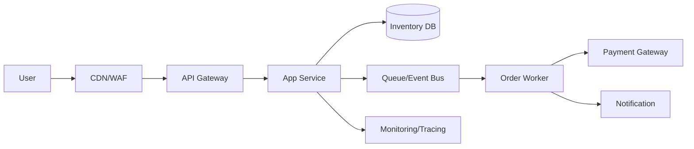

[[Home]]

# Cloud Engineer Magazine (2026-05-20 10:15 JST)

## 1) 今日のアプリ
**リアルタイム在庫連動つきフラッシュセール基盤**（EC向け）  
短時間にアクセスが急増するセールで、在庫超過販売を防ぎながら、注文確定までを低遅延で処理する。

---

## 2) 要件整理
### 機能要件
- 商品一覧/詳細表示
- セール時の注文受付（先着制御）
- 在庫引当（原子的な在庫減算）
- 決済連携（外部PSP）
- 注文・在庫イベント配信（通知/分析）

### 非機能要件
- **可用性**: セール時間帯にSLAを維持（マルチAZ/リージョンDR）
- **性能**: P95 API応答 < 300ms、瞬間トラフィック急増に自動追従
- **セキュリティ**: 最小権限IAM、WAF、暗号化（保存/転送）
- **コスト**: 平時は低コスト、セール時のみスケールアウト

---

## 3) 推奨アーキテクチャ（なぜその構成か）
**イベント駆動 + キャッシュ前段 + 在庫台帳の強整合書き込み**を採用。
- 読み取り系（商品表示）はCDN + キャッシュで吸収
- 書き込み系（注文確定）はキュー/イベント経由で平滑化
- 在庫はトランザクション整合性を持つストアで引当

**理由**
- スパイク耐性: 非同期化でバックエンド保護
- 過販売防止: 在庫減算の競合制御を明示
- 運用性: 監視対象（API、キュー遅延、在庫失敗率）が明確

---

## 4) クラウド別実装マップ
### AWS
- エッジ: Amazon CloudFront + AWS WAF
- API: Amazon API Gateway + AWS Lambda（またはECS/Fargate）
- 在庫DB: Amazon DynamoDB（条件付き書き込み）
- イベント: Amazon EventBridge / Amazon SQS
- 認証: Amazon Cognito
- 監視: Amazon CloudWatch + AWS X-Ray

### OCI
- エッジ: OCI WAF + Load Balancer
- API/実行: API Gateway + OCI Functions（またはOKE）
- 在庫DB: Autonomous Database（トランザクション制御）
- イベント: OCI Streaming + OCI Queue
- 認証: OCI IAM
- 監視: OCI Monitoring + Logging + Application Performance Monitoring

### GCP
- エッジ: Cloud CDN + Cloud Armor
- API/実行: API Gateway + Cloud Run（またはGKE）
- 在庫DB: Cloud Spanner（高整合）またはFirestore（要件次第）
- イベント: Pub/Sub + Cloud Tasks
- 認証: Identity Platform / IAM
- 監視: Cloud Monitoring + Cloud Logging + Cloud Trace

---

## 5) システム構成図（Mermaid）

---

## 6) データフロー/認証・認可/監視運用の要点
- **データフロー**: 商品閲覧はキャッシュ優先、注文は「受付→キュー→在庫引当→決済→確定」
- **認証・認可**: ユーザー認証はOIDC、サービス間はIAMロール/サービスアカウントで最小権限
- **監視運用**:
  - SLI: APIレイテンシ、5xx率、在庫引当失敗率、キュー遅延
  - アラート: キュー滞留閾値、在庫不整合検知、決済エラー率
  - 監査: 管理操作は監査ログを長期保管

---

## 7) コスト最適化ポイント（初期・成長期）
### 初期
- サーバレス中心（Lambda/Functions/Cloud Run）でアイドルコスト削減
- 低頻度ログは保持期間短縮、アーカイブ階層化

### 成長期
- 予約/コミットメント（AWS Savings Plans, OCI commitments, GCP CUD）
- キャッシュヒット率改善（DB read削減）
- 非同期ワーカーの同時実行上限を制御し、下流コストを平準化

---

## 8) 障害時の設計（DR/バックアップ/フェイルオーバー）
- **DR方針**: RTO/RPOを定義（例: RTO 30分, RPO 5分）
- **バックアップ**: DB定期スナップショット + PITR
- **フェイルオーバー**:
  - 同一リージョン内はマルチAZ
  - 重要データはクロスリージョン複製
  - DNS/グローバルLBで切替手順を自動化
- **演習**: 四半期ごとにゲームデー実施（在庫DB障害/キュー遅延を注入）

---

## 9) 学習ポイント（今日覚えるクラウド機能）
1. **AWS DynamoDB 条件付き書き込み**で在庫競合を防ぐ
2. **OCI Streaming/Queue**で注文ピークを平滑化する
3. **GCP Pub/Sub + Cloud Tasks**で非同期処理の再試行制御を分離する

---

## 10) 30〜60分ミニ演習
1. APIの `POST /orders` 疑似エンドポイントを1つ作る（任意クラウド）
2. 在庫減算を「条件付き更新（在庫>0のみ成功）」で実装
3. 失敗時イベントをキューに送り、再試行ワーカーを追加
4. ダッシュボードに以下2つを可視化:
   - 在庫引当失敗率
   - キュー遅延時間

**完了条件**: 同時10リクエストで過販売が発生しないことを確認

---

## 11) 公式ドキュメント参照リンク（AWS/OCI/GCP）
### AWS
- Well-Architected Framework: https://docs.aws.amazon.com/wellarchitected/latest/framework/welcome.html
- DynamoDB 条件式書き込み: https://docs.aws.amazon.com/amazondynamodb/latest/developerguide/Expressions.ConditionExpressions.html
- SQS: https://docs.aws.amazon.com/AWSSimpleQueueService/latest/SQSDeveloperGuide/welcome.html
- CloudFront: https://docs.aws.amazon.com/AmazonCloudFront/latest/DeveloperGuide/Introduction.html
- WAF: https://docs.aws.amazon.com/waf/latest/developerguide/waf-chapter.html

### OCI
- OCI Architecture Center: https://docs.oracle.com/en-us/iaas/Content/Architecture/Reference/reference_architecture.htm
- API Gateway: https://docs.oracle.com/en-us/iaas/Content/APIGateway/Concepts/apigatewayoverview.htm
- OCI Streaming: https://docs.oracle.com/en-us/iaas/Content/Streaming/Concepts/streamingoverview.htm
- OCI Queue: https://docs.oracle.com/en-us/iaas/Content/queue/overview.htm
- OCI IAM: https://docs.oracle.com/en-us/iaas/Content/Identity/Concepts/overview.htm

### GCP
- Google Cloud Architecture Framework: https://docs.cloud.google.com/architecture/framework
- Cloud Run: https://docs.cloud.google.com/run/docs/overview/what-is-cloud-run
- Pub/Sub: https://docs.cloud.google.com/pubsub/docs/overview
- Cloud Tasks: https://docs.cloud.google.com/tasks/docs/dual-overview
- Cloud Armor: https://docs.cloud.google.com/armor/docs/overview

---

### 今日のひとこと
在庫の正しさは「DB選定」だけでなく、**更新条件・再試行設計・監視指標**まで含めて初めて守れる。
