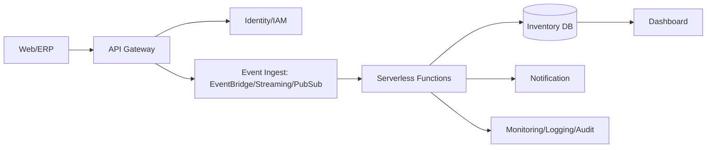

---
tags:
  - cloud
  - aws
  - oci
  - gcp
  - architecture
  - daily
---
[[Home]]

# Cloud Engineer Magazine — 2026-05-21

## 1) 今日のアプリ
**リアルタイム在庫アラート付きEC在庫可視化アプリ**  
複数倉庫の在庫をほぼリアルタイムで集約し、欠品予兆を検知してSlack/メール通知する。

---

## 2) 要件整理
### 機能要件
- SKU単位で在庫数・引当数・入荷予定を表示
- 在庫しきい値を下回ったら即時通知
- CSV/APIで在庫更新を受け付け
- 監査ログ（誰が閾値を変えたか）を保持

### 非機能要件
- **可用性**: 99.9% 以上、AZ障害に耐える
- **性能**: 在庫更新イベントから通知まで 5 秒以内（P95）
- **セキュリティ**: 最小権限IAM、KMS暗号化、WAF、監査証跡
- **コスト**: 初期はサーバレス中心、成長時に高負荷部のみ最適化

---

## 3) 推奨アーキテクチャ（なぜその構成か）
**イベント駆動 + サーバレス + マネージドDB** を採用。  
理由:
- 在庫更新はバーストしやすく、キュー/ストリームで平滑化できる
- サーバレスでアイドルコストを抑え、初期運用が軽い
- 集計ビューはNoSQL/分析基盤に分離し、参照性能と拡張性を確保

---

## 4) クラウド別実装マップ
### AWS での実装サービス
- API: **Amazon API Gateway**
- 認証: **Amazon Cognito**
- イベント取り込み: **Amazon EventBridge** または **Amazon SQS**
- 処理: **AWS Lambda**
- 在庫DB: **Amazon DynamoDB**
- 通知: **Amazon SNS**
- 監視: **Amazon CloudWatch** + **AWS CloudTrail**
- 秘密情報: **AWS Secrets Manager**

### OCI での実装サービス
- API: **API Gateway**
- 認証: **OCI IAM**（IDドメイン）
- イベント取り込み: **OCI Streaming** / **OCI Queue**
- 処理: **OCI Functions**
- 在庫DB: **Autonomous Database (JSON可)** または **NoSQL Database**
- 通知: **Notifications**
- 監視: **Monitoring** + **Logging** + **Audit**
- 秘密情報: **Vault**

### GCP での実装サービス
- API: **API Gateway**（またはCloud Endpoints）
- 認証: **Identity Platform** / **IAM**
- イベント取り込み: **Pub/Sub**
- 処理: **Cloud Functions** または **Cloud Run**
- 在庫DB: **Firestore**（ドキュメント）または **Cloud SQL**
- 通知連携: **Pub/Sub + Cloud Run**（Slack/Webhook）
- 監視: **Cloud Monitoring** + **Cloud Logging** + **Cloud Audit Logs**
- 秘密情報: **Secret Manager**

**トレードオフ（短評）**
- DynamoDB/Firestore はスキーマ柔軟・高速、複雑JOINは苦手
- Cloud SQL/Autonomous DB はSQL集計が得意、スケール設計は要計画
- Lambda/Functions は運用軽量、長時間処理はコンテナ実行（Cloud Run等）が有利

---

## 5) システム構成図（Mermaid）

---

## 6) データフロー/認証・認可/監視運用の要点
- **データフロー**: 更新API → イベント基盤 → 関数で検証/重複排除 → DB更新 → 閾値判定通知
- **認証・認可**:
  - ユーザー認証はOIDCベース
  - サービス間はIAMロール/サービスアカウントで短期認証
  - 書込APIはWAF + レート制限 + 署名/トークン検証
- **監視運用**:
  - SLI: 更新遅延、通知遅延、エラー率
  - アラート: キュー滞留、関数失敗率、DBスロットリング
  - 監査: 閾値変更・権限変更をAudit Logs/CloudTrailで追跡

---

## 7) コスト最適化ポイント（初期・成長期）
### 初期
- サーバレス中心で固定費を最小化
- 保存期間を短めにし、監査ログはライフサイクル管理
- 開発/検証環境をスケジュール停止

### 成長期
- 高トラフィックAPIをコンテナ常駐化して単価最適化
- DBのアクセスパターンを分離（書込系と分析系）
- 予約/コミットメント（Savings Plans, CUD 等）を段階適用

---

## 8) 障害時の設計（DR/バックアップ/フェイルオーバー）
- **DR方針**: まず同一リージョン複数AZ、次にクロスリージョン複製
- **バックアップ**:
  - DB PITR（ポイントインタイム復旧）
  - 設定/IaCをGit管理し再構築可能に
- **フェイルオーバー**:
  - DNS/グローバルLBでセカンダリ切替
  - 非同期イベントはDLQを必須化し再処理手順をRunbook化

---

## 9) 学習ポイント（今日覚えるクラウド機能）
- **AWS**: EventBridge + Lambda + DynamoDB でイベント駆動在庫更新
- **OCI**: Streaming/Functions/Notifications の疎結合パターン
- **GCP**: Pub/Sub と Cloud Run/Functions の使い分け（遅延・コスト）

---

## 10) 30〜60分ミニ演習
1. 1つのクラウドを選び、`在庫更新イベントJSON` を定義（SKU, quantity, warehouse, ts）
2. API → イベント基盤 → 関数 → DB更新の最小パイプラインを作成
3. 「在庫<10」で通知するルールを実装
4. 失敗イベントをDLQに送り、再実行手順をREADMEに記載

完了条件:
- 5件のテストイベント投入でDB更新と通知を確認
- 1件の異常データでDLQ到達を確認

---

## 11) 公式ドキュメント参照リンク（AWS/OCI/GCP）
### AWS
- API Gateway: https://docs.aws.amazon.com/apigateway/
- Amazon Cognito: https://docs.aws.amazon.com/cognito/
- Amazon EventBridge: https://docs.aws.amazon.com/eventbridge/
- AWS Lambda: https://docs.aws.amazon.com/lambda/
- Amazon DynamoDB: https://docs.aws.amazon.com/dynamodb/
- Amazon SNS: https://docs.aws.amazon.com/sns/
- AWS Well-Architected: https://docs.aws.amazon.com/wellarchitected/

### OCI
- API Gateway: https://docs.oracle.com/en-us/iaas/Content/APIGateway/home.htm
- IAM: https://docs.oracle.com/en-us/iaas/Content/Identity/home.htm
- Streaming: https://docs.oracle.com/en-us/iaas/Content/Streaming/home.htm
- Functions: https://docs.oracle.com/en-us/iaas/Content/Functions/home.htm
- NoSQL Database: https://docs.oracle.com/en-us/iaas/nosql-database/index.html
- Notifications: https://docs.oracle.com/en-us/iaas/Content/Notification/home.htm
- Monitoring: https://docs.oracle.com/en-us/iaas/Content/Monitoring/home.htm

### GCP
- Google Cloud Architecture Framework: https://docs.cloud.google.com/architecture/framework
- API Gateway: https://docs.cloud.google.com/api-gateway/docs
- Pub/Sub: https://docs.cloud.google.com/pubsub/docs
- Cloud Functions: https://docs.cloud.google.com/functions/docs
- Cloud Run: https://docs.cloud.google.com/run/docs
- Firestore: https://docs.cloud.google.com/firestore/docs
- Cloud Monitoring: https://docs.cloud.google.com/monitoring/docs
