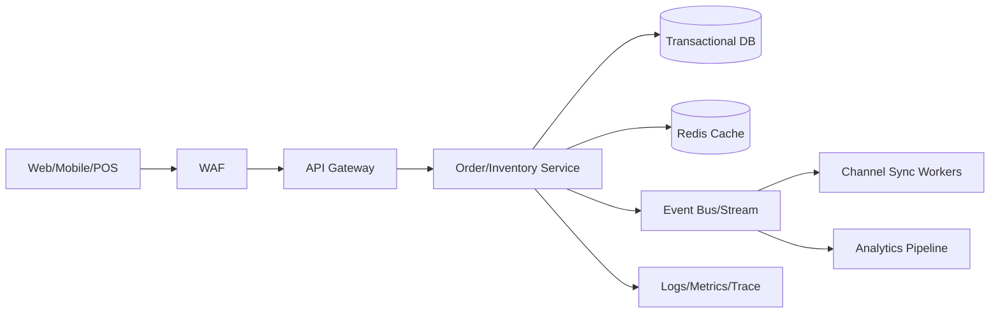

# 2026-05-22 10:15 Cloud Engineer Magazine
Tags: #cloud #aws #oci #gcp #architecture #daily
Links: [[Home]]

## 1) 今日のアプリ
**リアルタイム在庫同期付き D2C コマース API**

複数チャネル（自社EC・モバイルアプリ・店舗POS）からの注文を受け、在庫引当を即時反映するバックエンドを設計します。

---

## 2) 要件整理（機能要件/非機能要件）
### 機能要件
- 商品一覧・在庫照会 API
- 注文作成 API（在庫引当を伴う）
- 在庫更新イベント配信（他チャネル同期）
- 管理者向け在庫調整 API

### 非機能要件
- **可用性**: 99.95% 目標、リージョン障害時はRTO 30分/RPO 5分
- **性能**: 注文API p95 < 300ms、在庫反映遅延 < 3秒
- **セキュリティ**: 最小権限IAM、WAF、KMS暗号化、監査ログ必須
- **コスト**: 初期はサーバレス中心、成長後にホットパスのみ常時稼働へ

---

## 3) 推奨アーキテクチャ（なぜその構成か）
**イベント駆動 + APIゲートウェイ + マネージドDB** を基本にします。

- 注文受付と在庫更新を疎結合化し、スパイク耐性を確保
- 在庫の整合性はトランザクション対応DBで担保
- 非同期イベントで他チャネル連携（分析/通知）を拡張しやすくする
- WAF + IAM + Secret管理を標準化し、secure-by-default を徹底

**トレードオフ（例）**
- RDB（整合性強） vs NoSQL（スケール強）
  - 在庫引当の厳密性重視ならRDB優位
  - 参照負荷が極端に高い商品カタログはNoSQL/キャッシュ併用

---

## 4) クラウド別実装マップ
### AWS
- API: **Amazon API Gateway**
- 認証: **Amazon Cognito**（またはOIDC連携）
- アプリ実行: **AWS Lambda** / **ECS Fargate**（成長後）
- DB: **Amazon Aurora PostgreSQL**（在庫・注文）
- 非同期: **Amazon EventBridge** + **Amazon SQS**
- キャッシュ: **Amazon ElastiCache for Redis**
- 監視: **Amazon CloudWatch**, **AWS X-Ray**, **CloudTrail**
- 保護: **AWS WAF**, **AWS KMS**, **Secrets Manager**

### OCI
- API: **API Gateway**
- 認証: **OCI IAM**（IDCS/OIDC連携）
- アプリ実行: **Oracle Functions** / **Container Instances or OKE**
- DB: **Autonomous Transaction Processing (ATP)** または **Base Database**
- 非同期: **OCI Streaming** + **OCI Queue**
- キャッシュ: **OCI Cache (Redis)**
- 監視: **Monitoring**, **Logging**, **Application Performance Monitoring**
- 保護: **OCI WAF**, **Vault**, **Cloud Guard**

### GCP
- API: **API Gateway**（またはCloud Endpoints）
- 認証: **Identity Platform** / IAM
- アプリ実行: **Cloud Run** / **Cloud Functions**
- DB: **Cloud SQL for PostgreSQL**
- 非同期: **Pub/Sub** + **Cloud Tasks**
- キャッシュ: **Memorystore for Redis**
- 監視: **Cloud Monitoring**, **Cloud Logging**, **Cloud Trace**, **Cloud Audit Logs**
- 保護: **Cloud Armor**, **Cloud KMS**, **Secret Manager**

---

## 5) システム構成図（Mermaid）

---

## 6) データフロー/認証・認可/監視運用の要点
- **データフロー**: 注文受付 → 在庫引当トランザクション → コミット後イベント発行 → 各チャネル更新
- **認証・認可**:
  - ユーザーはOIDC/JWT
  - サービス間は短期資格情報（IAMロール/サービスアカウント）
  - DB/キュー/シークレットへの権限を最小化（read/writeを分離）
- **監視運用**:
  - SLI: API遅延、エラー率、在庫反映遅延、キュー滞留
  - アラート閾値を段階化（警告/重大）
  - 監査ログは改ざん耐性ある保管へ

---

## 7) コスト最適化ポイント（初期・成長期）
### 初期
- サーバレス（Lambda/Functions/Cloud Run最小インスタンス）で固定費を抑える
- DBは小さく開始、バックアップ保持日数を業務要件で最適化
- ログ保持を30〜90日で調整

### 成長期
- ホットAPIをコンテナ常時稼働に寄せてレイテンシ安定化
- リード負荷はキャッシュと読み取りレプリカへオフロード
- ストレージ階層化（低頻度データを安価層へ）

---

## 8) 障害時の設計（DR/バックアップ/フェイルオーバー）
- **DR方針**: マルチAZ標準 + クロスリージョン複製（DBスナップショット/ログ）
- **バックアップ**: PITR有効化、日次スナップショット、復元演習を月次実施
- **フェイルオーバー**:
  - API層はヘルスチェック付きDNS/グローバルLBで切替
  - 非同期基盤は再試行・DLQを前提設計
  - 在庫イベントは冪等キーで重複適用防止

---

## 9) 学習ポイント（今日覚えるクラウド機能）
- **AWS EventBridge**: ルーティング柔軟性と疎結合化
- **OCI Streaming**: 高スループットイベント基盤の中核
- **GCP Pub/Sub**: at-least-once配信前提の再処理設計

---

## 10) 30〜60分ミニ演習
1. 任意クラウド1つ選び、`POST /orders` の最小APIを作成
2. 注文成功時にイベント（OrderCreated）を発行
3. ワーカーで在庫更新ログを出力
4. 失敗時にDLQ/再試行を確認
5. IAMポリシーを見直し、不要権限を1つ削除

**ゴール**: 「同期API + 非同期イベント + 最小権限」の基本形を手で作る。

---

## 11) 公式ドキュメント参照リンク（AWS/OCI/GCP）
### AWS
- https://docs.aws.amazon.com/apigateway/
- https://docs.aws.amazon.com/lambda/
- https://docs.aws.amazon.com/AmazonRDS/latest/AuroraUserGuide/CHAP_AuroraOverview.html
- https://docs.aws.amazon.com/eventbridge/
- https://docs.aws.amazon.com/AWSSimpleQueueService/latest/SQSDeveloperGuide/welcome.html
- https://docs.aws.amazon.com/waf/
- https://docs.aws.amazon.com/IAM/latest/UserGuide/best-practices.html

### OCI
- https://docs.oracle.com/en-us/iaas/Content/APIGateway/home.htm
- https://docs.oracle.com/en-us/iaas/Content/Functions/home.htm
- https://docs.oracle.com/en-us/iaas/Content/Streaming/home.htm
- https://docs.oracle.com/en-us/iaas/Content/queue/home.htm
- https://docs.oracle.com/en-us/iaas/Content/Identity/home.htm
- https://docs.oracle.com/en-us/iaas/Content/WAF/home.htm
- https://docs.oracle.com/en-us/iaas/Content/KeyManagement/home.htm

### GCP
- https://docs.cloud.google.com/api-gateway/docs
- https://docs.cloud.google.com/run/docs
- https://docs.cloud.google.com/sql/docs/postgres
- https://docs.cloud.google.com/pubsub/docs
- https://docs.cloud.google.com/tasks/docs
- https://docs.cloud.google.com/armor/docs
- https://docs.cloud.google.com/iam/docs/best-practices
