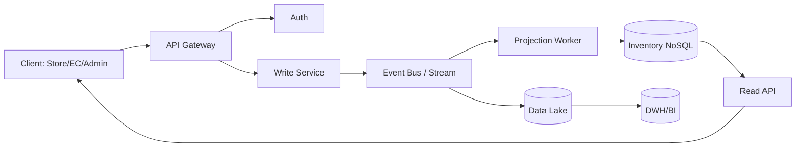

[[Home]]

# Cloud Engineer Magazine (2026-05-23)

## 1) 今日のアプリ
**リアルタイム在庫同期付きEC在庫可視化アプリ**  
複数倉庫・店舗・ECモールの在庫を数秒〜1分以内で同期し、欠品/過剰在庫を減らす。

## 2) 要件整理
### 機能要件
- SKU単位の在庫更新（入庫/出庫/返品/引当）
- 在庫照会API（店舗、EC、社内向け）
- しきい値アラート（欠品予兆）
- 日次レポート（SKU回転率、欠品率）

### 非機能要件
- **可用性**: 99.9%以上（在庫照会は継続提供）
- **性能**: 書き込みP95 < 300ms、照会P95 < 150ms
- **セキュリティ**: 最小権限IAM、暗号化 at-rest/in-transit、監査ログ
- **コスト**: 初期はサーバレス中心、成長後は予約/確定利用で最適化

## 3) 推奨アーキテクチャ（なぜその構成か）
**イベント駆動 + CQRS寄り構成**を採用。
- 更新系: イベントバスに集約し、在庫更新を非同期化（スパイク耐性）
- 参照系: 低遅延KV/NoSQLに投影し高速照会
- 分析系: ストリームをDWHへ連携し、OLTP負荷を分離

理由:
1. 在庫更新はバーストしやすく、キュー/ストリームで平準化が有効  
2. 読み取り負荷が高いため、更新系と参照系を分離すると性能・可用性が安定  
3. 監査・再処理（イベント再生）がしやすい

## 4) クラウド別実装マップ
### AWS
- API: **Amazon API Gateway**
- 認証: **Amazon Cognito**
- 更新処理: **AWS Lambda** + **Amazon EventBridge**
- 在庫DB: **Amazon DynamoDB**
- 分析: **Kinesis Data Firehose** → **Amazon S3** → **Amazon Athena**
- 監視: **Amazon CloudWatch**, **AWS X-Ray**, **AWS CloudTrail**

### OCI
- API: **OCI API Gateway**
- 認証: **OCI Identity and Access Management (IAM)**
- 更新処理: **OCI Functions** + **OCI Streaming**
- 在庫DB: **Autonomous JSON Database**（または NoSQL）
- 分析: **Object Storage** + **OCI Data Flow** / **Analytics Cloud**
- 監視: **OCI Monitoring**, **Logging**, **Audit**

### GCP
- API: **API Gateway**
- 認証: **Identity Platform**（または IAM + IAP 構成）
- 更新処理: **Cloud Run** + **Pub/Sub**
- 在庫DB: **Firestore**（Native mode）
- 分析: **Dataflow** → **BigQuery**
- 監視: **Cloud Monitoring**, **Cloud Logging**, **Cloud Audit Logs**, **Cloud Trace**

## 5) システム構成図（Mermaid）

## 6) データフロー/認証・認可/監視運用の要点
- **データフロー**: API受信→認証→更新イベント発行→投影更新→照会API応答
- **認証・認可**: OIDC/JWT、サービス間は短期資格情報、IAMロール分離（read/write/admin）
- **監視運用**:
  - SLI: API遅延、イベント遅延、投影ラグ
  - アラート: 在庫更新失敗率、DLQ件数、認証失敗急増
  - 監査: 変更操作を監査ログへ保存し追跡可能に

## 7) コスト最適化ポイント（初期・成長期）
- **初期**: サーバレス（Lambda/Functions/Cloud Run）でアイドル課金回避
- **成長期**:
  - ストレージ階層化（S3/OCI Object Storage/Cloud Storage）
  - 分析クエリ最適化（パーティション、列指向活用）
  - 需要安定部分は予約/コミットメント適用

## 8) 障害時の設計（DR/バックアップ/フェイルオーバー）
- マルチAZ（リージョン内）を標準化
- イベントは再処理可能に（DLQ + リプレイ手順）
- DBはPITR/バックアップ有効化
- RTO/RPO例:
  - 照会系: RTO 15分 / RPO 5分
  - 分析系: RTO 4時間 / RPO 1時間

## 9) 学習ポイント（今日覚えるクラウド機能）
- **AWS DynamoDB**: パーティション設計とスロットリング回避
- **OCI Streaming**: パーティションとコンシューマグループ設計
- **GCP Pub/Sub**: at-least-once前提の冪等処理設計

## 10) 30〜60分ミニ演習
1. 在庫更新イベントのJSONスキーマを定義（SKU, quantity, reason, ts, idempotencyKey）
2. 「重複イベントが来ても在庫が壊れない」冪等ロジックを疑似コード化
3. 各クラウドで以下を表にする（5分ずつ）:
   - API入口
   - イベント基盤
   - 在庫DB
   - 監視サービス
4. 最後に、1日の想定トラフィック（例: 更新50万件）でボトルネック候補を3つ挙げる

## 11) 公式ドキュメント参照リンク（AWS/OCI/GCP）
### AWS
- API Gateway: https://docs.aws.amazon.com/apigateway/
- Cognito: https://docs.aws.amazon.com/cognito/
- Lambda: https://docs.aws.amazon.com/lambda/
- EventBridge: https://docs.aws.amazon.com/eventbridge/
- DynamoDB: https://docs.aws.amazon.com/dynamodb/
- CloudWatch: https://docs.aws.amazon.com/cloudwatch/
- CloudTrail: https://docs.aws.amazon.com/cloudtrail/

### OCI
- OCI Documentation Home: https://docs.oracle.com/en-us/iaas/Content/home.htm
- API Gateway: https://docs.oracle.com/en-us/iaas/Content/APIGateway/home.htm
- Functions: https://docs.oracle.com/en-us/iaas/Content/Functions/home.htm
- Streaming: https://docs.oracle.com/en-us/iaas/Content/Streaming/home.htm
- IAM: https://docs.oracle.com/en-us/iaas/Content/Identity/home.htm
- Monitoring: https://docs.oracle.com/en-us/iaas/Content/Monitoring/home.htm
- Logging: https://docs.oracle.com/en-us/iaas/Content/Logging/home.htm

### GCP
- Google Cloud Documentation Home: https://docs.cloud.google.com/docs
- API Gateway: https://docs.cloud.google.com/api-gateway/docs
- Pub/Sub: https://docs.cloud.google.com/pubsub/docs
- Cloud Run: https://docs.cloud.google.com/run/docs
- Firestore: https://docs.cloud.google.com/firestore/docs
- BigQuery: https://docs.cloud.google.com/bigquery/docs
- Cloud Monitoring: https://docs.cloud.google.com/monitoring/docs
