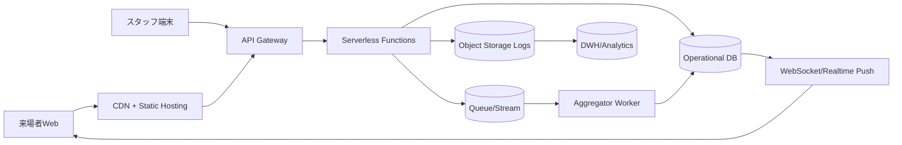

# Cloud Engineer Magazine (2026-05-24)
[[Home]]

## 1) 今日のアプリ
**イベント会場向け「リアルタイム待ち時間可視化アプリ」**
- 来場者がモバイルWebで「各ブースの待ち時間」を確認
- スタッフはQRチェックイン端末から入退場を送信
- 1〜3秒以内に待ち時間を更新表示

---

## 2) 要件整理
### 機能要件
- ブースごとの待機人数・推定待ち時間の表示
- スタッフ端末から入場/退場イベント登録
- 混雑アラート（しきい値超過）
- イベント終了後に混雑ヒートマップ分析

### 非機能要件
- **可用性**: イベント中は停止しない（マルチAZ/リージョン設計余地）
- **性能**: 更新遅延1〜3秒、ピーク同時接続1万ユーザー想定
- **セキュリティ**: スタッフ/一般ユーザー権限分離、最小権限IAM
- **コスト**: 平時低コスト、イベント開催時のみスケール

---

## 3) 推奨アーキテクチャ（なぜその構成か）
**方針: サーバーレス中心 + マネージドDB + WebSocket配信**
- バーストアクセスに強い（オートスケール）
- 運用負荷を下げ、短期イベントでも導入しやすい
- リアルタイム更新はPub/Sub系＋WebSocketで実現

**設計の要点**
- 書き込みAPI（チェックイン）と読み取りAPI（待ち時間取得）を分離
- 集計はストリーム処理で非同期化し、API応答を軽くする
- 認証は一般ユーザー（匿名/低権限）とスタッフ（強認証）を分離

---

## 4) クラウド別実装マップ
### AWS
- フロント: S3 + CloudFront
- API: API Gateway (HTTP/WebSocket) + Lambda
- データ: DynamoDB（待ち行列状態）, S3（分析用ログ）
- イベント処理: EventBridge / Kinesis（要件で選択）
- 認証: Amazon Cognito（ユーザープール/IDプール）
- 監視: CloudWatch + X-Ray + CloudTrail

**トレードオフ**
- DynamoDBは低レイテンシに強いが、アクセスパターン設計が重要
- Kinesisは高頻度ストリーム向き、EventBridgeは疎結合連携向き

### OCI
- フロント: Object Storage + CDN
- API: API Gateway + Functions
- データ: Autonomous JSON Database or NoSQL Database, Object Storage（ログ）
- イベント処理: OCI Streaming + Events
- 認証: OCI IAM（Identity Domains）
- 監視: Monitoring + Logging + Application Performance Monitoring

**トレードオフ**
- Autonomous JSON DBはJSONドキュメント活用が容易
- OCI StreamingはKafka互換ワークロードに寄せやすい

### GCP
- フロント: Cloud Storage + Cloud CDN
- API: API Gateway/Cloud Run + Cloud Functions（またはCloud Run統一）
- データ: Firestore（リアルタイム参照）, BigQuery（分析）
- イベント処理: Pub/Sub + Dataflow（必要時）
- 認証: Identity Platform / IAM
- 監視: Cloud Monitoring + Cloud Logging + Cloud Trace

**トレードオフ**
- Firestoreはリアルタイム同期が強み
- Dataflowは強力だが小規模では過剰になり得る

---

## 5) システム構成図（Mermaid）

---

## 6) データフロー/認証・認可/監視運用の要点
### データフロー
1. スタッフ端末が入退場イベント送信
2. APIで受領後、即時書き込み + ストリームへ投入
3. ワーカーが待ち時間を再計算
4. WebSocketでクライアントへ差分配信
5. 生ログはオブジェクトストレージへ集約

### 認証・認可
- 一般ユーザー: 読み取り専用トークン
- スタッフ: MFA付きログイン + 書き込み権限
- IAMは**最小権限**（関数ごとロール分離、DBテーブル単位で制限）

### 監視運用
- SLI: API p95、更新遅延、配信失敗率
- アラート: エラー率、DLQ滞留、認証失敗急増
- 監査: すべての管理操作を監査ログへ

---

## 7) コスト最適化ポイント（初期・成長期）
### 初期
- サーバーレス徹底（常時起動を減らす）
- 分析基盤はバッチ中心（毎時/毎日集計）
- ログ保持は短期 + ライフサイクル移行

### 成長期
- 高頻度処理のみ常時実行に切替
- DBのホットパーティション対策（キー設計見直し）
- CDNキャッシュ戦略最適化でAPIコール削減

---

## 8) 障害時の設計（DR/バックアップ/フェイルオーバー）
- DB: 自動バックアップ + PITR（Point-in-Time Recovery）
- 静的配信: 複数リージョンに複製
- API: マルチAZ前提、必要に応じリージョンDR
- メッセージング: 再試行 + DLQ + 冪等キー
- Runbook: 「配信遅延」「DBスロットリング」「認証障害」の手順を事前定義

---

## 9) 学習ポイント（今日覚えるクラウド機能）
- **AWS DynamoDB**: パーティションキー設計で性能/コストが決まる
- **OCI API Gateway**: 認証ポリシーとバックエンド連携の分離
- **GCP Pub/Sub**: at-least-once前提で冪等設計する

---

## 10) 30〜60分ミニ演習
1. 任意クラウド1つを選ぶ（AWS/OCI/GCP）
2. 「チェックインAPI」を1本作る（認証付き）
3. DBに `booth_id, entered_at, exited_at` を保存
4. 5分おきに待ち時間を再計算するジョブを実装
5. 監視アラートを1つ設定（エラー率 or 遅延）

**ゴール**: 「リアルタイムっぽく見える最小構成」を動かす

---

## 11) 公式ドキュメント参照リンク（AWS/OCI/GCP）
### AWS
- Well-Architected Framework: https://docs.aws.amazon.com/wellarchitected/latest/framework/welcome.html
- Amazon API Gateway: https://docs.aws.amazon.com/apigateway/
- AWS Lambda: https://docs.aws.amazon.com/lambda/
- Amazon DynamoDB: https://docs.aws.amazon.com/dynamodb/
- Amazon Cognito: https://docs.aws.amazon.com/cognito/
- Amazon CloudWatch: https://docs.aws.amazon.com/cloudwatch/

### OCI
- OCI Architecture Center: https://docs.oracle.com/en-us/iaas/Content/Architecture/home.htm
- OCI API Gateway: https://docs.oracle.com/en-us/iaas/Content/APIGateway/home.htm
- OCI Functions: https://docs.oracle.com/en-us/iaas/Content/Functions/home.htm
- OCI Streaming: https://docs.oracle.com/en-us/iaas/Content/Streaming/home.htm
- OCI IAM / Identity Domains: https://docs.oracle.com/en-us/iaas/Content/Identity/home.htm
- OCI Monitoring: https://docs.oracle.com/en-us/iaas/Content/Monitoring/home.htm

### GCP
- Google Cloud Architecture Framework: https://docs.cloud.google.com/architecture/framework
- API Gateway: https://docs.cloud.google.com/api-gateway/docs
- Cloud Run: https://docs.cloud.google.com/run/docs
- Pub/Sub: https://docs.cloud.google.com/pubsub/docs
- Firestore: https://docs.cloud.google.com/firestore/docs
- Cloud Monitoring: https://docs.cloud.google.com/monitoring/docs
