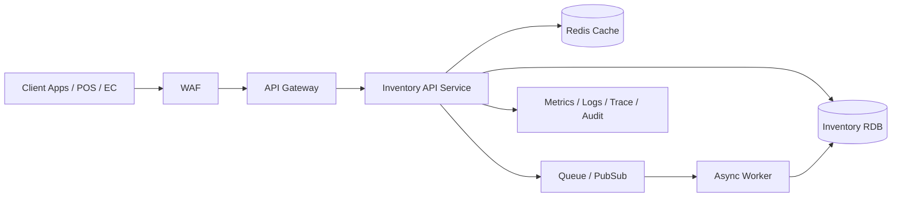

# Daily Cloud Engineer Magazine — 2026-05-25
[[Home]]

## 1) 今日のアプリ
**リアルタイム在庫同期付きEC在庫管理API**

複数チャネル（自社EC/モール/実店舗）で在庫を秒〜分単位で同期し、売り越しを防ぐB2C向けAPIサービス。

---

## 2) 要件整理

### 機能要件
- 商品在庫の参照API（GET）
- 在庫引当/戻しAPI（POST）
- 注文イベント取り込み（非同期）
- 在庫変更履歴の追跡（監査ログ）

### 非機能要件
- **可用性**: 99.9% 以上（リージョン内冗長）
- **性能**: 在庫参照 p95 < 200ms、更新API p95 < 400ms
- **セキュリティ**: 最小権限IAM、KMS暗号化、WAF、監査証跡
- **コスト**: 初期はマネージド中心、成長時にキャッシュ/購読設計で最適化

---

## 3) 推奨アーキテクチャ（なぜその構成か）
**観点: マルチクラウド比較（AWS/OCI/GCP）**

- エッジでWAF + API Gateway：攻撃面を先に絞る
- 在庫更新は同期API + 非同期イベントのハイブリッド：ユーザー応答性と整合性の両立
- 在庫DBはRDB（トランザクション整合性重視）
- 読み取りはキャッシュで吸収：ピーク時のDB負荷を低減
- 監視はメトリクス/ログ/トレースを統合し、SLO運用しやすくする

**トレードオフ（短く）**
- API Gatewayは運用が軽いが高トラフィックでは単価影響あり
- RDBは整合性に強いが水平分散はNoSQLより難しい
- キャッシュ導入は高速化に効くが、失効戦略の設計が必須

---

## 4) クラウド別実装マップ

### AWS
- API公開: **Amazon API Gateway**
- 防御: **AWS WAF**
- 認証: **Amazon Cognito**（またはOIDC連携）
- アプリ実行: **AWS Lambda** または **Amazon ECS(Fargate)**
- 在庫DB: **Amazon Aurora (MySQL/PostgreSQL)**
- キャッシュ: **Amazon ElastiCache for Redis**
- 非同期連携: **Amazon SQS / Amazon EventBridge**
- 監視: **Amazon CloudWatch + AWS X-Ray + CloudTrail**

### OCI
- API公開: **OCI API Gateway**
- 防御: **OCI Web Application Firewall**
- 認証: **OCI IAM**（Federation/OIDC）
- アプリ実行: **OCI Functions** または **Container Instances / OKE**
- 在庫DB: **OCI MySQL HeatWave** または **Autonomous Database**
- キャッシュ: **OCI Cache (Redis)**
- 非同期連携: **OCI Queue / OCI Streaming**
- 監視: **OCI Monitoring + Logging + Audit**

### GCP
- API公開: **API Gateway**
- 防御: **Cloud Armor**
- 認証: **Identity Platform / IAM**
- アプリ実行: **Cloud Run**
- 在庫DB: **Cloud SQL (PostgreSQL/MySQL)**
- キャッシュ: **Memorystore for Redis**
- 非同期連携: **Pub/Sub**
- 監視: **Cloud Monitoring + Cloud Logging + Cloud Trace + Cloud Audit Logs**

---

## 5) システム構成図（Mermaid）

---

## 6) データフロー/認証・認可/監視運用の要点

### データフロー
1. クライアントが在庫参照（まずキャッシュ参照）
2. ミス時はRDB参照しキャッシュ更新
3. 注文確定で在庫引当API実行（RDBトランザクション）
4. 変更イベントをQueue/PubSubに発行し下流へ連携

### 認証・認可
- APIはJWT/OIDCで認証
- サービス間はIAMロール（静的鍵を持たない）
- DB接続情報はSecrets Manager系に保管
- 監査ログは改ざん耐性のある保管を設定

### 監視運用
- SLI例: APIレイテンシ、5xx率、在庫更新失敗率、キュー滞留
- アラート: p95超過、DLQ増加、DB接続失敗、WAFブロック急増
- 障害解析のため、リクエストIDを全レイヤで相関

---

## 7) コスト最適化ポイント（初期・成長期）

### 初期
- サーバレス/マネージド優先（運用工数削減）
- 小さめDB + オートスケール
- ログ保持期間を要件ベースで短め設定

### 成長期
- 読み取りはRedisヒット率改善でDB負荷抑制
- 非同期化率を上げ、ピーク平準化
- コンピュートは予約/節約プラン系を検討
- 高頻度APIはキャッシュTTLとデータ鮮度のバランス最適化

---

## 8) 障害時の設計（DR/バックアップ/フェイルオーバー）
- RDBはマルチAZ構成を標準化
- 日次バックアップ + PITR（ポイントインタイムリカバリ）
- キューはDLQを有効化し再処理手順をRunbook化
- 重要APIはサーキットブレーカ/リトライ（指数バックオフ）
- リージョン障害を想定し、復旧目標（RTO/RPO）を明文化

---

## 9) 学習ポイント（今日覚えるクラウド機能）
- **AWS**: API Gateway + Lambda/ECS + Aurora をイベント駆動で組み合わせる設計
- **OCI**: API Gateway + Functions + Queue/Streaming の構成パターン
- **GCP**: Cloud Run + Pub/Sub + Cloud SQL の疎結合アーキテクチャ

---

## 10) 30〜60分ミニ演習
1. 1クラウド選択（AWS/OCI/GCP）
2. 在庫参照API `/inventory/{sku}` と在庫更新API `/inventory/reserve` を設計
3. 失敗時フローを追加（DLQ or Retry）
4. 監視指標を3つ定義（レイテンシ/エラー率/キュー滞留）
5. 最小権限IAMポリシーの草案を作る（API実行ロール、DBアクセス、Queue発行のみ）

---

## 11) 公式ドキュメント参照リンク（AWS/OCI/GCP）

### AWS
- API Gateway: https://docs.aws.amazon.com/apigateway/
- AWS Lambda: https://docs.aws.amazon.com/lambda/
- Amazon ECS: https://docs.aws.amazon.com/ecs/
- Amazon Aurora: https://docs.aws.amazon.com/aurora/
- Amazon ElastiCache: https://docs.aws.amazon.com/elasticache/
- Amazon SQS: https://docs.aws.amazon.com/sqs/
- Amazon EventBridge: https://docs.aws.amazon.com/eventbridge/
- AWS WAF: https://docs.aws.amazon.com/waf/
- Amazon CloudWatch: https://docs.aws.amazon.com/cloudwatch/

### OCI
- OCI API Gateway: https://docs.oracle.com/en-us/iaas/Content/APIGateway/home.htm
- OCI Functions: https://docs.oracle.com/en-us/iaas/Content/Functions/home.htm
- OCI Queue: https://docs.oracle.com/en-us/iaas/Content/queue/home.htm
- OCI Streaming: https://docs.oracle.com/en-us/iaas/Content/Streaming/home.htm
- OCI MySQL Database Service: https://docs.oracle.com/en-us/iaas/mysql-database/
- Autonomous Database: https://docs.oracle.com/en-us/iaas/autonomous-database/
- OCI WAF: https://docs.oracle.com/en-us/iaas/Content/WAF/home.htm
- OCI Monitoring: https://docs.oracle.com/en-us/iaas/Content/Monitoring/home.htm

### GCP
- API Gateway: https://docs.cloud.google.com/api-gateway
- Cloud Run: https://docs.cloud.google.com/run
- Cloud SQL: https://docs.cloud.google.com/sql
- Memorystore: https://docs.cloud.google.com/memorystore
- Pub/Sub: https://docs.cloud.google.com/pubsub
- Cloud Armor: https://docs.cloud.google.com/armor
- Cloud Monitoring: https://docs.cloud.google.com/monitoring
- Cloud Logging: https://docs.cloud.google.com/logging
