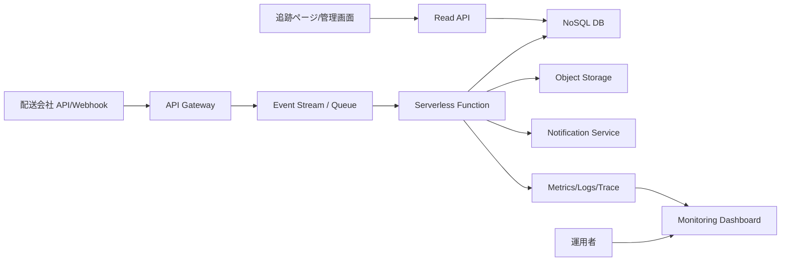

# Cloud Engineer Magazine (2026-05-30)
[[Home]]

## 1) 今日のアプリ
**リアルタイム配送トラッキングSaaS（中小EC向け）**  
- 配送ステータスを「注文管理画面」「購入者向け追跡ページ」「通知（メール/Push）」へ即時反映
- 配送会社API取り込み、遅延検知、到着予測、運用向けダッシュボードを提供

---

## 2) 要件整理（機能要件/非機能要件）
### 機能要件
- 配送イベント（集荷/輸送中/配達完了）を準リアルタイムで反映（数秒〜数十秒）
- 配送会社API/Webhookの取り込み
- 注文ID・追跡番号で検索
- 遅延判定ルール（例: SLA超過）
- 顧客通知（メール/モバイルPush）

### 非機能要件
- **可用性:** 業務時間帯に高可用（AZ障害に耐える）
- **性能:** ピーク時イベント急増（例: 通常の10倍）を吸収
- **セキュリティ:** 最小権限IAM、暗号化（保存時/転送時）、監査証跡
- **コスト:** 初期は小さく開始し、成長に合わせサーバレス/マネージドを段階利用

---

## 3) 推奨アーキテクチャ（なぜその構成か）
**イベント駆動 + マネージドDB + API層**を採用。

- 取り込みをメッセージング層へ分離し、配送APIのスパイクを吸収
- ステータス参照は低遅延KVS/NoSQLに集約
- 分析/再学習用にオブジェクトストレージへ履歴保存
- 通知を非同期化して本処理の遅延を防止

**理由:**
- 配送イベントはバーストしやすく、同期直書きは詰まりやすい
- イベント駆動により可用性と拡張性を両立
- マネージドサービス中心で運用負荷を抑えられる

---

## 4) クラウド別実装マップ
### AWS での実装サービス
- Ingress/API: **Amazon API Gateway**
- イベント取り込み: **Amazon EventBridge** or **Amazon SQS**
- 処理: **AWS Lambda**
- トランザクションDB: **Amazon DynamoDB**
- 履歴保管/分析: **Amazon S3** (+必要に応じて Athena)
- 通知: **Amazon SNS**
- 監視: **Amazon CloudWatch**, **AWS X-Ray**
- IAM/秘密情報: **AWS IAM**, **AWS KMS**, **AWS Secrets Manager**

### OCI での実装サービス
- Ingress/API: **OCI API Gateway**
- イベント取り込み: **OCI Streaming**
- 処理: **OCI Functions**
- トランザクションDB: **OCI NoSQL Database**
- 履歴保管: **OCI Object Storage**
- 通知: **OCI Notifications**
- 監視: **OCI Monitoring**, **OCI Logging**, **OCI Application Performance Monitoring**
- IAM/暗号鍵: **OCI IAM**, **OCI Vault**

### GCP での実装サービス
- Ingress/API: **API Gateway** (or Cloud Endpoints)
- イベント取り込み: **Pub/Sub**
- 処理: **Cloud Functions** or **Cloud Run**
- トランザクションDB: **Firestore** (Native mode)  
- 履歴保管: **Cloud Storage**
- 通知: **Firebase Cloud Messaging / Email連携（SendGrid等）**
- 監視: **Cloud Monitoring**, **Cloud Logging**, **Cloud Trace**
- IAM/秘密情報: **Cloud IAM**, **Cloud KMS**, **Secret Manager**

**トレードオフ（短評）**
- AWS: サービス選択肢が広く拡張しやすいが、設計自由度が高く複雑化しやすい
- OCI: 料金効率が良いケースが多く、構成が比較的シンプル
- GCP: Pub/Sub + サーバレス連携が強く、開発体験が軽快

---

## 5) システム構成図（Mermaid）

---

## 6) データフロー/認証・認可/監視運用の要点
### データフロー
1. 配送会社WebhookをAPI Gatewayで受信
2. イベントをキュー/ストリームへ投入
3. 関数で正規化・重複排除（idempotency key）
4. NoSQLへ最新状態をUpsert、履歴をオブジェクト保存
5. 状態変化時のみ通知イベント発行

### 認証・認可
- サービス間はIAMロールで接続（長期キーを避ける）
- APIはJWT/OAuth2または署名付きリクエスト
- テナント分離をDBパーティションキー（tenant_id）とIAM条件で強制
- KMS管理鍵で暗号化、Secrets Manager/Vaultでシークレット管理

### 監視運用
- SLI: 取り込み遅延、更新成功率、通知成功率
- SLO例: 95%イベントを30秒以内反映
- DLQ（死信キュー）と再処理手順をRunbook化

---

## 7) コスト最適化ポイント（初期・成長期）
### 初期
- サーバレス中心（課金を利用量連動）
- NoSQLはオンデマンド/小容量開始
- ログ保持期間を短めに設定（例: 14〜30日）

### 成長期
- イベント量安定後に予約/コミット系割引を検討
- ホットデータとコールドデータを分離（NoSQL + Object Storageライフサイクル）
- 通知の再送制御とバッチ化で外部送信コストを削減

---

## 8) 障害時の設計（DR/バックアップ/フェイルオーバー）
- **AZ障害:** マルチAZ構成（API/関数/DBの冗長）
- **リージョン障害:**
  - 重要テナントはクロスリージョン複製（NoSQL/Storage）
  - DNS/グローバルLBでセカンダリへ切替
- **バックアップ:**
  - NoSQLポイントインタイムリカバリ（可能な範囲で）
  - Object Storageのバージョニング + イミュータブル保管（必要時）
- **フェイルオーバー訓練:** 四半期ごとにゲームデイ実施

---

## 9) 学習ポイント（今日覚えるクラウド機能）
- **AWS:** EventBridge と SQS の使い分け（ルーティング重視 vs バッファ重視）
- **OCI:** Streaming + Functions のイベント処理パターン
- **GCP:** Pub/Sub の at-least-once 前提での冪等設計

---

## 10) 30〜60分ミニ演習
1. 任意クラウド1つを選ぶ（AWS/OCI/GCP）
2. 「Webhook受信 → キュー投入 → 関数処理 → NoSQL更新」の最小構成を作る
3. 同一イベントを2回送って**重複更新されない**ことを確認
4. メトリクスで処理時間P95を可視化

**完了条件:**
- イベント1件で状態が1回だけ更新される
- 失敗時に再試行 or DLQに落ちることを確認できる

---

## 11) 公式ドキュメント参照リンク（AWS/OCI/GCP）
### AWS
- Well-Architected Framework: https://docs.aws.amazon.com/wellarchitected/latest/framework/welcome.html
- Amazon API Gateway: https://docs.aws.amazon.com/apigateway/
- Amazon EventBridge: https://docs.aws.amazon.com/eventbridge/
- Amazon SQS: https://docs.aws.amazon.com/sqs/
- AWS Lambda: https://docs.aws.amazon.com/lambda/
- Amazon DynamoDB: https://docs.aws.amazon.com/dynamodb/
- Amazon S3: https://docs.aws.amazon.com/s3/
- Amazon SNS: https://docs.aws.amazon.com/sns/
- AWS IAM: https://docs.aws.amazon.com/iam/
- AWS KMS: https://docs.aws.amazon.com/kms/

### OCI
- OCI Architecture Center: https://docs.oracle.com/en-us/iaas/Content/Architecture/home.htm
- API Gateway: https://docs.oracle.com/en-us/iaas/Content/APIGateway/home.htm
- Streaming: https://docs.oracle.com/en-us/iaas/Content/Streaming/home.htm
- Functions: https://docs.oracle.com/en-us/iaas/Content/Functions/home.htm
- NoSQL Database: https://docs.oracle.com/en-us/iaas/nosql-database/index.html
- Object Storage: https://docs.oracle.com/en-us/iaas/Content/Object/home.htm
- Notifications: https://docs.oracle.com/en-us/iaas/Content/Notification/home.htm
- IAM: https://docs.oracle.com/en-us/iaas/Content/Identity/home.htm
- Vault: https://docs.oracle.com/en-us/iaas/Content/KeyManagement/home.htm

### GCP
- Architecture Framework: https://docs.cloud.google.com/architecture/framework
- API Gateway: https://docs.cloud.google.com/api-gateway
- Pub/Sub: https://docs.cloud.google.com/pubsub
- Cloud Functions: https://docs.cloud.google.com/functions
- Cloud Run: https://docs.cloud.google.com/run
- Firestore: https://docs.cloud.google.com/firestore
- Cloud Storage: https://docs.cloud.google.com/storage
- Cloud Monitoring: https://docs.cloud.google.com/monitoring
- Cloud Logging: https://docs.cloud.google.com/logging
- IAM: https://docs.cloud.google.com/iam
- Cloud KMS: https://docs.cloud.google.com/kms
- Secret Manager: https://docs.cloud.google.com/secret-manager
