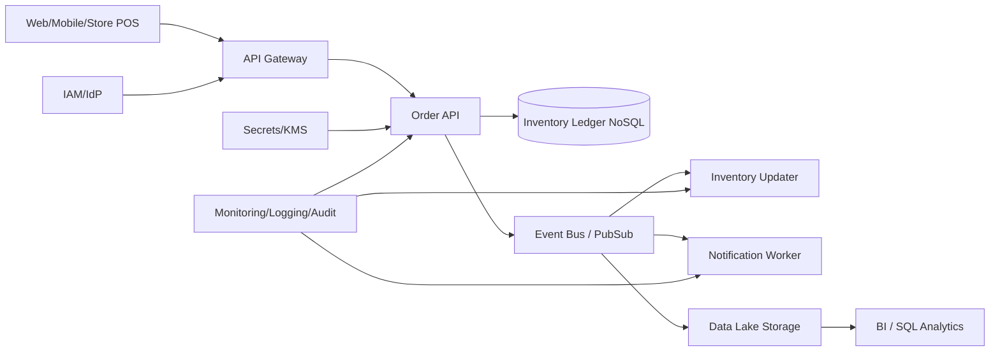

# Daily Cloud Engineer Magazine (2026-05-31 10:15 JST)
[[Home]]

## 1) 今日のアプリ
**リアルタイム在庫同期付き D2C コマース基盤**

実店舗・EC・倉庫の在庫を秒〜分単位で同期し、在庫切れ/過剰販売を防ぐアプリ。

---

## 2) 要件整理（機能要件/非機能要件）

### 機能要件
- 商品カタログ管理
- 注文受付・決済完了イベント受信
- 在庫引当/戻し（キャンセル時）
- 在庫変動イベントを各チャネルへ配信
- 管理者向け在庫ダッシュボード

### 非機能要件
- **可用性**: 24/7、RTO 30分以内、RPO 5分以内
- **性能**: 注文API p95 < 300ms、在庫反映 10秒以内
- **セキュリティ**: 最小権限IAM、暗号化（保存時/転送時）、監査ログ
- **コスト**: 初期はサーバーレス中心、成長後はホットパスのみ常駐化

---

## 3) 推奨アーキテクチャ（なぜその構成か）
- **API層 + イベント駆動 + NoSQL在庫台帳 + 分析基盤分離**を採用。
- 注文書き込みは同期APIで受け、在庫更新・通知・分析投入は非同期イベントで分離。
- これにより、ピーク時もAPI応答を守りやすく、機能追加（通知先や分析処理）も疎結合で拡張可能。

**トレードオフ**
- イベント駆動は再試行・重複排除設計が必要（複雑性↑）
- ただしスケール耐性と障害分離が大きく向上

---

## 4) クラウド別実装マップ

### AWS での実装サービス
- API: **Amazon API Gateway** + **AWS Lambda**
- 在庫台帳: **Amazon DynamoDB**（条件付き更新で競合制御）
- イベント: **Amazon EventBridge**（ドメインイベント連携）
- 非同期処理: **AWS Lambda** / **Amazon SQS**
- 分析: **Amazon Kinesis** or EventBridge連携 → **Amazon S3** + **Amazon Athena**
- 認証: **Amazon Cognito**（管理UI）
- 秘密情報: **AWS Secrets Manager**
- 監視: **Amazon CloudWatch** + **AWS X-Ray** + **AWS CloudTrail**

### OCI での実装サービス
- API: **API Gateway** + **Functions**
- 在庫台帳: **NoSQL Database**
- イベント: **Events**
- 非同期処理: **Queue** + Functions
- 分析: **Object Storage** + **Data Flow (Spark)** / **Analytics**
- 認証: **OCI IAM**（必要に応じて Identity Domains）
- 秘密情報: **Vault**
- 監視: **Monitoring** + **Logging** + **Audit**

### GCP での実装サービス
- API: **API Gateway** + **Cloud Run**（または Cloud Functions）
- 在庫台帳: **Firestore (Native mode)**
- イベント: **Pub/Sub**
- 非同期処理: **Cloud Run jobs / Cloud Functions** + Pub/Sub サブスク
- 分析: **Cloud Storage** + **BigQuery**
- 認証: **Identity Platform** or **IAM**（B2B/B2C要件で選択）
- 秘密情報: **Secret Manager**
- 監視: **Cloud Monitoring** + **Cloud Logging** + **Cloud Audit Logs** + **Cloud Trace**

---

## 5) システム構成図（Mermaid）

---

## 6) データフロー/認証・認可/監視運用の要点
- **データフロー**: 注文受付 → 在庫条件付き減算 → 成功時イベント発行 → 通知/分析へファンアウト
- **重複対策**: イベントに idempotency key、コンシューマ側で処理済み記録
- **認証・認可**:
  - 管理UI: OIDC/OAuth2
  - サービス間: IAMロール/サービスアカウント（固定キー禁止）
  - DBアクセス: テーブル/コレクション単位で最小権限
- **監視運用**:
  - SLI: API遅延、在庫同期遅延、失敗率
  - SLO違反時にアラート
  - 監査ログを集中保管し、変更追跡を必須化

---

## 7) コスト最適化ポイント（初期・成長期）
- **初期**:
  - サーバーレス中心（Lambda/Functions/Cloud Run）
  - ストレージはライフサイクルで低頻度層へ自動移行
  - 分析はバッチ実行（常時クラスター回避）
- **成長期**:
  - 高頻度APIのみプロビジョンド/最小インスタンスでウォーム化
  - NoSQLのアクセスパターン最適化（ホットキー分散）
  - イベント保持期間を用途別に短縮し転送コスト抑制

---

## 8) 障害時の設計（DR/バックアップ/フェイルオーバー）
- マルチAZを基本、リージョン障害に備えて**非同期クロスリージョン複製**
- バックアップ:
  - NoSQL定期スナップショット
  - オブジェクトストレージのバージョニング有効化
- フェイルオーバー:
  - DNS/グローバルLBでセカンダリへ切替
  - ランブック化（切替条件、担当、ロールバック手順）
- 定期DR訓練（四半期）でRTO/RPO実測

---

## 9) 学習ポイント（今日覚えるクラウド機能）
- **AWS**: DynamoDB 条件式更新で在庫競合を防ぐ
- **OCI**: Events + Functions + Queue で疎結合ワークフロー
- **GCP**: Pub/Sub の再配信前提で冪等コンシューマを作る

---

## 10) 30〜60分ミニ演習
1. 任意クラウドで「注文API -> イベント発行 -> 在庫更新ワーカー」の最小構成を作る
2. 在庫更新を**冪等化なし**で実装して重複問題を確認
3. idempotency key を導入して再実行
4. 失敗イベントをDLQ（または同等機能）に退避し、再処理手順を記述

**達成条件**
- 同一注文イベントを2回送っても在庫が1回分しか減らない
- 失敗イベントを手動再処理できる

---

## 11) 公式ドキュメント参照リンク（AWS/OCI/GCP）

### AWS
- API Gateway: https://docs.aws.amazon.com/apigateway/
- AWS Lambda: https://docs.aws.amazon.com/lambda/
- DynamoDB: https://docs.aws.amazon.com/dynamodb/
- EventBridge: https://docs.aws.amazon.com/eventbridge/
- SQS: https://docs.aws.amazon.com/sqs/
- Cognito: https://docs.aws.amazon.com/cognito/
- CloudWatch: https://docs.aws.amazon.com/cloudwatch/
- CloudTrail: https://docs.aws.amazon.com/cloudtrail/

### OCI
- API Gateway: https://docs.oracle.com/en-us/iaas/Content/APIGateway/home.htm
- Functions: https://docs.oracle.com/en-us/iaas/Content/Functions/home.htm
- Events: https://docs.oracle.com/en-us/iaas/Content/Events/home.htm
- Queue: https://docs.oracle.com/en-us/iaas/Content/queue/home.htm
- NoSQL Database: https://docs.oracle.com/en-us/iaas/nosql-database/index.html
- Vault: https://docs.oracle.com/en-us/iaas/Content/KeyManagement/home.htm
- Monitoring: https://docs.oracle.com/en-us/iaas/Content/Monitoring/home.htm
- Logging: https://docs.oracle.com/en-us/iaas/Content/Logging/home.htm
- Audit: https://docs.oracle.com/en-us/iaas/Content/Audit/home.htm

### GCP
- API Gateway: https://docs.cloud.google.com/api-gateway/docs
- Cloud Run: https://docs.cloud.google.com/run/docs
- Firestore: https://docs.cloud.google.com/firestore/docs
- Pub/Sub: https://docs.cloud.google.com/pubsub/docs
- Cloud Storage: https://docs.cloud.google.com/storage/docs
- BigQuery: https://docs.cloud.google.com/bigquery/docs
- Secret Manager: https://docs.cloud.google.com/secret-manager/docs
- Cloud Monitoring: https://docs.cloud.google.com/monitoring/docs
- Cloud Logging: https://docs.cloud.google.com/logging/docs
- Cloud Audit Logs: https://docs.cloud.google.com/logging/docs/audit
