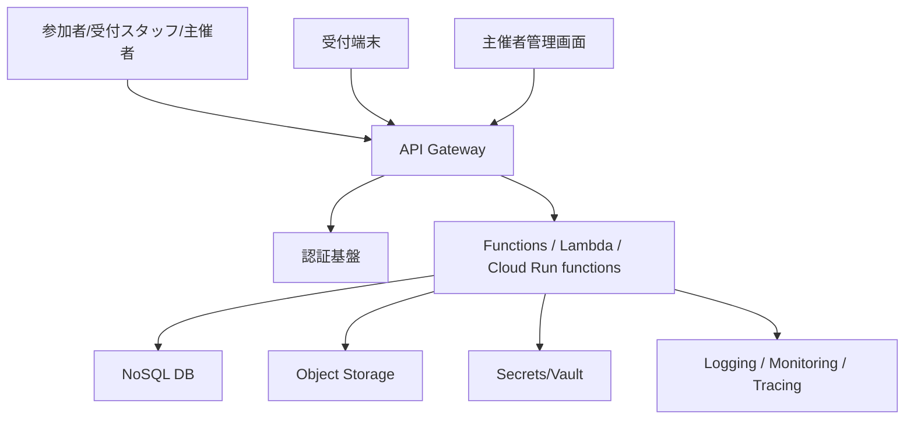

---
tags:
  - cloud
  - aws
  - oci
  - gcp
  - architecture
  - daily
---

[[Home]]

# Cloud Engineer Magazine — 2026-06-07

## 1) 今日のアプリ
**週末イベント向け QR チケットチェックイン SaaS**

小規模〜中規模イベント運営者が、参加者一覧、QR 発行、当日受付、入場済み判定、簡易ダッシュボードを使えるアプリを想定します。今日は **「サーバレス中心の単一リージョン本番 + マネージド監視 + 後から多リージョン拡張しやすい構成」** をテーマにします。

---

## 2) 要件整理

### 機能要件
- 主催者がイベントを作成
- 参加者登録、QR チケット発行
- 受付端末から QR 読み取り
- 二重入場防止
- 主催者向け参加状況ダッシュボード

### 非機能要件
- **可用性**: 受付ピーク時でも API が落ちにくい
- **性能**: QR 読み取りから 1 秒前後で入場可否を返す
- **セキュリティ**: 認証必須、管理 API と受付 API を分離、最小権限 IAM
- **コスト**: 平時は低コスト、イベント当日だけ自動スケール

---

## 3) 推奨アーキテクチャ（なぜその構成か）
**推奨: API Gateway + Functions/Lambda + NoSQL DB + Object Storage + Managed Auth + Managed Monitoring**

理由:
- イベント系は **平時ほぼゼロ、当日だけ急増** しやすく、サーバレスが合う
- 受付 API は CRUD より **低レイテンシなキー参照** が多く、NoSQL が相性良い
- QR 画像や CSV エクスポートは Object Storage に逃がせる
- 認証・監視・ログをマネージドに寄せると運用負荷を抑えやすい

**トレードオフ**
- サーバレスは運用が軽い反面、コールドスタートやローカル再現性に注意
- RDB の方が複雑な集計は楽だが、今日はチェックイン高速化を優先して NoSQL を選択

---

## 4) クラウド別実装マップ

### AWS での実装サービス
- エッジ/API: **Amazon API Gateway**
- 実行基盤: **AWS Lambda**
- データ: **Amazon DynamoDB**
- ファイル保存: **Amazon S3**
- 認証: **Amazon Cognito**
- 監視: **Amazon CloudWatch / AWS X-Ray**
- 秘密情報: **AWS Secrets Manager**

**向いている点**
- DynamoDB のキー設計で `eventId + ticketId` を主軸にすると高速
- Lambda の従量課金でイベント日以外の固定費を抑えやすい

### OCI での実装サービス
- エッジ/API: **OCI API Gateway**
- 実行基盤: **OCI Functions**
- データ: **Oracle NoSQL Database Cloud Service**
- ファイル保存: **OCI Object Storage**
- 認証/権限: **OCI IAM**
- 監視: **OCI Logging / Monitoring / Alarms**
- 秘密情報: **OCI Vault**

**向いている点**
- OCI API Gateway は Functions とつなぎやすい
- IAM ポリシーを compartment 単位で切ると運営チーム分離がしやすい

### GCP での実装サービス
- エッジ/API: **API Gateway**
- 実行基盤: **Cloud Run functions**（または Cloud Run サービス）
- データ: **Firestore (Native mode)**
- ファイル保存: **Cloud Storage**
- 認証: **Identity Platform** または **IAM + サービスアカウント**
- 監視: **Cloud Logging / Cloud Monitoring / Error Reporting**
- 秘密情報: **Secret Manager**

**向いている点**
- Firestore はイベント/チケット/チェックイン状態をドキュメントで扱いやすい
- Cloud Run 系は HTTP ワークロードのデプロイと観測が素直

---

## 5) システム構成図（Mermaid）

---

## 6) データフロー / 認証・認可 / 監視運用の要点

### データフロー
1. 主催者がイベント作成
2. チケット発行時に `ticketId` と署名付き QR 情報を生成
3. 受付端末が QR を送信
4. API が `eventId + ticketId` を NoSQL で参照
5. 未使用なら原子的に「checked-in」へ更新
6. 結果を即時返却し、監査ログを保存

### 認証・認可
- 主催者画面と受付画面で **権限を分離**
- API は **認証必須**、公開エンドポイント最小化
- Function/Lambda/Run から DB・Object Storage への権限は **最小権限 IAM**
- 管理操作とチェックイン操作でロール分離

### 監視運用
- 監視すべきメトリクス:
  - API 5xx
  - 関数エラー率
  - P95/P99 レイテンシ
  - DB スロットリング/容量不足
  - 認証失敗増加
- イベント当日はアラーム閾値を通常日より厳しめに設定

---

## 7) コスト最適化ポイント（初期・成長期）

### 初期
- サーバレス徹底で固定費を削る
- NoSQL は **オンデマンド/自動スケール寄り** で始める
- 画像や CSV は Object Storage に寄せる
- 長期保存ログは保持期間を短くして必要分のみアーカイブ

### 成長期
- アクセスパターンが固まったら:
  - AWS: DynamoDB のアクセス設計・TTL・必要なら予約/キャパシティ見直し
  - OCI: NoSQL の capacity mode とストレージ/読み書き特性を最適化
  - GCP: Firestore のインデックス最適化、不要インデックス削減
- QR 再生成や集計を非同期化し、同期 API の実行時間を削る

---

## 8) 障害時の設計（DR / バックアップ / フェイルオーバー）
- **最初の段階**: 単一リージョン + バックアップ + IaC 再作成可能を重視
- **次の段階**: 読み取り中心の画面から multi-region 化を検討
- DB は PITR/バックアップ/エクスポート機能を確認
- Object Storage はバージョニング・ライフサイクル・クロスリージョン複製を検討
- API 定義、IAM、関数コード、DB スキーマ相当は **Terraform など IaC 管理** 推奨

**実務的判断**
- 受付システムは「完全停止を避ける」が最優先
- そのため、障害時は「入場記録の後追い同期」を許容する **簡易オフラインモード** を端末側に持たせる設計も有効

---

## 9) 学習ポイント（今日覚えるクラウド機能）
- **AWS DynamoDB**: 高速キーアクセス、サーバレス NoSQL、TTL
- **OCI API Gateway**: 認証・レート制限付き HTTP エントリポイント
- **GCP Firestore**: ドキュメント指向、サーバレス、インデックス設計重要

---

## 10) 30〜60分ミニ演習
1. `eventId`, `ticketId`, `status`, `checkedInAt` を持つチケットデータモデルを設計
2. チェックイン API を 1 本設計
   - 入力: `eventId`, `ticketId`, `gateId`
   - 出力: `ALLOW` / `DENY_ALREADY_USED` / `DENY_NOT_FOUND`
3. 各クラウドで次を 1 行ずつ埋める
   - API
   - 実行基盤
   - DB
   - 認証
   - 監視
4. 「二重入場防止」をどう原子的に実装するかメモする

---

## 11) 公式ドキュメント参照リンク（AWS / OCI / GCP）

### AWS
- API Gateway: https://docs.aws.amazon.com/apigateway/latest/developerguide/welcome.html
- Lambda: https://docs.aws.amazon.com/lambda/latest/dg/welcome.html
- DynamoDB: https://docs.aws.amazon.com/amazondynamodb/latest/developerguide/Introduction.html
- Cognito: https://docs.aws.amazon.com/cognito/latest/developerguide/what-is-amazon-cognito.html
- CloudWatch: https://docs.aws.amazon.com/AmazonCloudWatch/latest/monitoring/WhatIsCloudWatch.html

### OCI
- API Gateway Overview: https://docs.oracle.com/en-us/iaas/Content/APIGateway/Concepts/apigatewayoverview.htm
- API Gateway Docs Home: https://docs.oracle.com/en-us/iaas/Content/APIGateway/home.htm
- Functions Overview: https://docs.oracle.com/en-us/iaas/Content/Functions/Concepts/functionsoverview.htm
- Oracle NoSQL Database on OCI: https://docs.oracle.com/en-us/iaas/nosql-database/index.html
- IAM Overview: https://docs.oracle.com/en-us/iaas/Content/Identity/Concepts/overview.htm
- Getting Started with Policies: https://docs.oracle.com/en-us/iaas/Content/Identity/Concepts/policygetstarted.htm

### GCP
- API Gateway: https://docs.cloud.google.com/api-gateway/docs
- Cloud Run functions overview: https://docs.cloud.google.com/functions/docs/concepts/overview
- Firestore overview: https://docs.cloud.google.com/firestore/native/docs/overview
- Cloud Storage: https://docs.cloud.google.com/storage/docs
- Cloud Monitoring: https://docs.cloud.google.com/monitoring/docs
- Secret Manager: https://docs.cloud.google.com/secret-manager/docs
