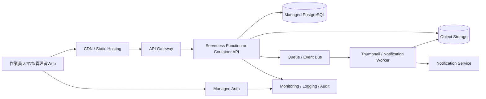

---
tags:
  - cloud
  - aws
  - oci
  - gcp
  - architecture
  - daily
---

[[Home]]

# Cloud Engineer Magazine — 2026-06-08

## 1) 今日のアプリ
**写真付き現場点検レポートアプリ**

設備保守・建設・倉庫点検の担当者が、スマホから写真・チェックリスト・位置情報・コメントを送信し、管理者がWeb画面で進捗確認・差し戻し・CSV出力できるアプリ。

**今日の視点:** 3クラウド共通で実装できる「標準構成」を学ぶ日。  
特に **オブジェクトストレージ + マネージドDB + サーバレスAPI + IAM + 監視** の基本形を比較する。

---

## 2) 要件整理

### 機能要件
- モバイル/ブラウザから点検報告を登録
- 写真アップロード
- 点検項目の保存（OK/NG/要確認）
- 報告一覧、検索、ステータス更新
- 管理者/作業員の権限制御
- 通知（報告完了、差し戻し）

### 非機能要件
- **可用性:** 営業時間中は止めにくい。リージョン内冗長が基本
- **性能:** 写真アップロードは数MB/枚、API応答は通常1秒前後を目標
- **セキュリティ:** 写真は非公開保管、最小権限IAM、監査ログ必須
- **コスト:** 初期は小さく始め、利用増加時のみスケール

---

## 3) 推奨アーキテクチャ（なぜその構成か）

**推奨構成:**
- フロントエンド: 静的Webホスティング/CDN
- 認証: クラウドのマネージドID基盤
- API: サーバレス関数 or 軽量コンテナAPI
- データ: マネージドRDB
- 写真: オブジェクトストレージ
- 非同期処理: キュー/イベントでサムネイル生成や通知
- 監視: メトリクス、ログ、監査ログを標準有効化

### なぜこの構成か
- **写真ファイルをDBに入れない**ことで、容量・コスト・性能を分離しやすい
- **APIはサーバレス優先**にすると、初期費用を抑えやすい
- **認証を自前実装しない**ことで、パスワード管理やMFAをマネージド化できる
- **イベント駆動**にすると、画像後処理や通知を本処理から切り離せる

### トレードオフ
- **サーバレス関数**は初期に有利だが、長時間処理や複雑接続ではコンテナの方が楽なことがある
- **RDB**は検索条件が複雑な業務向き。超高スループットな単純Key-Value用途ならNoSQLも候補
- **CDN配信**は高速化に有利だが、社内限定運用ならLB配下の単純構成でもよい

---

## 4) クラウド別実装マップ

### AWS での実装サービス
- フロント: **Amazon CloudFront + Amazon S3**
- 認証: **Amazon Cognito**
- API: **Amazon API Gateway + AWS Lambda**
- DB: **Amazon RDS for PostgreSQL**
- 写真保存: **Amazon S3**
- 非同期: **Amazon SQS** / **Amazon EventBridge**
- 通知: **Amazon SNS**
- 監視: **Amazon CloudWatch** / **AWS CloudTrail**
- 秘密情報: **AWS Secrets Manager**

**AWSでこの構成を選ぶ理由:**
- サーバレス部品が細かく揃っていて、小規模開始がしやすい
- S3 + Lambda + EventBridge の連携が定番で実装情報も豊富

### OCI での実装サービス
- フロント: **Object Storage + Load Balancer/CDN検討**
- 認証: **OCI IAM Identity Domains**
- API: **API Gateway + Functions**
- DB: **Base Database Service (PostgreSQL/MySQL選定)**
- 写真保存: **Object Storage**
- 非同期: **Streaming** または **Events**
- 通知: **Notifications**
- 監視: **Monitoring** / **Logging** / **Audit**
- 秘密情報: **Vault**

**OCIでこの構成を選ぶ理由:**
- Oracle系運用との親和性が高く、監査・IAM・Vaultを標準構成に組み込みやすい
- コスト観点で有利になるケースがあり、中堅業務システムに載せやすい

### GCP での実装サービス
- フロント: **Cloud Storage + Cloud CDN**
- 認証: **Identity Platform**
- API: **API Gateway + Cloud Run** または **Cloud Functions**
- DB: **Cloud SQL for PostgreSQL**
- 写真保存: **Cloud Storage**
- 非同期: **Pub/Sub**
- 通知: **Pub/Sub + Cloud Run/Functions**
- 監視: **Cloud Monitoring** / **Cloud Logging** / **Cloud Audit Logs**
- 秘密情報: **Secret Manager**

**GCPでこの構成を選ぶ理由:**
- Cloud Run が非常に扱いやすく、HTTP API の実装・運用が軽い
- Logging/Monitoring の横断体験がよく、可観測性を作りやすい

---

## 5) システム構成図（Mermaid）

---

## 6) データフロー / 認証・認可 / 監視運用の要点

### データフロー
1. ユーザーがログイン
2. API がアップロード用URLまたは安全な受け口を発行
3. 写真はオブジェクトストレージへ保存
4. 点検メタデータは API 経由でDB保存
5. 保存イベントでサムネイル生成や通知を非同期実行

### 認証・認可
- **認証**は Cognito / Identity Domains / Identity Platform などを使用
- **認可**はロール分離を明確にする
  - 作業員: 自分の報告作成・参照
  - 管理者: 全件参照・承認・差し戻し
  - 運用者: 監査ログ参照、本番変更は制限
- **最小権限IAM**を徹底
  - API実行ロールは必要バケット/DB/キューだけ
  - 管理UIの運用者権限と開発者権限を分離
- バケット/ストレージは**非公開デフォルト**

### 監視運用
- 監視対象
  - APIエラー率
  - p95レイテンシ
  - DB接続数/CPU/ストレージ
  - 非同期キュー滞留
  - 認証失敗急増
- 監査対象
  - IAM変更
  - 秘密情報アクセス
  - ストレージ公開設定変更

---

## 7) コスト最適化ポイント（初期・成長期）

### 初期
- API は **Lambda / Functions / Cloud Run最小構成** で始める
- DB は最小サイズから開始。ただしバックアップは削らない
- 写真は原本保存 + 必要時のみサムネイル生成
- CDN/キャッシュで静的配信を安くする

### 成長期
- 画像サイズ上限を設けて転送量を抑える
- DBは読取負荷が増えたらリードレプリカや接続最適化を検討
- ライフサイクル管理で古い写真を低コスト層へ移行
- サーバレス限界が来たら、APIのみコンテナ常駐へ段階移行

---

## 8) 障害時の設計（DR / バックアップ / フェイルオーバー）

- **RDB:** 自動バックアップ有効化、復旧手順を定期確認
- **オブジェクトストレージ:** バージョニング/保持ポリシーを検討
- **リージョン戦略:** まずは単一リージョン高可用、その後必要に応じてクロスリージョン
- **非同期処理:** リトライ + デッドレターキュー相当を使う
- **認証基盤障害:** 一時的な業務停止影響を把握し、手順書を作る
- **フェイルオーバー方針:**
  - 初期は手動復旧で十分なことが多い
  - ミッションクリティカル化したらDB/ストレージ複製を強化

---

## 9) 学習ポイント（今日覚えるクラウド機能）

**「オブジェクトストレージへの直接アップロード」**

アプリサーバーを経由せず、クライアントから安全に写真をアップロードする設計は重要。  
これで API サーバーの帯域負荷を減らし、スケールしやすくなる。

あわせて覚えること:
- 期限付きアップロードURLの考え方
- バケット非公開 + 必要時だけ署名付きアクセス
- 保存イベントで後処理を分離する設計

---

## 10) 30〜60分ミニ演習

### 演習テーマ
「1枚の点検写真を安全に登録する最小構成」を設計する

### やること
1. AWS/OCI/GCP のどれか1つを選ぶ
2. 次の4部品だけで構成を書く
   - 認証
   - API
   - オブジェクトストレージ
   - DB
3. 次の質問に答える
   - 写真はどこに保存するか
   - API は何をDBに保存するか
   - 権限は誰に何を許可するか
   - 障害時に最低限どこをバックアップするか
4. Mermaid で5ノード以内の簡易図を書く

**余力があれば:**
- サムネイル生成を非同期化するイベントを1つ追加
- 監視アラートを3つ定義する

---

## 11) 公式ドキュメント参照リンク（AWS / OCI / GCP）

### AWS
- Amazon S3: https://docs.aws.amazon.com/AmazonS3/latest/userguide/Welcome.html
- Amazon API Gateway: https://docs.aws.amazon.com/apigateway/latest/developerguide/welcome.html
- AWS Lambda: https://docs.aws.amazon.com/lambda/latest/dg/welcome.html
- Amazon Cognito: https://docs.aws.amazon.com/cognito/latest/developerguide/what-is-amazon-cognito.html
- Amazon RDS: https://docs.aws.amazon.com/AmazonRDS/latest/UserGuide/Welcome.html
- AWS Secrets Manager: https://docs.aws.amazon.com/secretsmanager/latest/userguide/intro.html
- Amazon CloudWatch: https://docs.aws.amazon.com/AmazonCloudWatch/latest/monitoring/WhatIsCloudWatch.html
- AWS CloudTrail: https://docs.aws.amazon.com/awscloudtrail/latest/userguide/cloudtrail-user-guide.html

### OCI
- Object Storage: https://docs.oracle.com/en-us/iaas/Content/Object/Concepts/objectstorageoverview.htm
- API Gateway: https://docs.oracle.com/en-us/iaas/Content/APIGateway/home.htm
- Functions: https://docs.oracle.com/en-us/iaas/Content/Functions/home.htm
- Identity and Access Management / Identity Domains: https://docs.oracle.com/en-us/iaas/Content/Identity/home.htm
- Base Database Service: https://docs.oracle.com/en-us/iaas/Content/Database/home.htm
- Notifications: https://docs.oracle.com/en-us/iaas/Content/Notification/home.htm
- Events: https://docs.oracle.com/en-us/iaas/Content/Events/home.htm
- Logging: https://docs.oracle.com/en-us/iaas/Content/Logging/home.htm
- Monitoring: https://docs.oracle.com/en-us/iaas/Content/Monitoring/home.htm
- Vault: https://docs.oracle.com/en-us/iaas/Content/KeyManagement/home.htm
- Audit: https://docs.oracle.com/en-us/iaas/Content/Audit/Concepts/auditoverview.htm

### GCP
- Cloud Storage: https://docs.cloud.google.com/storage/docs
- API Gateway: https://docs.cloud.google.com/api-gateway/docs
- Cloud Run: https://docs.cloud.google.com/run/docs
- Cloud Functions: https://docs.cloud.google.com/functions/docs
- Identity Platform: https://docs.cloud.google.com/identity-platform/docs
- Cloud SQL: https://docs.cloud.google.com/sql/docs
- Pub/Sub: https://docs.cloud.google.com/pubsub/docs
- Secret Manager: https://docs.cloud.google.com/secret-manager/docs
- Cloud Monitoring: https://docs.cloud.google.com/monitoring/docs
- Cloud Logging: https://docs.cloud.google.com/logging/docs
- Cloud Audit Logs: https://docs.cloud.google.com/logging/docs/audit

---

## ひとこと
今日のポイントは、**「写真はオブジェクトストレージ、業務データはRDB、後処理はイベント駆動」**。  
この型は点検アプリ以外にも、経費精算、不具合報告、配送証跡アプリにそのまま応用できる。
