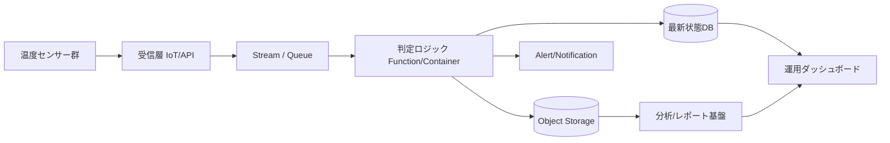

---
tags:
  - cloud
  - aws
  - oci
  - gcp
  - architecture
  - daily
---

[[Home]]

# Cloud Engineer Magazine — 2026-06-09

## 1) 今日のアプリ
**コールドチェーン温度監視アプリ**

物流倉庫・配送車・店舗の冷蔵/冷凍設備に取り付けたセンサーから温度データを継続収集し、閾値超過を検知したら即時アラート、ダッシュボード表示、監査用レポート出力を行うアプリ。

**今日の視点:** 3クラウド比較をしつつ、**IoT/イベント駆動/時系列に近い監視ワークロード**をどう安全に実装するかを学ぶ。

---

## 2) 要件整理

### 機能要件
- センサーから数分おきに温度データ送信
- 閾値超過時に即時通知
- デバイスごとの最新状態表示
- 過去データの検索・グラフ表示
- 店舗/倉庫/配送車ごとの権限制御
- 監査レポート出力

### 非機能要件
- **可用性:** アラート停止は業務影響が大きい。受信と通知は高可用を優先
- **性能:** 取り込みはバーストあり。1件ごとの遅延よりも安定吸収が重要
- **セキュリティ:** デバイス認証、通信暗号化、最小権限IAM、監査ログ必須
- **コスト:** 初期は少数デバイス、成長時は数千〜数万台まで段階拡張したい

---

## 3) 推奨アーキテクチャ（なぜその構成か）

**推奨構成:**
- デバイス受信: マネージドIoTエンドポイント
- 取り込みバッファ: メッセージング/ストリーム
- 判定ロジック: サーバレス関数
- 最新状態: NoSQL / キー中心DB
- 履歴保存: オブジェクトストレージ + 分析系DB or 時系列参照しやすい保管先
- 通知: メール/Webhook/運用通知
- 可視化: ダッシュボード

### なぜこの構成か
- **IoT受信を専用サービスに寄せる**と、証明書ベース認証や大量接続制御を自前実装しなくてよい
- **ストリーム/キューで受信と処理を分離**すると、バースト時も取りこぼしにくい
- **最新状態と履歴を分ける**と、画面表示の速さと長期保存コストを両立しやすい
- **アラート判定をサーバレス化**すると、初期は低コストで始めやすい

### トレードオフ
- **IoT専用サービス**は運用が楽だが、HTTP API直受けより学習コストがある
- **NoSQLで最新状態管理**は高速だが、複雑な集計は分析基盤へ逃がす設計が必要
- **ストリーム基盤**は拡張性が高いが、少数デバイスだけならややオーバースペックになることもある

---

## 4) クラウド別実装マップ

### AWS での実装サービス
- デバイス接続: **AWS IoT Core**
- ルール/連携: **AWS IoT Rules**
- 判定処理: **AWS Lambda**
- 最新状態: **Amazon DynamoDB**
- 長期保存: **Amazon S3**
- 配信/通知: **Amazon SNS**
- 可視化: **Amazon Managed Grafana** または独自Web
- 監視/監査: **Amazon CloudWatch / AWS CloudTrail**
- 秘密情報: **AWS Secrets Manager**

**向いている理由:** IoT Coreとルールエンジンで取り込みから後続連携まで組みやすい。DynamoDBで最新状態参照を高速化しやすい。

### OCI での実装サービス
- デバイス接続/API受信: **OCI API Gateway** + デバイス認証基盤（証明書/署名付きリクエスト設計）
- 非同期取り込み: **OCI Streaming**
- 判定処理: **OCI Functions**
- 最新状態: **OCI NoSQL Database**
- 長期保存: **OCI Object Storage**
- 通知: **OCI Notifications**
- 可視化/分析: **OCI Logging Analytics** または APEX/独自Web
- 監視/監査: **OCI Monitoring / Logging / Audit**
- 秘密情報: **OCI Vault**

**向いている理由:** Streaming + Functions + NoSQL の組み合わせでイベント駆動を素直に作れる。価格感を抑えつつ構成を整理しやすい。

### GCP での実装サービス
- デバイス受信: **Cloud Run** でHTTPS受信エンドポイント
- 非同期取り込み: **Pub/Sub**
- 判定処理: **Cloud Functions** または **Cloud Run**
- 最新状態: **Firestore** または **Bigtable**
- 長期保存: **Cloud Storage**
- 分析: **BigQuery**
- 通知: **Pub/Sub push / 外部通知連携 / メール基盤**
- 監視/監査: **Cloud Monitoring / Cloud Logging / Cloud Audit Logs**
- 秘密情報: **Secret Manager**

**向いている理由:** Pub/Sub と BigQuery の組み合わせで、収集から分析までの導線が強い。Cloud Run中心でHTTPベース実装もしやすい。

---

## 5) システム構成図（Mermaidで簡易図）

---

## 6) データフロー/認証・認可/監視運用の要点

### データフロー
1. デバイスが温度データをTLSで送信
2. 受信層が認証し、ストリーム/キューへ投入
3. 判定ロジックが閾値超過を検知
4. 最新状態DBを更新
5. 全件または集約済みデータを長期保存
6. アラートとダッシュボードへ反映

### 認証・認可
- **デバイスごとに個別ID/証明書/鍵**を持たせる
- **デバイスは送信専用権限**に限定
- 運用者・閲覧者・監査者でIAMロールを分離
- 秘密情報はVault/Secrets Manager/Secret Managerで保管
- 管理UIはSSO + MFA前提

### 監視運用
- メトリクス: 受信件数、遅延、失敗率、未処理件数、通知成功率
- ログ: デバイス認証失敗、閾値超過イベント、関数失敗
- 監査: IAM変更、秘密情報参照、通知設定変更
- 運用Runbook: 「通知失敗」「特定拠点のデータ途絶」「誤検知多発」を事前定義

---

## 7) コスト最適化ポイント（初期・成長期）

### 初期
- まずは**サーバレス中心**で開始
- 最新状態のみNoSQL、履歴はObject Storageへ寄せる
- ダッシュボードはフル自作せず、マネージド監視や簡易Webで始める

### 成長期
- 閾値判定を共通化し、重い分析だけ別パイプラインへ分離
- 保持期間ポリシーを分ける（直近90日高速、過去は低コスト保管）
- 通知連打を避けるため、抑止/集約ロジックを入れる

---

## 8) 障害時の設計（DR/バックアップ/フェイルオーバー）

- **受信層:** マネージドサービスのAZ冗長を前提。リージョン障害を考えるなら別リージョン待機
- **最新状態DB:** 自動バックアップ有効化。RPO/RTOに応じてクロスリージョン複製を検討
- **オブジェクト保存:** バージョニング/ライフサイクル/リージョン複製を使う
- **通知経路:** 単一通知先に依存せず、メール + Webhook など複線化
- **DR方針:**
  - 初期: リージョン内高可用 + バックアップ重視
  - 成長後: 重要拠点向けに別リージョン受信系を用意し、DNS/エンドポイント切替手順を明文化

---

## 9) 学習ポイント（今日覚えるクラウド機能）

- **AWS IoT Core** はデバイス接続とルール連携の入口として強い
- **OCI Streaming** はイベント受信のバッファとして使いやすい
- **GCP Pub/Sub** は疎結合な非同期連携の基本
- **最新状態DBと履歴保存を分ける**と、監視系ワークロードが整理しやすい
- **最小権限IAM + 秘密情報の外出し**が secure-by-default の基本

---

## 10) 30〜60分ミニ演習

1. 3クラウドそれぞれで、以下の対応表を自分で埋める
   - 受信層
   - 非同期層
   - 判定処理
   - 最新状態保存
   - 長期保存
   - 監視/監査
2. 「温度が5分間連続で閾値超過したら通知」に変更するとしたら、どこにロジックを置くか書く
3. 次の2案を比較して一言で結論を出す
   - A: 受信直後に毎回通知
   - B: ストリーム投入後に集約して通知
4. 余裕があれば Mermaid 図を「別リージョンDRあり」に書き換える

---

## 11) 公式ドキュメント参照リンク（AWS/OCI/GCP）

### AWS
- AWS IoT Core: https://docs.aws.amazon.com/iot/
- AWS Lambda: https://docs.aws.amazon.com/lambda/
- Amazon DynamoDB: https://docs.aws.amazon.com/dynamodb/
- Amazon S3: https://docs.aws.amazon.com/s3/
- Amazon SNS: https://docs.aws.amazon.com/sns/
- Amazon CloudWatch: https://docs.aws.amazon.com/cloudwatch/
- AWS CloudTrail: https://docs.aws.amazon.com/cloudtrail/

### OCI
- OCI API Gateway: https://docs.oracle.com/en-us/iaas/Content/APIGateway/home.htm
- OCI Streaming: https://docs.oracle.com/en-us/iaas/Content/Streaming/home.htm
- OCI Functions: https://docs.oracle.com/en-us/iaas/Content/Functions/home.htm
- OCI NoSQL Database: https://docs.oracle.com/en-us/iaas/nosql-database/index.html
- OCI Object Storage: https://docs.oracle.com/en-us/iaas/Content/Object/home.htm
- OCI Notifications: https://docs.oracle.com/en-us/iaas/Content/Notification/home.htm
- OCI Monitoring / Logging / Audit: https://docs.oracle.com/en-us/iaas/Content/Monitoring/home.htm / https://docs.oracle.com/en-us/iaas/Content/Logging/home.htm / https://docs.oracle.com/en-us/iaas/Content/Audit/home.htm
- OCI Vault: https://docs.oracle.com/en-us/iaas/Content/KeyManagement/home.htm

### GCP
- Cloud Run: https://docs.cloud.google.com/run/docs
- Pub/Sub: https://docs.cloud.google.com/pubsub/docs
- Cloud Functions: https://docs.cloud.google.com/functions/docs
- Firestore: https://docs.cloud.google.com/firestore/docs
- Bigtable: https://docs.cloud.google.com/bigtable/docs
- Cloud Storage: https://docs.cloud.google.com/storage/docs
- BigQuery: https://docs.cloud.google.com/bigquery/docs
- Cloud Monitoring: https://docs.cloud.google.com/monitoring/docs
- Cloud Logging: https://docs.cloud.google.com/logging/docs
- Cloud Audit Logs: https://docs.cloud.google.com/logging/docs/audit
- Secret Manager: https://docs.cloud.google.com/secret-manager/docs
