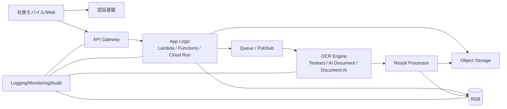

---
tags:
  - cloud
  - aws
  - oci
  - gcp
  - architecture
  - daily
---

[[Home]]

# Cloud Engineer Magazine — 2026-06-10

## 1) 今日のアプリ
**レシートOCR経費精算アプリ**

スマホでレシートを撮影すると、OCRで金額・日付・加盟店名を抽出し、申請ワークフローに流す社内向けアプリを作る。

**今日の視点:** 3クラウド比較（サーバーレス + マネージドAI + オブジェクトストレージ）

---

## 2) 要件整理

### 機能要件
- 従業員が画像/PDFをアップロード
- OCRで金額・日付・店舗名・税額候補を抽出
- 申請一覧、承認、差し戻し
- 画像原本を保持
- 会計システム連携用API/CSV出力

### 非機能要件
- **可用性:** 平日日中の業務ピークに耐える
- **性能:** アップロード受付は即時、OCRは非同期で数秒〜数十秒以内
- **セキュリティ:** 社員認証必須、原本は暗号化保管、最小権限IAM
- **コスト:** 初期は従量課金中心、利用増でDB/ワーカーを最適化

---

## 3) 推奨アーキテクチャ（なぜその構成か）
**推奨:** API + サーバーレス実行基盤 + Object Storage + OCR AI + RDB の非同期構成。

### 理由
- OCRは処理時間が読みにくいので、**同期APIの裏で非同期実行**に分離したほうが安定する
- レシート原本はRDBではなく**オブジェクトストレージ保管**が自然
- 抽出結果は検索・承認状態管理が必要なので**RDB**が扱いやすい
- 社内アプリなので、認証は**クラウド標準のID/IAM**に寄せると運用が軽い

### トレードオフ
- **フルサーバーレス:** 運用は軽いが、複雑な長時間処理や独自ライブラリ制御は弱め
- **コンテナ実行（Cloud Run / ECS / Container Instances 等）:** 柔軟だが、初期構築は少し重い
- **NoSQL中心:** スケールは強いが、承認一覧や経費検索条件が増えると設計が難しくなりやすい

---

## 4) クラウド別実装マップ

### AWS での実装サービス
- フロント/API: **Amazon API Gateway**
- 認証: **Amazon Cognito User Pools**
- アプリ処理: **AWS Lambda**
- 原本保存: **Amazon S3**
- OCR: **Amazon Textract**
- ワークフロー/非同期制御: **Amazon SQS** または **AWS Step Functions**
- 申請DB: **Amazon Aurora Serverless v2 (PostgreSQL)**
- 監視: **Amazon CloudWatch** + **AWS CloudTrail**
- 秘密情報: **AWS Secrets Manager**

**向いている理由:** サーバーレス統合が強く、社内申請系の標準構成を作りやすい。

### OCI での実装サービス
- フロント/API: **OCI API Gateway**
- 認証: **OCI IAM**（必要に応じて IDCS / IAM Identity Domains）
- アプリ処理: **OCI Functions**
- 原本保存: **OCI Object Storage**
- OCR: **OCI Document Understanding / AI Document**
- 非同期連携: **OCI Queue** または **Events**
- 申請DB: **Autonomous Database**
- 監視: **OCI Logging / Monitoring / Audit**
- 秘密情報: **OCI Vault**

**向いている理由:** Oracle系業務システムとの親和性が高く、DB込みで堅実にまとめやすい。

### GCP での実装サービス
- フロント/API: **API Gateway**
- 認証: **Identity Platform** または **Cloud IAM/IAP**（社内公開方式に応じて選択）
- アプリ処理: **Cloud Run**
- 原本保存: **Cloud Storage**
- OCR: **Document AI**
- 非同期連携: **Pub/Sub**
- 申請DB: **Cloud SQL for PostgreSQL**
- 監視: **Cloud Logging / Cloud Monitoring / Cloud Audit Logs**
- 秘密情報: **Secret Manager**

**向いている理由:** Document AI と Cloud Run の組み合わせが実装しやすく、イベント駆動化もしやすい。

---

## 5) システム構成図（Mermaid）

---

## 6) データフロー / 認証・認可 / 監視運用の要点

### データフロー
1. ユーザーがログイン
2. API経由でアップロード要求
3. アプリが原本をObject Storageへ保存
4. OCRジョブをキュー投入
5. ワーカーがOCR実行
6. 抽出結果をRDBへ保存
7. 承認者が一覧/詳細を確認して承認

### 認証・認可
- エンドユーザー認証は **Cognito / IAM Identity Domains / Identity Platform** を利用
- バックエンド間認可は**ロールベース**で分離
- OCR実行ロールには**対象バケット/対象プロジェクト/対象コンパートメントのみ**許可
- DB接続情報は Secrets Manager / Vault / Secret Manager に隔離

### 監視運用
- API 4xx/5xx、OCR失敗率、OCR処理時間、キュー滞留、DB接続数を監視
- 監査ログは必須（だれが原本にアクセスしたか追える状態）
- 個人情報を含むため、アプリログにレシート全文を出さない

---

## 7) コスト最適化ポイント（初期・成長期）

### 初期
- API/実行基盤は従量課金中心（Lambda / Functions / Cloud Run）
- 原本は標準ストレージで開始し、ライフサイクルで低頻度層へ移行
- OCRは**必要ページだけ**実行し、再処理回数を減らす

### 成長期
- OCR前に画像圧縮/サイズ制限を入れて無駄コストを削減
- DBは読取負荷に応じてリード分離や接続プーリングを検討
- 承認一覧が重くなったら、検索用インデックスや集計テーブルを追加

---

## 8) 障害時の設計（DR / バックアップ / フェイルオーバー）
- 原本は**Object Storageの耐久性**を前提にしつつ、必要ならクロスリージョン複製
- DBは自動バックアップを有効化し、RPO/RTOを先に決める
- OCR失敗は即エラー終了ではなく、**再試行 + デッドレターキュー**へ退避
- API系はステートレス維持、再デプロイで復旧しやすくする
- 監査ログ/運用ログの保存先はアプリ本体障害と分離

---

## 9) 学習ポイント（今日覚えるクラウド機能）
- **AWS Textract** はフォーム/テーブル抽出に強い
- **OCI API Gateway** は private/public 公開や認証・レート制御の入口として使いやすい
- **GCP Document AI** はドキュメント処理ワークロードに特化している
- 3クラウド共通で、**同期API + 非同期OCR** に分けるのが実務的

---

## 10) 30〜60分ミニ演習
**お題:** 「アップロード受付APIだけ」を設計する

やること:
1. APIエンドポイントを1本定義する（`POST /receipts`）
2. リクエスト/レスポンスJSONを決める
3. 保存先バケット名とキー命名規則を決める
4. OCR実行を同期にするか非同期にするか理由を書く
5. IAMロールを3つに分ける
   - API実行ロール
   - OCR実行ロール
   - 承認者閲覧ロール

**仕上げ条件:**
- 誰が何にアクセスできるかを1枚で説明できる
- 障害時の再試行方法を言える

---

## 11) 公式ドキュメント参照リンク（AWS / OCI / GCP）

### AWS
- API Gateway: https://docs.aws.amazon.com/apigateway/latest/developerguide/welcome.html
- Cognito User Pools: https://docs.aws.amazon.com/cognito/latest/developerguide/cognito-user-pools.html
- Lambda: https://docs.aws.amazon.com/lambda/latest/dg/welcome.html
- S3: https://docs.aws.amazon.com/AmazonS3/latest/userguide/Welcome.html
- Textract: https://docs.aws.amazon.com/textract/latest/dg/what-is.html
- Step Functions: https://docs.aws.amazon.com/step-functions/latest/dg/welcome.html
- Aurora Serverless v2: https://docs.aws.amazon.com/AmazonRDS/latest/AuroraUserGuide/aurora-serverless-v2.html

### OCI
- API Gateway: https://docs.oracle.com/en-us/iaas/Content/APIGateway/Concepts/apigatewayoverview.htm
- Functions: https://docs.oracle.com/en-us/iaas/Content/Functions/Concepts/functionsoverview.htm
- Object Storage: https://docs.oracle.com/en-us/iaas/Content/Object/Concepts/objectstorageoverview.htm
- Queue: https://docs.oracle.com/en-us/iaas/Content/queue/overview.htm
- Autonomous Database: https://docs.oracle.com/en/cloud/paas/autonomous-database/index.html
- Vault: https://docs.oracle.com/en-us/iaas/Content/KeyManagement/Concepts/keyoverview.htm
- OCI AI Document SDK reference: https://docs.oracle.com/en-us/iaas/tools/python/latest/api/ai_document.html

### GCP
- API Gateway: https://docs.cloud.google.com/api-gateway/docs/about-api-gateway
- Cloud Run: https://docs.cloud.google.com/run/docs/overview/what-is-cloud-run
- Cloud Storage: https://docs.cloud.google.com/storage/docs/introduction
- Document AI: https://docs.cloud.google.com/document-ai/docs/overview
- Pub/Sub: https://docs.cloud.google.com/pubsub/docs/overview
- Cloud SQL: https://docs.cloud.google.com/sql/docs/postgres/introduction
- Secret Manager: https://docs.cloud.google.com/secret-manager/docs/overview

---

## 一言メモ
この手のアプリは、**OCR精度より先に権限設計と監査ログ設計で差がつく**。PoCでもそこを雑にしないのが実務では大事。
