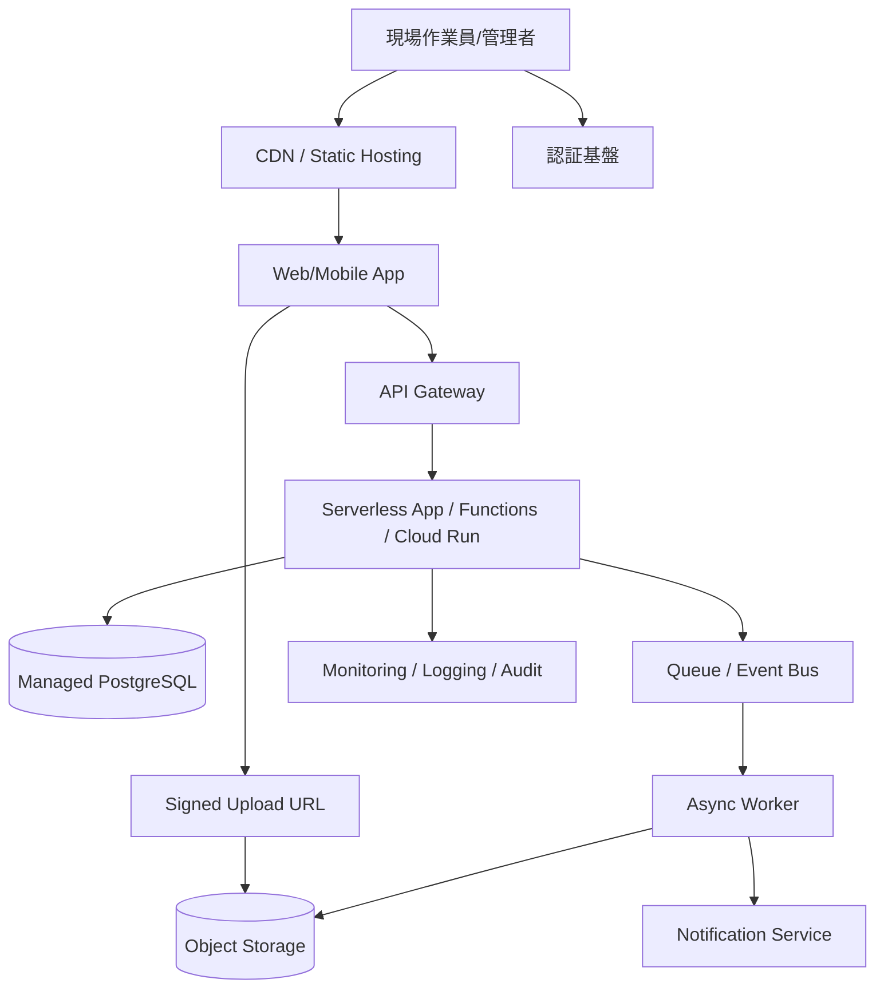

# 2026-06-12 10:15 Cloud Engineer Magazine
#cloud #aws #oci #gcp #architecture #daily
[[Home]]

## 1) 今日のアプリ
**現場点検レポートアプリ**

設備保守や建設現場で使うモバイル/Webアプリを想定します。作業員がチェックリスト入力、写真アップロード、位置情報付きレポート送信を行い、管理者が一覧確認・再点検指示・CSV出力できる構成です。

**今日の視点:**
- 推奨構成は **サーバレス中心の単一クラウド実装** をベースにする
- ただし **AWS / OCI / GCP の実装対応表** を並べて、同じ設計思想を3クラウドで比較する

---

## 2) 要件整理

### 機能要件
- 点検チェックリストの作成・更新
- 写真アップロード
- 点検結果の保存、検索、一覧表示
- 管理者/作業員のロール分離
- レポートCSV出力
- 通知（再点検依頼、期限超過）

### 非機能要件
- **可用性:** 現場業務が止まらないこと。AZ/リージョン障害時の復旧手順が必要
- **性能:** 写真アップロードは数MB〜数十MB、API応答は通常1秒台以内
- **セキュリティ:** 写真・報告書は機微情報扱い。保存時暗号化、最小権限IAM、監査ログ必須
- **コスト:** 初期は少人数利用を想定し、アイドル時コストを抑える。成長時はストレージ・配信・DB負荷を段階拡張

---

## 3) 推奨アーキテクチャ（なぜその構成か）

**推奨:** API + 認証 + オブジェクトストレージ + マネージドDB + 非同期通知 のサーバレス/マネージド構成

### 構成の意図
- **写真ファイルはオブジェクトストレージへ直アップロード**
  - アプリサーバ経由を避け、帯域・CPUコストを削減
- **業務データはマネージドRDBへ**
  - 点検一覧、絞り込み、CSV出力、管理画面との相性が良い
- **認証はクラウド標準のIDサービス**
  - 自前認証を避け、MFAやトークン管理を標準化
- **通知や画像後処理はイベント駆動**
  - APIの応答を軽くし、再送や拡張がしやすい

### この構成を選ぶ理由
- 初期は運用負荷が低い
- 利用増加時はストレージ/API/DBを個別に伸ばせる
- 監査、暗号化、IAMをクラウド標準機能で揃えやすい

### トレードオフ
- **サーバレス優先** は運用が軽い一方、複雑な長時間処理は設計を分ける必要がある
- **RDB採用** は検索や帳票に強い一方、超高頻度書き込みだけを見るとNoSQLの方が伸ばしやすい場合がある
- **ストレージ直アップロード** は効率的だが、署名付きURL管理やアップロード権限制御が重要

---

## 4) クラウド別実装マップ

### AWS での実装サービス
- フロント: **AWS Amplify Hosting** または S3 + CloudFront
- 認証: **Amazon Cognito**
- API: **Amazon API Gateway**
- アプリ実行: **AWS Lambda**
- 写真保存: **Amazon S3**
- 業務DB: **Amazon Aurora Serverless v2 (PostgreSQL互換)**
- 非同期処理: **Amazon SQS** / **Amazon EventBridge**
- 通知: **Amazon SNS**
- 監視: **Amazon CloudWatch** + **AWS CloudTrail**
- 秘密情報: **AWS Secrets Manager**
- WAF: **AWS WAF**

**AWSを選ぶ理由:** サーバレス部品が非常に揃っており、イベント連携と周辺機能が強い。

### OCI での実装サービス
- フロント: **OCI Object Storage** + **OCI CDN**
- 認証: **OCI IAM** または **OCI Identity Domains**
- API: **OCI API Gateway**
- アプリ実行: **OCI Functions**
- 写真保存: **OCI Object Storage**
- 業務DB: **Autonomous Transaction Processing** または **Base Database**
- 非同期処理: **OCI Queue** / **OCI Events**
- 通知: **OCI Notifications**
- 監視: **OCI Monitoring** + **OCI Logging** + **Audit**
- 秘密情報: **OCI Vault**
- WAF: **OCI Web Application Firewall**

**OCIを選ぶ理由:** Oracle系DBとの親和性が高く、業務データ中心アプリで強い。ネットワーク/DBの一体設計もしやすい。

### GCP での実装サービス
- フロント: **Cloud Storage** + **Cloud CDN** または Firebase Hosting
- 認証: **Identity Platform** または Firebase Authentication
- API: **API Gateway** または HTTPS Load Balancer + Cloud Run
- アプリ実行: **Cloud Run**
- 写真保存: **Cloud Storage**
- 業務DB: **Cloud SQL for PostgreSQL**
- 非同期処理: **Pub/Sub**
- 通知/イベント: **Eventarc**
- 監視: **Cloud Monitoring** + **Cloud Logging** + **Cloud Audit Logs**
- 秘密情報: **Secret Manager**
- WAF: **Cloud Armor**

**GCPを選ぶ理由:** Cloud Run の開発体験が良く、コンテナベースで柔軟。イベント連携もシンプル。

---

## 5) システム構成図（Mermaidで簡易図）

---

## 6) データフロー / 認証・認可 / 監視運用の要点

### データフロー
1. ユーザーが認証
2. フロントが API から点検データ取得
3. 写真アップロード時は API が **署名付きURL** を払い出す
4. クライアントがオブジェクトストレージへ直接アップロード
5. メタデータ（点検ID、写真URL、位置情報）だけを API 経由でDB保存
6. イベント発火でサムネイル生成・通知・監査処理を非同期実行

### 認証・認可
- 作業員/管理者を **ロール分離**
- API は **JWT/OIDCトークン** を検証
- オブジェクトストレージは公開せず、**署名付きURL** や限定読取URLを使用
- DB接続資格情報は **Secrets Manager / Vault / Secret Manager** に格納
- IAMは **最小権限**。関数ごとに必要なストレージ/キュー/ログ権限だけ付与

### 監視運用
- 監視対象:
  - API 5xx率
  - 関数エラー率
  - キュー滞留数
  - DB接続数/CPU
  - ストレージアップロード失敗数
- 監査対象:
  - 誰が点検結果を閲覧/修正したか
  - 誰がバケット/ストレージ設定を変更したか
- アラート:
  - API エラー急増
  - 非同期処理遅延
  - DBストレージ逼迫

---

## 7) コスト最適化ポイント（初期・成長期）

### 初期
- API/アプリは **Lambda / Functions / Cloud Run** の従量課金を優先
- DBは最小構成で開始
- 写真はライフサイクル管理で低頻度アクセス層へ移行
- CDNキャッシュを効かせ、静的配信コストを抑える

### 成長期
- 写真サムネイル生成を非同期化してピーク平準化
- DBは読取負荷が増えたら **リードレプリカ** や接続プーリング検討
- アップロード増加時はストレージクラスと転送コストを見直す
- Cloud Run / Functions はメモリ・同時実行数をチューニング

### 代表的なトレードオフ
- **Aurora Serverless v2** は柔軟だが、常時小規模なら通常RDS構成が安い場合あり
- **Autonomous DB** は運用軽減の利点が大きいが、小規模検証では過剰なことがある
- **Cloud Run** は柔軟だが、単純APIだけなら Functions 系の方が構成が薄い場合がある

---

## 8) 障害時の設計（DR / バックアップ / フェイルオーバー）

### 基本方針
- ストレージは **バージョニング** と **バックアップ/複製方針** を有効化
- DBは **自動バックアップ** と **ポイントインタイムリカバリ** を有効化
- API/関数はステートレスにして再デプロイ容易にする

### 障害設計
- **AZ障害:** マネージドDBのマルチAZ/高可用構成を利用
- **リージョン障害:** 
  - 最低限はバックアップから別リージョン復旧できること
  - RTO/RPOが厳しいなら、DBレプリケーションやオブジェクト複製を追加
- **誤削除/ランサム対策:**
  - オブジェクトバージョニング
  - 削除保護
  - 監査ログの別保管

---

## 9) 学習ポイント（今日覚えるクラウド機能）

1. **署名付きURL / Pre-Authenticated Request / Signed URL** の考え方
2. API本体を経由せず大きなファイルを安全にアップロードする設計
3. イベント駆動で同期処理を減らす方法
4. IAM を「アプリ全体」ではなく「機能単位」で切る重要性
5. 監査ログは障害対応だけでなく権限濫用の追跡にも重要

---

## 10) 30〜60分ミニ演習

### 演習テーマ
「写真直アップロード + メタデータ保存」設計を1つのクラウドで紙に落とす

### 手順
1. AWS / OCI / GCP のどれか1つ選ぶ
2. 次を埋める
   - 認証サービス
   - APIサービス
   - 実行基盤
   - オブジェクトストレージ
   - DB
   - 監視
3. 次の質問に答える
   - 写真本体はどこに保存するか？
   - APIはどのタイミングで署名付きURLを出すか？
   - 管理者だけCSV出力可能にするにはどこで認可するか？
   - 障害時に最初に見るメトリクスは何か？

### 余力があれば
- Mermaid図を自分用に1回書き換えて、通知処理を追加する

---

## 11) 公式ドキュメント参照リンク（AWS / OCI / GCP）

### AWS
- Amazon Cognito: https://docs.aws.amazon.com/cognito/
- Amazon API Gateway: https://docs.aws.amazon.com/apigateway/
- AWS Lambda: https://docs.aws.amazon.com/lambda/
- Amazon S3: https://docs.aws.amazon.com/s3/
- Amazon Aurora: https://docs.aws.amazon.com/aurora/
- Amazon SQS: https://docs.aws.amazon.com/AWSSimpleQueueService/
- Amazon EventBridge: https://docs.aws.amazon.com/eventbridge/
- AWS WAF: https://docs.aws.amazon.com/waf/
- AWS CloudWatch: https://docs.aws.amazon.com/cloudwatch/
- AWS CloudTrail: https://docs.aws.amazon.com/cloudtrail/

### OCI
- OCI API Gateway: https://docs.oracle.com/en-us/iaas/Content/APIGateway/home.htm
- OCI Functions: https://docs.oracle.com/en-us/iaas/Content/Functions/home.htm
- OCI Object Storage: https://docs.oracle.com/en-us/iaas/Content/Object/home.htm
- OCI Queue: https://docs.oracle.com/en-us/iaas/Content/queue/home.htm
- OCI Events: https://docs.oracle.com/en-us/iaas/Content/Events/home.htm
- OCI Notifications: https://docs.oracle.com/en-us/iaas/Content/Notification/home.htm
- OCI Monitoring: https://docs.oracle.com/en-us/iaas/Content/Monitoring/home.htm
- OCI Logging: https://docs.oracle.com/en-us/iaas/Content/Logging/home.htm
- OCI Vault: https://docs.oracle.com/en-us/iaas/Content/KeyManagement/home.htm
- OCI Web Application Firewall: https://docs.oracle.com/en-us/iaas/Content/WAF/home.htm

### GCP
- Cloud Run: https://docs.cloud.google.com/run/docs
- Cloud Storage: https://docs.cloud.google.com/storage/docs
- API Gateway: https://docs.cloud.google.com/api-gateway/docs
- Cloud SQL: https://docs.cloud.google.com/sql/docs
- Pub/Sub: https://docs.cloud.google.com/pubsub/docs
- Eventarc: https://docs.cloud.google.com/eventarc/docs
- Secret Manager: https://docs.cloud.google.com/secret-manager/docs
- Cloud Monitoring: https://docs.cloud.google.com/monitoring/docs
- Cloud Logging: https://docs.cloud.google.com/logging/docs
- Cloud Armor: https://docs.cloud.google.com/armor/docs

---

## ひとことまとめ
今日は **「ファイルはオブジェクトストレージへ直送、業務データだけAPI/DBへ」** という定番設計を、AWS / OCI / GCP に対応づけて覚える回です。現場アプリ、写真検品、申請添付、点検報告のような業務系でそのまま使える設計です。
