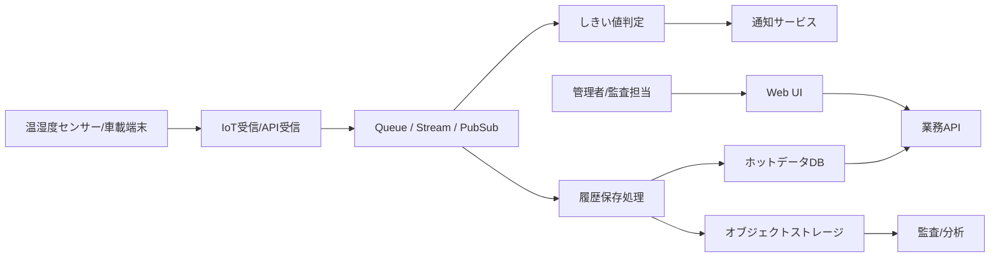

---
tags:
  - cloud
  - aws
  - oci
  - gcp
  - architecture
  - daily
---
[[Home]]

# 2026-06-14 Cloud Engineer Magazine

## 今日のアプリ
**コールドチェーン監視アプリ**

物流センターや配送車の温度・湿度センサーを集約し、しきい値逸脱時に即時アラート、配送履歴の可視化、監査向けレポート出力を行うアプリ。食品・医薬品の保管/配送品質を守る前提で設計する。

---

## 1) 要件整理

### 機能要件
- センサー端末から数分〜数秒間隔で温度/湿度/位置情報を送信
- 閾値逸脱時にリアルタイム通知
- 車両/倉庫/配送便ごとの時系列グラフ表示
- 監査向けに履歴を長期保存
- 管理者/オペレーター/監査担当で権限分離

### 非機能要件
- **可用性:** 監視停止を避けるためマネージドなメッセージ受信とマルチAZ前提
- **性能:** バースト流入を吸収できる疎結合構成
- **セキュリティ:** デバイス認証、TLS、最小権限IAM、暗号化 at rest/in transit
- **コスト:** 初期はサーバレス中心、成長後は保存ポリシーと集計粒度を最適化

---

## 2) 推奨アーキテクチャ
**結論:** 「IoTメッセージ受信 → ストリーム/キュー → ルール判定/加工 → 時系列/分析保存 → 通知/API」というイベント駆動構成が最適。

### なぜこの構成か
- センサー送信量は不均一なので、受信と処理を分離した方が安定する
- アラート判定と蓄積処理を分けると、通知遅延と保存処理の競合を避けやすい
- 時系列参照と監査用長期保管はアクセス特性が異なるため、保存先を分けた方が運用しやすい
- 認証/認可をアプリ利用者とデバイスで分離すると事故が減る

**推奨パターン:**
- デバイス接続: 各クラウドの IoT 受信基盤
- 非同期処理: Queue / Stream / Pub/Sub
- 即時通知: Event rule + notification service
- 可視化API: コンテナ or サーバレスAPI
- 履歴保存: ホットデータは運用DB、コールドデータはオブジェクトストレージ

---

## 3) クラウド別実装マップ

### AWS での実装サービス
- **受信:** AWS IoT Core
- **ルール処理:** IoT Rules + AWS Lambda
- **バッファ/疎結合:** Amazon SQS または Kinesis Data Streams
- **運用DB:** Amazon DynamoDB
- **長期保存:** Amazon S3
- **通知:** Amazon SNS
- **API:** Amazon API Gateway + Lambda
- **認証:** Amazon Cognito / IAM / IoT certificates
- **監視:** Amazon CloudWatch + AWS CloudTrail

**一言トレードオフ:**
- Kinesis は高スループット向き、SQS は単純な非同期処理に向く
- DynamoDB は時系列キー設計が重要。複雑分析は S3 + Athena 側に逃がすと楽

### OCI での実装サービス
- **受信:** OCI Streaming（デバイスゲートウェイ用途は API/エージェント設計で補完）
- **イベント処理:** OCI Functions
- **バッファ/ストリーム:** OCI Streaming
- **運用DB:** Autonomous Database または NoSQL Database
- **長期保存:** Object Storage
- **通知:** Notifications
- **API:** API Gateway
- **認証:** IAM, Dynamic Groups, Vault
- **監視:** Monitoring, Logging, Events, Audit

**一言トレードオフ:**
- SQL 集計が多いなら Autonomous Database が強い
- シンプルなキーアクセス中心なら NoSQL Database で運用負荷を抑えやすい

### GCP での実装サービス
- **受信:** Pub/Sub（デバイスは HTTPS/MQTT ブリッジ経由で接続設計）
- **イベント処理:** Cloud Run functions or Cloud Functions / Dataflow
- **バッファ/疎結合:** Pub/Sub
- **運用DB:** Firestore または Bigtable
- **長期保存:** Cloud Storage
- **通知:** Cloud Monitoring alerting + Pub/Sub / external webhook
- **API:** API Gateway または Cloud Run
- **認証:** IAM, Identity Platform, service accounts, Secret Manager
- **監視:** Cloud Monitoring, Cloud Logging, Cloud Audit Logs

**一言トレードオフ:**
- Firestore はアプリ開発が速い
- Bigtable は大量時系列に強いが、アクセス設計を誤ると扱いにくい

---

## 4) システム構成図（Mermaid）

---

## 5) データフロー / 認証・認可 / 監視運用の要点

### データフロー
1. デバイスが証明書または署名付き認証で受信基盤へ送信
2. メッセージをストリーム/キューへ格納
3. 関数が閾値判定し、逸脱時のみ通知
4. 別処理で時系列データをDBへ、原本をオブジェクトストレージへ保存
5. UI/API はホットデータDB中心に参照、監査用途は長期保存側を参照

### 認証・認可
- **デバイス認証**と**人間ユーザー認証**を分離する
- デバイスごとに証明書/credential を分け、失効可能にする
- API 実行ロールは「保存先1つ」「通知先1つ」など最小権限に限定
- Secrets はシークレット管理サービスに格納し、コード/環境変数へ直書きしない

### 監視運用
- 監視対象は「受信失敗」「処理遅延」「通知失敗」「DB書込失敗」
- アラート閾値は温度逸脱だけでなく、**メッセージ滞留時間**でも設定する
- 監査ログは必ず有効化し、誰が閾値やルールを変えたか追跡可能にする

---

## 6) コスト最適化ポイント

### 初期
- サーバレス中心にして常時起動コンテナを減らす
- 保存データは raw 全量 + 集計結果最小限
- 通知は「重要イベントのみ」に絞る

### 成長期
- ホットデータ保持期間を短縮し、古いデータは安価ストレージへ移行
- 高頻度センサーデータは 1件ずつ画面表示せず、分単位/5分単位で集約
- ストリーム処理の並列度と DB 書き込み単価を観測しながら調整

---

## 7) 障害時の設計（DR / バックアップ / フェイルオーバー）
- 受信基盤はマネージドサービスを使い、単一VM依存を避ける
- DB は自動バックアップを有効化
- 原本イベントはオブジェクトストレージへ退避して**再処理可能**にする
- 通知失敗時は DLQ / 再試行を設ける
- リージョン障害まで考えるなら、長期保存データを別リージョン複製
- RTO/RPO を決める: 例) 監視UI復旧30分、原本データ消失ゼロ寄り

---

## 8) 学習ポイント（今日覚えるクラウド機能）
- **AWS IoT Rules**: 受信メッセージを条件付きで Lambda/SQS/S3 へ流せる
- **OCI Streaming**: Kafka互換APIを使えるため、イベント基盤として拡張しやすい
- **GCP Pub/Sub**: バースト吸収に強く、疎結合な非同期設計の中心に置きやすい

---

## 9) 30〜60分ミニ演習
1. 1つのセンサーメッセージ JSON を定義する
   - `deviceId`, `timestamp`, `temperature`, `humidity`, `lat`, `lon`
2. 各クラウドで以下を紙設計する
   - 受信サービス
   - 判定処理
   - 保存先
   - 通知先
3. 次の問いに答える
   - 閾値逸脱判定をDB参照前に行う理由は？
   - raw データをオブジェクトストレージへ残す理由は？
   - IAM 権限を広くしすぎると、どんな事故が起きるか？

**余裕があれば:**
- AWS なら IoT Core → Lambda → DynamoDB
- OCI なら Streaming → Functions → Object Storage
- GCP なら Pub/Sub → Cloud Run → Firestore
の最小構成をそれぞれ1枚図で書き分ける

---

## 10) 公式ドキュメント参照リンク

### AWS
- AWS IoT Core: https://docs.aws.amazon.com/iot/
- AWS IoT Rules: https://docs.aws.amazon.com/iot/latest/developerguide/iot-rules.html
- AWS Lambda: https://docs.aws.amazon.com/lambda/
- Amazon DynamoDB: https://docs.aws.amazon.com/dynamodb/
- Amazon S3: https://docs.aws.amazon.com/s3/
- Amazon SNS: https://docs.aws.amazon.com/sns/
- Amazon CloudWatch: https://docs.aws.amazon.com/cloudwatch/

### OCI
- OCI Streaming: https://docs.oracle.com/en-us/iaas/Content/Streaming/home.htm
- OCI Functions: https://docs.oracle.com/en-us/iaas/Content/Functions/home.htm
- OCI Object Storage: https://docs.oracle.com/en-us/iaas/Content/Object/home.htm
- OCI Notifications: https://docs.oracle.com/en-us/iaas/Content/Notification/home.htm
- OCI API Gateway: https://docs.oracle.com/en-us/iaas/Content/APIGateway/home.htm
- OCI Monitoring: https://docs.oracle.com/en-us/iaas/Content/Monitoring/home.htm
- OCI IAM: https://docs.oracle.com/en-us/iaas/Content/Identity/home.htm

### GCP
- Google Cloud Pub/Sub: https://docs.cloud.google.com/pubsub/docs
- Cloud Run: https://docs.cloud.google.com/run/docs
- Cloud Functions: https://docs.cloud.google.com/functions/docs
- Firestore: https://docs.cloud.google.com/firestore/docs
- Cloud Storage: https://docs.cloud.google.com/storage/docs
- Cloud Monitoring: https://docs.cloud.google.com/monitoring/docs
- IAM: https://docs.cloud.google.com/iam/docs

---

## 11) 使い分けのまとめ
- **AWS**: IoT専用サービスが厚く、デバイス接続〜ルール処理まで一貫性が高い
- **OCI**: ストリーム + 関数 + DB を素直に組みやすく、業務SQL分析と相性がよい
- **GCP**: Pub/Sub 起点のイベント設計がわかりやすく、分析拡張がしやすい

**今日の一言:**
IoT 系アプリは「受信を止めないこと」と「後で再処理できること」が勝ち筋。まずはイベント原本を安全に残す設計を身体で覚える。
