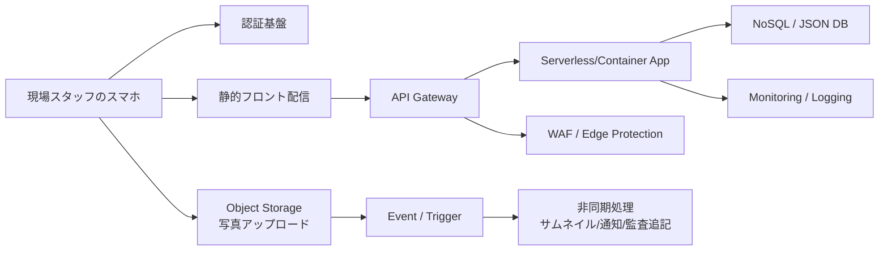

---
tags:
  - cloud
  - aws
  - oci
  - gcp
  - architecture
  - daily
---

[[Home]]

# Cloud Engineer Magazine — 2026-06-15 10:15

## 1) 今日のアプリ
**設備点検レポートアプリ**

現場スタッフがスマホで設備写真を撮り、チェック項目を入力し、異常があれば即時に保守チケット化するアプリを考える。オフライン復帰、写真保存、承認フロー、監査ログが必要な、かなり現実寄りの業務アプリ。

今日は **3クラウド横断の比較視点** で見る。結論から言うと、最初の1年は **API + サーバレス実行 + マネージドNoSQL/JSON DB + オブジェクトストレージ** が最もバランスが良い。

---

## 2) 要件整理

### 機能要件
- 点検結果の登録・更新
- 写真アップロード
- 異常時のステータス変更（要確認 / 緊急）
- 作業履歴の検索
- 監督者承認
- 将来的に通知・簡易ワークフロー連携

### 非機能要件
- **可用性:** 日中の現場作業時間は止めたくない。単一AZ/単一VM依存は避ける
- **性能:** 画像アップロードは重いが、入力API自体は軽量。読み書きレイテンシは短く保ちたい
- **セキュリティ:** 写真・点検データは社内資産。IAM最小権限、保存時暗号化、監査ログ必須
- **コスト:** 初期は小さく始める。常時稼働サーバを減らし、アクセス増に応じて従量課金中心で伸ばす

---

## 3) 推奨アーキテクチャ（なぜその構成か）

### 推奨構成
- フロント: SPA or モバイルアプリ
- 認証: マネージドID基盤
- API: API Gateway
- 業務ロジック: Functions / Lambda / Cloud Run
- データ: NoSQL or JSON向きDB
- 画像: オブジェクトストレージ
- 非同期処理: イベント駆動（通知、サムネイル、監査追記）
- 監視: クラウド標準のメトリクス・ログ・アラート

### この構成を勧める理由
1. **点検APIは短時間・疎結合** なのでサーバレスと相性が良い
2. **写真保存はDBではなくオブジェクトストレージ** に分けるのが定石
3. **点検レコードはスキーマ変更が起きやすい** ため、NoSQL/JSON指向が扱いやすい
4. **異常通知や画像後処理を非同期化** すると、現場ユーザーの待ち時間を減らせる
5. 初期はほぼ運用レスで始められ、増加時に API/実行基盤/ストレージを個別に伸ばせる

### トレードオフ
- **サーバレスの利点:** 初期コスト低い、運用が軽い、スパイク耐性が高い
- **弱点:** コールドスタート、ローカル開発の再現性、複雑な長時間処理は少し苦手
- **NoSQLの利点:** 変更に強い、スケールしやすい
- **弱点:** 複雑JOINや厳密な帳票系分析は後で別系統を考えたくなる

---

## 4) クラウド別実装マップ

### AWS での実装サービス
- フロント配信: **Amazon S3 + Amazon CloudFront**
- 認証: **Amazon Cognito**
- API: **Amazon API Gateway**
- 業務ロジック: **AWS Lambda**
- 点検データ: **Amazon DynamoDB**
- 写真保管: **Amazon S3**
- 非同期連携: **Amazon EventBridge**
- 監視: **Amazon CloudWatch**
- 境界防御: **AWS WAF**

**向いている理由:** DynamoDB と Lambda の組み合わせが定番。小さいチームでも立ち上げやすい。

### OCI での実装サービス
- フロント配信: **Object Storage**（静的ファイル保管）
- 認証/認可: **OCI IAM**
- API: **OCI API Gateway**
- 業務ロジック: **OCI Functions**
- 点検データ: **Oracle NoSQL Database Cloud Service**
- 写真保管: **OCI Object Storage**
- 非同期連携: **OCI Events**
- 監視: **OCI Monitoring + Logging**
- 境界防御: **OCI Web Application Firewall**

**向いている理由:** API Gateway / Functions / Object Storage / NoSQL が素直にまとまる。OCI標準サービスで閉じやすい。

### GCP での実装サービス
- フロント配信: **Cloud Storage**（または Firebase Hosting も候補）
- 認証: **Identity Platform**
- API: **API Gateway**
- 業務ロジック: **Cloud Run**
- 点検データ: **Firestore (Native mode)**
- 写真保管: **Cloud Storage**
- 非同期連携: **Eventarc / Pub/Sub**
- 監視: **Cloud Monitoring + Cloud Logging**
- 境界防御: **Cloud Armor**

**向いている理由:** Cloud Run はコンテナで柔軟。Firestore はモバイル/WEB寄りの開発速度が高い。

### ざっくり比較
- **最速で始めやすい:** AWS
- **コンテナ自由度を持たせやすい:** GCP
- **Oracle系運用やOCI統一を進めたい組織に自然:** OCI

---

## 5) システム構成図（Mermaid）

---

## 6) データフロー / 認証・認可 / 監視運用の要点

### データフロー
1. ユーザーがログイン
2. 点検画面で入力開始
3. 写真はアプリからオブジェクトストレージへアップロード
4. API はメタデータ（設備ID、点検結果、画像URL、担当者、時刻）をDBへ保存
5. 異常フラグありならイベント発火
6. 非同期で通知、サムネイル生成、監査記録追加

### 認証・認可
- ユーザー認証は **Cognito / OCI IAM / Identity Platform** を使用
- API実行主体とストレージアクセス主体を分離する
- 写真バケットは**原則 private**
- アプリは必要なAPIだけ呼べるよう **最小権限IAM** にする
- 管理者・現場担当・監査担当でロール分離

### 監視運用
- API レイテンシ、4xx/5xx、関数エラー、DBスロットリング、ストレージ失敗を監視
- アラート例:
  - API 5xx が5分連続で閾値超過
  - 関数エラー率上昇
  - 画像アップロード失敗急増
  - DB レイテンシ悪化
- 監査面では「誰がどの設備データを更新したか」を必ず残す

---

## 7) コスト最適化ポイント（初期・成長期）

### 初期
- 常時稼働VMを置かない
- 画像サイズをクライアント側で圧縮
- DB はアクセスパターンに沿ってキー設計し、不要な全文検索を避ける
- ログ保存期間を無制限にしない

### 成長期
- 画像ライフサイクル管理で低頻度アクセス層へ移行
- 高頻度検索項目だけ二次インデックスを追加
- 非同期処理をバッチ化し、通知をまとめる
- GCPなら Cloud Run の最小インスタンス設定、AWSなら Lambda メモリ最適化、OCIなら Functions 実行時間の見直しで単価調整

---

## 8) 障害時の設計（DR / バックアップ / フェイルオーバー）

### まず押さえること
このアプリは「写真」と「点検メタデータ」で復旧戦略が少し違う。

### 推奨方針
- **オブジェクトストレージ:** バージョニング / バックアップ / ライフサイクル設計
- **DB:** 自動バックアップ、ポイントインタイム復旧の有無を確認
- **API層:** IaCで再作成可能にする
- **設定:** 環境変数やシークレットをコード外で管理

### フェイルオーバー観点
- 初期は**単一リージョン + バックアップ重視**で十分なことが多い
- 現場停止コストが高い業務なら、将来は**クロスリージョン複製**を検討
- 画像URLを直接永続化しすぎず、アプリ経由の参照制御に寄せると移行しやすい

---

## 9) 学習ポイント（今日覚えるクラウド機能）

### 今日の3つ
1. **API Gateway は単なる入口ではなく、認証・制御・監視の境界面**
2. **オブジェクトストレージとDBを分離** すると、性能・コスト・運用が安定する
3. **イベント駆動にすると UX を保ったまま後処理を足せる**

### 1サービスずつ覚えるなら
- AWS: **DynamoDB のアクセスパターン設計**
- OCI: **API Gateway と Functions の接続モデル**
- GCP: **Cloud Run のサービスアカウント設計**

---

## 10) 30〜60分ミニ演習

### お題
「設備点検APIの最小構成」を1クラウド選んで紙に設計する。

### 手順
1. 認証サービスを1つ選ぶ
2. APIサービスを1つ選ぶ
3. 実行基盤を1つ選ぶ
4. 点検データ保存先を1つ選ぶ
5. 写真保存先を1つ選ぶ
6. 監視メトリクスを3つ決める
7. IAMロールを3種類書く（現場担当 / 管理者 / 実行基盤）

### ゴール
以下を3行で説明できればOK。
- なぜその構成にしたか
- 一番高そうな箇所はどこか
- 一番壊れやすい箇所をどう監視するか

---

## 11) 公式ドキュメント参照リンク（AWS / OCI / GCP）

### AWS
- API Gateway + Lambda + DynamoDB チュートリアル  
  https://docs.aws.amazon.com/apigateway/latest/developerguide/http-api-dynamo-db.html
- Lambda と API Gateway の連携  
  https://docs.aws.amazon.com/lambda/latest/dg/services-apigateway-tutorial.html
- Amazon Cognito 開発者ガイド  
  https://docs.aws.amazon.com/cognito/
- Amazon S3 ドキュメント  
  https://docs.aws.amazon.com/s3/
- AWS WAF 開発者ガイド  
  https://docs.aws.amazon.com/waf/
- Amazon CloudWatch ドキュメント  
  https://docs.aws.amazon.com/cloudwatch/

### OCI
- API Gateway 概要  
  https://docs.oracle.com/en-us/iaas/Content/APIGateway/Concepts/apigatewayoverview.htm
- Functions 概要  
  https://docs.oracle.com/en-us/iaas/Content/Functions/Concepts/functionsoverview.htm
- Object Storage 概要  
  https://docs.oracle.com/en-us/iaas/Content/Object/Concepts/objectstorageoverview.htm
- Oracle NoSQL Database Cloud Service  
  https://docs.oracle.com/en-us/iaas/nosql-database/index.html
- Monitoring 概要  
  https://docs.oracle.com/en-us/iaas/Content/Monitoring/Concepts/monitoringoverview.htm
- Web Application Firewall 概要  
  https://docs.oracle.com/en-us/iaas/Content/WAF/Concepts/overview.htm

### GCP
- API Gateway と Cloud Run のスタートガイド  
  https://docs.cloud.google.com/api-gateway/docs/get-started-cloud-run
- API Gateway 概要  
  https://docs.cloud.google.com/api-gateway/docs/about-api-gateway
- Cloud Run のサービスID  
  https://docs.cloud.google.com/run/docs/securing/service-identity
- Firestore 概要  
  https://docs.cloud.google.com/firestore/native/docs/overview
- Cloud Storage 概要  
  https://docs.cloud.google.com/storage/docs/introduction
- Cloud Monitoring 概要  
  https://docs.cloud.google.com/monitoring/docs/monitoring-overview
- Identity Platform ドキュメント  
  https://docs.cloud.google.com/identity-platform/docs

---

## 一言まとめ
今日の肝は、**「写真はオブジェクトストレージ、業務データはNoSQL、入口はAPI Gateway、後処理はイベント化」**。この4点を押さえるだけで、3クラウド比較がかなり楽になる。