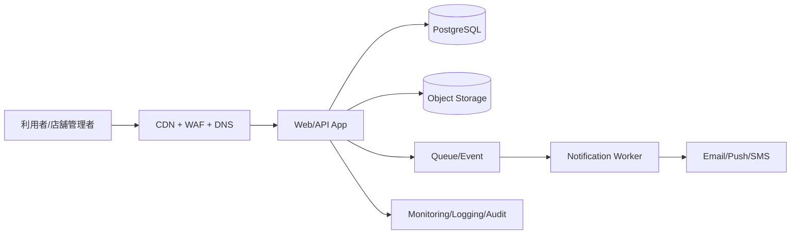

---
tags:
  - cloud
  - aws
  - oci
  - gcp
  - architecture
  - daily
---
[[Home]]

# Cloud Engineer Magazine — 2026-06-16 10:15

## 1) 今日のアプリ
**リアルタイム順番待ち・予約アプリ**（病院・飲食店・行政窓口向け）

今日の視点は **3クラウドでほぼ同じ設計思想を保ちながら、単一クラウドで実装しやすい構成を比較する** こと。

主な機能:
- 予約作成・変更・キャンセル
- 順番待ち番号の発行
- 管理画面から呼び出し状態更新
- メール/プッシュ通知
- 混雑状況の簡易ダッシュボード

---

## 2) 要件整理
### 機能要件
- 利用者が空き枠を確認して予約できる
- 店舗/拠点側が待ち行列を更新できる
- 呼び出し直前に通知を送る
- 添付ファイルは不要だが、将来的に問診票PDFや画像を保存できる

### 非機能要件
- **可用性:** 営業時間中は停止しにくいこと。DBはマネージドHA前提
- **性能:** 通常は軽量、昼休み前などに急増。読み取り集中に強いこと
- **セキュリティ:** 個人情報を扱うため、公開面は最小化。IAM最小権限、DB私設接続、監査ログ必須
- **コスト:** 初期は小さく、繁忙期だけスケールアウトできること

---

## 3) 推奨アーキテクチャ（なぜその構成か）
**推奨:** 「CDN + WAF + マネージドWeb/API実行基盤 + マネージドPostgreSQL + オブジェクトストレージ + 非同期通知 + 統合監視」

### なぜこの構成か
- **予約/順番待ち**は強い整合性が必要なので、主データは **PostgreSQL** が扱いやすい
- アプリ層は日中に負荷が偏るため、**サーバレス/コンテナ自動スケール** が相性良い
- 通知処理は同期APIに混ぜず、**キュー/イベント** に逃がすと再送制御しやすい
- 将来の帳票・画像保管のため、**オブジェクトストレージ** を先に入れておくと拡張しやすい
- 最初からKubernetesを使うより、**初期は運用負荷の低い実行基盤** を選ぶ方が実務的

### 今日の設計判断
- **小〜中規模の初期:** より運用が軽いサービスを優先
- **成長後:** キャッシュ、読取分離、ジョブ分離、マルチリージョン検討

---

## 4) クラウド別実装マップ
### AWS での実装サービス
- フロント配信: **CloudFront**
- DNS: **Route 53**
- WAF: **AWS WAF**
- API/アプリ実行: **Amazon ECS on AWS Fargate** + **Application Load Balancer**
  - 理由: App Runner は新規利用不可案内があるため、今日は Fargate を基準にする
- DB: **Amazon RDS for PostgreSQL**（Multi-AZ）
- 添付/帳票保存: **Amazon S3**
- 非同期通知: **Amazon SQS** + **AWS Lambda** または通知ワーカー
- 認証: **Amazon Cognito**
- 監視: **Amazon CloudWatch** + **CloudTrail**
- シークレット: **AWS Secrets Manager**

**トレードオフ:**
- Fargate は柔軟だが、Cloud Run よりネットワーク/周辺設定が少し多い
- Cognito は統合しやすいが、UI/カスタマイズは設計を要する

### OCI での実装サービス
- フロント公開: **OCI Load Balancer** + 必要に応じて **OCI WAF**
- DNS: **OCI DNS**
- API/アプリ実行: **Oracle Container Engine for Kubernetes (OKE)**
- DB: **Autonomous Database Serverless** または要件次第で **Base Database Service for PostgreSQL系運用** を検討
- 添付/帳票保存: **OCI Object Storage**
- 非同期通知: **OCI Queue** + ワーカーPod / **OCI Functions**
- 認証: **OCI IAM**（アプリ利用者向けは外部IdP連携も現実的）
- 監視: **OCI Monitoring** + **Logging** + **Audit**
- シークレット: **OCI Vault**

**トレードオフ:**
- OKE は柔軟性が高いが、Cloud Run や単純なFargate構成より運用知識が必要
- Autonomous Database は運用負荷が低い一方、アプリの接続設計と料金特性は事前確認したい

### GCP での実装サービス
- フロント公開: **Cloud Load Balancing** + **Cloud CDN** + **Cloud Armor**
- DNS: **Cloud DNS**
- API/アプリ実行: **Cloud Run**
- DB: **Cloud SQL for PostgreSQL**（HA構成）
- 添付/帳票保存: **Cloud Storage**
- 非同期通知: **Pub/Sub** + **Cloud Run jobs / worker service**
- 認証: **Identity Platform** または **Identity-Aware Proxy**（管理画面用途）
- 監視: **Cloud Monitoring** + **Cloud Logging** + **Cloud Audit Logs**
- シークレット: **Secret Manager**

**トレードオフ:**
- Cloud Run は初期スピードが非常に高い
- 常時接続や高頻度接続プール設計は Cloud SQL 接続方式を丁寧に考える必要がある

---

## 5) システム構成図（Mermaidで簡易図）

---

## 6) データフロー / 認証・認可 / 監視運用の要点
### データフロー
1. 利用者が予約枠照会
2. APIがDBから空き枠を取得
3. 予約確定時にトランザクションで枠をロック/更新
4. 通知イベントをキューへ投入
5. ワーカーが通知送信し、結果をログ化

### 認証・認可
- 一般利用者と管理者ロールを分離
- 管理APIは **管理者グループ/ロール** のみ許可
- DB接続資格情報はシークレットマネージャで保管
- サービス間権限は **最小権限IAM**。例:
  - APIサービス: DB接続、キュー送信、オブジェクト限定バケット読書きのみ
  - ワーカー: キュー受信、通知送信、必要最小限の更新のみ
- 管理画面は公開URLでも **MFA / IdP連携 / IP制限** を優先

### 監視運用
- 監視する主要指標:
  - APIレイテンシ p95/p99
  - 予約確定失敗率
  - DB接続数 / CPU / ストレージ
  - キュー滞留件数
  - 通知失敗率
- 監査:
  - IAM変更
  - ネットワーク公開設定変更
  - DBスナップショット/削除イベント

---

## 7) コスト最適化ポイント（初期・成長期）
### 初期
- アプリ実行は **最小インスタンス少なめ** またはゼロスケール可能サービスを活用
- DBは過大構成を避け、まずは小さく開始
- 画像/PDFはオブジェクトストレージへ逃がし、DB肥大化を防ぐ
- 通知は同期送信せず、ワーカーでまとめて処理

### 成長期
- 読み取り負荷が増えたら **読取レプリカ** やキャッシュ導入
- 分析用途はOLTP DBに寄せず、ログ/イベント基盤へ分離
- CDNキャッシュ対象を静的アセット中心に明確化
- 保存ライフサイクルを定義し、古い帳票を低コスト層へ移行

---

## 8) 障害時の設計（DR / バックアップ / フェイルオーバー）
- DBは **自動バックアップ + PITR** を有効化
- 本番DBは可能なら **AZ冗長/HA構成** を選択
- オブジェクトストレージはバージョニングやライフサイクルを利用
- アプリ層はステートレスにして再デプロイ容易化
- キュー利用で通知再送を可能にする
- DR優先度:
  1. 予約DB復旧
  2. API復旧
  3. 通知ワーカー復旧
  4. 管理分析画面復旧

**判断基準:**
- まずは同一リージョンHA
- 多地域DRは、無停止要件や災害要件がある業種だけ段階導入

---

## 9) 学習ポイント（今日覚えるクラウド機能）
- **AWS:** RDS Multi-AZ は「予約データを落としにくくする」ための基本
- **OCI:** Autonomous Database Serverless は「DB運用負荷を減らす」選択肢
- **GCP:** Cloud Run は「日中ピーク型アプリ」を小さく始めやすい
- **共通:** キューを入れるだけで、通知失敗やスパイク耐性がかなり改善する

---

## 10) 30〜60分ミニ演習
### 演習テーマ
「予約作成API」の最小設計を1本書く

### やること
1. `POST /reservations` のリクエストJSONを定義
2. DBテーブルを3つだけ決める
   - `stores`
   - `timeslots`
   - `reservations`
3. 予約確定時に必要なバリデーションを列挙
4. 通知イベントのペイロード例を作る
5. AWS / OCI / GCP のどれで最初に作るか決め、理由を3行で書く

### 期待アウトプット
- API仕様メモ
- テーブル定義ラフ
- 失敗ケース一覧（満席、重複予約、通知失敗）

---

## 11) 公式ドキュメント参照リンク（AWS / OCI / GCP）
### AWS
- ECS on AWS Fargate: https://docs.aws.amazon.com/AmazonECS/latest/developerguide/AWS_Fargate.html
- Application Load Balancer: https://docs.aws.amazon.com/elasticloadbalancing/latest/application/introduction.html
- Amazon RDS for PostgreSQL: https://docs.aws.amazon.com/AmazonRDS/latest/UserGuide/CHAP_PostgreSQL.html
- Amazon S3: https://docs.aws.amazon.com/AmazonS3/latest/userguide/Welcome.html
- Amazon Cognito: https://docs.aws.amazon.com/cognito/latest/developerguide/what-is-amazon-cognito.html
- AWS WAF: https://docs.aws.amazon.com/waf/latest/developerguide/waf-chapter.html
- AWS Secrets Manager: https://docs.aws.amazon.com/secretsmanager/latest/userguide/intro.html

### OCI
- Oracle Container Engine for Kubernetes (OKE): https://docs.oracle.com/en-us/iaas/Content/ContEng/home.htm
- Autonomous Database Serverless: https://docs.oracle.com/en-us/iaas/autonomous-database-serverless/index.html
- Object Storage: https://docs.oracle.com/en-us/iaas/Content/Object/Concepts/objectstorageoverview.htm
- Load Balancer: https://docs.oracle.com/en-us/iaas/Content/Balance/home.htm
- Queue: https://docs.oracle.com/en-us/iaas/Content/queue/home.htm
- Vault: https://docs.oracle.com/en-us/iaas/Content/KeyManagement/home.htm
- Monitoring: https://docs.oracle.com/en-us/iaas/Content/Monitoring/home.htm

### GCP
- Cloud Run: https://docs.cloud.google.com/run/docs/overview/what-is-cloud-run
- Cloud SQL for PostgreSQL: https://docs.cloud.google.com/sql/docs/postgres
- Cloud Storage: https://docs.cloud.google.com/storage/docs/introduction
- Cloud Load Balancing: https://docs.cloud.google.com/load-balancing/docs/load-balancing-overview
- Cloud Armor: https://docs.cloud.google.com/armor/docs/overview
- Pub/Sub: https://docs.cloud.google.com/pubsub/docs/overview
- Secret Manager: https://docs.cloud.google.com/secret-manager/docs/overview

---

## ひとこと
この題材は **「整合性が必要な業務データ」と「スパイクするアクセス」を両方持つ** ので、クラウド設計の練習にかなり向いている。今日の勘どころは、**予約確定をDBトランザクションで守り、通知は非同期に逃がす**、これ。