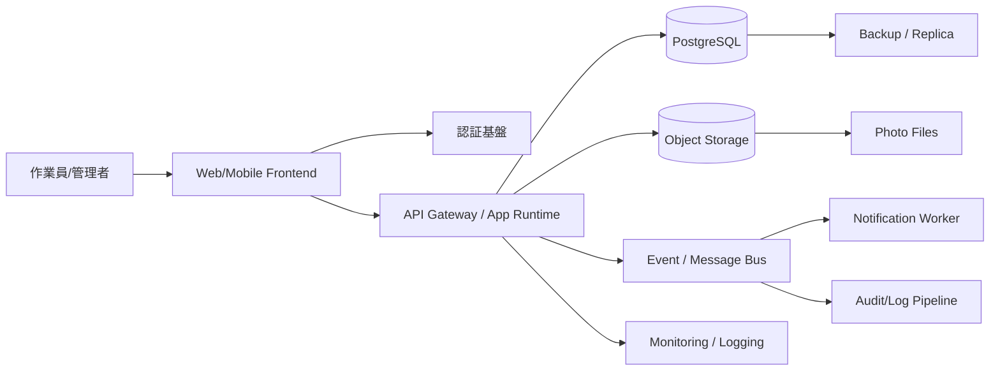

---
tags:
  - cloud
  - aws
  - oci
  - gcp
  - architecture
  - daily
---

[[Home]]

# Cloud Engineer Magazine — 2026-06-17 10:15

## 今日の視点
今日は **単一アプリを3クラウドで実装比較する日**。題材は **現場点検レポートアプリ**。

- 作業員がスマホで点検票を入力
- 写真をアップロード
- 異常時は即通知
- 管理者は一覧・検索・承認

昨日の「順番待ち・予約アプリ」と違い、今日は **画像アップロード + ワークフロー + 監査証跡** が主役。

---

## 1) 今日のアプリ
**現場点検レポートアプリ**

想定ユースケース:
- 工場設備点検
- ビル保守
- 店舗開閉チェック
- 配送車両の出庫前点検

主要画面:
- モバイル入力画面
- 写真添付
- 点検結果一覧
- 異常レポート詳細
- 承認・差し戻し

---

## 2) 要件整理

### 機能要件
- 点検項目の入力・保存
- 写真アップロード
- 異常時通知（メール or チャット連携前提のWebhook）
- 管理者向け一覧・検索
- 承認・差し戻し
- 監査ログ保持

### 非機能要件
**可用性**
- 業務時間中は止めにくい
- DB はマネージドHA構成を優先

**性能**
- 通常は軽負荷、月末や朝夕に入力集中
- API はスパイク耐性を持たせる
- 画像配信はオブジェクトストレージで分離

**セキュリティ**
- 作業員/管理者で権限分離
- 写真URLは非公開
- 最小権限IAM
- 監査ログを有効化

**コスト**
- 初期はサーバレス/従量課金を優先
- 成長後はDB・通知・ログ保管コストを最適化

---

## 3) 推奨アーキテクチャ（なぜその構成か）

### 推奨構成
- **フロント**: SPA または軽量Web
- **API**: マネージドHTTP入口 + コンテナ実行基盤
- **DB**: PostgreSQL
- **画像保存**: オブジェクトストレージ
- **非同期処理**: イベント/メッセージング
- **認証**: クラウドIAM連携のマネージド認証
- **監視**: クラウド標準監視 + 構造化ログ

### なぜこの構成か
1. **入力APIと画像保存を分離**できる  
   画像をアプリサーバ経由にせず、署名付きURL/事前認証URLで直接アップロードさせると、APIの負荷と帯域コストを抑えやすい。

2. **スパイクに強い**  
   朝の一斉点検など、短時間の同時アクセスにサーバレス/コンテナ自動スケールが合う。

3. **異常通知を同期処理から外せる**  
   レポート保存成功後、イベント発火で通知・画像解析・監査連携を非同期化できる。

4. **権限設計が明確**  
   「作業員は自分の現場データを登録」「管理者は閲覧・承認」「運用は監査ログ閲覧」とロール分離しやすい。

### トレードオフ
- **サーバレス/マネージド中心**: 運用は楽だが、細かいチューニング自由度は低い
- **PostgreSQL採用**: 検索・集計・承認ワークフローに強いが、超大規模イベント処理専用ならNoSQLの方が伸ばしやすい場面もある
- **直接アップロード**: 効率は良いが、URL期限管理・アップロード後検証が必要

---

## 4) クラウド別実装マップ

### AWS での実装サービス
- フロント配信: **Amazon CloudFront + Amazon S3**
- 認証: **Amazon Cognito**
- API: **Amazon API Gateway**
- アプリ実行: **Amazon ECS on Fargate**  
  - 理由: コンテナ運用しやすく、バックエンド実装の自由度が高い
- DB: **Amazon RDS for PostgreSQL**
- 画像保存: **Amazon S3**
- 非同期通知/イベント: **Amazon EventBridge** + 必要に応じて **AWS Lambda**
- 監視: **Amazon CloudWatch**
- 監査: **AWS CloudTrail**

**一言判断**: AWS は選択肢が広い。迷ったら「API Gateway + Fargate + RDS + S3 + EventBridge」が堅い。

### OCI での実装サービス
- フロント配信: **Object Storage** + 必要に応じて **Load Balancer/CDN前段**
- 認証: **OCI IAM Identity Domains**
- API: **OCI API Gateway**
- アプリ実行: **OCI Container Instances** または **OCI Functions**  
  - 今日の推奨は **Container Instances**。APIバックエンドをコンテナで素直に載せやすい
- DB: **Autonomous Database for Transaction Processing** または **Base Database Service for PostgreSQL系要件**  
  - 今日の実務寄り推奨は **Autonomous Database (ATP)** を中心に考える
- 画像保存: **OCI Object Storage**
- 非同期通知/イベント: **OCI Events** + **Notifications** または Functions
- 監視: **OCI Monitoring / Logging**
- 監査: **OCI Audit**

**一言判断**: OCI は IAM、API Gateway、Object Storage、Autonomous Database を軸にすると構成がまとまりやすい。

### GCP での実装サービス
- フロント配信: **Cloud Storage** + 必要に応じて **Cloud CDN**
- 認証: **Identity Platform**
- API/アプリ実行: **Cloud Run**
- DB: **Cloud SQL for PostgreSQL**
- 画像保存: **Cloud Storage**
- 非同期通知/イベント: **Pub/Sub** + 必要に応じて **Eventarc**
- 監視: **Cloud Monitoring / Cloud Logging**
- 監査: **Cloud Audit Logs**

**一言判断**: GCP は Cloud Run 中心で薄く組める。初期開発速度が高い。

---

## 5) システム構成図（Mermaid）

---

## 6) データフロー / 認証・認可 / 監視運用の要点

### データフロー
1. ユーザーがログイン
2. フロントがAPIから点検票定義を取得
3. 写真アップロード用の署名付きURLを取得
4. 写真をオブジェクトストレージへ直接保存
5. 点検結果をAPIへ送信
6. APIがDBへ保存
7. 異常フラグありならイベント発行
8. 通知ワーカーがメール/Webhook/将来のチャット通知を実行

### 認証・認可
- 認証は **Cognito / Identity Domains / Identity Platform** のようなマネージド認証を使う
- アプリ内ロール例:
  - `worker`: 登録のみ
  - `supervisor`: 閲覧・承認
  - `admin`: マスタ設定
- ストレージは**非公開バケット**を基本にする
- 画像閲覧は短寿命の署名付きURLで制御
- 実行基盤からDB/ストレージへの権限は**最小権限IAM**

### 監視運用
- 監視対象:
  - API レイテンシ
  - 5xx率
  - DB接続数
  - ストレージアップロード失敗率
  - イベント配信失敗
- 構造化ログに最低限含める項目:
  - `request_id`
  - `tenant/site_id`
  - `user_id`
  - `inspection_id`
  - `result_status`
- 異常通知は「API障害」「DB接続失敗」「通知失敗」を分けてアラート

---

## 7) コスト最適化ポイント（初期・成長期）

### 初期
- コンピュートは **Cloud Run / Fargate最小構成 / OCIの小さなコンテナ構成** で開始
- DBはHA必須度を見て最小サイズから始める
- 画像はライフサイクル管理を設定
- ログは保持期間を短めにし、監査ログだけ長めに残す

### 成長期
- APIが安定したら、常時アクセスの多い環境では最小インスタンスや予約/節約系オプションを検討
- DBは読み取り負荷増加時にリードレプリカ/読み取り分離を検討
- 画像サムネイル生成や通知を完全非同期化し、API応答時間を守る
- オブジェクトストレージの階層化・アーカイブを活用

### ざっくり比較
- **AWS**: 機能幅が広いが、ログ・転送・イベント周りが積み上がりやすい
- **OCI**: DBと一体で設計するとコスト効率を出しやすい場面がある
- **GCP**: 小中規模のサーバレスAPIは見積もりしやすい

---

## 8) 障害時の設計（DR / バックアップ / フェイルオーバー）

### 最低限の設計
- DB自動バックアップ有効化
- オブジェクトストレージのバージョニング/保持戦略
- アプリは**ステートレス**にする
- イベント処理は再試行可能にする
- 通知失敗時はデッドレター相当の保留先を持つ

### DRの考え方
- **初期**: 単一リージョン + マルチAZ/HA
- **成長後**: 別リージョンへのバックアップ複製、重要画像のクロスリージョン保護を検討
- RPO/RTO を先に決める
  - 例: RPO 15分, RTO 1時間

### フェイルオーバー上の注意
- DBフェイルオーバー時の接続再試行を実装
- 画像アップロードURLは短寿命なので、クライアントの再取得ロジックを持たせる
- イベントは少なくとも冪等に処理する

---

## 9) 学習ポイント（今日覚えるクラウド機能）

1. **署名付きURL/事前認証URL** でアプリサーバを経由せず安全にファイルを扱う
2. **イベント駆動** にすると通知・監査・画像後処理をAPI本体から切り離せる
3. **マネージド認証** を使うと、パスワード保管やMFA実装の負担を減らせる
4. **監査ログ** は「何が壊れたか」ではなく「誰が何にアクセスしたか」を追うために重要
5. **最小権限IAM** は、ストレージ読取・書込、DB接続、通知送信を役割ごとに分けるのが基本

---

## 10) 30〜60分ミニ演習

### 演習テーマ
「画像アップロード付き点検APIの最小構成を設計する」

### やること
1. AWS / OCI / GCP のどれか1つを選ぶ
2. 以下だけを実装・設計する
   - 認証
   - 点検結果登録API
   - 画像アップロード
   - DB保存
3. 次の表を自分で埋める

- 認証サービス:
- API入口:
- 実行基盤:
- DB:
- ストレージ:
- イベント:
- 監視:

### 追加課題
- 異常時のみ通知する条件を設計
- `worker` と `supervisor` の権限差を箇条書き
- 写真アップロードを「API経由」ではなく「直接アップロード」にする理由を3つ書く

---

## 11) 公式ドキュメント参照リンク（AWS / OCI / GCP）

### AWS
- Amazon Cognito: https://docs.aws.amazon.com/cognito/
- Amazon API Gateway: https://docs.aws.amazon.com/apigateway/
- Amazon ECS on AWS Fargate: https://docs.aws.amazon.com/AmazonECS/latest/developerguide/AWS_Fargate.html
- Amazon RDS for PostgreSQL: https://docs.aws.amazon.com/AmazonRDS/latest/UserGuide/CHAP_PostgreSQL.html
- Amazon S3: https://docs.aws.amazon.com/AmazonS3/latest/userguide/Welcome.html
- Amazon EventBridge: https://docs.aws.amazon.com/eventbridge/latest/userguide/eb-what-is.html
- Amazon CloudWatch: https://docs.aws.amazon.com/AmazonCloudWatch/latest/monitoring/WhatIsCloudWatch.html
- AWS CloudTrail: https://docs.aws.amazon.com/awscloudtrail/latest/userguide/cloudtrail-user-guide.html

### OCI
- OCI API Gateway: https://docs.oracle.com/en-us/iaas/Content/APIGateway/Concepts/apigatewayoverview.htm
- OCI Container Instances: https://docs.oracle.com/en-us/iaas/Content/container-instances/home.htm
- OCI Identity and Access Management / Identity Domains: https://docs.oracle.com/en-us/iaas/Content/Identity/home.htm
- OCI Object Storage: https://docs.oracle.com/en-us/iaas/Content/Object/home.htm
- OCI Events: https://docs.oracle.com/en-us/iaas/Content/Events/Concepts/eventsoverview.htm
- OCI Notifications: https://docs.oracle.com/en-us/iaas/Content/Notification/home.htm
- OCI Monitoring: https://docs.oracle.com/en-us/iaas/Content/Monitoring/home.htm
- OCI Logging: https://docs.oracle.com/en-us/iaas/Content/Logging/home.htm
- OCI Audit: https://docs.oracle.com/en-us/iaas/Content/Audit/Concepts/auditoverview.htm
- Autonomous Database: https://docs.oracle.com/en-us/iaas/autonomous-database-serverless/doc/

### GCP
- Cloud Run: https://docs.cloud.google.com/run/docs/overview/what-is-cloud-run
- Cloud SQL for PostgreSQL: https://docs.cloud.google.com/sql/docs/postgres/introduction
- Cloud Storage: https://docs.cloud.google.com/storage/docs
- Pub/Sub: https://docs.cloud.google.com/pubsub/docs/overview
- Eventarc: https://docs.cloud.google.com/eventarc/docs
- Identity Platform: https://docs.cloud.google.com/identity-platform/docs
- Cloud Monitoring: https://docs.cloud.google.com/monitoring/docs
- Cloud Logging: https://docs.cloud.google.com/logging/docs
- Cloud Audit Logs: https://docs.cloud.google.com/logging/docs/audit

---

## 今日のひとこと
この題材の本質は、**「API・画像・通知を分離して、現場入力を止めない構成にすること」**。  
クラウドごとの差はサービス名より、**どこまでマネージドに寄せるか** の設計判断に出る。
