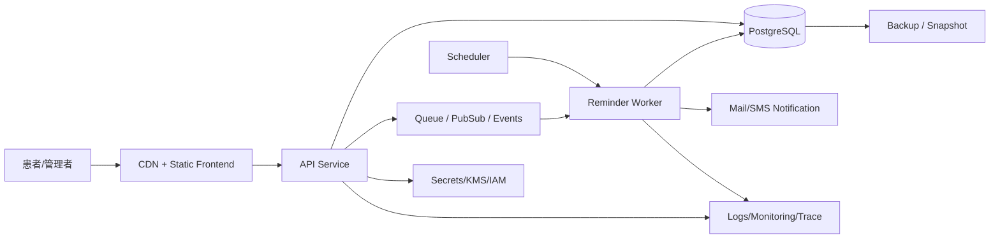

---
tags:
  - cloud
  - aws
  - oci
  - gcp
  - architecture
  - daily
---
[[Home]]

# Cloud Engineer Magazine — 2026-06-18

## 1) 今日のアプリ
**予約リマインダー付き診療予約アプリ**

患者がWeb/モバイルから診療予約を行い、予約確認・前日通知・当日リマインド・キャンセル待ち通知まで行うアプリを想定する。今日は **イベント駆動 + マネージドDB + 通知基盤** を中心に、AWS / OCI / GCP の実装を比較する。

**今日の視点:**
- 基本は単一リージョンの堅実構成
- ただし将来の多リージョン化を見据えた設計
- クラウドごとの差が出やすい「通知・非同期処理・認証」を比較

---

## 2) 要件整理

### 機能要件
- 患者が空き枠を検索して予約する
- 予約変更・キャンセルができる
- 前日 / 当日の自動リマインド通知
- 管理者が診療枠、休診日、担当医を管理できる
- キャンセル発生時にキャンセル待ち利用者へ通知できる

### 非機能要件

**可用性**
- 受付時間中の停止を避けたい
- DB とアプリはゾーン冗長が望ましい

**性能**
- 予約検索は数百ms台を目標
- 通知処理は非同期化し、予約APIの応答時間を悪化させない

**セキュリティ**
- 個人情報を扱うため、保存時暗号化・通信暗号化は必須
- 管理者権限と患者権限を明確に分離
- 最小権限IAM、秘密情報はSecret Manager系で管理

**コスト**
- 初期は小規模、成長時に通知量と予約件数が増える
- 常時稼働台数を抑え、イベント駆動で伸縮させたい

---

## 3) 推奨アーキテクチャ（なぜその構成か）
**推奨:**
- フロント: 静的配信 + CDN
- API: コンテナ or サーバレスHTTP
- DB: マネージドPostgreSQL
- 非同期処理: メッセージキュー / PubSub
- 通知: メール/SMS連携
- バッチ/スケジュール: マネージドスケジューラ

**なぜこの構成か**
1. **予約登録APIと通知処理を分離**できる
   - 予約確定時はDB保存までを同期処理
   - 通知はイベント投入後に非同期処理
2. **診療予約はRDBが向く**
   - 空き枠、医師別予定、キャンセル、状態遷移、トランザクション整合性が重要
3. **スケジュール処理が多い**
   - 前日通知、当日通知、キャンセル待ち通知をマネージドなジョブ実行に寄せやすい
4. **個人情報保護に合わせやすい**
   - マネージドID、WAF、KMS、Secrets、監査ログを標準採用しやすい

**トレードオフ**
- 完全サーバレスは運用が軽いが、接続プーリングや長い業務処理は工夫が必要
- 常駐コンテナは挙動が安定しやすいが、小規模時はコストが上がりやすい
- 通知を各クラウドのネイティブサービスに寄せると実装は楽だが、マルチクラウド移植性は下がる

---

## 4) クラウド別実装マップ

### AWS での実装サービス
- フロント配信: **Amazon S3 + Amazon CloudFront**
- 認証: **Amazon Cognito**
- API実行: **AWS App Runner** または **AWS Lambda + Amazon API Gateway**
- DB: **Amazon RDS for PostgreSQL**
- 非同期イベント: **Amazon EventBridge** / **Amazon SQS**
- スケジュール: **Amazon EventBridge Scheduler**
- 通知: **Amazon SNS** / **Amazon SES**
- 秘密情報: **AWS Secrets Manager**
- 暗号化鍵: **AWS KMS**
- 監視: **Amazon CloudWatch + AWS CloudTrail + AWS X-Ray**
- 防御: **AWS WAF**

**AWSでの理由**
- Scheduler, SQS, SNS, SES の組み合わせが予約通知に素直
- App Runner は小〜中規模Web APIの運用負荷が低い
- Lambda構成は従量課金で初期コストを抑えやすい

### OCI での実装サービス
- フロント配信: **Object Storage + CDN / Load Balancer配下の静的配信**
- 認証: **OCI Identity and Access Management**（必要に応じて外部IdP連携）
- API実行: **Container Instances** または **OCI Functions**
- DB: **Base Database Service (PostgreSQL互換を使うならMySQL HeatWave以外の選択も要検討)** / 実務上は **OCI PostgreSQL** 提供状況に応じ確認
- 非同期イベント: **OCI Queue** / **OCI Events** / **Streaming**
- スケジュール: **Functions + Events / scheduled executionパターン**
- 通知: **OCI Notifications**
- 秘密情報: **OCI Vault**
- 監視: **OCI Monitoring + Logging + Audit**
- 防御: **OCI Web Application Firewall**

**OCIでの理由**
- Queue / Events / Notifications / Vault の組み合わせで基本パターンを組みやすい
- Container Instances はKubernetes不要でコンテナ実行したいときに扱いやすい
- コスト効率を重視した中小規模構成で検討しやすい

**注意**
- OCIは採用するDBサービスの現行ラインナップ確認が重要。設計前に PostgreSQL の正式提供形態と運用責任分界を公式ドキュメントで確認すること。

### GCP での実装サービス
- フロント配信: **Cloud Storage + Cloud CDN**
- 認証: **Identity Platform** または **Firebase Authentication**
- API実行: **Cloud Run**
- DB: **Cloud SQL for PostgreSQL**
- 非同期イベント: **Pub/Sub**
- スケジュール: **Cloud Scheduler**
- 通知処理: **Cloud Run Jobs / Cloud Functions / Pub/Sub subscriber**
- 秘密情報: **Secret Manager**
- 暗号化鍵: **Cloud KMS**
- 監視: **Cloud Monitoring + Cloud Logging + Cloud Trace + Audit Logs**
- 防御: **Cloud Armor**

**GCPでの理由**
- Cloud Run + Pub/Sub + Scheduler + Cloud SQL の相性が非常に良い
- スケール挙動が分かりやすく、小規模から始めやすい
- サービス間認証をIAMベースで組みやすい

---

## 5) システム構成図（Mermaidで簡易図）

---

## 6) データフロー / 認証・認可 / 監視運用の要点

### データフロー
1. ユーザーが予約枠を検索
2. API がDBから空き枠を取得
3. 予約確定時、API がDBへトランザクション保存
4. 保存後に通知イベントを Queue / PubSub に投入
5. Worker が通知を送信
6. Scheduler が前日・当日リマインド対象を定期抽出し、通知ジョブを起動

### 認証・認可
- 患者向けログインは **Cognito / Identity Platform / 外部IdP連携** を利用
- 管理者は一般患者と**別ロール**にする
- API から DB 接続するアプリ実行主体には、**DB接続・Secrets参照・ログ出力だけ**を付与
- メール/SMS送信権限、Queue購読権限、KMS復号権限を分離
- 管理画面はWAFとIP制限、MFA適用を優先検討

### 監視運用
- SLI例:
  - 予約API成功率
  - 95パーセンタイル応答時間
  - 通知送信遅延
  - キュー滞留数
- アラート例:
  - DB接続数急増
  - 通知失敗率上昇
  - Dead Letter Queue への流入
  - Scheduler実行失敗
- 監査ログは最低でも以下を保存
  - IAM変更
  - Secrets参照
  - 管理者による予約変更

---

## 7) コスト最適化ポイント（初期・成長期）

### 初期
- APIは **Cloud Run / App Runner / Functions系** を優先検討
- DBは最小サイズから開始し、自動バックアップだけは削らない
- 通知は全件同期送信せず、必ずキュー経由で処理
- CDN配信で静的ファイルのオリジンサーブを減らす

### 成長期
- DBの読み取り負荷が増えたら read replica やキャッシュを検討
- 通知バースト時は Worker 並列度を制御
- 監査・アプリログは保持期間を分ける
- 予約検索が重くなれば、空き枠集計を事前計算テーブル化

**コスト上のトレードオフ**
- 常駐コンテナは低レイテンシだが、夜間アクセスが少ないなら割高になりやすい
- サーバレスは安いことが多いが、高頻度アクセスでは常駐構成の方が予測しやすい場合がある

---

## 8) 障害時の設計（DR / バックアップ / フェイルオーバー）
- DBは **自動バックアップ + PITR** を有効化
- バックアップ復元手順を四半期ごとに検証
- キューは再試行・DLQを設定
- 通知処理は**冪等**にする（同一予約IDで二重送信防止）
- 単一リージョン開始でも、以下は先に設計する
  - バックアップ保存先
  - IaC化
  - 秘密情報の再作成手順
  - DNS切替手順
- マルチリージョン化が必要になるのは、停止許容時間が短い場合や災害対策要件が強い場合

---

## 9) 学習ポイント（今日覚えるクラウド機能）
- **AWS:** EventBridge Scheduler は「指定時刻の大量ジョブ起動」に使いやすい
- **OCI:** Queue / Events / Notifications / Vault を組み合わせると非同期設計の基本が作れる
- **GCP:** Cloud Run は HTTP API と非同期Workerの両方に使いやすい
- **共通:** 通知処理は API 本体から切り離し、再試行可能な非同期設計にする

---

## 10) 30〜60分ミニ演習
**テーマ:** 「前日リマインド通知」を1クラウドで設計してみる

### やること
1. 次のテーブルを想定する
   - appointments(id, patient_id, starts_at, status, reminder_sent)
2. Scheduler が1時間ごとに起動
3. 24時間以内に開始する予約を抽出
4. Queue / PubSub に通知イベント投入
5. Worker が通知送信後、reminder_sent を更新

### 演習ポイント
- 同じ予約に二重通知しない条件はどう書くか
- 送信失敗時の再試行回数をどう決めるか
- 個人情報をログに出さないには何をマスクするか

### 発展
- キャンセル待ち通知も同じイベント駆動で追加してみる

---

## 11) 公式ドキュメント参照リンク（AWS / OCI / GCP）

### AWS
- Amazon Cognito: https://docs.aws.amazon.com/cognito/
- AWS App Runner: https://docs.aws.amazon.com/apprunner/
- AWS Lambda: https://docs.aws.amazon.com/lambda/
- Amazon API Gateway: https://docs.aws.amazon.com/apigateway/
- Amazon RDS: https://docs.aws.amazon.com/rds/
- Amazon SQS: https://docs.aws.amazon.com/AWSSimpleQueueService/
- Amazon EventBridge: https://docs.aws.amazon.com/eventbridge/
- Amazon EventBridge Scheduler: https://docs.aws.amazon.com/scheduler/
- Amazon SNS: https://docs.aws.amazon.com/sns/
- Amazon SES: https://docs.aws.amazon.com/ses/
- AWS Secrets Manager: https://docs.aws.amazon.com/secretsmanager/
- AWS KMS: https://docs.aws.amazon.com/kms/
- Amazon CloudWatch: https://docs.aws.amazon.com/cloudwatch/
- AWS WAF: https://docs.aws.amazon.com/waf/

### OCI
- OCI Architecture Center / Core docs: https://docs.oracle.com/en-us/iaas/Content/home.htm
- OCI Container Instances: https://docs.oracle.com/en-us/iaas/Content/container-instances/home.htm
- OCI Functions: https://docs.oracle.com/en-us/iaas/Content/Functions/home.htm
- OCI Queue: https://docs.oracle.com/en-us/iaas/Content/queue/home.htm
- OCI Events: https://docs.oracle.com/en-us/iaas/Content/Events/home.htm
- OCI Notifications: https://docs.oracle.com/en-us/iaas/Content/Notification/home.htm
- OCI Vault: https://docs.oracle.com/en-us/iaas/Content/KeyManagement/home.htm
- OCI Monitoring: https://docs.oracle.com/en-us/iaas/Content/Monitoring/home.htm
- OCI Logging: https://docs.oracle.com/en-us/iaas/Content/Logging/home.htm
- OCI Audit: https://docs.oracle.com/en-us/iaas/Content/Audit/home.htm
- OCI Web Application Firewall: https://docs.oracle.com/en-us/iaas/Content/WAF/home.htm

### GCP
- Cloud Run: https://docs.cloud.google.com/run/docs
- Cloud SQL: https://docs.cloud.google.com/sql/docs
- Pub/Sub: https://docs.cloud.google.com/pubsub/docs
- Cloud Scheduler: https://docs.cloud.google.com/scheduler/docs
- Identity Platform: https://docs.cloud.google.com/identity-platform/docs
- Secret Manager: https://docs.cloud.google.com/secret-manager/docs
- Cloud KMS: https://docs.cloud.google.com/kms/docs
- Cloud Monitoring: https://docs.cloud.google.com/monitoring/docs
- Cloud Logging: https://docs.cloud.google.com/logging/docs
- Cloud Trace: https://docs.cloud.google.com/trace/docs
- Cloud Armor: https://docs.cloud.google.com/armor/docs
- Cloud CDN: https://docs.cloud.google.com/cdn/docs
- Cloud Storage: https://docs.cloud.google.com/storage/docs

---

**ひとこと:**
予約系アプリは「検索・確定・通知・変更」の責務分離が肝。まずは **RDB中心 + 非同期通知 + 最小権限IAM** の型を体に入れると、他の業務アプリにも応用しやすい。
