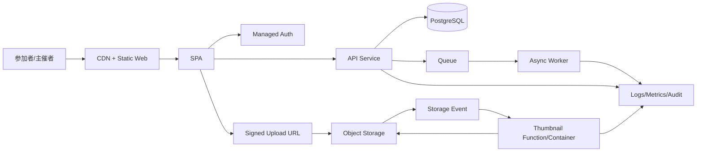

---
tags:
  - cloud
  - aws
  - oci
  - gcp
  - architecture
  - daily
---

[[Home]]

# Cloud Engineer Magazine — 2026-06-19

## 1) 今日のアプリ
**イベント写真共有アプリ**

社内勉強会や地域イベントで、参加者がスマホから写真をアップロードし、主催者が承認後に公開ギャラリーへ反映するアプリを想定する。

**今日の視点:** 3クラウド比較（AWS / OCI / GCP）

- 写真アップロードはオブジェクトストレージ中心
- Web/API はマネージド実行基盤を優先
- 画像変換はイベント駆動
- 認証はマネージドIdPを優先

---

## 2) 要件整理

### 機能要件
- 参加者ログイン
- 写真アップロード
- サムネイル生成
- 主催者による公開/非公開承認
- 公開ギャラリー閲覧
- 削除申請・監査ログ

### 非機能要件
- **可用性:** イベント当日にアクセス集中しても継続利用できる
- **性能:** 写真アップロード後、数秒〜十数秒以内にサムネイル生成
- **セキュリティ:** 署名付きURL/最小権限IAM/非公開バケットを基本
- **コスト:** 平時は低コスト、イベント時だけ自動スケール

---

## 3) 推奨アーキテクチャ（なぜその構成か）

**推奨:** 
- フロントエンド: CDN配信の静的Web
- API: サーバレス or コンテナPaaS
- 画像保存: オブジェクトストレージ
- 画像処理: ストレージイベント → 関数実行
- メタデータ: マネージドRDB
- 非同期処理: キュー
- 認証: マネージドCIAM/IdP
- 監視: クラウド標準のログ/メトリクス/アラート

**この構成を選ぶ理由**
- 画像本体はオブジェクトストレージが最も素直で安い
- Web/API を分離するとスケールとキャッシュ設計が簡単
- 画像変換を非同期化するとアップロード体験が安定する
- RDBは「投稿状態・承認状態・所有者・監査」を扱いやすい

**トレードオフ**
- フルサーバレスは運用が軽いが、ローカル再現や統合テストはやや複雑
- コンテナPaaSは移植性が高いが、常時起動コストが出やすい
- RDBは整合性に強いが、超高頻度の分析用途は別ストアを足したくなる

---

## 4) クラウド別実装マップ

### AWS での実装サービス
- フロント: **Amazon CloudFront + Amazon S3**
- API: **AWS App Runner** または **Amazon API Gateway + AWS Lambda**
- 認証: **Amazon Cognito**
- 画像保存: **Amazon S3**
- サムネイル生成: **S3 Event Notifications + AWS Lambda**
- メタデータDB: **Amazon Aurora Serverless v2 (PostgreSQL)** または **Amazon RDS for PostgreSQL**
- 非同期処理: **Amazon SQS**
- 秘密情報: **AWS Secrets Manager**
- 監視: **Amazon CloudWatch + AWS CloudTrail**

**AWSでの判断ポイント**
- API が軽量なら API Gateway + Lambda が最小運用
- 画像処理ライブラリ依存が重いなら App Runner/コンテナも現実的

### OCI での実装サービス
- フロント: **OCI Object Storage + OCI CDN**
- API: **OCI Container Instances** または **Oracle Functions**
- 認証: **OCI IAM Identity Domains**
- 画像保存: **OCI Object Storage**
- サムネイル生成: **Events + Oracle Functions**
- メタデータDB: **Autonomous Database** または **Base Database for PostgreSQL相当構成**
- 非同期処理: **OCI Queue**
- 秘密情報: **OCI Vault**
- 監視: **OCI Logging / Monitoring / Audit**

**OCIでの判断ポイント**
- 小〜中規模で運用を寄せたいなら Autonomous Database が扱いやすい
- Oracle Functions で済まない実行条件なら Container Instances がわかりやすい

### GCP での実装サービス
- フロント: **Cloud CDN + Cloud Storage**
- API: **Cloud Run**
- 認証: **Identity Platform** または **Firebase Authentication**
- 画像保存: **Cloud Storage**
- サムネイル生成: **Eventarc + Cloud Run functions / Cloud Functions**
- メタデータDB: **Cloud SQL for PostgreSQL**
- 非同期処理: **Pub/Sub**
- 秘密情報: **Secret Manager**
- 監視: **Cloud Logging + Cloud Monitoring + Cloud Audit Logs**

**GCPでの判断ポイント**
- Cloud Run はHTTP APIとバッチ処理の両方に寄せやすい
- イベント連携は Eventarc を起点にすると構成が整理しやすい

---

## 5) システム構成図（Mermaid）

---

## 6) データフロー / 認証・認可 / 監視運用の要点

### データフロー
1. ユーザーが認証
2. API がアップロード用署名付きURLを発行
3. クライアントがオブジェクトストレージへ直接アップロード
4. ストレージイベントで画像処理を起動
5. サムネイル生成後、DB の公開状態・パス情報を更新
6. 公開済み写真だけ CDN 経由で配信

### 認証・認可
- 一般ユーザーと主催者ロールを分離
- ストレージは**公開禁止**を基本、配信は CDN/署名付きURL で制御
- API 実行ロールには DB・Queue・Storage への必要最小権限のみ付与
- 関数/コンテナごとに個別サービスアカウント/実行ロールを使う

### 監視運用
- 監視対象:
  - API レイテンシ
  - 5xx率
  - 画像処理失敗数
  - キュー滞留
  - DB接続数
  - ストレージリクエスト急増
- 監査:
  - 管理者操作ログ
  - IAM変更
  - KMS/Vault/Secretアクセス

---

## 7) コスト最適化ポイント（初期・成長期）

### 初期
- API はサーバレス優先
- DB は最小構成から開始
- 画像オリジナルとサムネイルの保持期間を分ける
- CDN キャッシュを強めて配信コストを抑える

### 成長期
- 画像変換をキュー化してピーク平準化
- ライフサイクル管理で古い原本を低頻度階層へ移動
- DB 読み取り増加時はリードレプリカや接続プーリングを検討
- 高トラフィック時はサムネイルサイズを標準化してキャッシュ効率を上げる

---

## 8) 障害時の設計（DR / バックアップ / フェイルオーバー）

- **オブジェクトストレージ:** バージョニング有効化、削除保護、必要に応じクロスリージョン複製
- **DB:** 自動バックアップ、PITR、マルチAZ/高可用構成
- **API:** 複数AZ/リージョン展開可能なマネージド基盤を選ぶ
- **キュー:** 冪等処理 + DLQ を必須化
- **復旧手順:** 「画像は残っているがDB更新失敗」ケースの再処理バッチを用意

**実務上の重要点**
- サムネイルは再生成できるので、最重要データは「原本」と「メタデータ」
- DR優先順位は **DB > 原本画像 > 非同期ジョブ > サムネイル** の順で考えると整理しやすい

---

## 9) 学習ポイント（今日覚えるクラウド機能）

- **AWS:** S3 へ直接アップロードさせ、API は署名付きURL発行だけに絞ると安全で安い
- **OCI:** Events + Functions で画像後処理を疎結合にできる
- **GCP:** Cloud Run + Eventarc はHTTP処理とイベント処理の設計を揃えやすい

---

## 10) 30〜60分ミニ演習

**演習テーマ:** 「写真アップロード後にサムネイル生成される最小構成」を設計する

### やること
1. 任意のクラウドを1つ選ぶ
2. 次の5要素だけで構成図を書く
   - Auth
   - API
   - Object Storage
   - Event
   - Thumbnail Processor
3. IAMロールを3種類に分ける
   - フロント用
   - API用
   - 画像処理用
4. 「公開バケットにしない」前提で配信方法を書く
5. 失敗時の再処理方法を1つ決める

### ゴール
- **なぜクライアント直接アップロードが有利か** を説明できる
- **なぜ画像処理を非同期にするか** を説明できる
- **なぜ最小権限IAMが必要か** を説明できる

---

## 11) 公式ドキュメント参照リンク（AWS / OCI / GCP）

### AWS
- S3 User Guide: https://docs.aws.amazon.com/AmazonS3/latest/userguide/Welcome.html
- CloudFront Developer Guide: https://docs.aws.amazon.com/AmazonCloudFront/latest/DeveloperGuide/Introduction.html
- App Runner Developer Guide: https://docs.aws.amazon.com/apprunner/latest/dg/what-is-apprunner.html
- Lambda Developer Guide: https://docs.aws.amazon.com/lambda/latest/dg/welcome.html
- API Gateway Developer Guide: https://docs.aws.amazon.com/apigateway/latest/developerguide/welcome.html
- Cognito Developer Guide: https://docs.aws.amazon.com/cognito/latest/developerguide/what-is-amazon-cognito.html
- Aurora User Guide: https://docs.aws.amazon.com/AmazonRDS/latest/AuroraUserGuide/CHAP_AuroraOverview.html
- SQS Developer Guide: https://docs.aws.amazon.com/AWSSimpleQueueService/latest/SQSDeveloperGuide/welcome.html
- CloudWatch User Guide: https://docs.aws.amazon.com/AmazonCloudWatch/latest/monitoring/WhatIsCloudWatch.html

### OCI
- Object Storage Overview: https://docs.oracle.com/en-us/iaas/Content/Object/Concepts/objectstorageoverview.htm
- CDN Overview: https://docs.oracle.com/en-us/iaas/Content/CDN/Tasks/overview.htm
- Container Instances Overview: https://docs.oracle.com/en-us/iaas/Content/container-instances/overview-of-container-instances.htm
- Functions Overview: https://docs.oracle.com/en-us/iaas/Content/Functions/Concepts/functionsoverview.htm
- Identity Domains Overview: https://docs.oracle.com/en-us/iaas/Content/Identity/home.htm
- Events Overview: https://docs.oracle.com/en-us/iaas/Content/Events/Concepts/eventsoverview.htm
- Queue Overview: https://docs.oracle.com/en-us/iaas/Content/queue/overview.htm
- Vault Overview: https://docs.oracle.com/en-us/iaas/Content/KeyManagement/Concepts/keyoverview.htm
- Monitoring Overview: https://docs.oracle.com/en-us/iaas/Content/Monitoring/Concepts/monitoringoverview.htm
- Logging Overview: https://docs.oracle.com/en-us/iaas/Content/Logging/Concepts/loggingoverview.htm
- Audit Overview: https://docs.oracle.com/en-us/iaas/Content/Audit/Concepts/auditoverview.htm

### GCP
- Cloud Storage Overview: https://docs.cloud.google.com/storage/docs/introduction
- Cloud CDN Overview: https://docs.cloud.google.com/cdn/docs/overview
- Cloud Run Overview: https://docs.cloud.google.com/run/docs/overview/what-is-cloud-run
- Eventarc Overview: https://docs.cloud.google.com/eventarc/docs/overview
- Cloud SQL for PostgreSQL: https://docs.cloud.google.com/sql/docs/postgres/introduction
- Pub/Sub Overview: https://docs.cloud.google.com/pubsub/docs/overview
- Secret Manager Overview: https://docs.cloud.google.com/secret-manager/docs/overview
- Cloud Logging Overview: https://docs.cloud.google.com/logging/docs
- Cloud Monitoring Overview: https://docs.cloud.google.com/monitoring/docs/monitoring-overview
- Cloud Audit Logs Overview: https://docs.cloud.google.com/logging/docs/audit

---

## 一言まとめ
この題材では、**「画像はオブジェクトストレージ」「状態はRDB」「重い処理はイベント駆動」** を徹底すると、3クラウドとも安全・拡張しやすい構成に落とし込みやすい。