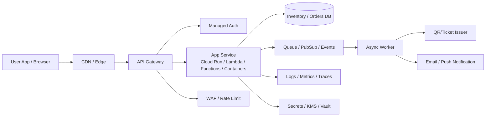

---
tags:
  - cloud
  - aws
  - oci
  - gcp
  - architecture
  - daily
---

[[Home]]

# Cloud Engineer Magazine — 2026-06-20
#cloud #aws #oci #gcp #architecture #daily

## 1) 今日のアプリ
**リアルタイム在庫アラート付きチケット販売アプリ**

ライブ・イベント向けに、以下を提供する想定です。
- ユーザー向け: チケット検索、購入、QR発行
- 運営向け: 在庫追加、販売状況ダッシュボード
- 通知: 残席わずか、販売開始、購入完了通知

今日は**API + コンテナ/Functions + マネージドDB + 非同期イベント**の定番構成を、AWS / OCI / GCP でどう組むかを比較します。

---

## 2) 要件整理

### 機能要件
- イベント一覧・検索
- チケット在庫管理
- 購入API
- 決済完了後のチケット発行
- メール/Push通知
- 管理者向け販売ダッシュボード

### 非機能要件
**可用性**
- 販売開始直後の瞬間負荷に耐える
- 単一AZ障害で停止しない

**性能**
- 商品一覧/イベント一覧は低レイテンシ
- 購入処理は整合性優先
- 通知は非同期で吸収

**セキュリティ**
- 最小権限IAM
- API認証必須
- WAF/レート制限
- DB暗号化、シークレットは専用保管

**コスト**
- 平常時は低コスト
- 販売開始時だけオートスケール
- 初期はサーバレス寄り、成長後は高トラフィック向け最適化

---

## 3) 推奨アーキテクチャ
**推奨:**
- フロント: SPA or モバイルアプリ
- エッジ/API: API Gateway 系
- アプリ層: コンテナ実行基盤（Cloud Run / コンテナ / Functions）
- 在庫・注文: マネージドDB
- 非同期処理: メッセージキュー / PubSub
- 認証: マネージドIdP
- 監視: マネージドメトリクス・ログ・アラート

### なぜこの構成か
- **一覧表示と購入処理を分離**できる
  - 一覧系はキャッシュしやすい
  - 購入系は整合性と再試行制御が重要
- **販売開始直後のスパイク**をキューで吸収できる
- **通知やQR発行**を非同期化してAPI応答を短くできる
- **認証・WAF・監査ログ**をマネージドに寄せて安全側に倒しやすい

### ざっくりした設計判断
- **初期**: サーバレス/従量課金中心
- **成長期**: アプリをコンテナ化して可搬性と制御性を上げる
- **在庫更新**: 楽観ロック or 条件付き更新で二重販売を防ぐ

---

## 4) クラウド別実装マップ

### AWS での実装サービス
- フロント/API公開: **Amazon API Gateway**
- 認証: **Amazon Cognito**
- アプリ実行: **AWS Lambda** または **Amazon ECS/Fargate**
- 在庫・注文DB: **Amazon DynamoDB**（高スパイク向け）
- 非同期イベント: **Amazon EventBridge** / **Amazon SQS**
- 通知: **Amazon SNS** / メール連携
- セキュリティ: **AWS WAF**, **AWS KMS**, **IAM**
- 監視: **Amazon CloudWatch**, **AWS CloudTrail**

**向いている理由**
- API Gateway + Lambda + DynamoDB はイベント販売のような**バースト耐性**と相性がよい
- DynamoDB の条件付き書き込みで在庫競合制御を実装しやすい

**トレードオフ**
- DynamoDB は柔軟だが、RDB前提の複雑JOINには不向き
- ECS/Fargate は柔軟だが、Lambdaより運用判断が増える

### OCI での実装サービス
- フロント/API公開: **OCI API Gateway**
- 認証: **OCI Identity and Access Management** + 外部IdP連携
- アプリ実行: **OCI Functions** または **Container Instances / OKE**
- 在庫・注文DB: **Autonomous Database** または用途次第で **MySQL Database Service**
- 非同期イベント: **OCI Queue** / **Events**
- シークレット・暗号鍵: **OCI Vault**
- 監視: **OCI Logging**, **Monitoring**, **Alarms**
- 保護: **OCI Web Application Firewall**

**向いている理由**
- API Gateway から Functions/OKE へ素直に接続できる
- Autonomous Database を使うと、**トランザクション重視の販売処理**を組みやすい

**トレードオフ**
- DynamoDB/Firestore 的な完全マネージドNoSQLの感覚とは設計が少し違う
- RDB中心にすると、急激な超高バーストは前段キュー設計がより重要

### GCP での実装サービス
- フロント/API公開: **API Gateway**
- 認証: **Identity Platform** または **IAM** / IAP連携
- アプリ実行: **Cloud Run**
- 在庫・注文DB: **Firestore**（初期）または **Cloud SQL**（厳密RDB要件）
- 非同期イベント: **Pub/Sub**
- 通知/イベント処理: **Eventarc** + **Cloud Run**
- セキュリティ: **Cloud Armor**, **Secret Manager**, **Cloud KMS**, **IAM**
- 監視: **Cloud Logging**, **Cloud Monitoring**, **Error Reporting**

**向いている理由**
- Cloud Run はスケールが速く、コンテナで実装統一しやすい
- Pub/Sub と組み合わせると販売開始スパイクの吸収がしやすい

**トレードオフ**
- Firestore は高速だが、厳密なRDBモデリングが必要な場合は Cloud SQL も検討
- Cloud Run の同時実行数設定を雑にすると、在庫更新の競合設計を誤りやすい

---

## 5) システム構成図（Mermaid）

---

## 6) データフロー / 認証・認可 / 監視運用の要点

### データフロー
1. ユーザーがイベント一覧を取得
2. 購入API呼び出し
3. アプリが在庫を**条件付き更新**して確保
4. 注文イベントをキュー投入
5. ワーカーが決済確定後にQR発行・通知送信
6. 管理画面は集計済みデータ or DB参照で販売状況表示

### 認証・認可
- 一般ユーザー認証は Cognito / Identity Platform / 外部IdP連携
- 管理APIは別ロール・別スコープ
- サービス間アクセスは**短期資格情報 + 最小権限IAM**
- DB接続シークレットは Secrets Manager / Vault / Secret Manager に保管

### 監視運用
- API: 4xx/5xx率、P95/P99レイテンシ
- キュー: 滞留件数、再試行回数、DLQ件数
- DB: スロットリング、接続数、遅延クエリ
- アラート: 販売開始前後で閾値を切り替えると実運用しやすい

---

## 7) コスト最適化ポイント

### 初期
- **サーバレス優先**
- 低トラフィック時はゼロ近くまで縮む構成を選ぶ
- 通知・集計は非同期化して同期APIのリソースを減らす

### 成長期
- 高頻度APIだけコンテナ常時稼働へ寄せる
- 読み取り系にキャッシュ/CDNを追加
- DBはアクセスパターン別に分離
  - 在庫/注文: 整合性重視
  - 閲覧/ランキング: キャッシュ・分析基盤寄り

### クラウド別ひとこと
- **AWS**: DynamoDB は設計がハマると強いが、アクセスパターン先行で考える
- **OCI**: Autonomous Database は運用を減らせるが、負荷特性に応じて接続設計を丁寧に
- **GCP**: Cloud Run はコスト効率が高いが、min instances や concurrency 設定で請求が変わる

---

## 8) 障害時の設計

### DR / バックアップ / フェイルオーバー
- API層は**マルチAZ前提**
- DBはマネージドのバックアップと自動復旧機能を有効化
- 非同期処理は**再試行 + DLQ**を必ず実装
- 決済/注文イベントには**冪等キー**を付与
- チケット発行は「二重発行しない」状態管理を持つ

### 実務で大事な点
- 在庫処理は「処理成功」より「誤販売しない」を優先
- 障害時は販売停止フラグを即時切り替え可能にする
- 管理画面で手動再処理・手動返金フローを用意する

---

## 9) 学習ポイント（今日覚えるクラウド機能）
- **AWS**: API Gateway + Lambda + DynamoDB の定番サーバレスAPI構成
- **OCI**: API Gateway と Functions / Container backend の接続、および Vault による秘密情報管理
- **GCP**: API Gateway + Cloud Run + Pub/Sub のスケーラブルなイベント処理

**今日の一言**
「購入APIは同期で短く、重い後続処理は非同期で逃がす」がチケット販売系の基本。

---

## 10) 30〜60分ミニ演習

### 演習テーマ
「購入APIの最小構成を1クラウドで紙設計する」

### 手順
1. 1つ選ぶ（AWS / OCI / GCP）
2. 以下だけを書く
   - API公開サービス
   - 認証サービス
   - アプリ実行基盤
   - DB
   - 非同期メッセージ基盤
   - 監視
3. 次に、購入処理の失敗パターンを3つ書く
   - 在庫競合
   - 通知失敗
   - DB一時エラー
4. 各失敗に対する対策を書く
   - 条件付き更新
   - 再試行 + DLQ
   - 冪等キー

### ゴール
- 「サービス名を並べる」ではなく、**どこで整合性を守るか**を説明できるようになる

---

## 11) 公式ドキュメント参照リンク（AWS / OCI / GCP）

### AWS
- API Gateway ドキュメント
  - https://docs.aws.amazon.com/apigateway/latest/developerguide/welcome.html
- Lambda と API Gateway のチュートリアル
  - https://docs.aws.amazon.com/lambda/latest/dg/services-apigateway-tutorial.html
- API Gateway + Lambda + DynamoDB のCRUD例
  - https://docs.aws.amazon.com/apigateway/latest/developerguide/http-api-dynamo-db.html
- Cognito + API Gateway + Lambda の構成例
  - https://docs.aws.amazon.com/solutions/latest/constructs/aws-cognito-apigateway-lambda.html

### OCI
- API Gateway 概要
  - https://docs.oracle.com/en-us/iaas/Content/APIGateway/Concepts/apigatewayoverview.htm
- API Gateway ドキュメントホーム
  - https://docs.oracle.com/en-us/iaas/Content/APIGateway/home.htm
- OCI API リファレンス
  - https://docs.oracle.com/en-us/iaas/api/
- Vault リリース/機能情報
  - https://docs.oracle.com/en-us/iaas/releasenotes/services/vault/
- OCI Logging 関連
  - https://docs.oracle.com/en-us/iaas/autonomous-database-serverless/doc/autonomous-oci-logging.html

### GCP
- API Gateway + Cloud Run の開始ガイド
  - https://docs.cloud.google.com/api-gateway/docs/get-started-cloud-run
- Cloud Run から Google Cloud サービス接続
  - https://docs.cloud.google.com/run/docs/integrate/using-gcp-services
- Pub/Sub トリガー
  - https://docs.cloud.google.com/run/docs/triggering/pubsub-triggers
- Firestore イベントトリガー
  - https://docs.cloud.google.com/run/docs/triggering/firestore-triggers
- Firestore 拡張 with Cloud Run functions
  - https://docs.cloud.google.com/firestore/native/docs/extend-with-cloud-run-functions

---

## ひとこと比較まとめ
- **AWS**: バースト耐性の高いサーバレス販売APIを作りやすい
- **OCI**: トランザクション重視の販売処理と企業系設計に寄せやすい
- **GCP**: コンテナベースでシンプルに伸ばしやすい

次回は別のアプリ題材で、**分析基盤寄り**または**マルチクラウド比較寄り**に振ると学習効率が高いです。
