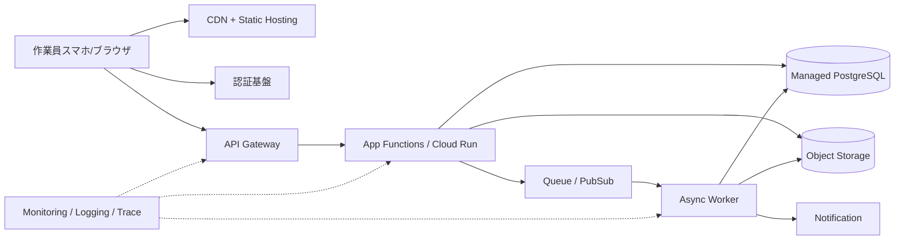

---
tags:
  - cloud
  - aws
  - oci
  - gcp
  - architecture
  - daily
---

[[Home]]

# Cloud Engineer Magazine — 2026-06-21 10:15

## 1) 今日のアプリ
**写真付き現場点検レポートアプリ**

設備保守・建設・倉庫点検向け。作業員がスマホで写真を撮り、チェック項目を入力し、オフライン復帰後に同期。管理者は未完了点検・異常報告・写真証跡を確認する。

**今日の視点:** 3クラウド共通で作れる「イベント駆動 + オブジェクトストレージ中心」の設計。

---

## 2) 要件整理

### 機能要件
- 作業員ログイン
- 点検テンプレート配布
- 写真アップロード
- 点検結果保存
- 異常時に通知
- 管理画面で一覧・検索
- 将来的に OCR / 画像解析を追加可能

### 非機能要件
- **可用性:** 営業時間中は高可用、障害時も写真と報告が失われない
- **性能:** 写真アップロードは数秒以内、一覧は 1〜2 秒程度
- **セキュリティ:** 社員ごとの権限制御、写真 URL の直接公開禁止、最小権限 IAM
- **コスト:** 初期はサーバレス寄り、利用増で DB / API / CDN を段階最適化

---

## 3) 推奨アーキテクチャ（なぜその構成か）
**推奨:**
- フロント: 静的配信 + CDN
- API: マネージド API Gateway
- アプリ層: Functions / Cloud Run 系の小さな stateless サービス
- データ: メタデータはマネージド DB、写真は Object Storage
- 非同期処理: Queue / PubSub / Events
- 認証: クラウド IAM 直結ではなく、アプリ用の ID 基盤を利用

**理由:**
1. 写真ファイルは DB に入れずオブジェクトストレージ分離が基本
2. 点検登録と画像後処理を非同期化すると、現場体験が安定する
3. サーバレス中心だと初期コストを抑えやすい
4. 将来 OCR・AI 判定・帳票生成を追加しやすい

**DB の考え方:**
- 点検ヘッダ / 結果 / ユーザー / 現場マスタは RDB が扱いやすい
- 高速な一覧とトランザクションが必要なので、今日は RDB を主軸にする
- 写真メタデータはテーブル管理、実体は Object Storage

---

## 4) クラウド別実装マップ

### AWS での実装サービス
- フロント配信: **Amazon CloudFront + Amazon S3**
- 認証: **Amazon Cognito**
- API: **Amazon API Gateway**
- アプリ実行: **AWS Lambda**
- DB: **Amazon Aurora Serverless v2 (PostgreSQL 互換)**
- 写真保存: **Amazon S3**
- 非同期処理: **Amazon SQS**
- 通知: **Amazon SNS**
- 監視: **Amazon CloudWatch + AWS X-Ray**
- セキュリティ: **AWS WAF, IAM, KMS, Secrets Manager**

**向いている点:** Lambda と S3 の相性が良く、小規模開始がしやすい。
**トレードオフ:** 高トラフィック時は API Gateway / Lambda 呼び出し回数課金を要確認。

### OCI での実装サービス
- フロント配信: **OCI Object Storage + OCI Load Balancer / CDN 構成**
- 認証: **OCI Identity and Access Management (IAM)** を基盤に、必要に応じて外部 IdP 連携
- API: **OCI API Gateway**
- アプリ実行: **OCI Functions**
- DB: **Autonomous Database Serverless** または **Base Database**
- 写真保存: **OCI Object Storage**
- 非同期処理: **OCI Queue**
- 通知: **OCI Notifications**
- 監視: **OCI Monitoring + Logging + Application Performance Monitoring**
- セキュリティ: **OCI WAF, Vault, Cloud Guard, Security Zones**

**向いている点:** Object Storage・Autonomous Database・ネットワーク制御が強く、企業系ワークロードに寄せやすい。
**トレードオフ:** 一部の実装パターンは AWS/GCP より事例が少なく、設計標準化が重要。

### GCP での実装サービス
- フロント配信: **Cloud Storage + Cloud CDN**
- 認証: **Identity Platform**（または Google ID 連携）
- API: **API Gateway**
- アプリ実行: **Cloud Run**
- DB: **Cloud SQL for PostgreSQL**
- 写真保存: **Cloud Storage**
- 非同期処理: **Pub/Sub**
- 通知: **Pub/Sub + Cloud Run / Cloud Functions**
- 監視: **Cloud Monitoring + Cloud Logging + Cloud Trace**
- セキュリティ: **Cloud Armor, IAM, Secret Manager, Cloud KMS**

**向いている点:** Cloud Run が扱いやすく、コンテナベースで拡張しやすい。
**トレードオフ:** 完全イベント駆動の最小構成は分かりやすい一方、権限設計を雑にするとサービスアカウントが広くなりがち。

---

## 5) システム構成図（Mermaid）

---

## 6) データフロー / 認証・認可 / 監視運用の要点

### データフロー
1. ユーザーが認証
2. API が点検テンプレートを返す
3. 写真アップロード用の短命 URL を発行
4. クライアントが写真を Object Storage に直接アップロード
5. API に点検結果メタデータを登録
6. 非同期ジョブでサムネイル生成・OCR・異常通知

**ポイント:** 写真本体を API サーバ経由にしない。帯域・コスト・タイムアウトを避けやすい。

### 認証・認可
- ユーザー認証は Cognito / Identity Platform / 外部 IdP 連携を優先
- API は JWT 検証
- オブジェクトアクセスは **署名付き URL / 短命トークン** に限定
- 管理者・現場責任者・作業員でロール分離
- ワーカー用権限は「対象バケット・対象キュー・対象 DB 接続」に絞る

### 監視運用
- API レイテンシ、4xx/5xx、キュー滞留、DB 接続数、アップロード失敗率を監視
- 異常検知は「エラー件数」だけでなく「未処理キュー滞留時間」で見る
- 監査ログを有効化し、誰がどの点検を変更したか追える状態にする

---

## 7) コスト最適化ポイント（初期・成長期）

### 初期
- CDN + 静的ホスティングで Web 配信コストを低く保つ
- サーバレス API を採用し、常時起動 VM を避ける
- 写真はライフサイクルポリシーで低頻度アクセス階層へ移行
- DB は最小サイズで開始し、重い分析は別系統に逃がす

### 成長期
- アップロード急増時は API 経由を減らし直接アップロード徹底
- DB 読み取り負荷が上がれば read replica / キャッシュを検討
- OCR や画像解析は全件即時実行ではなく、異常報告時優先や夜間バッチに分離
- 保持期間の長い画像は Archive / Cold tier を活用

---

## 8) 障害時の設計（DR / バックアップ / フェイルオーバー）
- DB は自動バックアップを有効化
- Object Storage はバージョニングまたは同等機能を有効化
- 重要帳票は別リージョン複製を検討
- API / Functions は stateless を維持し、再デプロイしやすくする
- キューを挟み、外部通知失敗時も再送可能にする

**現実的な DR レベル:**
- 初期: 単一リージョン + 自動バックアップ
- 成長期: マルチ AZ / 高可用 DB
- 重要業務化: 別リージョンへのバックアップ複製 + 復旧訓練

---

## 9) 学習ポイント（今日覚えるクラウド機能）
1. **Object Storage への直接アップロード** は API サーバの負荷削減に効く
2. **API Gateway** は認証・スロットリング・監視の入口を標準化できる
3. **Queue / PubSub** を挟むと、重い画像処理を同期 API から分離できる
4. **WAF + 最小権限 IAM + Secret Manager/Vault/KMS** が secure-by-default の土台

---

## 10) 30〜60分ミニ演習
**テーマ:** 「写真直アップロード型 API」を 3クラウドのどれか 1つで設計する

### やること
- 1. バケットを 1つ作る
- 2. API エンドポイントを 1本用意する
- 3. API はアップロード用の短命 URL を返すだけにする
- 4. クライアントはその URL へ直接 PUT/POST する前提で設計メモを書く
- 5. 監視項目を 5個決める

### チェック観点
- API がファイル本体を中継していないか
- URL の有効期限が長すぎないか
- アップロード先権限が広すぎないか
- 失敗時に再送設計があるか

---

## 11) 公式ドキュメント参照リンク（AWS / OCI / GCP）

### AWS
- API Gateway: https://docs.aws.amazon.com/apigateway/latest/developerguide/welcome.html
- Lambda: https://docs.aws.amazon.com/lambda/latest/dg/welcome.html
- Amazon S3: https://docs.aws.amazon.com/AmazonS3/latest/userguide/Welcome.html
- Amazon Cognito: https://docs.aws.amazon.com/cognito/latest/developerguide/what-is-amazon-cognito.html
- Amazon Aurora: https://docs.aws.amazon.com/AmazonRDS/latest/AuroraUserGuide/CHAP_AuroraOverview.html
- Amazon SQS: https://docs.aws.amazon.com/AWSSimpleQueueService/latest/SQSDeveloperGuide/welcome.html
- AWS WAF: https://docs.aws.amazon.com/waf/latest/developerguide/waf-chapter.html

### OCI
- API Gateway: https://docs.oracle.com/en-us/iaas/Content/APIGateway/Concepts/apigatewayoverview.htm
- Functions: https://docs.oracle.com/en-us/iaas/Content/Functions/Concepts/functionsoverview.htm
- Object Storage: https://docs.oracle.com/en-us/iaas/Content/Object/Concepts/objectstorageoverview.htm
- Autonomous Database: https://docs.oracle.com/en-us/iaas/autonomous-database-serverless/doc/autonomous-introduction.html
- Queue: https://docs.oracle.com/en-us/iaas/Content/queue/overview.htm
- Notifications: https://docs.oracle.com/en-us/iaas/Content/Notification/Concepts/notificationoverview.htm
- WAF: https://docs.oracle.com/en-us/iaas/Content/WAF/Concepts/overview.htm

### GCP
- API Gateway: https://docs.cloud.google.com/api-gateway/docs
- Cloud Run: https://docs.cloud.google.com/run/docs/overview/what-is-cloud-run
- Cloud Storage: https://docs.cloud.google.com/storage/docs/introduction
- Identity Platform: https://docs.cloud.google.com/identity-platform/docs
- Cloud SQL: https://docs.cloud.google.com/sql/docs/postgres
- Pub/Sub: https://docs.cloud.google.com/pubsub/docs/overview
- Cloud Armor: https://docs.cloud.google.com/armor/docs/overview

---

## ひとこと
この手のアプリは、**「画像はオブジェクトストレージへ直接」「業務データは RDB」「重い処理は非同期化」** の3点を守ると、かなり壊れにくく育てやすい。最初から全部盛りにせず、まずはアップロード・記録・通知の 3本柱を固めるのが正解。