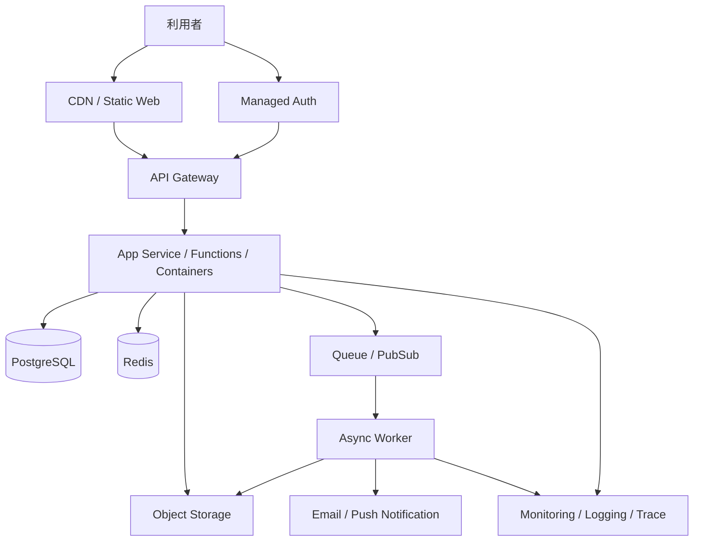

---
tags:
  - cloud
  - aws
  - oci
  - gcp
  - architecture
  - daily
---

[[Home]]

# Cloud Engineer Magazine — 2026-06-22 10:15

## 今日のアプリ
**イベント予約・QR入場管理アプリ**

想定ユースケース：
- 小〜中規模イベント主催者が参加登録を受け付ける
- 決済完了後に電子チケットを発行する
- 当日はスタッフがスマホでQRコードを読み取り、重複入場を防ぐ
- 開催前後に通知、集客分析、CSVエクスポートも行う

---

## 1) 要件整理

### 機能要件
- 参加者の会員登録・ログイン
- イベント一覧・空席確認・予約
- 決済連携後のチケット発行
- QRコード付きチケット表示
- 入場時のチェックインAPI
- 主催者向け管理画面（参加者一覧、当日入場状況、簡易分析）
- メール/プッシュ通知

### 非機能要件
- **可用性**: 申込開始直後のアクセス集中に耐える
- **性能**: 空席確認とチェックインAPIは低レイテンシ
- **セキュリティ**: 個人情報、予約情報、管理者権限を厳格に保護
- **コスト**: 平常時は安く、発売開始時だけ自動スケール

---

## 2) 推奨アーキテクチャ（なぜその構成か）

**今日の視点: マネージド中心の3クラウド実装比較**

推奨は以下の構成：
- フロントエンド: 静的Web配信 + CDN
- API: API Gateway + コンテナ/Functions
- 予約データ: マネージド PostgreSQL
- 空席/在庫競合対策: Redis もしくはDBトランザクション制御
- 非同期処理: Queue / PubSub / Streaming
- チケットPDF・QR画像: Object Storage
- 認証: 各クラウドのマネージドID基盤
- 監視: メトリクス・ログ・アラートを標準サービスで統一

### なぜこの構成か
- **予約系はRDBが強い**: 座席数・在庫数・予約状態の整合性が重要
- **発売開始の瞬間最大風速に対応しやすい**: API層をサーバレス/オートスケールにする
- **通知や帳票は非同期化すべき**: 同期APIにメール送信やPDF生成を入れない
- **運用負荷を下げる**: Kubernetes必須にせず、まずはマネージドで始める

### 主なトレードオフ
- **Functions vs コンテナ**: Functionsは速く作れるが、複雑な依存関係や長め処理はコンテナが扱いやすい
- **RDB一本 vs Redis併用**: 初期はRDBだけで十分なことが多い。高負荷時にRedisを追加
- **API Gateway + Serverless vs GKE/EKS/OKE**: 初期〜成長初期は前者が運用しやすい。常時高負荷・細かい制御が必要ならKubernetesも候補

---

## 3) クラウド別実装マップ

### AWS での実装サービス
- フロントエンド: **Amazon S3 + Amazon CloudFront**
- DNS/TLS: **Amazon Route 53 + AWS Certificate Manager**
- 認証: **Amazon Cognito**
- API: **Amazon API Gateway**
- アプリ実行: **AWS Lambda** または **Amazon ECS on Fargate**
- DB: **Amazon Aurora PostgreSQL** または **Amazon RDS for PostgreSQL**
- キャッシュ: **Amazon ElastiCache for Redis**
- 非同期処理: **Amazon SQS**
- オブジェクト保存: **Amazon S3**
- 通知: **Amazon SNS / Amazon SES**
- 監視: **Amazon CloudWatch + AWS X-Ray**
- 秘密情報: **AWS Secrets Manager**

**選び分け**
- 小規模開始なら **Lambda + RDS** で十分
- PDF生成や画像処理が増えるなら **Fargate** が楽
- 認証は自前実装より **Cognito** の方が安全に始めやすい

### OCI での実装サービス
- フロントエンド: **Object Storage + CDN**
- DNS/TLS: **OCI DNS + Certificates**
- 認証: **OCI Identity Domains**
- API: **API Gateway**
- アプリ実行: **OCI Functions** または **Container Instances**
- DB: **Base Database Service for PostgreSQL**（または要件により MySQL/Autonomous Database 検討）
- キャッシュ: **OCI Cache**
- 非同期処理: **OCI Queue** または **Streaming**
- オブジェクト保存: **Object Storage**
- 通知: **Notifications**
- 監視: **Monitoring + Logging + Alarms**
- 秘密情報: **Vault**

**選び分け**
- 軽量APIは **Functions** が速い
- 常駐アプリや依存が重い処理は **Container Instances** が扱いやすい
- イベント連携が多ければ **Queue**、高スループットなら **Streaming** を検討

### GCP での実装サービス
- フロントエンド: **Cloud Storage + Cloud CDN**
- DNS/TLS: **Cloud DNS + Certificate Manager**
- 認証: **Identity Platform**
- API: **API Gateway**
- アプリ実行: **Cloud Run**
- DB: **Cloud SQL for PostgreSQL**
- キャッシュ: **Memorystore for Redis**
- 非同期処理: **Pub/Sub + Cloud Tasks**
- オブジェクト保存: **Cloud Storage**
- 通知: **Pub/Sub 経由 + 外部通知連携** / メールは外部SaaS併用も現実的
- 監視: **Cloud Monitoring + Cloud Logging + Trace**
- 秘密情報: **Secret Manager**

**選び分け**
- GCPは **Cloud Run** が非常に扱いやすい
- 即時イベント配信は **Pub/Sub**、確実なバックグラウンド実行は **Cloud Tasks** が相性良い
- 認証は **Identity Platform** でOIDCベースに寄せやすい

---

## 4) システム構成図（Mermaid）

---

## 5) データフロー / 認証・認可 / 監視運用の要点

### データフロー
1. ユーザーがWebでログイン
2. APIでイベント一覧・残席を取得
3. 予約APIで申込を受け付け、DBトランザクションで在庫を更新
4. 決済完了イベント後、非同期ワーカーがチケット生成
5. QRコード付きチケットをObject Storageへ保存
6. 通知送信
7. 当日はチェックインAPIがQRトークンを検証し、重複入場を拒否

### 認証・認可
- 一般ユーザーと主催者管理者を**別ロール**で分離
- 管理APIは管理者グループ/ロールのみ許可
- ワーカー、API、DB接続は**サービスアカウント/実行ロール**ごとに最小権限
- Object Storage バケットは非公開を基本にし、必要時のみ署名付きURL
- Secrets は Secrets Manager / Vault / Secret Manager に保存

### 監視運用
- 重要メトリクス:
  - 予約成功率
  - API 5xx率
  - DB接続数
  - キュー滞留数
  - チェックインAPIレイテンシ
- 重要ログ:
  - 認証失敗
  - 権限拒否
  - 予約競合エラー
  - チェックインチケット重複
- アラート例:
  - 発売開始10分間の5xx率急増
  - DB CPU/接続急騰
  - Queue backlog 増加

---

## 6) コスト最適化ポイント（初期・成長期）

### 初期
- API層は **Functions / Lambda / Cloud Run** 優先
- DBは最小構成から開始
- Redisは最初から必須にしない
- 帳票や通知は非同期化し、ピーク時のAPIインスタンス数を抑える
- 静的配信は CDN + Object Storage を基本にする

### 成長期
- ホットデータだけRedisへ逃がす
- 読み取り負荷増大時はDBリードレプリカを検討
- バッチ/ワーカーを別スケールにしてAPIを守る
- ログ保持期間を見直し、低頻度アクセスのオブジェクトはライフサイクル管理

---

## 7) 障害時の設計（DR / バックアップ / フェイルオーバー）

- DBは**自動バックアップ**を有効化
- Object Storage は**バージョニング**を検討
- 本番は可能なら**Multi-AZ / 複数障害ドメイン**構成
- 非同期メッセージは再試行可能設計にする
- チェックインAPIは「失敗時に完全停止」ではなく、短時間の再試行と監査ログを設計
- DRは以下の順で考えると現実的:
  1. 同一リージョン高可用性
  2. 別リージョンへのバックアップ複製
  3. 重要イベントのみクロスリージョン復旧手順を用意

**注意**: 予約系でマルチリージョン同時書き込みを安易にやると整合性が難しい。まずは単一リージョン高可用 + 明確な復旧手順が実務的。

---

## 8) 学習ポイント（今日覚えるクラウド機能）

- **AWS**: API Gateway と Lambda/Fargate の使い分け
- **OCI**: Functions / Queue / Vault を組み合わせた軽量アーキテクチャ
- **GCP**: Cloud Run + Cloud SQL + Pub/Sub/Cloud Tasks の王道構成
- **共通**: 署名付きURL、最小権限IAM、非同期化、RDB整合性設計

---

## 9) 30〜60分ミニ演習

### 演習テーマ
「予約受付APIの最小構成を設計する」

### やること
1. 3クラウドのどれか1つを選ぶ
2. 次の5つのサービス名を書き出す
   - 静的配信
   - 認証
   - API
   - DB
   - 非同期処理
3. 予約完了までのデータフローを5〜8手順で書く
4. IAM最小権限の対象を3つ挙げる
5. 予約集中時のボトルネックを2つ挙げ、対策を書く

### 余力があれば
- 「チェックイン重複をどう防ぐか」をSQL更新条件または排他制御の観点で整理する

---

## 10) 公式ドキュメント参照リンク（AWS / OCI / GCP）

### AWS
- API Gateway: https://docs.aws.amazon.com/apigateway/
- AWS Lambda: https://docs.aws.amazon.com/lambda/
- Amazon ECS: https://docs.aws.amazon.com/ecs/
- Amazon RDS: https://docs.aws.amazon.com/rds/
- Amazon Aurora: https://docs.aws.amazon.com/aurora/
- Amazon Cognito: https://docs.aws.amazon.com/cognito/
- Amazon SQS: https://docs.aws.amazon.com/AWSSimpleQueueService/
- Amazon S3: https://docs.aws.amazon.com/s3/
- Amazon CloudFront: https://docs.aws.amazon.com/AmazonCloudFront/
- AWS Secrets Manager: https://docs.aws.amazon.com/secretsmanager/
- Amazon CloudWatch: https://docs.aws.amazon.com/cloudwatch/

### OCI
- API Gateway: https://docs.oracle.com/en-us/iaas/Content/APIGateway/home.htm
- Functions: https://docs.oracle.com/en-us/iaas/Content/Functions/home.htm
- Container Instances: https://docs.oracle.com/en-us/iaas/Content/container-instances/home.htm
- PostgreSQL: https://docs.oracle.com/en-us/iaas/Content/postgresql/home.htm
- Queue: https://docs.oracle.com/en-us/iaas/Content/queue/home.htm
- Streaming: https://docs.oracle.com/en-us/iaas/Content/Streaming/home.htm
- Object Storage: https://docs.oracle.com/en-us/iaas/Content/Object/home.htm
- Identity Domains: https://docs.oracle.com/en-us/iaas/Content/Identity/home.htm
- Vault: https://docs.oracle.com/en-us/iaas/Content/KeyManagement/home.htm
- Monitoring/Logging: https://docs.oracle.com/en-us/iaas/Content/Monitoring/home.htm

### GCP
- API Gateway: https://cloud.google.com/api-gateway/docs
- Cloud Run: https://cloud.google.com/run/docs
- Cloud SQL for PostgreSQL: https://cloud.google.com/sql/docs/postgres
- Memorystore for Redis: https://cloud.google.com/memorystore/docs/redis
- Pub/Sub: https://cloud.google.com/pubsub/docs
- Cloud Tasks: https://cloud.google.com/tasks/docs
- Cloud Storage: https://cloud.google.com/storage/docs
- Cloud CDN: https://cloud.google.com/cdn/docs
- Identity Platform: https://cloud.google.com/identity-platform/docs
- Secret Manager: https://cloud.google.com/secret-manager/docs
- Cloud Monitoring: https://cloud.google.com/monitoring/docs

---

## 11) ひとこと
予約・在庫・チェックイン系の設計では、**派手な分散構成より、整合性を守るRDB設計と最小権限IAMの方が先に効く**。まずはマネージド構成で安全に作り、ピーク対策はAPI層のスケールと非同期化で吸収するのが実務向き。