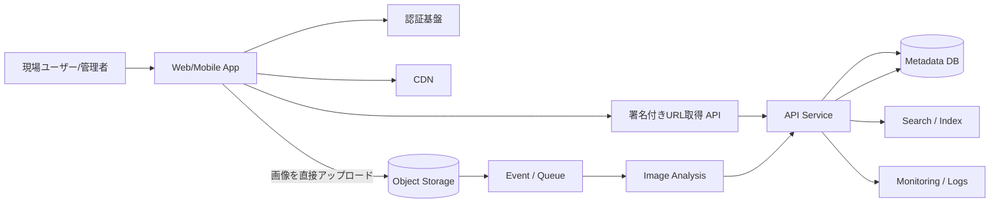

---
tags:
  - cloud
  - aws
  - oci
  - gcp
  - architecture
  - daily
---

[[Home]]

# Cloud Engineer Magazine — 2026-06-23

## 1) 今日のアプリ
**現場写真アップロード＋自動分類アプリ**

建設・設備保守・小売監査の現場担当者が、スマホから写真を投稿し、AIでタグ付けし、案件ごとに検索・共有できるアプリを想定する。

- 例: `漏水`, `ひび割れ`, `棚欠品`, `配線異常`
- 現場では回線が不安定でも使いたい
- 管理者はWeb画面から案件別に一覧・検索したい
- 将来的に1日数万〜数十万枚まで伸ばせる構成を目指す

## 2) 要件整理

### 機能要件
- モバイル/Webから画像アップロード
- 案件・拠点・担当者単位で写真を管理
- AIによる画像ラベル抽出
- タグ/案件/日時で検索
- 管理者向けダッシュボード
- アップロード完了やAI処理失敗の通知

### 非機能要件
- **可用性:** オブジェクト保存は高耐久、APIはAZ冗長
- **性能:** 画像本体はオブジェクトストレージへ直送、メタデータだけAPIで処理
- **セキュリティ:** ID基盤で認証、最小権限IAM、保存時暗号化、非公開バケット
- **コスト:** 初期はサーバレス中心、成長後は推論頻度・配信・保存階層を見直す

## 3) 推奨アーキテクチャ（なぜその構成か）
**推奨:** 「フロント + API + オブジェクトストレージ + 非同期画像解析 + メタデータDB + 検索」のイベント駆動構成。

### 構成理由
- **画像は直接ストレージへ**: APIサーバ経由を避け、帯域/レイテンシ/運用負荷を下げる
- **AI解析は非同期**: アップロード体験を速く保ち、失敗再試行もしやすい
- **メタデータDBと検索を分離**: 正規データ管理と検索UXを両立
- **CDN配信**: 管理画面のサムネイル閲覧を高速化
- **マネージド認証**: 現場ユーザー/管理者ロールを分離しやすい

### トレードオフ
- **完全サーバレス**は初期に強いが、処理時間の長い画像変換や複雑ワークフローは制約がある
- **Kubernetes/ECS/GKE/OKE** は柔軟だが、今日の要件なら運用コストが先に重い
- **単純なDB検索だけ**だとタグ検索や将来の類似検索で伸びにくい

## 4) クラウド別実装マップ

### AWS での実装サービス
- フロント配信: **Amazon CloudFront** + **Amazon S3**
- 認証: **Amazon Cognito**
- API: **Amazon API Gateway** + **AWS Lambda**
- 画像保存: **Amazon S3**
- 非同期連携: **Amazon EventBridge** または **Amazon SQS**
- 画像解析: **Amazon Rekognition**
- メタデータDB: **Amazon DynamoDB**
- 監視: **Amazon CloudWatch** + **AWS CloudTrail**
- 秘密情報: **AWS Secrets Manager**

**この組み合わせが向く理由:**
S3イベント/Lambda/Rekognition のつながりが素直で、小規模開始がしやすい。DynamoDB は案件ID + 撮影日時などのアクセスパターン設計に向く。

### OCI での実装サービス
- フロント配信: **OCI Object Storage** + **OCI CDN**
- 認証: **OCI IAM**（必要に応じて外部IdP連携）
- API: **OCI API Gateway** + **OCI Functions**
- 画像保存: **OCI Object Storage**
- 非同期連携: **OCI Streaming** または **Events**
- 画像解析: **OCI Vision**
- メタデータDB: **Autonomous JSON Database** または **Autonomous Database**
- 監視: **OCI Monitoring** + **Logging** + **Audit**
- 秘密情報: **OCI Vault**

**この組み合わせが向く理由:**
Object Storage / Functions / Vision / Logging のマネージド利用で運用を軽くできる。JSON主体なら Autonomous JSON Database が扱いやすい。

### GCP での実装サービス
- フロント配信: **Cloud Storage** + **Cloud CDN**
- 認証: **Identity Platform** または **Cloud Identity** 連携
- API: **API Gateway** + **Cloud Run**
- 画像保存: **Cloud Storage**
- 非同期連携: **Pub/Sub**
- 画像解析: **Cloud Vision API**
- メタデータDB: **Firestore** または **Cloud SQL**
- 監視: **Cloud Monitoring** + **Cloud Logging** + **Cloud Audit Logs**
- 秘密情報: **Secret Manager**

**この組み合わせが向く理由:**
Cloud Run は HTTP API の実装自由度が高く、Pub/Sub + Vision API の非同期連携も組みやすい。Firestore は初期の高速立ち上げに向く。

## 5) システム構成図（Mermaidで簡易図）


## 6) データフロー / 認証・認可 / 監視運用の要点

### データフロー
1. ユーザーがログイン
2. API が**短寿命のアップロード用URL**を発行
3. クライアントが画像をオブジェクトストレージへ直接送信
4. 保存イベントでキュー/イベントが起動
5. AIサービスがラベル抽出
6. API/関数がメタデータDBへ保存
7. 管理画面はDBと検索インデックスから一覧表示

### 認証・認可
- 一般ユーザー、現場責任者、管理者でロール分離
- バケットは原則 private
- アップロード権限は**署名付きURL限定**、永続キーを端末に置かない
- KMS/Vault/Secret Manager で鍵・シークレットを管理
- サービス間権限は最小権限IAM

### 監視運用
- API レイテンシ、4xx/5xx、関数失敗数、キュー滞留、AI失敗率を監視
- 監査ログで「誰がどの画像にアクセスしたか」を追えるようにする
- 画像処理失敗はDLQ相当の退避先を用意して再処理可能にする

## 7) コスト最適化ポイント（初期・成長期）

### 初期
- コンピュートは Lambda / Functions / Cloud Run で従量課金中心
- 画像原本は標準ストレージ、サムネイルのみ頻繁参照
- DB はオンデマンド/小規模構成から開始
- AI は「アップロード時のみ実行」に絞る

### 成長期
- 古い画像を低コスト階層へライフサイクル移行
- CloudFront / CDN キャッシュでサムネイル配信コストを抑える
- AI再解析はバッチ化し、必要画像だけ再実行
- 検索負荷が増えたら専用検索基盤やインデックス戦略を追加

## 8) 障害時の設計（DR / バックアップ / フェイルオーバー）
- **オブジェクトストレージ:** バージョニング有効化、必要に応じてクロスリージョン複製
- **DB:** 自動バックアップ、有効期限つきスナップショット、復旧手順を文書化
- **イベント処理:** 冪等設計（同じ画像イベントが複数回来ても安全）
- **API:** マルチAZ/リージョン拡張しやすいステートレス設計
- **運用:** RTO/RPO を明確化。たとえば「画像消失ゼロ優先、AIタグ再生成は許容」など優先順位を決める

## 9) 学習ポイント（今日覚えるクラウド機能）
- **署名付きアップロードURL** は「アプリ経由アップロード地獄」を避ける基本パターン
- **イベント駆動** は UX とバックエンド処理を分離できる
- **AI推論を同期APIに直結しない** と、体感性能と再試行性が上がる
- **最小権限IAM + 非公開ストレージ + 監査ログ** が secure-by-default の土台

## 10) 30〜60分ミニ演習
1. 1つのクラウドを選ぶ（AWS推奨）
2. 以下のリソース名だけでよいので設計メモを書く
   - 認証
   - API
   - 画像保存バケット
   - イベント/キュー
   - AI解析
   - メタデータDB
   - 監視
3. 次に「アップロード完了からタグ保存まで」のシーケンスを6行で書く
4. 最後に IAM 権限を3つに分ける
   - エンドユーザー
   - API 実行ロール
   - AI処理ロール

**余裕があれば:**
- DynamoDB / Firestore / JSON DB のどれが今日の要件に合うか1段落で比較する

## 11) 公式ドキュメント参照リンク（AWS / OCI / GCP）

### AWS
- Amazon S3 ドキュメント: https://docs.aws.amazon.com/s3/
- Amazon CloudFront ドキュメント: https://docs.aws.amazon.com/AmazonCloudFront/latest/DeveloperGuide/Introduction.html
- Amazon Cognito ドキュメント: https://docs.aws.amazon.com/cognito/
- Amazon API Gateway ドキュメント: https://docs.aws.amazon.com/apigateway/
- AWS Lambda ドキュメント: https://docs.aws.amazon.com/lambda/
- Amazon Rekognition ドキュメント: https://docs.aws.amazon.com/rekognition/
- Amazon DynamoDB ドキュメント: https://docs.aws.amazon.com/dynamodb/
- Amazon CloudWatch ドキュメント: https://docs.aws.amazon.com/cloudwatch/
- AWS CloudTrail ドキュメント: https://docs.aws.amazon.com/cloudtrail/

### OCI
- OCI Object Storage: https://docs.oracle.com/en-us/iaas/Content/Object/Concepts/objectstorageoverview.htm
- OCI CDN: https://docs.oracle.com/en-us/iaas/Content/Edge/Tasks/overview.htm
- OCI API Gateway: https://docs.oracle.com/en-us/iaas/Content/APIGateway/home.htm
- OCI Functions: https://docs.oracle.com/en-us/iaas/Content/Functions/home.htm
- OCI Vision: https://docs.oracle.com/en-us/iaas/Content/vision/home.htm
- OCI Streaming: https://docs.oracle.com/en-us/iaas/Content/Streaming/home.htm
- OCI Monitoring: https://docs.oracle.com/en-us/iaas/Content/Monitoring/home.htm
- OCI Logging: https://docs.oracle.com/en-us/iaas/Content/Logging/home.htm
- OCI Vault: https://docs.oracle.com/en-us/iaas/Content/KeyManagement/Concepts/keyoverview.htm

### GCP
- Cloud Storage ドキュメント: https://docs.cloud.google.com/storage/docs
- Cloud CDN ドキュメント: https://docs.cloud.google.com/cdn/docs
- API Gateway ドキュメント: https://docs.cloud.google.com/api-gateway/docs
- Cloud Run ドキュメント: https://docs.cloud.google.com/run/docs
- Pub/Sub ドキュメント: https://docs.cloud.google.com/pubsub/docs
- Vision AI ドキュメント: https://docs.cloud.google.com/vision/docs
- Firestore ドキュメント: https://docs.cloud.google.com/firestore/docs
- Cloud Monitoring ドキュメント: https://docs.cloud.google.com/monitoring/docs
- Secret Manager ドキュメント: https://docs.cloud.google.com/secret-manager/docs
```
