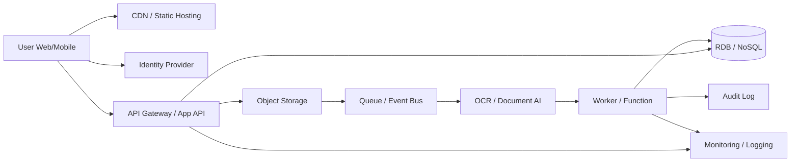

---
tags:
  - cloud
  - aws
  - oci
  - gcp
  - architecture
  - daily
---
[[Home]]

# Cloud Engineer Magazine — 2026-06-24 10:15

## 1) 今日のアプリ
**領収書OCRつき経費精算API**

社員がスマホやWebから領収書画像をアップロードすると、OCRで日付・金額・支払先を抽出し、承認フロー付きで経費申請まで進める業務アプリ。

**今日の視点:** **マルチクラウド比較**  
AI/OCR、オブジェクト保存、非同期処理、認証、監視を AWS / OCI / GCP でどう組むかを実装寄りに見る。

---

## 2) 要件整理

### 機能要件
- 領収書画像のアップロード
- OCR による項目抽出（日付、金額、通貨、支払先）
- ユーザーによる補正
- 承認者ワークフロー
- 経費データ検索
- 監査ログ保管

### 非機能要件
- **可用性:** 平日日中の利用集中に耐える。アップロード失敗時は再試行可能
- **性能:** OCR は同期レスポンスに閉じず、非同期ジョブ化して UX を安定化
- **セキュリティ:** 画像・抽出データは暗号化、最小権限 IAM、監査ログ必須
- **コスト:** 初期はサーバレス優先、成長期は OCR 実行量とDB課金を最適化

---

## 3) 推奨アーキテクチャ（なぜその構成か）

**推奨構成:**  
**フロント + API + オブジェクトストレージ + 非同期キュー/イベント + OCR/Document AI + RDB + 監視**

### なぜこの構成か
1. **画像アップロードとOCRを分離**できる  
   OCR は遅延や失敗がありうるため、API リクエスト中に完結させない方が安定する。
2. **保存先をオブジェクトストレージに集約**できる  
   領収書原本の保管、再処理、監査対応がしやすい。
3. **OCR結果をRDBに正規化**できる  
   承認・検索・集計・会計連携は JSON 保持だけでなく構造化データが必要。
4. **IAM と KMS を境界の中心**に置ける  
   アップロード、OCR実行、DB更新、承認APIをロール分離しやすい。

### トレードオフ
- **全部同期処理**にすると実装は単純だが、OCR遅延でタイムアウトしやすい
- **完全マイクロサービス化**は将来性はあるが、初期段階では運用負荷が高い
- **Document AI 専用基盤に寄せすぎる**と移植性が落ちるため、OCR結果は自前スキーマに正規化する

---

## 4) クラウド別実装マップ

### AWS での実装サービス
- フロント配信: **Amazon CloudFront + Amazon S3**
- 認証: **Amazon Cognito**
- API: **Amazon API Gateway**
- アプリ実行: **AWS Lambda**
- 画像保存: **Amazon S3**
- OCR: **Amazon Textract**
- 非同期連携: **Amazon SQS** または **Amazon EventBridge**
- DB: **Amazon Aurora Serverless v2** もしくは **Amazon DynamoDB**
- 秘密情報: **AWS Secrets Manager**
- 鍵管理: **AWS KMS**
- 監視: **Amazon CloudWatch + AWS CloudTrail**

**AWSでの判断:**  
Textract を使うなら「ファイル到着 → SQS → Lambda → Textract → DB更新」が素直。  
承認系や検索条件が多いなら Aurora、シンプルな申請状態管理なら DynamoDB も有力。

### OCI での実装サービス
- フロント配信: **Object Storage + Load Balancer / CDN**
- 認証: **OCI IAM Identity Domains**
- API: **API Gateway**
- アプリ実行: **OCI Functions** または **Container Instances**
- 画像保存: **Object Storage**
- OCR: **OCI Document Understanding**
- 非同期連携: **Events + Queue**
- DB: **Autonomous Database** もしくは **MySQL HeatWave**
- 秘密情報: **Vault**
- 鍵管理: **Vault (KMS)**
- 監視: **Monitoring + Logging + Audit**

**OCIでの判断:**  
業務帳票やOCRを絡めると Document Understanding が主役。  
Oracle系業務連携やSQL分析まで見据えるなら Autonomous Database が相性良い。

### GCP での実装サービス
- フロント配信: **Cloud Storage + Cloud CDN**
- 認証: **Identity Platform** または **IAM / IAP 構成**
- API: **API Gateway** または **Cloud Run 直接公開**
- アプリ実行: **Cloud Run**
- 画像保存: **Cloud Storage**
- OCR: **Document AI**
- 非同期連携: **Pub/Sub**
- DB: **Cloud SQL** もしくは **Firestore**
- 秘密情報: **Secret Manager**
- 鍵管理: **Cloud KMS**
- 監視: **Cloud Monitoring + Cloud Logging + Cloud Audit Logs**

**GCPでの判断:**  
Document AI と Cloud Run の相性が良い。非同期は Pub/Sub が基本線。  
申請ワークフローの更新一貫性が大事なら Cloud SQL、軽量な状態管理なら Firestore。

---

## 5) システム構成図（Mermaidで簡易図）

---

## 6) データフロー / 認証・認可 / 監視運用の要点

### データフロー
1. ユーザーがログイン
2. API がアップロード用URLまたはアップロード受付を発行
3. 画像をオブジェクトストレージへ保存
4. 保存イベントで OCR ジョブ起動
5. OCR結果を自前スキーマへ変換して DB 保存
6. ユーザーが補正して申請提出
7. 承認者が承認、監査ログへ記録

### 認証・認可
- 一般ユーザー、承認者、経理管理者でロール分離
- **最小権限 IAM** を徹底
  - フロントは直接DBに触れない
  - OCR実行ロールは対象バケット/コンテナだけ読める
  - ワーカーロールは必要テーブルのみ更新可能
- 管理操作は MFA 前提
- 秘密情報は Secrets Manager / Vault / Secret Manager に保管

### 監視運用
- 監視すべき指標
  - OCR失敗率
  - キュー滞留数
  - API 4xx/5xx
  - DB接続数 / レイテンシ
  - 処理完了までの時間
- アラート例
  - OCR失敗率 > 5%
  - キュー滞留 > 10分
  - 申請保存失敗連続発生
- 監査では「誰がいつ画像を見たか」「誰が承認したか」を必ず残す

---

## 7) コスト最適化ポイント（初期・成長期）

### 初期
- サーバレス中心にする（Lambda / Functions / Cloud Run）
- 小規模ではマネージドRDB最小構成または従量課金DBを使う
- OCR は必要項目だけ抽出し、再処理を減らす
- 画像はライフサイクルルールで低頻度層へ移行

### 成長期
- OCR実行件数が増えたら、**再読取率** と **誤抽出率** を測る
- 検索負荷が上がれば読取系をキャッシュまたは検索専用ストアへ分離
- バッチ承認・集計処理はピーク時間外へ寄せる
- 保存期間ポリシーを明確化し、原本・派生データの保持コストを分離管理

---

## 8) 障害時の設計（DR / バックアップ / フェイルオーバー）

- **オブジェクトストレージ:** バージョニング有効化、必要に応じてクロスリージョン複製
- **DB:** 自動バックアップ + PITR、重要ならマルチAZ/HA構成
- **キュー:** 冪等処理を実装し、再試行で二重登録しない
- **OCR失敗:** DLQ / 再処理キューを用意
- **リージョン障害:**
  - 初期は「復旧手順を明文化」までで十分
  - 成長後は静的配信・API・DB の代替リージョン戦略を検討

**実務ポイント:**  
この種の業務アプリは“完全自動フェイルオーバー”より、**データ欠損防止** と **再処理可能性** の方が重要なことが多い。

---

## 9) 学習ポイント（今日覚えるクラウド機能）

- **AWS Textract** は OCR だけでなくフォーム/テーブル抽出が強い
- **OCI Document Understanding** は業務文書抽出ユースケースで使いやすい
- **GCP Document AI** は文書処理パイプライン設計との相性が良い
- どのクラウドでも、**イベント駆動 + オブジェクトストレージ + 最小権限IAM** が基本パターン

---

## 10) 30〜60分ミニ演習

### 演習テーマ
「アップロード後に非同期OCRを起動する最小構成」を1クラウド選んで紙に設計する

### 手順
1. API、ストレージ、OCR、DB、監視を5箱で描く
2. 各箱に実サービス名を書く
3. IAMロールを3つ定義する
   - ユーザー操作用
   - OCR実行用
   - DB更新用
4. 障害ケースを2つ書く
   - OCR失敗
   - DB保存失敗
5. 再試行方法と監査ログの残し方を書く

### できれば追加
- AWS / OCI / GCP のうち別クラウドに置き換えた場合の差分を3つ比較する

---

## 11) 公式ドキュメント参照リンク（AWS / OCI / GCP）

### AWS
- Amazon Textract: https://docs.aws.amazon.com/textract/
- AWS Lambda: https://docs.aws.amazon.com/lambda/
- Amazon S3: https://docs.aws.amazon.com/s3/
- Amazon SQS: https://docs.aws.amazon.com/AWSSimpleQueueService/
- Amazon API Gateway: https://docs.aws.amazon.com/apigateway/
- Amazon Cognito: https://docs.aws.amazon.com/cognito/
- AWS KMS: https://docs.aws.amazon.com/kms/
- Amazon CloudWatch: https://docs.aws.amazon.com/cloudwatch/
- AWS CloudTrail: https://docs.aws.amazon.com/cloudtrail/

### OCI
- OCI Document Understanding: https://docs.oracle.com/en-us/iaas/Content/document-understanding/home.htm
- OCI Functions: https://docs.oracle.com/en-us/iaas/Content/Functions/home.htm
- OCI API Gateway: https://docs.oracle.com/en-us/iaas/Content/APIGateway/home.htm
- OCI Object Storage: https://docs.oracle.com/en-us/iaas/Content/Object/home.htm
- OCI Queue: https://docs.oracle.com/en-us/iaas/Content/queue/home.htm
- OCI Events: https://docs.oracle.com/en-us/iaas/Content/Events/home.htm
- Autonomous Database: https://docs.oracle.com/en-us/iaas/autonomous-database-serverless/doc/
- OCI Vault: https://docs.oracle.com/en-us/iaas/Content/KeyManagement/home.htm
- OCI Monitoring: https://docs.oracle.com/en-us/iaas/Content/Monitoring/home.htm
- OCI Logging: https://docs.oracle.com/en-us/iaas/Content/Logging/home.htm
- OCI Audit: https://docs.oracle.com/en-us/iaas/Content/Audit/home.htm
- Identity Domains: https://docs.oracle.com/en-us/iaas/Content/Identity/home.htm

### GCP
- Document AI: https://docs.cloud.google.com/document-ai/docs
- Cloud Run: https://docs.cloud.google.com/run/docs
- Cloud Storage: https://docs.cloud.google.com/storage/docs
- Pub/Sub: https://docs.cloud.google.com/pubsub/docs
- API Gateway: https://docs.cloud.google.com/api-gateway/docs
- Cloud SQL: https://docs.cloud.google.com/sql/docs
- Firestore: https://docs.cloud.google.com/firestore/docs
- Secret Manager: https://docs.cloud.google.com/secret-manager/docs
- Cloud KMS: https://docs.cloud.google.com/kms/docs
- Cloud Monitoring: https://docs.cloud.google.com/monitoring/docs
- Cloud Logging: https://docs.cloud.google.com/logging/docs
- Cloud Audit Logs: https://docs.cloud.google.com/logging/docs/audit
- Identity Platform: https://docs.cloud.google.com/identity-platform/docs
