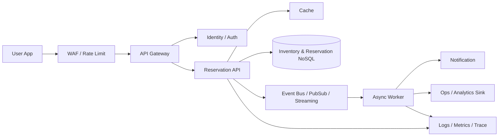

---
tags:
  - cloud
  - aws
  - oci
  - gcp
  - architecture
  - daily
---

[[Home]]

# Cloud Engineer Magazine — 2026-06-25 10:15

## 今日の視点
**マルチクラウド比較**: フラッシュセール向け **在庫予約API** をどう組むか。  
ポイントは **瞬間的な高トラフィック**, **二重販売防止**, **短時間予約**, **安全な認証**, **観測性**。

---

## 1) 今日のアプリ
**フラッシュセール在庫予約API**  
例: 期間限定セールで、ユーザーが商品をカート投入した瞬間に **5分だけ在庫を仮押さえ** する。

必要な機能:
- 商品一覧取得
- 在庫確認
- 在庫予約作成（TTL付き）
- 予約確定（購入）
- 予約失効
- 管理者向け在庫補充

この題材が良い理由:
- API Gateway / Serverless / NoSQL / Event / IAM / Monitoring を一通り学べる
- 「書ける」だけでなく **売り切れ時に壊れにくい設計** を学べる

---

## 2) 要件整理

### 機能要件
- ユーザーは認証後に在庫を予約できる
- 予約は 5 分で自動失効
- 決済完了時に予約を確定し、在庫を正式消費する
- 同一在庫の過剰予約を防ぐ
- 管理者のみ在庫補充 API を実行できる

### 非機能要件
**可用性**
- セール開始直後の急増に耐える
- 単一コンポーネント障害で API 全停止しない

**性能**
- 在庫確認は低レイテンシ
- 予約 API は高スループット優先
- 同期処理は最小限、後続処理はイベント非同期化

**セキュリティ**
- 認証必須、管理 API は別権限
- WAF / レート制限 / 監査ログ
- 最小権限 IAM
- サービス間通信はマネージド ID を優先し、長期鍵を避ける

**コスト**
- 初期はサーバレス中心で固定費を抑える
- 成長後は高頻度アクセス部分のみ専用化・キャッシュ強化

---

## 3) 推奨アーキテクチャ（なぜその構成か）

### 推奨方針
**API Gateway + コンテナ/Function + NoSQL + Event Bus/Queue + Cache + ID 管理**

### なぜこの構成か
1. **在庫予約は短命データ**なので TTL を持てる NoSQL が相性良い  
2. **セール直後のスパイク**に対して、サーバレス入口はオートスケールしやすい  
3. **確定処理・通知・分析**をイベント分離すると、予約APIの応答を速く保てる  
4. 在庫整合性は DB の条件付き更新やトランザクションで守る  
5. WAF / IAM / 監査ログを入口で標準化しやすい

### 設計のキモ
- **在庫数を減らす更新は条件付き書き込み**にする
- 「予約作成」と「予約確定」を別状態管理にする
- 売り切れ時は 409/429 を使い分ける
- 重い分析は本線 API から切り離す

---

## 4) クラウド別実装マップ

### AWS での実装サービス
- API 入口: **Amazon API Gateway**
- 認証: **Amazon Cognito**
- アプリ実行: **AWS Lambda**（初期） / **Amazon ECS on Fargate**（成長後）
- 在庫・予約DB: **Amazon DynamoDB**
- イベント連携: **Amazon EventBridge**
- 非同期ワーカー: **AWS Lambda** or **ECS/Fargate**
- キャッシュ: **Amazon ElastiCache**
- 監視: **Amazon CloudWatch**, **AWS X-Ray**
- セキュリティ: **AWS WAF**, **IAM**, **KMS**, **CloudTrail**

**AWS の選びどころ**
- DynamoDB の条件付き書き込みとスケール特性がこのユースケースに強い
- Lambda で初期コストを抑えやすい
- EventBridge で後続イベント連携を疎結合化しやすい

**トレードオフ**
- Lambda は短時間バーストに強いが、重い業務ロジックや接続管理は ECS/Fargate の方が扱いやすいことがある

### OCI での実装サービス
- API 入口: **OCI API Gateway**
- 認証/認可: **OCI IAM**（必要に応じて ID ドメイン連携）
- アプリ実行: **OCI Functions**（初期） / **Container Instances** or **OKE**（成長後）
- 在庫・予約DB: **OCI NoSQL Database**
- イベント連携: **OCI Events** + **OCI Streaming** / **Queue**
- キャッシュ: **OCI Cache**
- 監視: **OCI Monitoring**, **Logging**, **Application Performance Monitoring**
- セキュリティ: **OCI WAF**, **Vault**, **Audit**

**OCI の選びどころ**
- NoSQL + Functions + API Gateway の組み合わせでマネージド構成を作りやすい
- Streaming を使うと後段集計や通知を分離しやすい
- Vault / IAM / Audit を標準構成に入れやすい

**トレードオフ**
- きめ細かいイベント分離を強く進めるなら Streaming 設計の理解が必要
- シンプル構成優先なら Functions + NoSQL + Events から始めた方がよい

### GCP での実装サービス
- API 入口: **API Gateway**
- 認証: **Identity Platform** または **IAM** ベースのサービス保護
- アプリ実行: **Cloud Run**
- 在庫・予約DB: **Firestore**（TTL活用） or **Bigtable**（超高スループット時）
- イベント連携: **Pub/Sub**
- 非同期実行: **Cloud Run jobs / Cloud Run workers**
- キャッシュ: **Memorystore**
- 監視: **Cloud Monitoring**, **Cloud Logging**, **Cloud Trace**
- セキュリティ: **Cloud Armor**, **Secret Manager**, **Cloud Audit Logs**

**GCP の選びどころ**
- Cloud Run の運用負荷が低い
- Pub/Sub でイベント分離しやすい
- Firestore は初期実装が速い

**トレードオフ**
- 強い整合性とアクセスパターン次第では Firestore より別DBの方が向く
- 超高頻度在庫カウンタはスキーマ/更新設計を丁寧にしないと熱いキー問題が出やすい

---

## 5) システム構成図（Mermaid）

---

## 6) データフロー / 認証・認可 / 監視運用の要点

### データフロー
1. ユーザーが商品詳細を表示
2. API がキャッシュ or DB から在庫参照
3. 予約 API 実行時、**条件付き更新**で残数を減らし予約レコードを作成
4. 予約成功イベントを発行
5. 決済完了で予約確定イベントを発行
6. TTL 失効またはワーカーで未確定予約を戻し在庫復元

### 認証・認可
- 一般ユーザー: 商品参照・予約のみ
- 管理者: 在庫補充・手動取消
- サービス間: ロール / 動的資格情報 / サービスアカウントを使用
- DB やシークレットはアプリから最小権限で参照
- 管理 API は別ルート・別ポリシー・監査対象にする

### 監視運用
最低限取るべきメトリクス:
- 予約成功率
- 売り切れ率
- 条件付き更新失敗数
- p95 / p99 レイテンシ
- 認証失敗数
- WAF ブロック数
- 非同期ワーカー滞留数

ログ/トレース:
- リクエストIDを API → Worker まで伝搬
- 注文ID / 予約ID を構造化ログへ
- 409/429/5xx を分離可視化

---

## 7) コスト最適化ポイント（初期・成長期）

### 初期
- API はサーバレスで開始
- DB はオンデマンド / 従量課金寄り
- キャッシュは必要箇所に限定
- 分析基盤はまずログ保存のみ

### 成長期
- 商品詳細など高頻度 GET をキャッシュ強化
- 重い処理を非同期化して同期 API 実行時間を削減
- Cloud Run / ECS / OKE などは常時負荷が見えるなら予約容量や最小インスタンスを検討
- DB のホットキー対策（商品単位分散、在庫シャーディング）を行う

---

## 8) 障害時の設計（DR / バックアップ / フェイルオーバー）

### まず守るもの
- 在庫原本
- 予約状態
- 監査ログ

### DR 方針
- DB バックアップとポイントインタイム復元機能を有効化
- 予約イベントは再処理可能にする
- リージョン障害時は「即フル自動」よりも **在庫整合性優先** が現実的
- 読み取り系はマルチAZ/リージョン検討、書き込み系は整合性戦略を明確にする

### フェイルオーバー時の注意
- 在庫二重消費を防ぐため、切替中は一時的に予約 API を絞る選択肢も必要
- TTL 失効中の予約戻し処理は冪等にする
- イベント重複配信前提でワーカーを設計する

---

## 9) 学習ポイント（今日覚えるクラウド機能）

1. **条件付き書き込み**: 在庫の過剰販売を防ぐ基本
2. **TTL**: 短命な予約データ管理に便利
3. **イベント分離**: 通知や分析を同期 API から外す
4. **WAF + Rate Limit**: セール時の悪意/過負荷対策
5. **最小権限 IAM**: 管理 API と一般 API の権限分離

---

## 10) 30〜60分ミニ演習

### 演習テーマ
「予約 API の最小版を設計する」

### やること
1. 以下 3 API を紙か Markdown で定義する
   - `GET /items/{id}`
   - `POST /reservations`
   - `POST /reservations/{id}/confirm`
2. 予約レコードのスキーマを考える
   - `reservationId`
   - `itemId`
   - `userId`
   - `status`
   - `expiresAt`
3. 在庫減算時の条件付き更新ロジックを書く（擬似コードでOK）
4. 失敗時の HTTP ステータスを決める
   - 在庫なし: `409 Conflict`
   - レート超過: `429 Too Many Requests`
   - 未認証: `401 Unauthorized`
5. 監視項目を 5 つ書く

### 余力があれば
- AWS / OCI / GCP それぞれで「どのサービスに置くか」を 1 行ずつ書く

---

## 11) 公式ドキュメント参照リンク（AWS / OCI / GCP）

### AWS
- API Gateway: https://docs.aws.amazon.com/apigateway/
- Lambda: https://docs.aws.amazon.com/lambda/
- DynamoDB: https://docs.aws.amazon.com/amazondynamodb/
- EventBridge: https://docs.aws.amazon.com/eventbridge/
- Cognito: https://docs.aws.amazon.com/cognito/
- WAF: https://docs.aws.amazon.com/waf/
- CloudWatch: https://docs.aws.amazon.com/AmazonCloudWatch/

### OCI
- API Gateway: https://docs.oracle.com/en-us/iaas/Content/APIGateway/home.htm
- Functions: https://docs.oracle.com/en-us/iaas/Content/Functions/home.htm
- NoSQL Database: https://docs.oracle.com/en-us/iaas/nosql-database/index.html
- Events: https://docs.oracle.com/en-us/iaas/Content/Events/home.htm
- Streaming: https://docs.oracle.com/en-us/iaas/Content/Streaming/home.htm
- IAM: https://docs.oracle.com/en-us/iaas/Content/Identity/home.htm
- Monitoring: https://docs.oracle.com/en-us/iaas/Content/Monitoring/home.htm

### GCP
- API Gateway: https://docs.cloud.google.com/api-gateway/docs
- Cloud Run: https://docs.cloud.google.com/run/docs
- Firestore: https://docs.cloud.google.com/firestore/docs
- Pub/Sub: https://docs.cloud.google.com/pubsub/docs
- Identity Platform: https://docs.cloud.google.com/identity-platform/docs
- Cloud Armor: https://docs.cloud.google.com/armor/docs
- Cloud Monitoring: https://docs.cloud.google.com/monitoring/docs

---

## 一言まとめ
在庫予約APIの本質は、**「速く返す」より先に「売りすぎない」こと**。  
そのために、各クラウドで **条件付き更新・短命データTTL・イベント分離・最小権限IAM** をどう組み合わせるかが実務の差になる。
