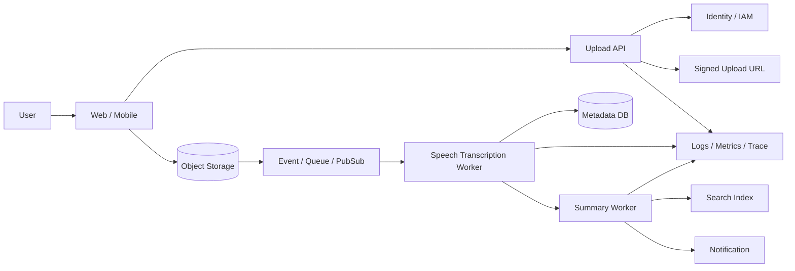

---
tags:
  - cloud
  - aws
  - oci
  - gcp
  - architecture
  - daily
---

[[Home]]

# Cloud Engineer Magazine — 2026-06-26 10:15

## 今日の視点
**シングルクラウドでも作れるが、3クラウド比較で学ぶ回**: **会議録音の自動文字起こし・要約アプリ**。  
ポイントは **安全なファイルアップロード**, **非同期音声処理**, **要約ジョブ**, **テナント分離**, **監査性**。

---

## 1) 今日のアプリ
**会議録音の自動文字起こし・要約アプリ**  
ユーザーが音声ファイルをアップロードすると、数分後に以下を返す:
- 話者分離つき文字起こし
- 要点サマリ
- アクションアイテム
- 検索可能な会議履歴

**この題材が良い理由**
- Object Storage / Event / Queue / Serverless / IAM / AI サービスを一気に学べる
- 同期APIで無理に処理せず、**非同期パイプラインで安定化する設計**を練習できる

---

## 2) 要件整理

### 機能要件
- 音声ファイルをアップロードできる
- アップロード完了後に文字起こしジョブを開始する
- 完了後に要約とアクションアイテムを生成する
- 会議単位で履歴検索できる
- 管理者は保持期間とアクセス権を制御できる

### 非機能要件
**可用性**
- 音声処理中に一部ジョブが失敗しても再実行できる
- API とバックグラウンド処理を分離して全停止を避ける

**性能**
- アップロード受付は高速
- 重い処理は非同期
- 文字起こし結果の閲覧は低レイテンシ

**セキュリティ**
- 音声データは保存時暗号化
- 署名付きURL/事前認証URLで直接アップロード
- 最小権限 IAM
- テナントごとにデータ分離
- 監査ログと秘密情報管理を標準化

**コスト**
- 初期はサーバレス中心
- 長時間音声や大量再処理を抑制
- 保持期間を明示しストレージ課金を抑える

---

## 3) 推奨アーキテクチャ（なぜその構成か）

### 推奨方針
**署名付きアップロード + Object Storage + Event/Queue + Serverless/Container Worker + Speech AI + 要約Worker + 検索DB**

### なぜこの構成か
1. 音声ファイルは API サーバー経由ではなく **ストレージへ直接アップロード** した方がスケールしやすい  
2. 文字起こしは数秒〜数十分かかるため、**ジョブ型の非同期処理** が前提  
3. 要約・通知・索引更新を分離すると、失敗箇所を局所化できる  
4. 会議履歴はメタデータ DB と全文検索を分けると運用しやすい  
5. KMS/Vault/Secret Manager と IAM を先に設計すると、後からの権限事故を減らせる

### トレードオフ
- **Functions/Lambda/Cloud Run** は初期運用が楽。ただし長時間・高並列処理はコンテナ基盤の方が制御しやすい
- AI 要約を毎回同期生成すると高コスト。まずは **文字起こし完了後の後段ジョブ** に分ける方が安全

---

## 4) クラウド別実装マップ

### AWS での実装サービス
- アップロードURL発行/API: **Amazon API Gateway + AWS Lambda**
- 音声保存: **Amazon S3**
- 文字起こし: **Amazon Transcribe**
- 要約ワーカー: **AWS Lambda** または **Amazon ECS on Fargate**
- メタデータDB: **Amazon DynamoDB**
- 検索: **Amazon OpenSearch Service**
- 非同期連携: **Amazon EventBridge** / **Amazon SQS**
- 認証: **Amazon Cognito**
- 監視/監査: **Amazon CloudWatch**, **AWS X-Ray**, **AWS CloudTrail**
- 暗号化/秘密管理: **AWS KMS**, **AWS Secrets Manager**

**AWS の選びどころ**
- S3 イベント, Transcribe, Lambda の接続が素直
- DynamoDB でジョブ状態管理を軽く持てる
- OpenSearch で会議履歴検索を強化しやすい

### OCI での実装サービス
- アップロードURL発行/API: **OCI API Gateway + OCI Functions**
- 音声保存: **OCI Object Storage**
- 文字起こし: **OCI Speech**
- 要約ワーカー: **OCI Functions** / **Container Instances** / **OKE**
- メタデータDB: **Autonomous Database** または **OCI NoSQL Database**
- 検索補助: **OCI Search with OpenSearch**
- 非同期連携: **OCI Events** + **OCI Queue** / **Streaming**
- 認証/認可: **OCI IAM**
- 監視/監査: **OCI Monitoring**, **Logging**, **Audit**, **Application Performance Monitoring**
- 暗号化/秘密管理: **OCI Vault**

**OCI の選びどころ**
- Object Storage, Events, Functions の構成が作りやすい
- Autonomous Database を使うと検索前の会議メタデータ管理が安定する
- Search with OpenSearch で検索要件を広げやすい

### GCP での実装サービス
- アップロードURL発行/API: **API Gateway + Cloud Run**
- 音声保存: **Cloud Storage**
- 文字起こし: **Speech-to-Text**
- 要約ワーカー: **Cloud Run** / **Cloud Run Jobs**
- メタデータDB: **Firestore** または **Cloud SQL**
- 検索: **Vertex AI Search** または **OpenSearch系の別運用**（要件次第）
- 非同期連携: **Pub/Sub**
- 認証: **Identity Platform** または **IAM + IAP/サービス認証**
- 監視/監査: **Cloud Monitoring**, **Cloud Logging**, **Cloud Trace**, **Cloud Audit Logs**
- 暗号化/秘密管理: **Cloud KMS**, **Secret Manager**

**GCP の選びどころ**
- Cloud Run で HTTP/API/Worker を揃えやすい
- Pub/Sub でアップロード後処理を疎結合化しやすい
- Speech-to-Text と Cloud Storage の連携が分かりやすい

---

## 5) システム構成図（Mermaid）

---

## 6) データフロー / 認証・認可 / 監視運用の要点

### データフロー
1. ユーザーが認証後、アップロード開始
2. API が署名付きURLを返す
3. クライアントが Object Storage に直接アップロード
4. 保存イベントで文字起こしジョブを開始
5. 完了後、要約ジョブと検索インデックス更新を実行
6. ユーザーは結果 API から文字起こし/要約を参照

### 認証・認可
- 一般ユーザー: 自分の会議のみ参照
- 管理者: テナント設定・保持期間管理
- ワーカー: ストレージ読取、結果書込、通知送信だけ許可
- バケット/コンテナは公開禁止、署名付きURLは短寿命
- KMS/Vault/Secret Manager で API キーや接続情報を保護

### 監視運用
最低限見る指標:
- アップロード成功率
- 文字起こしジョブ成功率/再試行回数
- 平均処理時間、p95 完了時間
- キュー滞留数
- 失敗理由別件数（音声形式不正、権限、タイムアウト）
- テナント別ストレージ使用量

運用メモ:
- ジョブ状態は `uploaded -> transcribing -> summarizing -> done/failed` のように明示
- リクエストID/ジョブIDを API から非同期処理まで引き継ぐ
- DLQ または失敗イベント保管先を用意し、手動再実行を可能にする

---

## 7) コスト最適化ポイント（初期・成長期）

### 初期
- API/Worker はサーバレス中心
- 要約は必要時のみ実行（毎回自動生成しない選択もあり）
- 音声保存はライフサイクルルールで短中期アーカイブ移行
- 検索は全件ではなく最新会議から段階導入

### 成長期
- 長時間音声を分割処理し再実行範囲を小さくする
- 高頻度検索は専用検索基盤に寄せる
- コンテナワーカーへ寄せて同時処理数を細かく制御
- 保持期間をプラン別に分け、不要な全文保存を減らす

---

## 8) 障害時の設計（DR / バックアップ / フェイルオーバー）

- 音声ファイルはオブジェクトストレージの冗長性を前提にし、重要データはクロスリージョン複製を検討
- メタデータDBは定期バックアップ必須
- キュー/イベントは再試行回数とDLQを設定
- 文字起こし失敗時はファイル再投入ではなく **ジョブ再実行** を優先
- RPO/RTO を決める:
  - 初期: 数時間以内復旧でも可
  - 業務利用拡大後: メタデータは低RPO、音声原本は高耐久ストレージで保護

**実務上の判断**
- まず守るべきは「原本音声」と「結果メタデータ」
- 要約や検索インデックスは再生成可能なことが多いので、復旧優先度を分ける

---

## 9) 学習ポイント（今日覚えるクラウド機能）

- **署名付きURL/事前認証リクエスト**: 大きいファイルをアプリ経由で中継しない
- **非同期ジョブ設計**: 重いAI処理を HTTP 同期レスポンスに載せない
- **最小権限 IAM**: API、Worker、管理者で権限分離
- **DLQ/失敗隔離**: 失敗時に全体停止しない
- **保存と検索の分離**: 原本、メタデータ、検索用途は責務を分ける

---

## 10) 30〜60分ミニ演習

### 演習テーマ
「音声アップロード受付 + 非同期ジョブ開始」だけを設計する

### やること
1. 1クラウド選ぶ（AWS / OCI / GCP）
2. 署名付きURLを返す API を1本決める
3. アップロード先バケット/ストレージの権限方針を書く
4. 保存イベントから起動するワーカーを1つ決める
5. ジョブ状態テーブルの項目を5つ書く
   - jobId
   - tenantId
   - objectPath
   - status
   - createdAt
6. 失敗時の再試行とDLQ方針を2行でまとめる

**できれば追加**
- 文字起こし完了後に要約ジョブへ渡すイベントJSONを作る

---

## 11) 公式ドキュメント参照リンク（AWS / OCI / GCP）

### AWS
- S3 presigned URL: https://docs.aws.amazon.com/AmazonS3/latest/userguide/using-presigned-url.html
- Amazon Transcribe: https://docs.aws.amazon.com/transcribe/latest/dg/what-is.html
- AWS Lambda: https://docs.aws.amazon.com/lambda/latest/dg/welcome.html
- Amazon EventBridge: https://docs.aws.amazon.com/eventbridge/latest/userguide/eb-what-is.html
- DynamoDB: https://docs.aws.amazon.com/amazondynamodb/latest/developerguide/Introduction.html

### OCI
- Object Storage Pre-Authenticated Requests: https://docs.oracle.com/en-us/iaas/Content/Object/Tasks/usingpreauthenticatedrequests.htm
- OCI Speech: https://docs.oracle.com/en-us/iaas/Content/speech/home.htm
- OCI Functions: https://docs.oracle.com/en-us/iaas/Content/Functions/home.htm
- OCI Events: https://docs.oracle.com/en-us/iaas/Content/Events/home.htm
- OCI Queue: https://docs.oracle.com/en-us/iaas/Content/queue/home.htm

### GCP
- Cloud Storage signed URLs: https://docs.cloud.google.com/storage/docs/access-control/signed-urls
- Speech-to-Text: https://docs.cloud.google.com/speech-to-text/docs
- Cloud Run overview: https://docs.cloud.google.com/run/docs/overview/what-is-cloud-run
- Pub/Sub overview: https://docs.cloud.google.com/pubsub/docs/overview
- Firestore: https://docs.cloud.google.com/firestore/docs/overview
