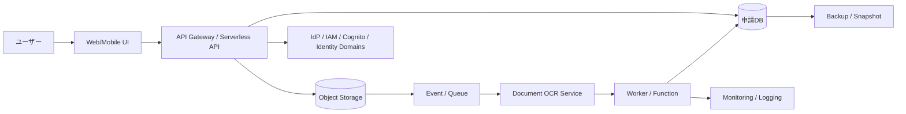

---
tags:
  - cloud
  - aws
  - oci
  - gcp
  - architecture
  - daily
---
[[Home]]

# Cloud Engineer Magazine — 2026-06-27

## 1) 今日のアプリ
**レシート画像から経費申請を自動作成するモバイル/Webアプリ**

出張や会食のレシートを撮影すると、OCR/ドキュメント解析で金額・日付・店名を抽出し、申請下書きを自動作成する。
今日は **マルチクラウド比較視点** で、AWS / OCI / GCP それぞれでほぼ同じ責務をどう実装するかを見る。

---

## 2) 要件整理

### 機能要件
- ユーザーがレシート画像/PDFをアップロード
- 金額、日付、加盟店名、税額候補を抽出
- ユーザーが補正して申請確定
- 承認者が申請一覧を確認・承認
- 監査用に原本ファイルを保管

### 非機能要件
- **可用性:** 平日日中の集中アクセスに耐える。単一AZ障害では止めない
- **性能:** 画像アップロードは即応、OCRは非同期で数秒〜数十秒以内
- **セキュリティ:** 原本は暗号化保存、最小権限IAM、監査ログ有効化
- **コスト:** 初期はサーバレス中心、件数増加時にキュー/DB/推論コストを最適化

---

## 3) 推奨アーキテクチャ（なぜその構成か）
**推奨:** `Object Storage + Event + Serverless API + Async OCR + RDB + Queue + Monitoring`

### なぜこの構成か
- **アップロードとOCRを分離**すると、ユーザー操作の応答性を維持しやすい
- OCRは変動負荷なので **イベント駆動 + 非同期処理** が向く
- 承認ワークフローや検索条件が増えるため、結果保存は **RDB** が扱いやすい
- 原本保管は **オブジェクトストレージ** が安く、ライフサイクル管理もしやすい
- 初期はサーバレスで運用を軽くし、件数が増えたらワーカーやDBを段階的に強化できる

### トレードオフ
- **完全サーバレス** は初期最適だが、超高頻度ではコールドスタートや単価が気になる
- **マネージドRDB** は扱いやすいが、読み取り中心なら一部を検索/分析基盤へ逃がしたくなる
- **クラウド固有OCR** は実装が速い一方、抽出精度や帳票種類によって移植性は下がる

---

## 4) クラウド別実装マップ

### AWS での実装サービス
- フロント/API: **Amazon API Gateway** + **AWS Lambda**
- 原本保存: **Amazon S3**
- OCR/抽出: **Amazon Textract**
- 非同期制御: **Amazon SQS** / **Amazon EventBridge**
- 申請DB: **Amazon Aurora Serverless v2** または **Amazon RDS for PostgreSQL**
- 認証: **Amazon Cognito**
- 秘密情報: **AWS Secrets Manager**
- 監視: **Amazon CloudWatch** + **AWS CloudTrail**

**向いている理由:** Textract と Lambda/S3 の組み合わせが素直。イベント駆動の定番構成を組みやすい。

### OCI での実装サービス
- フロント/API: **API Gateway** + **Functions**
- 原本保存: **Object Storage**
- OCR/抽出: **Document Understanding**
- 非同期制御: **Queue** + **Events**
- 申請DB: **Autonomous Transaction Processing** または **MySQL HeatWave**
- 認証: **IAM Identity Domains**
- 秘密情報: **Vault**
- 監視: **Monitoring** + **Logging** + **Audit**

**向いている理由:** 業務帳票系をシンプルにまとめやすい。Vault/Audit を含めて企業向けの基本線が作りやすい。

### GCP での実装サービス
- フロント/API: **API Gateway** or **Cloud Run**
- 原本保存: **Cloud Storage**
- OCR/抽出: **Document AI**
- 非同期制御: **Pub/Sub**
- 申請DB: **Cloud SQL for PostgreSQL**
- 認証: **Identity Platform** または **IAM** + 社内IdP連携
- 秘密情報: **Secret Manager**
- 監視: **Cloud Monitoring** + **Cloud Logging** + **Cloud Audit Logs**

**向いている理由:** Document AI と Pub/Sub/Cloud Run の相性がよく、イベント駆動をきれいに伸ばせる。

---

## 5) システム構成図（Mermaid）

---

## 6) データフロー / 認証・認可 / 監視運用の要点

### データフロー
1. ユーザーが画像/PDFをアップロード
2. API がメタデータを発行し、原本をオブジェクトストレージへ保存
3. ストレージイベントでキュー/イベントを発火
4. OCR サービスが抽出し、ワーカーが正規化
5. 結果をDBへ保存し、UI で「下書き作成済み」を表示

### 認証・認可
- 一般ユーザー、承認者、経理管理者でロール分離
- OCR実行ロールは **対象バケット/対象ストレージの限定パスのみ** 読み取り可
- DB 接続資格情報は Secrets/Vault/Secret Manager 管理
- 監査証跡として API 呼び出し、権限変更、オブジェクトアクセスログを保持

### 監視運用
- 監視すべき指標:
  - OCRジョブ失敗率
  - キュー滞留数
  - API P95 レイテンシ
  - DB接続数
  - ストレージ書き込み失敗
- アラート例:
  - キュー滞留 > 10分
  - OCR失敗率 > 5%
  - 5xx エラー急増

---

## 7) コスト最適化ポイント（初期・成長期）

### 初期
- API/ワーカーはサーバレス優先
- 原本は標準ストレージ、古い領収書はライフサイクルで低頻度層へ
- OCRは必要ページのみ、再実行はユーザー操作時に限定

### 成長期
- OCR前に画像サイズを標準化して無駄な解析コストを削減
- 高頻度処理は常時稼働のコンテナワーカーと比較検討
- 承認一覧の検索負荷が上がったら、DBインデックスや検索専用テーブルを追加

---

## 8) 障害時の設計（DR / バックアップ / フェイルオーバー）
- 原本は **バージョニング** を有効化
- DB は自動バックアップ + 定期スナップショット
- 本番APIは少なくともマルチAZ相当を選ぶ
- OCR失敗時は DLQ / 再処理キューへ逃がす
- リージョン障害が重い要件なら、原本を別リージョン複製

**現実的な優先順位:**
1. 原本保全
2. 申請DBの復旧性
3. 非同期ジョブの再実行性
4. リージョン間フェイルオーバー

---

## 9) 学習ポイント（今日覚えるクラウド機能）
- **AWS Textract**: フォーム/テーブル抽出をアプリに組み込みやすい
- **OCI Document Understanding**: 帳票データ抽出をAPI/CLIから扱える
- **GCP Document AI**: 文書処理ワークフローの中核サービス
- **共通設計の勘所**: 「アップロード同期」ではなく「保存→イベント→非同期抽出」に分ける

---

## 10) 30〜60分ミニ演習
**テーマ:** 同じ責務を3クラウドで対応付けする

### やること
1. 次の責務を表にする
   - API受付
   - 原本保存
   - OCR
   - 非同期通知
   - RDB
   - 認証
   - 監査ログ
2. AWS / OCI / GCP の対応サービスを埋める
3. 次に「最初の小規模版」と「1日10万件版」で何を変えるかを書く

### ゴール
- **サービス名の暗記** ではなく、**責務→サービス選定** の思考に慣れること

---

## 11) 公式ドキュメント参照リンク（AWS / OCI / GCP）

### AWS
- Amazon Textract: https://docs.aws.amazon.com/textract/latest/dg/what-is.html
- AWS Lambda: https://docs.aws.amazon.com/lambda/latest/dg/welcome.html
- Amazon S3: https://docs.aws.amazon.com/AmazonS3/latest/userguide/Welcome.html
- Amazon API Gateway: https://docs.aws.amazon.com/apigateway/latest/developerguide/welcome.html
- Amazon Cognito: https://docs.aws.amazon.com/cognito/latest/developerguide/what-is-amazon-cognito.html
- AWS Secrets Manager: https://docs.aws.amazon.com/secretsmanager/latest/userguide/intro.html
- Amazon CloudWatch: https://docs.aws.amazon.com/AmazonCloudWatch/latest/monitoring/WhatIsCloudWatch.html

### OCI
- Document Understanding: https://docs.oracle.com/en-us/iaas/Content/document-understanding/using/home.htm
- Functions: https://docs.oracle.com/en-us/iaas/Content/Functions/Concepts/functionsoverview.htm
- Object Storage: https://docs.oracle.com/en-us/iaas/Content/Object/Concepts/objectstorageoverview.htm
- API Gateway: https://docs.oracle.com/en-us/iaas/Content/APIGateway/Concepts/apigatewayoverview.htm
- Queue: https://docs.oracle.com/en-us/iaas/Content/queue/overview.htm
- IAM Identity Domains: https://docs.oracle.com/en-us/iaas/Content/Identity/home.htm
- Vault: https://docs.oracle.com/en-us/iaas/Content/KeyManagement/Concepts/keyoverview.htm
- Monitoring: https://docs.oracle.com/en-us/iaas/Content/Monitoring/Concepts/monitoringoverview.htm

### GCP
- Document AI overview: https://docs.cloud.google.com/document-ai/docs/overview
- Cloud Functions overview: https://docs.cloud.google.com/functions/docs/concepts/overview
- Cloud Run overview: https://docs.cloud.google.com/run/docs/overview/what-is-cloud-run
- Cloud Storage: https://docs.cloud.google.com/storage/docs/introduction
- Pub/Sub overview: https://docs.cloud.google.com/pubsub/docs/overview
- Cloud SQL: https://docs.cloud.google.com/sql/docs/introduction
- Secret Manager: https://docs.cloud.google.com/secret-manager/docs/overview
- Cloud Monitoring overview: https://docs.cloud.google.com/monitoring/api/v3

---

## 今日のひとこと
この手の業務アプリは、UIより先に **非同期化・権限分離・監査** をちゃんと考えたほうが後で効く。クラウド学習でもそこが差になる。