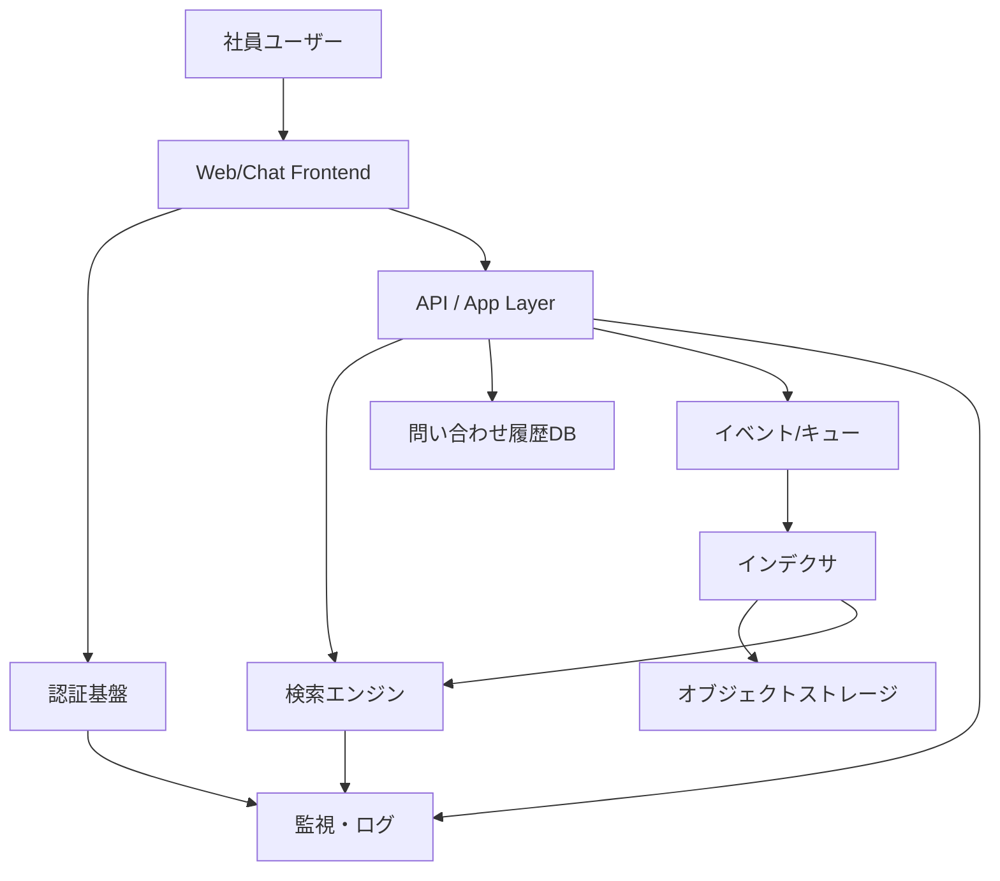

---
tags:
  - cloud
  - aws
  - oci
  - gcp
  - architecture
  - daily
---

[[Home]]

# Cloud Engineer Magazine — 2026-06-28

## 1) 今日のアプリ
**社内ナレッジ検索付き AI ヘルプデスク**

社員が Slack / Web ポータルから質問すると、社内 FAQ・運用手順書・製品マニュアルを検索し、回答候補を返すアプリを想定する。人手エスカレーション、回答ログ保存、アクセス制御付き。

---

## 2) 要件整理

### 機能要件
- 社員が Web / Chat から質問を送信できる
- ドキュメント検索（全文検索 + メタデータ絞り込み）ができる
- 回答案の生成前に、参照元ドキュメントを提示できる
- 未解決時は担当チームへエスカレーションできる
- 問い合わせ履歴・評価を保存できる

### 非機能要件
- **可用性**: 平日日中の利用集中に耐える。単一 AZ 障害では継続
- **性能**: 体感応答 2〜5 秒台を目標。検索は低レイテンシ
- **セキュリティ**: 社内文書の権限制御、暗号化、最小権限 IAM、監査ログ必須
- **コスト**: 初期は小さく始め、利用増加に応じて検索・推論・DB を段階拡張

---

## 3) 推奨アーキテクチャ（なぜその構成か）
**基本方針: 検索基盤 + API 層 + 認証 + 非同期取り込み + 監視**

- フロントはマネージドな静的ホスティング/CDNを使い、運用負荷を下げる
- API はサーバレスまたはマネージドコンテナで実装し、問い合わせ量に追従しやすくする
- ドキュメント原本はオブジェクトストレージに集約し、非同期でインデクシング
- 検索は専用のマネージド検索/検索エンジンを使い、メタデータや権限情報を持たせる
- 認証は企業 IdP 連携しやすいマネージド IAM / ID サービスを採用
- 監査ログ・アクセスログ・メトリクスを標準機能で集約

**なぜこの構成か**
- AI ヘルプデスクは「推論」より先に「正しい検索」が重要。まず RAG の検索品質を安定化しやすい構成を優先
- 文書更新はバースト的なので、イベント駆動でインデックス更新する方が効率的
- 問い合わせトラフィックは時間帯偏差があるため、常時大型 VM よりサーバレス/オートスケールが向く

---

## 4) クラウド別実装マップ

### AWS での実装サービス
- フロント: **Amazon CloudFront + Amazon S3**
- API: **Amazon API Gateway + AWS Lambda** もしくは **Amazon ECS on Fargate**
- 認証: **Amazon Cognito**（SAML/OIDC 連携）
- 文書保管: **Amazon S3**
- 検索: **Amazon OpenSearch Service**
- 非同期処理: **Amazon EventBridge / AWS Lambda / Amazon SQS**
- 監査・監視: **AWS CloudTrail / Amazon CloudWatch / AWS X-Ray**
- 秘密情報: **AWS Secrets Manager / AWS KMS**

**トレードオフ**
- Lambda は初期運用が軽いが、複雑なライブラリ依存や長時間処理は ECS/Fargate が楽
- OpenSearch は柔軟だが、検索チューニング運用は多少必要

### OCI での実装サービス
- フロント: **OCI Object Storage + Load Balancer / CDN**
- API: **OCI Functions** または **Container Instances / OKE**
- 認証: **OCI IAM**（必要に応じて外部 IdP 連携）
- 文書保管: **OCI Object Storage**
- 検索/分析基盤: **OCI Search with OpenSearch**
- 非同期処理: **OCI Events + OCI Functions + OCI Queue**
- 監査・監視: **OCI Audit / Monitoring / Logging / Application Performance Monitoring**
- 秘密情報: **OCI Vault / Key Management**

**トレードオフ**
- OCI Functions は軽量開始に向く
- OKE は柔軟だが、運用面では Functions / Container Instances より複雑

### GCP での実装サービス
- フロント: **Cloud Storage + Cloud CDN**
- API: **Cloud Run**
- 認証: **Identity Platform** または **Cloud Identity 連携**
- 文書保管: **Cloud Storage**
- 検索: **Vertex AI Search** または **AlloyDB / Elasticsearch系代替を別途設計**
- 非同期処理: **Eventarc / Pub/Sub / Cloud Run Jobs**
- 監査・監視: **Cloud Audit Logs / Cloud Monitoring / Cloud Logging / Trace**
- 秘密情報: **Secret Manager / Cloud KMS**

**トレードオフ**
- Cloud Run は HTTP API に非常に相性が良い
- Vertex AI Search は検索実装を早めやすいが、要件によってはインデックス制御の自由度確認が必要

---

## 5) システム構成図（Mermaidで簡易図）

---

## 6) データフロー / 認証・認可 / 監視運用の要点

### データフロー
1. 文書をオブジェクトストレージへ保存
2. 保存イベントで関数/ジョブが起動
3. メタデータ抽出・権限タグ付け後、検索インデックス更新
4. ユーザー質問を API が受信
5. ユーザー属性・所属に応じて検索フィルタ適用
6. 検索結果と参照元を返し、必要なら回答生成へ渡す
7. 問い合わせ履歴・評価を保存

### 認証・認可
- **認証**: SAML/OIDC で社内 IdP 連携
- **認可**: ドキュメントごとに部署・役割タグを付け、API 側と検索側の両方で強制
- **IAM**: API 実行ロール、インデクサロール、監視参照ロールを分離
- **秘密管理**: API キーや接続情報は Secrets Manager / Vault / Secret Manager に保管

### 監視運用
- 主要 KPI: 検索成功率、平均応答時間、0件ヒット率、エスカレーション率
- 技術監視: 5xx、関数エラー、キュー滞留、検索クラスタ負荷、認証失敗率
- 監査: 管理者操作、ポリシー変更、秘密情報アクセスを必ずログ化

---

## 7) コスト最適化ポイント（初期・成長期）

### 初期
- API はサーバレス優先
- 文書原本は低コストなオブジェクトストレージに集約
- 検索ノードは最小構成から開始
- ログ保持期間を明確化し、長期保管は安価な階層へ

### 成長期
- 問い合わせ API はコンテナ常駐化でコールドスタート回避
- 高頻度クエリをキャッシュ
- インデックスを部門単位や用途単位で分割し、検索コストを抑制
- 監視ログはサンプリングや集約ルールを見直す

---

## 8) 障害時の設計（DR / バックアップ / フェイルオーバー）
- オブジェクトストレージはバージョニング/ライフサイクル/必要に応じクロスリージョン複製
- 問い合わせ履歴 DB は自動バックアップ有効化
- 検索インデックスはスナップショット取得
- API 層はマルチ AZ / リージョン拡張可能な構成を前提に IaC 化
- DR 優先順位:
  1. 認証復旧
  2. 文書原本復旧
  3. インデックス再構築
  4. 問い合わせ履歴復旧
- 検索障害時は「FAQ のみ返す縮退モード」を持つと実務的

---

## 9) 学習ポイント（今日覚えるクラウド機能）
- **AWS**: API Gateway と Lambda を前段に置き、OpenSearch に安全に接続する責務分離
- **OCI**: Events + Functions + Search with OpenSearch でイベント駆動インデックス更新
- **GCP**: Cloud Run + Pub/Sub + Eventarc の組み合わせで疎結合 API を作る考え方

---

## 10) 30〜60分ミニ演習
**演習テーマ: 「社内FAQ検索 API の最小構成」を設計する**

### やること
1. AWS / OCI / GCP それぞれで以下を 1 つずつ選ぶ
   - フロント配信
   - API 実行基盤
   - 文書保管
   - 検索
   - 認証
2. 選定理由を 1 行で書く
3. 「文書アップロード → インデックス更新」のイベントフローを書く
4. IAM ロール/サービスアカウントを最低 3 種類に分ける

### ゴール
- 単にサービス名を覚えるのでなく、**責務分離**と**最小権限**の形で説明できること

---

## 11) 公式ドキュメント参照リンク（AWS/OCI/GCP）

### AWS
- CloudFront: https://docs.aws.amazon.com/AmazonCloudFront/latest/DeveloperGuide/Introduction.html
- S3: https://docs.aws.amazon.com/AmazonS3/latest/userguide/Welcome.html
- API Gateway: https://docs.aws.amazon.com/apigateway/latest/developerguide/welcome.html
- Lambda: https://docs.aws.amazon.com/lambda/latest/dg/welcome.html
- Cognito: https://docs.aws.amazon.com/cognito/latest/developerguide/what-is-amazon-cognito.html
- OpenSearch Service: https://docs.aws.amazon.com/opensearch-service/latest/developerguide/what-is.html
- EventBridge: https://docs.aws.amazon.com/eventbridge/latest/userguide/eb-what-is.html
- SQS: https://docs.aws.amazon.com/AWSSimpleQueueService/latest/SQSDeveloperGuide/welcome.html
- CloudWatch: https://docs.aws.amazon.com/AmazonCloudWatch/latest/monitoring/WhatIsCloudWatch.html
- CloudTrail: https://docs.aws.amazon.com/awscloudtrail/latest/userguide/cloudtrail-user-guide.html
- Secrets Manager: https://docs.aws.amazon.com/secretsmanager/latest/userguide/intro.html

### OCI
- Object Storage: https://docs.oracle.com/en-us/iaas/Content/Object/Concepts/objectstorageoverview.htm
- Load Balancer: https://docs.oracle.com/en-us/iaas/Content/Balance/Concepts/balanceoverview.htm
- Functions: https://docs.oracle.com/en-us/iaas/Content/Functions/Concepts/functionsoverview.htm
- Container Instances: https://docs.oracle.com/en-us/iaas/Content/container-instances/home.htm
- OKE: https://docs.oracle.com/en-us/iaas/Content/ContEng/home.htm
- IAM: https://docs.oracle.com/en-us/iaas/Content/Identity/home.htm
- Search with OpenSearch: https://docs.oracle.com/en-us/iaas/Content/search-opensearch/home.htm
- Events: https://docs.oracle.com/en-us/iaas/Content/Events/home.htm
- Queue: https://docs.oracle.com/en-us/iaas/Content/queue/home.htm
- Logging: https://docs.oracle.com/en-us/iaas/Content/Logging/home.htm
- Monitoring: https://docs.oracle.com/en-us/iaas/Content/Monitoring/home.htm
- Vault: https://docs.oracle.com/en-us/iaas/Content/KeyManagement/home.htm

### GCP
- Cloud Storage: https://docs.cloud.google.com/storage/docs
- Cloud CDN: https://docs.cloud.google.com/cdn/docs/overview
- Cloud Run: https://docs.cloud.google.com/run/docs/overview/what-is-cloud-run
- Pub/Sub: https://docs.cloud.google.com/pubsub/docs/overview
- Eventarc: https://docs.cloud.google.com/eventarc/docs/overview
- Secret Manager: https://docs.cloud.google.com/secret-manager/docs/overview
- Cloud KMS: https://docs.cloud.google.com/kms/docs
- Cloud Logging: https://docs.cloud.google.com/logging/docs
- Cloud Monitoring: https://docs.cloud.google.com/monitoring/docs
- Cloud Audit Logs: https://docs.cloud.google.com/logging/docs/audit
- Vertex AI Search: https://docs.cloud.google.com/generative-ai-app-builder/docs/enterprise-search-introduction

---

**ひとこと**: 今日のポイントは、AI アプリでもまずは検索・権限制御・監査を先に固めること。そこが弱いと、賢い回答より先に事故が起きる。
