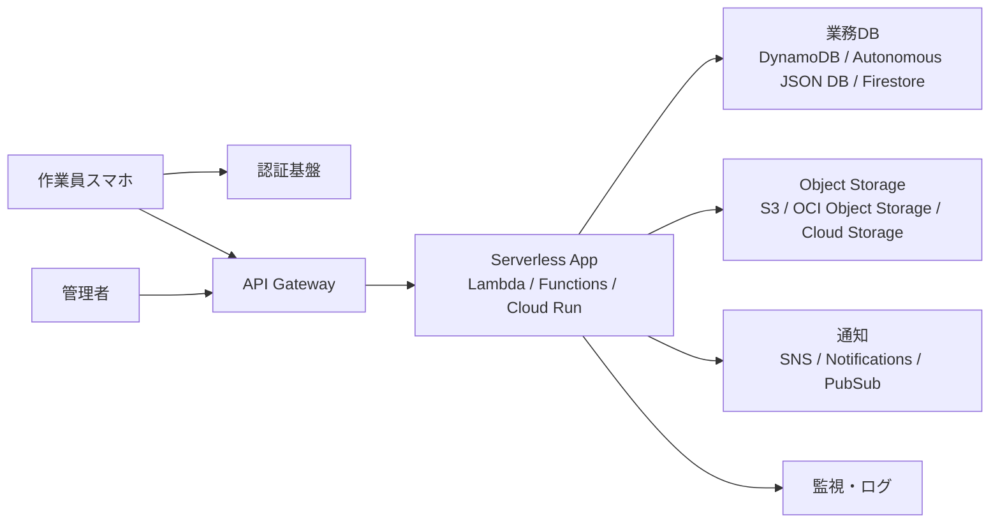

[[Home]]

#cloud #aws #oci #gcp #architecture #daily

# Cloud Engineer Magazine — 2026-06-29

## 今日のアプリ
**現場点検報告アプリ**

工場・ビル・設備保守の担当者が、スマホから点検結果・写真・位置情報・コメントを送信し、管理者が承認できるアプリを作る。

**今日の視点:** 3クラウド比較（同じ要件を AWS / OCI / GCP でどう組むか）

---

## 1) 要件整理

### 機能要件
- 作業員がログインして点検報告を作成
- 写真を複数枚アップロード
- 点検項目の入力（チェック、数値、コメント）
- 管理者による承認 / 差し戻し
- 点検履歴の検索
- 異常値なら通知

### 非機能要件
- **可用性:** 業務時間中は止めにくい。単一リージョンでもマネージドサービス中心で冗長化
- **性能:** 写真アップロード時の体感待ち時間を短くする
- **セキュリティ:** 認証必須、最小権限 IAM、監査ログ、保存時暗号化
- **コスト:** 初期はサーバレス中心、利用増加時に読み書きと画像配信を分離

---

## 2) 推奨アーキテクチャ（なぜその構成か）

**結論:**
- API は **マネージド Gateway + サーバレス実行基盤**
- 業務データは **NoSQL / JSON 指向 DB**
- 画像は **オブジェクトストレージ**
- 認証は **クラウドネイティブ IAM / ID サービス**
- 監視は **各クラウド標準のログ・メトリクス基盤**

**理由:**
- 点検報告は「大量画像 + 比較的単純な CRUD + 将来のモバイル拡張」が中心
- 初期フェーズで Kubernetes を持つより、サーバレスのほうが速く安く始めやすい
- 写真を DB に入れずオブジェクトストレージに分離すると、コスト・性能・バックアップ運用が楽

**トレードオフ:**
- サーバレスは初期最適だが、長時間処理や複雑バッチが増えるとコンテナ / ワーカー分離が必要
- NoSQL は柔軟だが、複雑 JOIN 分析が主目的なら OLTP RDB のほうが扱いやすい

---

## 3) クラウド別実装マップ

### AWS での実装サービス
- フロント API: **Amazon API Gateway**
- アプリ処理: **AWS Lambda**
- 点検データ: **Amazon DynamoDB**
- 写真保存: **Amazon S3**
- 認証: **Amazon Cognito**
- 通知: **Amazon SNS**
- 監視: **Amazon CloudWatch**
- 監査: **AWS CloudTrail**

**向いている理由:**
- モバイル/サーバレス構成の定番が揃っていて学習資産が多い
- DynamoDB + S3 の分離が自然

**注意点:**
- DynamoDB はアクセスパターン設計が先に必要
- Lambda のコールドスタートや同時実行制御は把握しておく

### OCI での実装サービス
- フロント API: **OCI API Gateway**
- アプリ処理: **OCI Functions**
- 点検データ: **Autonomous JSON Database**
- 写真保存: **OCI Object Storage**
- 認証・認可: **OCI IAM**
- 通知: **OCI Notifications**
- 監視/ログ: **OCI Monitoring / Logging**
- 監査: **OCI Audit**

**向いている理由:**
- JSON ドキュメント中心のアプリを Autonomous JSON Database で比較的素直に作れる
- API Gateway と Functions の接続が分かりやすい

**注意点:**
- アプリ認証を B2C 的に大きく広げる場合は外部 IdP 連携方針を早めに決めたい
- チーム内で OCI 運用経験が薄いと IAM/ネットワーク用語に慣れが必要

### GCP での実装サービス
- フロント API: **API Gateway**
- アプリ処理: **Cloud Run**
- 点検データ: **Cloud Firestore**
- 写真保存: **Cloud Storage**
- 認証: **Identity Platform**
- 通知: **Pub/Sub**（異常検知イベント連携）
- 監視: **Cloud Monitoring / Cloud Logging**
- 監査: **Cloud Audit Logs**

**向いている理由:**
- Cloud Run は HTTP アプリを素直に載せやすい
- Firestore はモバイル/ドキュメント指向と相性が良い

**注意点:**
- Firestore はクエリ制約とインデックス設計を意識する
- Cloud Run はコンテナ責務が増えるぶん、Lambda/FaaS より実装自由度が高い

---

## 4) システム構成図（Mermaid）

---

## 5) データフロー / 認証・認可 / 監視運用の要点

### データフロー
1. 作業員が認証
2. API で点検レコードを作成
3. 写真はアプリ経由または署名付き URL 方式でオブジェクトストレージへ保存
4. 点検レコードに写真 URL / オブジェクトキーを記録
5. 異常値なら通知イベントを発火
6. 管理者が承認するとステータス更新

### 認証・認可
- 一般ユーザーと管理者のロールを分離
- API ごとに **least privilege**
- 実行基盤から DB / Storage への権限は最小限
- 署名付き URL を使う場合は短寿命にする
- 監査ログを有効化し、誰が承認したか追跡可能にする

### 監視運用
- API 4xx/5xx、レイテンシ、関数エラー率を監視
- 画像アップロード失敗率を KPI 化
- 通知失敗、承認滞留件数も運用指標に含める
- 本番では構造化ログ（reportId, userId, siteId）を入れる

---

## 6) コスト最適化ポイント（初期・成長期）

### 初期
- サーバレス中心で常時稼働 VM を持たない
- 画像はライフサイクル管理で低頻度アクセス層へ移行
- 開発/検証環境は小さく分離

### 成長期
- API と画像配信を分離し、キャッシュ/CDN 導入を検討
- 書き込み急増時は DB のパーティション / インデックス設計を見直す
- 非同期処理（サムネイル生成、AI 判定）はイベント駆動へ分離

**一言トレードオフ:**
- 早期は「全部マネージド」でよい
- 利用増加後は「同期処理を減らす」ほうがコストにも性能にも効く

---

## 7) 障害時の設計（DR / バックアップ / フェイルオーバー）

- オブジェクトストレージはバージョニング/保護機能を有効化
- DB は自動バックアップと PITR 相当機能を確認
- 重要テーブル/コレクションは削除保護を検討
- 単一リージョン開始でも、将来のクロスリージョン設計方針を決めておく
- 障害時は「アップロード後に DB 書き込み失敗」などの不整合対策として再実行可能設計にする

**現実的な方針:**
- 初期: バックアップ + 冪等 API で守る
- 成長後: マルチリージョン / セカンダリ待機を検討

---

## 8) 学習ポイント（今日覚えるクラウド機能）

- **AWS:** API Gateway + Lambda + DynamoDB のサーバレス CRUD パターン
- **OCI:** API Gateway から Functions を呼び、JSON 指向 DB へつなぐ構成
- **GCP:** API Gateway + Cloud Run の HTTP バックエンド構成
- **共通:** 認証とアプリ権限を分離し、画像はオブジェクトストレージへ逃がす

---

## 9) 30〜60分ミニ演習

### 演習テーマ
「点検報告を 1 件登録する API を設計する」

### やること
1. `POST /reports` の JSON を設計
2. 必須項目を決める（siteId, inspectorId, checkedAt, status）
3. 写真保存を「DB 直保存」ではなく「オブジェクトストレージ保存 + キー記録」にする理由を書く
4. 次の 3 パターンのサービス対応表を自分で埋める
   - AWS
   - OCI
   - GCP
5. エラーケースを 3 つ書く
   - 認証失敗
   - 写真アップロード失敗
   - DB 更新失敗

### ゴール
- クラウドが違っても、**API / 実行基盤 / DB / Storage / Auth / Monitoring** の6層で見れば整理できる、と理解すること

---

## 10) 公式ドキュメント参照リンク（AWS / OCI / GCP）

### AWS
- API Gateway: https://docs.aws.amazon.com/apigateway/
- Lambda と API Gateway のチュートリアル: https://docs.aws.amazon.com/lambda/latest/dg/services-apigateway-tutorial.html
- DynamoDB: https://docs.aws.amazon.com/dynamodb/
- S3: https://docs.aws.amazon.com/s3/
- Cognito: https://docs.aws.amazon.com/cognito/
- CloudWatch: https://docs.aws.amazon.com/cloudwatch/
- CloudTrail: https://docs.aws.amazon.com/cloudtrail/

### OCI
- OCI Documentation Home: https://docs.oracle.com/en-us/iaas/Content/home.htm
- API Gateway 概要: https://docs.oracle.com/en-us/iaas/Content/APIGateway/Concepts/apigatewayoverview.htm
- API Gateway から Functions 呼び出し: https://docs.oracle.com/en-us/iaas/Content/APIGateway/Tasks/apigatewayusingfunctionsbackend.htm
- Functions チュートリアル: https://docs.oracle.com/en-us/iaas/developer-tutorials/tutorials/functions/func-api-gtw/01-summary.htm
- Object Storage: https://docs.oracle.com/en-us/iaas/Content/Object/Concepts/objectstorageoverview.htm
- IAM: https://docs.oracle.com/en-us/iaas/Content/Identity/home.htm
- Logging: https://docs.oracle.com/en-us/iaas/Content/Logging/home.htm
- Monitoring: https://docs.oracle.com/en-us/iaas/Content/Monitoring/home.htm
- Audit: https://docs.oracle.com/en-us/iaas/Content/Audit/home.htm

### GCP
- Google Cloud Documentation Home: https://docs.cloud.google.com/docs
- API Gateway: https://docs.cloud.google.com/api-gateway/docs
- API Gateway + Cloud Run: https://docs.cloud.google.com/api-gateway/docs/get-started-cloud-run
- Cloud Run: https://docs.cloud.google.com/run/docs
- Firestore: https://docs.cloud.google.com/firestore/docs
- Cloud Storage: https://docs.cloud.google.com/storage/docs
- Identity Platform: https://docs.cloud.google.com/identity-platform/docs
- Cloud Monitoring: https://docs.cloud.google.com/monitoring/docs
- Cloud Logging: https://docs.cloud.google.com/logging/docs
- Cloud Audit Logs: https://docs.cloud.google.com/logging/docs/audit

---

## 11) 今日のひとこと
この手の業務アプリは、最初に Kubernetes を持つより、**サーバレス + オブジェクトストレージ + マネージド認証** で始めたほうが失敗しにくい。まずは「写真と業務データを分ける設計」を身体で覚えるのが勝ち筋。