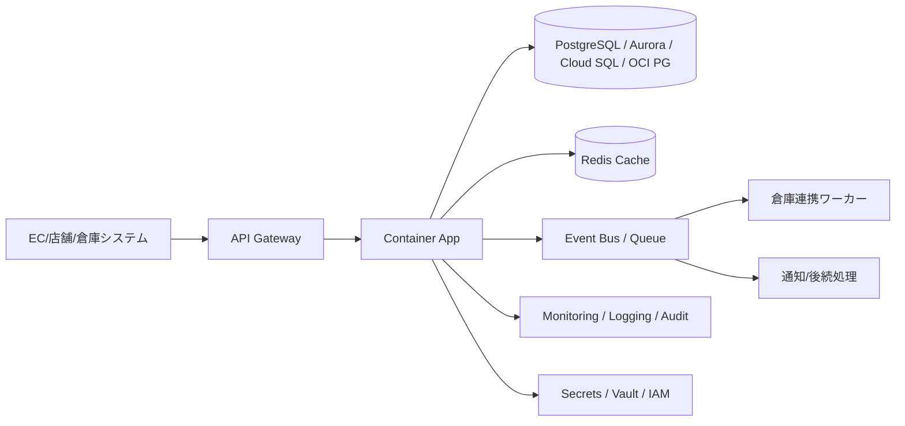

---
tags:
  - cloud
  - aws
  - oci
  - gcp
  - architecture
  - daily
---

[[Home]]

# 2026-06-30 10-15 Cloud Engineer Magazine

## 1) 今日のアプリ
**社内向けリアルタイム在庫引当アプリ**

EC・店舗・倉庫から同時に在庫を引き当て、在庫不足や二重販売を防ぐアプリを想定する。今日は**トランザクション整合性と低遅延API**を主題に、AWS / OCI / GCP でどう組むかを比較する。

---

## 2) 要件整理

### 機能要件
- 商品検索、在庫照会
- 注文時の在庫引当
- 引当成功/失敗の即時返却
- 倉庫システムからの入出庫反映
- 管理者向け在庫調整API

### 非機能要件
- **可用性:** 営業時間中は停止を避ける。単一AZ/単一障害点を作らない
- **性能:** 在庫照会は低遅延、引当APIは高同時実行でも整合性を崩さない
- **セキュリティ:** IAM最小権限、API認証、DB暗号化、監査ログ必須
- **コスト:** 初期はマネージド中心、成長期はキャッシュ/イベント分離で効率化

---

## 3) 推奨アーキテクチャ
**推奨:** API Gateway + コンテナ実行基盤 + トランザクション対応DB + 非同期イベント連携 + Redisキャッシュ

### なぜこの構成か
- **在庫引当**は整合性が重要なので、最終的な在庫確定は**RDBのトランザクション**に寄せる
- **在庫照会**は読取が多いため、**Redisキャッシュ**でDB負荷を減らす
- 倉庫反映・通知・分析は**イベント駆動**で分離し、同期APIを軽くする
- コンテナ基盤を使うと、業務ロジックをクラウド横断で移植しやすい

### トレードオフ
- **サーバーレス関数中心**は小規模には速いが、在庫引当の複雑な接続管理や長めの業務ロジックではコンテナの方が制御しやすい
- **NoSQL単独**はスケールしやすいが、在庫引当の厳密整合性はRDBの方が設計しやすい

---

## 4) クラウド別実装マップ

### AWS での実装サービス
- **API公開:** Amazon API Gateway
- **アプリ実行:** Amazon ECS on Fargate
- **在庫DB:** Amazon Aurora PostgreSQL
- **キャッシュ:** Amazon ElastiCache for Redis
- **非同期連携:** Amazon EventBridge / Amazon SQS
- **認証:** AWS IAM + Amazon Cognito（管理画面がある場合）
- **監視:** Amazon CloudWatch / AWS CloudTrail
- **秘密情報:** AWS Secrets Manager

**向いている理由:** Fargate + Aurora の組み合わせが運用しやすく、EventBridge で周辺連携を疎結合にしやすい。

### OCI での実装サービス
- **API公開:** OCI API Gateway
- **アプリ実行:** OCI Container Instances または OKE
- **在庫DB:** OCI PostgreSQL または Autonomous Database（トランザクション用途ならPostgreSQL寄り）
- **キャッシュ:** OCI Cache with Redis
- **非同期連携:** OCI Queue / OCI Streaming
- **認証:** OCI IAM
- **監視:** OCI Monitoring / Logging / Audit
- **秘密情報:** OCI Vault

**向いている理由:** API Gateway、Redis、Vault、Audit まで一貫して揃えやすく、シンプルな業務APIを堅実に組める。

### GCP での実装サービス
- **API公開:** API Gateway
- **アプリ実行:** Cloud Run
- **在庫DB:** Cloud SQL for PostgreSQL
- **キャッシュ:** Memorystore for Redis
- **非同期連携:** Pub/Sub + Cloud Tasks
- **認証:** IAM / Identity-Aware Proxy（社内管理画面向け候補）
- **監視:** Cloud Monitoring / Cloud Logging / Cloud Audit Logs
- **秘密情報:** Secret Manager

**向いている理由:** Cloud Run のスケーリングが速く、Pub/Sub で周辺処理を分離しやすい。少人数チームでも始めやすい。

---

## 5) システム構成図

---

## 6) データフロー / 認証・認可 / 監視運用の要点

### データフロー
1. クライアントが商品在庫を照会
2. アプリは Redis を確認、なければ RDB から取得してキャッシュ
3. 注文時はアプリが RDB トランザクションで在庫を引当
4. 成功後にイベントを発行し、通知・倉庫更新・分析連携へ非同期展開

### 認証・認可
- 外部/社内クライアントは API Gateway で認証
- 管理APIは一般APIと分離し、IAMロールやユーザー属性で権限を分ける
- アプリからDB・キュー・秘密情報へのアクセスは**最小権限IAM**
- DB資格情報は Secrets Manager / Vault / Secret Manager に保存し、コード埋め込み禁止

### 監視運用
- APIの p95/p99 レイテンシ監視
- 在庫引当失敗率、DB接続数、Redisヒット率、キュー滞留数を監視
- 監査ログは必ず有効化し、権限変更と秘密情報アクセスを追跡

---

## 7) コスト最適化ポイント

### 初期
- コンテナは最小サイズから開始
- Redis は小さく始め、まずは在庫照会だけキャッシュ
- 分析基盤を別に作り込まず、まずはアプリDB + ログ分析で十分

### 成長期
- 読取集中商品を Redis に寄せる
- 非同期化を進めてAPIインスタンス数を抑える
- DBはリードレプリカや接続プーリングを検討
- Cloud Run / Fargate / Container Instances はアイドル時間の少なさを活かす

---

## 8) 障害時の設計

- **DB障害:** 自動バックアップ、有効な PITR、マルチAZ/高可用構成を使う
- **キャッシュ障害:** Redis が落ちても RDB にフォールバック可能にする
- **キュー障害:** 冪等な再処理を前提にし、DLQ を用意
- **リージョン障害:** 初期はバックアップ復旧中心、成長後はリージョン間DRを設計
- **フェイルオーバー:** RDB のマネージドHA機能を優先利用し、自前切替ロジックを減らす

---

## 9) 学習ポイント
- **AWS:** EventBridge は疎結合なイベント配信に向く。SQS は確実な非同期処理に向く
- **OCI:** API Gateway + Vault + Audit の組み合わせで secure-by-default を作りやすい
- **GCP:** Cloud Run はコンテナ運用負荷を下げつつオートスケールしやすい

**今日覚える機能:**
- API Gateway で認証を前段に寄せる
- Redis は「整合性の源泉」ではなく「高速読取の補助」に使う
- 在庫引当の真実はトランザクションDBに置く

---

## 10) 30〜60分ミニ演習
1. 1つのクラウドを選ぶ
2. 以下の構成を図に起こす
   - API Gateway
   - アプリ実行基盤
   - PostgreSQL
   - Redis
   - Queue / Event
3. 「在庫照会API」と「在庫引当API」の2本だけ設計する
4. IAMロールを3つに分ける
   - アプリ実行ロール
   - 運用者ロール
   - CI/CDロール
5. 最後に「Redisが落ちたらどうするか」を3行で書く

---

## 11) 公式ドキュメント参照リンク

### AWS
- API Gateway: https://docs.aws.amazon.com/apigateway/
- Amazon ECS: https://docs.aws.amazon.com/ecs/
- AWS Fargate: https://docs.aws.amazon.com/AmazonECS/latest/developerguide/AWS_Fargate.html
- Amazon Aurora: https://docs.aws.amazon.com/aurora/
- ElastiCache for Redis: https://docs.aws.amazon.com/AmazonElastiCache/latest/red-ug/WhatIs.html
- Amazon EventBridge: https://docs.aws.amazon.com/eventbridge/
- Amazon SQS: https://docs.aws.amazon.com/AWSSimpleQueueService/
- AWS Secrets Manager: https://docs.aws.amazon.com/secretsmanager/
- AWS CloudWatch: https://docs.aws.amazon.com/cloudwatch/
- AWS CloudTrail: https://docs.aws.amazon.com/cloudtrail/

### OCI
- API Gateway: https://docs.oracle.com/en-us/iaas/Content/APIGateway/home.htm
- Container Instances: https://docs.oracle.com/en-us/iaas/Content/container-instances/home.htm
- Oracle Kubernetes Engine (OKE): https://docs.oracle.com/en-us/iaas/Content/ContEng/home.htm
- PostgreSQL: https://docs.oracle.com/en-us/iaas/postgresql/home.htm
- Cache with Redis: https://docs.oracle.com/en-us/iaas/Content/Redis/home.htm
- Queue: https://docs.oracle.com/en-us/iaas/Content/queue/home.htm
- Streaming: https://docs.oracle.com/en-us/iaas/Content/Streaming/home.htm
- Vault: https://docs.oracle.com/en-us/iaas/Content/KeyManagement/home.htm
- Monitoring: https://docs.oracle.com/en-us/iaas/Content/Monitoring/home.htm
- Logging: https://docs.oracle.com/en-us/iaas/Content/Logging/home.htm
- Audit: https://docs.oracle.com/en-us/iaas/Content/Audit/home.htm
- IAM: https://docs.oracle.com/en-us/iaas/Content/Identity/home.htm

### GCP
- API Gateway: https://docs.cloud.google.com/api-gateway/docs
- Cloud Run: https://docs.cloud.google.com/run/docs
- Cloud SQL for PostgreSQL: https://docs.cloud.google.com/sql/docs/postgres
- Memorystore for Redis: https://docs.cloud.google.com/memorystore/docs/redis
- Pub/Sub: https://docs.cloud.google.com/pubsub/docs
- Cloud Tasks: https://docs.cloud.google.com/tasks/docs
- Secret Manager: https://docs.cloud.google.com/secret-manager/docs
- Cloud Monitoring: https://docs.cloud.google.com/monitoring/docs
- Cloud Logging: https://docs.cloud.google.com/logging/docs
- Cloud Audit Logs: https://docs.cloud.google.com/logging/docs/audit
- IAM: https://docs.cloud.google.com/iam/docs

---

## ひとこと
在庫系は「速さ」より**整合性の置き場所**が先。まずDBトランザクションで正しさを守り、その上でキャッシュとイベントでスケールさせるのが王道。
