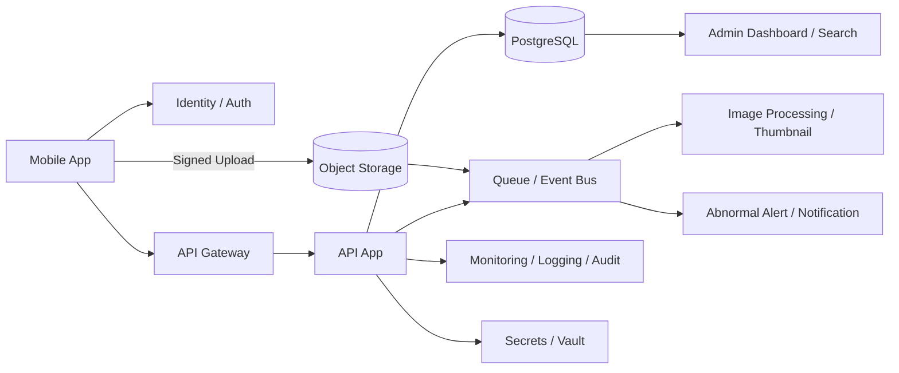

---
tags:
  - cloud
  - aws
  - oci
  - gcp
  - architecture
  - daily
---

[[Home]]

# 2026-07-01 10-15 Cloud Engineer Magazine

## 1) 今日のアプリ
**現場作業員向けフィールド点検報告アプリ**

設備保守・工場巡回・ビル管理を想定し、スマホから点検結果、写真、位置情報、異常報告を送るアプリを設計する。今日は**オフライン対応、画像アップロード、監査証跡、現場ごとの細かい権限制御**を主題に、AWS / OCI / GCP で実装マップを比較する。

---

## 2) 要件整理

### 機能要件
- 点検チェックリストの取得
- 点検結果の登録（テキスト、数値、写真、位置情報）
- オフライン時の一時保存と再送
- 異常報告の即時通知
- 管理者向けダッシュボードと検索

### 非機能要件
- **可用性:** 現場で継続利用できること。API単一障害点を避ける
- **性能:** 点検一覧表示は軽く、画像アップロードは非同期で詰まらせない
- **セキュリティ:** 作業員・管理者の権限分離、監査ログ、保存データ暗号化
- **コスト:** 初期はサーバーレス寄りで小さく始め、画像・通知・分析は必要に応じて拡張

---

## 3) 推奨アーキテクチャ
**推奨:** API Gateway + コンテナ/サーバーレスAPI + トランザクションDB + オブジェクトストレージ + 非同期キュー + ID基盤

### なぜその構成か
- 点検結果そのものは**検索性と整合性**が必要なので、メタデータは RDB に置く
- 写真はDBに入れず、**オブジェクトストレージ**に保存してコストと拡張性を確保する
- モバイル端末からの重い画像送信は、**署名付きアップロード**や一時URLでアプリAPIから分離すると詰まりにくい
- 異常報告通知、画像サムネイル生成、集計更新は**非同期イベント**に逃がす
- 認証はIDサービス、認可はIAM/アプリロールで二層化すると運用しやすい

### トレードオフ
- **関数中心**は初期構築が速いが、複雑な業務ロジックや接続制御が増えるとコンテナAPIの方が整理しやすい
- **NoSQL中心**はモバイル同期に向く場面もあるが、点検履歴の検索・集計・監査を考えるとRDBの方が説明しやすい
- **直接ストレージアップロード**は効率的だが、期限付きURL発行やアップロード後検証をちゃんと設計しないと危ない

---

## 4) クラウド別実装マップ

### AWS での実装サービス
- **API公開:** Amazon API Gateway
- **アプリ実行:** AWS Lambda または Amazon ECS on Fargate
- **点検DB:** Amazon Aurora PostgreSQL
- **画像保存:** Amazon S3
- **非同期連携:** Amazon SQS + Amazon EventBridge
- **認証:** Amazon Cognito
- **監視:** Amazon CloudWatch / AWS CloudTrail
- **秘密情報:** AWS Secrets Manager
- **通知:** Amazon SNS

**向いている理由:** S3、Cognito、SQS の組み合わせがモバイル業務アプリと相性がよく、署名付きアップロードやイベント処理も組みやすい。

### OCI での実装サービス
- **API公開:** OCI API Gateway
- **アプリ実行:** OCI Functions または OCI Container Instances
- **点検DB:** OCI PostgreSQL
- **画像保存:** OCI Object Storage
- **非同期連携:** OCI Queue / OCI Streaming
- **認証:** OCI IAM Identity Domains
- **監視:** OCI Monitoring / Logging / Audit
- **秘密情報:** OCI Vault
- **通知:** OCI Notifications

**向いている理由:** Object Storage、Vault、Audit、Identity Domains を組み合わせると、監査性の高い業務アプリを比較的素直に構成できる。

### GCP での実装サービス
- **API公開:** API Gateway
- **アプリ実行:** Cloud Run
- **点検DB:** Cloud SQL for PostgreSQL
- **画像保存:** Cloud Storage
- **非同期連携:** Pub/Sub + Cloud Tasks
- **認証:** Identity Platform または IAM ベース保護
- **監視:** Cloud Monitoring / Cloud Logging / Cloud Audit Logs
- **秘密情報:** Secret Manager
- **通知:** Firebase Cloud Messaging（モバイル通知設計時の候補）

**向いている理由:** Cloud Run と Cloud Storage の運用負荷が低く、Pub/Sub で画像後処理や通知を切り分けやすい。

---

## 5) システム構成図

---

## 6) データフロー / 認証・認可 / 監視運用の要点

### データフロー
1. 作業員がログインして担当現場のチェックリストを取得
2. 点検結果は端末内に一時保存でき、オンライン復帰時にAPIへ再送
3. APIは点検メタデータをDBへ保存し、画像アップロード用の一時URLを発行
4. モバイルは画像をオブジェクトストレージへ直接送信
5. アップロード完了イベントでサムネイル生成、異常通知、検索インデックス更新を非同期処理

### 認証・認可
- モバイル利用者認証は Cognito / Identity Domains / Identity Platform などのID基盤を使う
- 作業員、現場責任者、運用管理者でロールを分ける
- API は「自分の担当現場だけ参照/更新可能」にするABAC/RBAC設計を取る
- ストレージは公開禁止、アップロード/ダウンロードは期限付きURLで限定
- アプリ実行ロールは DB・キュー・ストレージ・秘密情報への最小権限だけ付与

### 監視運用
- APIエラー率、画像アップロード失敗率、キュー滞留、DB接続数、通知失敗数を監視
- 認証失敗急増、権限変更、Vault/Secret参照、監査ログ停止は即アラート
- モバイル再送件数を観測すると、現場の回線問題やUX問題を見つけやすい

---

## 7) コスト最適化ポイント

### 初期
- APIは Lambda / Functions / Cloud Run など従量課金寄りで開始
- DBは最小構成から始め、画像はオブジェクトストレージに分離
- サムネイルや通知は同期処理に入れず、イベント駆動で必要時だけ実行

### 成長期
- 画像保存はライフサイクル管理で低コスト階層へ移行
- APIのホットパスだけコンテナ常時稼働へ寄せ、他はサーバーレス継続
- 検索需要が増えたら専用検索基盤や分析基盤を追加し、DBへの全文検索集中を避ける
- モバイル配布対象が増えるなら通知やCDN利用を見直す

---

## 8) 障害時の設計

- **DB障害:** 自動バックアップ、PITR、HA構成を有効化。点検結果は冪等キーで再送可能にする
- **ストレージ障害:** アップロード失敗時は端末キューへ戻し、再送可能にする
- **キュー障害:** DLQ を持たせ、画像後処理や通知を再実行できるようにする
- **認証基盤障害:** 短時間の再試行方針と、既ログイン端末のトークン寿命設計を確認する
- **リージョン障害:** 初期はバックアップ復旧中心、重要度が高まればストレージ複製とDR手順を文書化する
- **フェイルオーバー:** 画像処理や通知は後回しにできても、点検結果登録APIを優先復旧対象にする

---

## 9) 学習ポイント
- **AWS:** S3 の署名付きURLと SQS/EventBridge の組み合わせで、重いファイル処理をAPI本体から外せる
- **OCI:** Object Storage + Queue + Audit + Vault で、業務証跡と保護の筋が通しやすい
- **GCP:** Cloud Run + Cloud Storage + Pub/Sub は小規模チームでも拡張しやすい構成

**今日覚える機能:**
- 写真はRDBではなくオブジェクトストレージへ置く
- モバイルの重いアップロードはAPIと分離する
- 認可は「ログインしているか」だけでなく「どの現場に触れてよいか」まで設計する

---

## 10) 30〜60分ミニ演習
1. 1つのクラウドを選ぶ
2. 次の構成を紙かMermaidで書く
   - API Gateway
   - API実行基盤
   - PostgreSQL
   - Object Storage
   - Queue / Event
   - ID基盤
3. 「点検登録API」と「画像アップロードフロー」を2本だけ設計する
4. IAM/ロールを4つに分ける
   - モバイル利用者
   - API実行ロール
   - 運用者
   - CI/CD
5. 最後に「オフラインから再送された重複登録をどう防ぐか」を3行で書く

---

## 11) 公式ドキュメント参照リンク

### AWS
- API Gateway: https://docs.aws.amazon.com/apigateway/
- AWS Lambda: https://docs.aws.amazon.com/lambda/
- Amazon ECS: https://docs.aws.amazon.com/ecs/
- AWS Fargate: https://docs.aws.amazon.com/AmazonECS/latest/developerguide/AWS_Fargate.html
- Amazon Aurora: https://docs.aws.amazon.com/aurora/
- Amazon S3: https://docs.aws.amazon.com/AmazonS3/latest/userguide/Welcome.html
- Amazon SQS: https://docs.aws.amazon.com/AWSSimpleQueueService/
- Amazon EventBridge: https://docs.aws.amazon.com/eventbridge/
- Amazon Cognito: https://docs.aws.amazon.com/cognito/
- AWS Secrets Manager: https://docs.aws.amazon.com/secretsmanager/
- Amazon CloudWatch: https://docs.aws.amazon.com/cloudwatch/
- AWS CloudTrail: https://docs.aws.amazon.com/cloudtrail/
- Amazon SNS: https://docs.aws.amazon.com/sns/

### OCI
- API Gateway: https://docs.oracle.com/en-us/iaas/Content/APIGateway/home.htm
- Functions: https://docs.oracle.com/en-us/iaas/Content/Functions/home.htm
- Container Instances: https://docs.oracle.com/en-us/iaas/Content/container-instances/home.htm
- PostgreSQL: https://docs.oracle.com/en-us/iaas/postgresql/home.htm
- Object Storage: https://docs.oracle.com/en-us/iaas/Content/Object/Concepts/objectstorageoverview.htm
- Queue: https://docs.oracle.com/en-us/iaas/Content/queue/home.htm
- Streaming: https://docs.oracle.com/en-us/iaas/Content/Streaming/home.htm
- Identity and Access Management: https://docs.oracle.com/en-us/iaas/Content/Identity/home.htm
- Identity Domains: https://docs.oracle.com/en-us/iaas/Content/Identity/domains/to_manage_identity_domains.htm
- Vault: https://docs.oracle.com/en-us/iaas/Content/KeyManagement/home.htm
- Monitoring: https://docs.oracle.com/en-us/iaas/Content/Monitoring/home.htm
- Logging: https://docs.oracle.com/en-us/iaas/Content/Logging/home.htm
- Audit: https://docs.oracle.com/en-us/iaas/Content/Audit/home.htm
- Notifications: https://docs.oracle.com/en-us/iaas/Content/Notification/home.htm

### GCP
- API Gateway: https://docs.cloud.google.com/api-gateway/docs
- Cloud Run: https://docs.cloud.google.com/run/docs
- Cloud SQL for PostgreSQL: https://docs.cloud.google.com/sql/docs/postgres
- Cloud Storage: https://docs.cloud.google.com/storage/docs
- Pub/Sub: https://docs.cloud.google.com/pubsub/docs
- Cloud Tasks: https://docs.cloud.google.com/tasks/docs
- Identity Platform: https://docs.cloud.google.com/identity-platform/docs
- Secret Manager: https://docs.cloud.google.com/secret-manager/docs
- Cloud Monitoring: https://docs.cloud.google.com/monitoring/docs
- Cloud Logging: https://docs.cloud.google.com/logging/docs
- Cloud Audit Logs: https://docs.cloud.google.com/logging/docs/audit

---

## ひとこと
モバイル現場アプリは、APIよりも**アップロード経路・再送設計・権限制御**で差が出る。業務データはRDB、重いファイルはオブジェクトストレージ、後処理は非同期、がまず堅い。