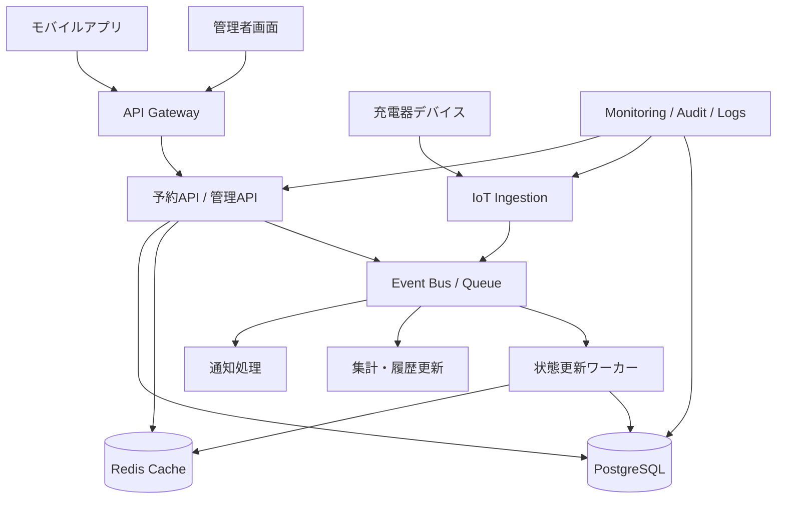

---
tags:
  - cloud
  - aws
  - oci
  - gcp
  - architecture
  - daily
---

[[Home]]

# 2026-07-02 10-15 Cloud Engineer Magazine

## 1) 今日のアプリ
**EV充電ステーション予約・稼働監視アプリ**

ユーザーがスマホから充電器を検索・予約し、現地では充電器の状態（空き/使用中/障害）をリアルタイム確認できるアプリを設計する。今日は **予約整合性、IoT状態連携、通知、マルチリージョンDR** を主題に、AWS / OCI / GCP の実装マップを整理する。

---

## 2) 要件整理

### 機能要件
- 充電ステーション検索（位置・空き状況・出力・料金）
- 充電枠の予約、キャンセル、開始/終了
- 充電器からの稼働状態・障害イベント受信
- 予約前通知、利用開始通知、障害通知
- 管理者向けの稼働率・障害一覧・監査ログ閲覧

### 非機能要件
- **可用性:** 予約APIと状態表示APIは高可用。単一AZ障害で停止しない
- **性能:** 空き状況表示は秒〜十数秒単位で更新、予約確定は低遅延
- **セキュリティ:** 利用者/運営者/保守員の権限分離、端末・デバイス認証、保存データ暗号化
- **コスト:** 初期はサーバーレス/マネージド中心、成長時に読み取り負荷とIoTイベントを分離拡張

---

## 3) 推奨アーキテクチャ
**推奨:** API Gateway + アプリ実行基盤 + トランザクションDB + キャッシュ + IoTイベント基盤 + 通知

### なぜその構成か
- 予約は**二重予約防止**が重要なので、在庫的な整合性を持たせやすい **PostgreSQL系RDB** を中核に置く
- 充電器状態は更新頻度が高いため、予約DBに直接ぶつけず **イベント取り込み + キャッシュ/派生テーブル** に分離する
- モバイル利用者の検索/表示は読み取り中心なので、空き状況APIはキャッシュで吸収すると安定する
- 通知、利用履歴集計、障害チケット起票は **非同期キュー/イベント** に逃がすと本線APIが軽くなる
- 認証はエンドユーザーID基盤、デバイスはIoT証明書/サービス認証で分けると least privilege を実装しやすい

### トレードオフ
- **全部RDBで処理**すると実装は単純だが、IoTイベント増加で予約系ワークロードに干渉しやすい
- **NoSQL中心**は水平拡張しやすいが、予約の排他・キャンセル待ち・課金確定の整合性説明が少し難しい
- **WebSocket常時配信**は見栄えが良いが、実運用では 5〜15 秒更新 + キャッシュでも十分な場面が多い

---

## 4) クラウド別実装マップ

### AWS での実装サービス
- **API公開:** Amazon API Gateway
- **アプリ実行:** AWS Lambda または Amazon ECS on Fargate
- **予約DB:** Amazon Aurora PostgreSQL
- **状態キャッシュ:** Amazon ElastiCache for Redis
- **IoT受信:** AWS IoT Core
- **非同期連携:** Amazon EventBridge + Amazon SQS
- **認証:** Amazon Cognito
- **監視/監査:** Amazon CloudWatch / AWS CloudTrail
- **秘密情報:** AWS Secrets Manager
- **通知:** Amazon SNS

**向いている理由:** IoT Core と EventBridge を中心に、デバイスイベントと業務イベントを分けて扱いやすい。Aurora + Redis で予約整合性と高速参照の役割分担もしやすい。

### OCI での実装サービス
- **API公開:** OCI API Gateway
- **アプリ実行:** OCI Functions または OCI Container Instances
- **予約DB:** OCI PostgreSQL
- **状態キャッシュ:** OCI Cache with Redis
- **IoT/イベント受信:** 充電器側から OCI Streaming へ取り込み、必要に応じて Functions で処理
- **非同期連携:** OCI Queue / OCI Streaming
- **認証:** OCI IAM Identity Domains
- **監視/監査:** OCI Monitoring / Logging / Audit
- **秘密情報:** OCI Vault
- **通知:** OCI Notifications

**向いている理由:** OCI は API Gateway、PostgreSQL、Redis、Streaming の組み合わせで、比較的素直にイベント駆動の業務アプリを組める。Identity Domains と Vault を使うと運用権限も整理しやすい。

### GCP での実装サービス
- **API公開:** API Gateway
- **アプリ実行:** Cloud Run
- **予約DB:** Cloud SQL for PostgreSQL
- **状態キャッシュ:** Memorystore for Redis
- **IoT/イベント受信:** Pub/Sub（デバイスゲートウェイや中継サービス経由）
- **非同期連携:** Pub/Sub + Cloud Tasks
- **認証:** Identity Platform または IAM + アプリ認証
- **監視/監査:** Cloud Monitoring / Cloud Logging / Cloud Audit Logs
- **秘密情報:** Secret Manager
- **通知:** Firebase Cloud Messaging 連携または外部通知基盤

**向いている理由:** Cloud Run と Pub/Sub の相性が良く、予約APIとイベント処理を分離しやすい。Cloud Tasks を使うと再試行制御付きの業務処理を実装しやすい。

---

## 5) システム構成図（Mermaid）

---

## 6) データフロー / 認証・認可 / 監視運用の要点

### データフロー
1. モバイルアプリが空き状況を検索し、Redis系キャッシュから高速取得
2. 予約時はアプリAPIが RDB トランザクションで予約枠を確保
3. 予約確定イベントをイベント基盤へ送信し、通知・履歴更新を非同期実行
4. 充電器から稼働イベントを受信し、状態更新ワーカーがキャッシュとDBへ反映
5. 障害イベントは保守チーム通知と監査ログ記録を同時に行う

### 認証・認可
- **利用者:** Cognito / Identity Domains / Identity Platform 等でOIDCベース認証
- **運営者・保守員:** 管理画面はSSO連携 + MFA を前提
- **デバイス:** 人間ユーザーと共有しない。証明書またはサービスIDで機器単位認証
- **認可:** 「一般利用者」「運営者」「保守員」でロール分離。予約更新・障害確認・課金参照を細かく分ける
- **秘密情報:** DB資格情報や通知API鍵は Secrets Manager / Vault / Secret Manager で管理

### 監視運用
- SLI候補: 予約成功率、検索API P95、状態反映遅延、通知遅延
- アラート候補: 予約競合急増、IoTイベント滞留、DB接続枯渇、Redisヒット率低下
- 監査: 管理者の予約強制変更、障害ステータス変更、権限変更を監査ログ化

---

## 7) コスト最適化ポイント（初期・成長期）

### 初期
- APIはサーバーレス寄り（Lambda / Functions / Cloud Run）で開始
- Redisは最小構成、更新頻度が低いうちはキャッシュキーを絞る
- 分析は本番DBから直接重い集計を避け、日次バッチやイベント集計で済ませる

### 成長期
- 読み取り負荷が増えたら、空き状況表示をキャッシュ/派生ストア中心に寄せる
- 通知処理をキュー消費へ分離し、ピーク時のAPI遅延を防ぐ
- DBはリードレプリカや接続プール導入を検討
- ログは保持期間を分け、監査ログとデバッグログを同じコスト設計にしない

---

## 8) 障害時の設計（DR / バックアップ / フェイルオーバー）

- **DB:** 自動バックアップ + PITR を有効化。予約系はマルチAZ/高可用構成を優先
- **キャッシュ:** Redis喪失時はDB再計算で復旧可能にし、キャッシュを唯一の正としない
- **イベント基盤:** 再試行・DLQ を用意し、通知失敗や状態更新失敗を後追い再処理できるようにする
- **リージョン障害:** 初期はバックアップ復旧前提、成長後は読み取り系から先に冗長化。完全アクティブ-アクティブより、予約整合性を保てる片系優先のDRが現実的
- **運用判断:** 障害時は「新規予約停止・既存予約照会のみ継続」の縮退モードを先に定義しておく

---

## 9) 学習ポイント（今日覚えるクラウド機能）

- **AWS:** IoT Core と EventBridge を分けて使うと、デバイス通信と業務イベントを疎結合にできる
- **OCI:** API Gateway + Streaming + Functions でイベント駆動アプリを比較的シンプルに組める
- **GCP:** Cloud Run と Pub/Sub の分離で、同期APIと非同期処理の責務を明確にしやすい
- **共通:** 予約の「正」はRDB、表示高速化はRedis、通知/集計は非同期、が実務で扱いやすい基本形

---

## 10) 30〜60分ミニ演習

1. まず 1 クラウド選択（AWS / OCI / GCP のどれでも可）
2. 次の3コンポーネントだけで最小構成を書く
   - API Gateway
   - アプリ実行基盤
   - PostgreSQL
3. その後、以下を追加して設計差分を書く
   - Redis キャッシュ
   - 非同期キュー/イベント
   - 通知サービス
4. 最後に「二重予約をどう防ぐか」を 5 行で説明する

**ゴール:** サービス名を並べるだけでなく、「同期処理に残すもの」と「非同期に逃がすもの」を説明できること。

---

## 11) 公式ドキュメント参照リンク（AWS / OCI / GCP）

### AWS
- API Gateway: https://docs.aws.amazon.com/apigateway/
- Amazon Aurora overview: https://docs.aws.amazon.com/AmazonRDS/latest/AuroraUserGuide/CHAP_AuroraOverview.html
- Amazon S3 user guide: https://docs.aws.amazon.com/AmazonS3/latest/userguide/Welcome.html
- AWS IoT Core developer guide: https://docs.aws.amazon.com/iot/latest/developerguide/what-is-aws-iot.html
- Amazon EventBridge: https://docs.aws.amazon.com/eventbridge/latest/userguide/eb-what-is.html
- Amazon Cognito developer guide: https://docs.aws.amazon.com/cognito/latest/developerguide/what-is-amazon-cognito.html

### OCI
- API Gateway overview: https://docs.oracle.com/en-us/iaas/Content/APIGateway/Concepts/apigatewayoverview.htm
- OCI PostgreSQL: https://docs.oracle.com/en-us/iaas/postgresql/home.htm
- Object Storage overview: https://docs.oracle.com/en-us/iaas/Content/Object/Concepts/objectstorageoverview.htm
- OCI Streaming: https://docs.oracle.com/en-us/iaas/Content/Streaming/home.htm
- OCI Queue: https://docs.oracle.com/en-us/iaas/Content/queue/home.htm
- OCI IAM Identity Domains: https://docs.oracle.com/en-us/iaas/Content/Identity/home.htm

### GCP
- API Gateway documentation: https://docs.cloud.google.com/api-gateway/docs
- Cloud Run documentation: https://docs.cloud.google.com/run/docs
- Cloud SQL for PostgreSQL: https://docs.cloud.google.com/sql/docs/postgres
- Cloud Storage documentation: https://docs.cloud.google.com/storage/docs
- Pub/Sub documentation: https://docs.cloud.google.com/pubsub/docs
- Cloud Monitoring documentation: https://docs.cloud.google.com/monitoring/docs
