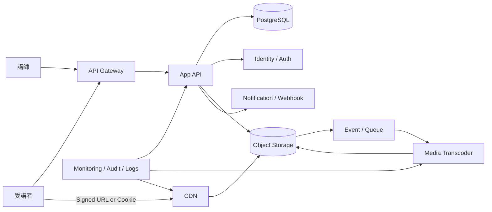

---
tags:
  - cloud
  - aws
  - oci
  - gcp
  - architecture
  - daily
---

[[Home]]

# 2026-07-03 10-15 Cloud Engineer Magazine

## 1) 今日のアプリ
**会員制動画講座アプリ（アップロード / エンコード / 保護配信 / 学習進捗）**

講師が動画をアップロードすると自動でエンコードされ、受講者はログイン後に保護された動画を視聴できる。今日は **大容量ファイル処理、署名付き配信、進捗保存、非同期パイプライン** を主題に、AWS / OCI / GCP で実装を比較する。

---

## 2) 要件整理

### 機能要件
- 講師が動画をアップロード
- 動画を複数解像度へ変換
- 受講者が認証後に動画視聴
- 視聴進捗（何分見たか、完了率）を保存
- 新着講座公開通知、管理者向け監査ログ

### 非機能要件
- **可用性:** 視聴APIと配信経路は高可用。単一AZ障害で止めない
- **性能:** アップロード完了後は非同期処理、視聴開始は低遅延
- **セキュリティ:** 会員以外へ動画URLを露出しない。最小権限IAM、保存時暗号化、管理者操作の監査
- **コスト:** 初期はマネージド中心、成長後は配信キャッシュと保存階層化で最適化

---

## 3) 推奨アーキテクチャ（なぜその構成か）
**推奨:** `API Gateway + App Runtime + Object Storage + 非同期キュー/イベント + Media Transcoding + CDN + RDB`

### なぜその構成か
- 動画本体はDBに入れず **オブジェクトストレージ** に分離するのが基本
- アップロード直後にエンコードを同期実行すると遅すぎるため、**保存 → イベント → 非同期変換** に分ける
- 視聴権限はアプリ側で判定し、配信URLは **署名付きURL / 署名付きCookie** で短時間のみ有効化すると安全
- 進捗や購入状態は更新整合性が必要なので **PostgreSQL系RDB** が扱いやすい
- 配信は CDN を前段に置くと、オリジン負荷と転送料を下げながら視聴体験を安定化しやすい

### トレードオフ
- **全部Cloud Storage/S3直配信** は簡単だが、大量視聴時は配信最適化やアクセス制御が粗くなりやすい
- **コンテナ自前FFmpeg** は柔軟だが、運用負荷が高い。まずはマネージド変換サービスが堅い
- **NoSQLで進捗管理** も可能だが、会員・注文・講座公開制御まで考えるとRDBの方が説明しやすい

---

## 4) クラウド別実装マップ

### AWS での実装サービス
- **API公開:** Amazon API Gateway
- **アプリ実行:** AWS Lambda または Amazon ECS on Fargate
- **動画保存:** Amazon S3
- **エンコード:** AWS Elemental MediaConvert
- **CDN配信:** Amazon CloudFront
- **進捗DB:** Amazon Aurora PostgreSQL
- **非同期連携:** Amazon EventBridge + Amazon SQS
- **認証:** Amazon Cognito
- **秘密情報:** AWS Secrets Manager
- **監視/監査:** Amazon CloudWatch / AWS CloudTrail

**向いている理由:** S3 → EventBridge/SQS → MediaConvert → CloudFront の流れが組みやすく、会員制配信の基本形を作りやすい。

### OCI での実装サービス
- **API公開:** OCI API Gateway
- **アプリ実行:** OCI Functions または OCI Container Instances
- **動画保存:** OCI Object Storage
- **エンコード:** OCI Media Flow
- **CDN配信:** OCI CDN
- **進捗DB:** OCI PostgreSQL
- **非同期連携:** OCI Events + OCI Queue / OCI Streaming
- **認証:** OCI IAM Identity Domains
- **秘密情報:** OCI Vault
- **監視/監査:** OCI Monitoring / Logging / Audit

**向いている理由:** Object Storage、Media Flow、CDN、Identity Domains の組み合わせで、動画処理から保護配信まで素直に組める。

### GCP での実装サービス
- **API公開:** API Gateway
- **アプリ実行:** Cloud Run
- **動画保存:** Cloud Storage
- **エンコード:** Transcoder API
- **CDN配信:** Cloud CDN
- **進捗DB:** Cloud SQL for PostgreSQL
- **非同期連携:** Pub/Sub + Cloud Tasks
- **認証:** Identity Platform
- **秘密情報:** Secret Manager
- **監視/監査:** Cloud Monitoring / Cloud Logging / Cloud Audit Logs

**向いている理由:** Cloud Storage → Pub/Sub → Cloud Run / Transcoder API の分離がしやすく、Cloud CDN まで含めて動画配信の実装がきれいに整理できる。

---

## 5) システム構成図（Mermaid）

---

## 6) データフロー / 認証・認可 / 監視運用の要点

### データフロー
1. 講師がログインし、動画アップロード用の一時URLを取得
2. 動画をオブジェクトストレージへ直接アップロード
3. 保存イベントでキュー/イベントを発火
4. トランスコード処理が HLS/DASH など配信用アセットを生成
5. 公開可能状態になったらメタデータをDB更新
6. 受講者は購入/契約状態をAPIで確認後、短寿命の署名付き配信URLを取得して視聴
7. プレイヤーは定期的に進捗をAPIへ送信

### 認証・認可
- **受講者:** Cognito / Identity Domains / Identity Platform で認証
- **講師 / 管理者:** SSO + MFA を推奨
- **認可:** 「受講者」「講師」「運営管理者」でロール分離
- **配信保護:** CDN/オブジェクトストレージを公開バケット運用しない。アプリ判定後に署名付きURLやCookieを発行
- **IAM:** トランスコード実行ロールは対象バケット/ストレージの必要最小権限だけ付与
- **秘密情報:** DB接続、Webhook鍵、配信署名関連情報は Secrets Manager / Vault / Secret Manager で管理

### 監視運用
- SLI候補: 視聴開始成功率、視聴開始までの時間、トランスコード完了時間、配信5xx率
- アラート候補: 変換ジョブ失敗、キュー滞留、署名URL発行失敗、DB接続枯渇、CDNオリジンエラー増加
- 監査対象: 管理者による公開切替、講師権限変更、保護バケット設定変更、秘密情報参照

---

## 7) コスト最適化ポイント（初期・成長期）

### 初期
- APIは Lambda / Functions / Cloud Run など従量課金寄りで開始
- まずは 720p / 480p 程度の少数プロファイルに絞り、無駄なエンコードを避ける
- 視聴ログは必要最小限をRDBへ、詳細イベントはオブジェクトストレージやログ基盤へ分離

### 成長期
- CDN キャッシュヒット率を上げ、オリジン転送量を削減
- 古い元動画や未使用アセットはライフサイクル管理で低コスト階層へ移行
- 人気講座はキャッシュ最適化、低視聴講座は高解像度生成を後回しにする
- 視聴進捗の高頻度更新はバッファリングや間引きでDB書き込みを抑える

---

## 8) 障害時の設計（DR / バックアップ / フェイルオーバー）

- **DB:** 自動バックアップ + PITR。会員情報・購入情報・進捗はHA構成を優先
- **オブジェクトストレージ:** バージョニング、有効ならクロスリージョン複製を検討
- **変換ジョブ:** 再試行とDLQを持たせ、失敗動画だけ再投入できるようにする
- **CDN障害:** APIは生かしつつ、一時的にオリジン直配信へ切替可能かを検討。ただし認可制御が崩れない設計にする
- **リージョン障害:** 初期はバックアップ復旧中心。成長後は配信アセット複製を先に、DBはRPO/RTOに応じて段階強化
- **縮退モード:** 新規アップロード停止・既存講座視聴優先を先に定義しておく

---

## 9) 学習ポイント（今日覚えるクラウド機能）

- **AWS:** MediaConvert と CloudFront を使うと、変換と保護配信の責務を分けやすい
- **OCI:** Media Flow + Object Storage + CDN の組み合わせで、動画パイプラインをOCI上で閉じやすい
- **GCP:** Transcoder API + Cloud Storage + Cloud CDN はシンプルで分離しやすい
- **共通:** 動画配信は「アップロード同期処理」にしない。保存→イベント→変換→公開 の段階分離が基本

---

## 10) 30〜60分ミニ演習

1. 1つのクラウドを選ぶ
2. 次の最小構成をMermaidで書く
   - API Gateway
   - App Runtime
   - Object Storage
   - Transcoder
   - CDN
   - PostgreSQL
3. 次に以下を追加する
   - 認証基盤
   - キュー/イベント
   - 監視/監査
4. 最後に以下を5行で説明する
   - なぜ動画をDBに入れないのか
   - なぜ署名付きURLが必要か
   - なぜ進捗更新を毎秒DBへ書かない方がよいか

**ゴール:** サービス名を言えるだけでなく、**動画処理を同期/非同期でどう分けるか** を説明できること。

---

## 11) 公式ドキュメント参照リンク（AWS / OCI / GCP）

### AWS
- Amazon API Gateway: https://docs.aws.amazon.com/apigateway/
- AWS Lambda: https://docs.aws.amazon.com/lambda/
- Amazon ECS: https://docs.aws.amazon.com/ecs/
- AWS Fargate: https://docs.aws.amazon.com/AmazonECS/latest/developerguide/AWS_Fargate.html
- Amazon S3: https://docs.aws.amazon.com/AmazonS3/latest/userguide/Welcome.html
- AWS Elemental MediaConvert: https://docs.aws.amazon.com/mediaconvert/
- Amazon CloudFront: https://docs.aws.amazon.com/AmazonCloudFront/latest/DeveloperGuide/Introduction.html
- Amazon Aurora overview: https://docs.aws.amazon.com/AmazonRDS/latest/AuroraUserGuide/CHAP_AuroraOverview.html
- Amazon EventBridge: https://docs.aws.amazon.com/eventbridge/latest/userguide/eb-what-is.html
- Amazon SQS: https://docs.aws.amazon.com/AWSSimpleQueueService/latest/SQSDeveloperGuide/welcome.html
- Amazon Cognito: https://docs.aws.amazon.com/cognito/latest/developerguide/what-is-amazon-cognito.html
- AWS Secrets Manager: https://docs.aws.amazon.com/secretsmanager/latest/userguide/intro.html
- Amazon CloudWatch: https://docs.aws.amazon.com/AmazonCloudWatch/latest/monitoring/WhatIsCloudWatch.html
- AWS CloudTrail: https://docs.aws.amazon.com/awscloudtrail/latest/userguide/cloudtrail-user-guide.html

### OCI
- API Gateway: https://docs.oracle.com/en-us/iaas/Content/APIGateway/Concepts/apigatewayoverview.htm
- Functions: https://docs.oracle.com/en-us/iaas/Content/Functions/home.htm
- Container Instances: https://docs.oracle.com/en-us/iaas/Content/container-instances/home.htm
- Object Storage: https://docs.oracle.com/en-us/iaas/Content/Object/Concepts/objectstorageoverview.htm
- Media Flow: https://docs.oracle.com/en-us/iaas/Content/mediaflow/using/home.htm
- OCI CDN: https://docs.oracle.com/en-us/iaas/Content/EdgeServices/Tasks/overview.htm
- OCI PostgreSQL: https://docs.oracle.com/en-us/iaas/postgresql/home.htm
- OCI Events: https://docs.oracle.com/en-us/iaas/Content/Events/home.htm
- OCI Queue: https://docs.oracle.com/en-us/iaas/Content/queue/home.htm
- OCI Streaming: https://docs.oracle.com/en-us/iaas/Content/Streaming/home.htm
- OCI IAM Identity Domains: https://docs.oracle.com/en-us/iaas/Content/Identity/home.htm
- OCI Vault: https://docs.oracle.com/en-us/iaas/Content/KeyManagement/home.htm
- OCI Monitoring: https://docs.oracle.com/en-us/iaas/Content/Monitoring/home.htm
- OCI Logging: https://docs.oracle.com/en-us/iaas/Content/Logging/home.htm
- OCI Audit: https://docs.oracle.com/en-us/iaas/Content/Audit/home.htm

### GCP
- API Gateway: https://docs.cloud.google.com/api-gateway/docs
- Cloud Run: https://docs.cloud.google.com/run/docs
- Cloud Storage: https://docs.cloud.google.com/storage/docs
- Transcoder API: https://docs.cloud.google.com/transcoder/docs
- Cloud CDN: https://docs.cloud.google.com/cdn/docs
- Cloud SQL for PostgreSQL: https://docs.cloud.google.com/sql/docs/postgres
- Pub/Sub: https://docs.cloud.google.com/pubsub/docs
- Cloud Tasks: https://docs.cloud.google.com/tasks/docs
- Identity Platform: https://docs.cloud.google.com/identity-platform/docs
- Secret Manager: https://docs.cloud.google.com/secret-manager/docs
- Cloud Monitoring: https://docs.cloud.google.com/monitoring/docs
- Cloud Logging: https://docs.cloud.google.com/logging/docs
- Cloud Audit Logs: https://docs.cloud.google.com/logging/docs/audit

---

## ひとこと
動画系アプリは、アプリ本体より **配信保護・非同期変換・CDN運用** で設計差が出る。まずは「会員判定はAPI、重い動画処理は非同期、配信はCDN」が基本線。