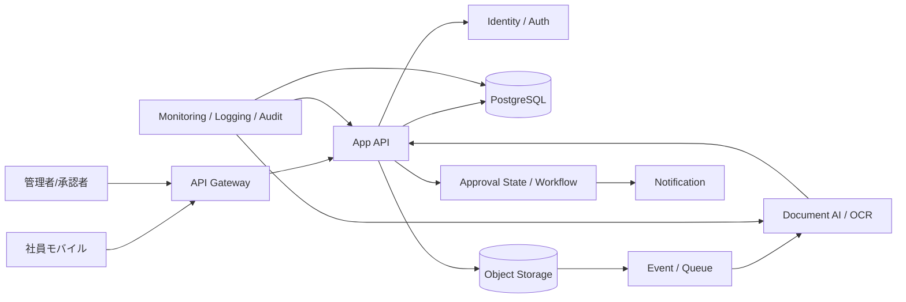

---
tags:
  - cloud
  - aws
  - oci
  - gcp
  - architecture
  - daily
---

[[Home]]

# 2026-07-04 10-15 Cloud Engineer Magazine

## 1) 今日のアプリ
**レシートOCR経費精算アプリ（撮影 / OCR / 承認 / 保管 / 監査）**

社員がスマホでレシートを撮影すると、OCR で日付・金額・店名を抽出し、申請・承認・会計連携まで進める。今日は **ドキュメントAI、イベント駆動、監査証跡、最小権限IAM** を主題に、AWS / OCI / GCP を比較する。

---

## 2) 要件整理

### 機能要件
- 社員が画像/PDFのレシートをアップロード
- OCR で金額・日付・通貨・加盟店名を抽出
- 抽出結果をユーザーが修正して申請
- 上長承認、経理確認、差戻し
- 元ファイルと申請履歴を保管
- 不正検知のため監査ログを残す

### 非機能要件
- **可用性:** 申請API と承認API は業務時間中に安定稼働
- **性能:** OCR は非同期で数秒〜数十秒以内、一覧/承認画面は低遅延
- **セキュリティ:** 個人情報・金額情報を含むため、保存時暗号化、通信暗号化、厳格なRBAC、監査ログ必須
- **コスト:** 初期はサーバレス中心、OCR は従量課金、長期保管はライフサイクルで最適化

---

## 3) 推奨アーキテクチャ（なぜその構成か）
**推奨:** `API Gateway + Serverless App + Object Storage + Event/Queue + Document AI/OCR + RDB + Notification`

### なぜその構成か
- レシート画像/PDFは **オブジェクトストレージ** に置き、アプリDBにはメタデータだけ保存する方が安全で運用しやすい
- OCR は同期APIに直結するとタイムアウトやUX悪化を招くため、**アップロード → イベント → 非同期解析** に分ける
- 承認ワークフローは状態遷移と検索が多いため、**PostgreSQL系RDB** が扱いやすい
- OCR 抽出値は誤認識が起こるので、**人間が修正できるUI** を前提にする方が実務向き
- 通知、監査、再処理を考えると、イベント駆動にしておくと拡張しやすい

### トレードオフ
- **完全自動承認** は速いが、OCR誤認識や不正を見逃しやすい
- **自前OCR基盤** は柔軟だが、モデル運用と精度改善コストが重い。まずはマネージドOCRが堅い
- **NoSQL中心** でも組めるが、承認状態・差戻し履歴・検索条件を考えるとRDBが説明しやすい

---

## 4) クラウド別実装マップ

### AWS での実装サービス
- **API公開:** Amazon API Gateway
- **アプリ実行:** AWS Lambda
- **レシート保存:** Amazon S3
- **OCR/帳票抽出:** Amazon Textract
- **ワークフロー制御:** AWS Step Functions
- **申請DB:** Amazon Aurora PostgreSQL
- **非同期連携:** Amazon EventBridge + Amazon SQS
- **認証:** Amazon Cognito
- **通知:** Amazon SNS または Amazon SES
- **秘密情報:** AWS Secrets Manager
- **監視/監査:** Amazon CloudWatch / AWS CloudTrail

**向いている理由:** S3 に置いた書類を Textract で解析し、Step Functions で状態管理すると、申請→承認→再処理の流れを整理しやすい。

### OCI での実装サービス
- **API公開:** OCI API Gateway
- **アプリ実行:** OCI Functions
- **レシート保存:** OCI Object Storage
- **OCR/帳票抽出:** OCI Document Understanding
- **申請DB:** OCI PostgreSQL
- **非同期連携:** OCI Events + OCI Queue
- **認証:** OCI IAM Identity Domains
- **通知:** OCI Notifications
- **秘密情報:** OCI Vault
- **監視/監査:** OCI Monitoring / Logging / Audit

**向いている理由:** Object Storage、Document Understanding、Identity Domains を組み合わせると、文書処理系の業務アプリを比較的素直に構成できる。

### GCP での実装サービス
- **API公開:** API Gateway
- **アプリ実行:** Cloud Run
- **レシート保存:** Cloud Storage
- **OCR/帳票抽出:** Document AI
- **申請DB:** Cloud SQL for PostgreSQL
- **非同期連携:** Pub/Sub + Cloud Tasks
- **認証:** Identity Platform
- **通知:** Cloud Run から Gmail API/外部通知、または Pub/Sub 起点の通知処理
- **秘密情報:** Secret Manager
- **監視/監査:** Cloud Monitoring / Cloud Logging / Cloud Audit Logs

**向いている理由:** Cloud Storage → Pub/Sub → Cloud Run / Document AI の分離がしやすく、帳票処理パイプラインを小さく始めやすい。

---

## 5) システム構成図（Mermaidで簡易図）

---

## 6) データフロー / 認証・認可 / 監視運用の要点

### データフロー
1. 社員がログインし、アップロード用の一時URLまたはAPI経由でレシートを送信
2. 元ファイルをオブジェクトストレージへ保存
3. 保存イベントでキュー/イベントを発火
4. OCR サービスが画像/PDFを解析し、抽出結果を返す
5. アプリが抽出結果をDBへ保存し、ユーザーに確認・修正させる
6. 申請後、承認ワークフローを進める
7. 承認・差戻し・修正履歴を監査ログとして残す
8. 保管期限を過ぎたファイルはアーカイブまたは削除ポリシーへ移す

### 認証・認可
- **社員認証:** Cognito / Identity Domains / Identity Platform
- **権限分離:** 社員、承認者、経理、監査閲覧者、運用者でロールを分ける
- **最小権限IAM:** OCR 実行ロールは対象バケット/ストレージ読取と結果保存だけに限定
- **機密保護:** DB資格情報、署名鍵、通知APIキーは Secrets Manager / Vault / Secret Manager で管理
- **保管保護:** バケット公開禁止、保存時暗号化、必要ならKMS連携
- **監査:** 承認者変更、申請内容修正、権限変更、保管ポリシー変更を必ず追跡

### 監視運用
- SLI候補: OCR 完了率、OCR 平均処理時間、申請完了率、承認滞留件数、API 5xx 率
- アラート候補: OCR失敗増加、キュー滞留、DB接続枯渇、通知失敗、監査ログ停止
- 運用ポイント: OCR 再実行ボタン、差戻し理由テンプレート、月末ピーク時のキュー監視

---

## 7) コスト最適化ポイント（初期・成長期）

### 初期
- API は Lambda / Functions / Cloud Run の従量課金で開始
- OCR は必要ページだけ対象化し、不要な添付を処理しない
- 元ファイルはオブジェクトストレージ、検索用メタデータだけRDBへ保存
- 承認通知はまずメール中心にし、複雑な通知基盤を後回しにする

### 成長期
- 長期保管ファイルは低頻度アクセス/アーカイブ階層へ移行
- OCR 結果の再処理対象を絞り、全面再解析を避ける
- 月末ピークだけキュー処理並列度を上げる
- 添付サイズ上限や画像圧縮ルールを入れ、OCR/転送料を抑える

---

## 8) 障害時の設計（DR / バックアップ / フェイルオーバー）

- **DB:** 自動バックアップ + PITR。申請状態と承認履歴はRPOを小さく保つ
- **オブジェクトストレージ:** バージョニング、有効ならクロスリージョン複製を検討
- **OCR失敗:** 再試行回数を制御し、失敗ジョブはDLQ/隔離キューに送る
- **API障害:** アップロード停止時でも既存承認作業を継続できる縮退設計を考える
- **リージョン障害:** 初期はバックアップ復旧中心、成長後はストレージ複製とDBフェイルオーバー強化
- **監査保全:** 監査ログはアプリ本体と別経路でも保管し、改ざん困難性を上げる

---

## 9) 学習ポイント（今日覚えるクラウド機能）

- **AWS:** Textract は書類OCRをマネージドで扱え、Step Functions と組み合わせると再処理や承認分岐を書きやすい
- **OCI:** Document Understanding は文書から構造化データ抽出を行う入口として実務向き
- **GCP:** Document AI は帳票系の抽出に強く、Cloud Run / Pub/Sub と分離しやすい
- **共通:** OCR は精度100%前提にしない。**人間確認を組み込む設計** が現実的

---

## 10) 30〜60分ミニ演習

1. 1つのクラウドを選ぶ
2. 次の最小構成をMermaidで書く
   - API Gateway
   - App Runtime
   - Object Storage
   - OCR/Document AI
   - PostgreSQL
   - Queue/Event
3. 次に以下を追加する
   - 認証基盤
   - 承認通知
   - 監視/監査
4. 最後に以下を各3行で説明する
   - なぜOCRを同期処理にしないのか
   - なぜ元ファイルをDBではなくオブジェクトストレージに置くのか
   - なぜ「社員」と「承認者」でロール分離が必要か

**ゴール:** サービス名を覚えるだけでなく、**文書アップロード → 非同期解析 → 人手確認 → 承認** の流れを説明できること。

---

## 11) 公式ドキュメント参照リンク（AWS / OCI / GCP）

### AWS
- Amazon API Gateway: https://docs.aws.amazon.com/apigateway/
- AWS Lambda: https://docs.aws.amazon.com/lambda/
- Amazon S3: https://docs.aws.amazon.com/AmazonS3/latest/userguide/Welcome.html
- Amazon Textract: https://docs.aws.amazon.com/textract/
- AWS Step Functions: https://docs.aws.amazon.com/step-functions/
- Amazon Aurora overview: https://docs.aws.amazon.com/AmazonRDS/latest/AuroraUserGuide/CHAP_AuroraOverview.html
- Amazon EventBridge: https://docs.aws.amazon.com/eventbridge/latest/userguide/eb-what-is.html
- Amazon SQS: https://docs.aws.amazon.com/AWSSimpleQueueService/latest/SQSDeveloperGuide/welcome.html
- Amazon Cognito: https://docs.aws.amazon.com/cognito/latest/developerguide/what-is-amazon-cognito.html
- Amazon SNS: https://docs.aws.amazon.com/sns/latest/dg/welcome.html
- Amazon SES: https://docs.aws.amazon.com/ses/latest/dg/Welcome.html
- AWS Secrets Manager: https://docs.aws.amazon.com/secretsmanager/latest/userguide/intro.html
- Amazon CloudWatch: https://docs.aws.amazon.com/AmazonCloudWatch/latest/monitoring/WhatIsCloudWatch.html
- AWS CloudTrail: https://docs.aws.amazon.com/awscloudtrail/latest/userguide/cloudtrail-user-guide.html

### OCI
- API Gateway: https://docs.oracle.com/en-us/iaas/Content/APIGateway/Concepts/apigatewayoverview.htm
- Functions: https://docs.oracle.com/en-us/iaas/Content/Functions/home.htm
- Object Storage: https://docs.oracle.com/en-us/iaas/Content/Object/Concepts/objectstorageoverview.htm
- Document Understanding: https://docs.oracle.com/en-us/iaas/Content/document-understanding/home.htm
- OCI PostgreSQL: https://docs.oracle.com/en-us/iaas/postgresql/home.htm
- OCI Events: https://docs.oracle.com/en-us/iaas/Content/Events/home.htm
- OCI Queue: https://docs.oracle.com/en-us/iaas/Content/queue/home.htm
- OCI IAM Identity Domains: https://docs.oracle.com/en-us/iaas/Content/Identity/home.htm
- OCI Notifications: https://docs.oracle.com/en-us/iaas/Content/Notification/home.htm
- OCI Vault: https://docs.oracle.com/en-us/iaas/Content/KeyManagement/home.htm
- OCI Monitoring: https://docs.oracle.com/en-us/iaas/Content/Monitoring/home.htm
- OCI Logging: https://docs.oracle.com/en-us/iaas/Content/Logging/home.htm
- OCI Audit: https://docs.oracle.com/en-us/iaas/Content/Audit/home.htm

### GCP
- API Gateway: https://docs.cloud.google.com/api-gateway/docs
- Cloud Run: https://docs.cloud.google.com/run/docs
- Cloud Storage: https://docs.cloud.google.com/storage/docs
- Document AI: https://docs.cloud.google.com/document-ai/docs
- Cloud SQL for PostgreSQL: https://docs.cloud.google.com/sql/docs/postgres
- Pub/Sub: https://docs.cloud.google.com/pubsub/docs
- Cloud Tasks: https://docs.cloud.google.com/tasks/docs
- Identity Platform: https://docs.cloud.google.com/identity-platform/docs
- Secret Manager: https://docs.cloud.google.com/secret-manager/docs
- Cloud Monitoring: https://docs.cloud.google.com/monitoring/docs
- Cloud Logging: https://docs.cloud.google.com/logging/docs
- Cloud Audit Logs: https://docs.cloud.google.com/logging/docs/audit

---

## ひとこと
文書系アプリは、OCR そのものより **誤認識を前提にした業務フロー設計** で差が出る。まずは「原本は安全に保管」「OCR は非同期」「人手確認あり」「監査証跡を残す」が基本線。