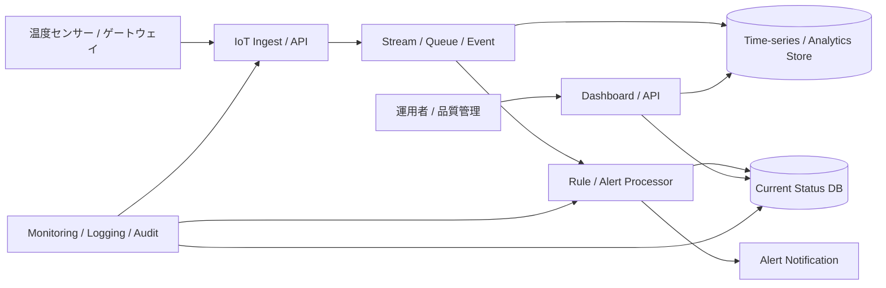

---
tags:
  - cloud
  - aws
  - oci
  - gcp
  - architecture
  - daily
---

[[Home]]

# 2026-07-05 10-15 Cloud Engineer Magazine

## 1) 今日のアプリ
**コールドチェーン温度監視アプリ（冷蔵配送 / アラート / 監査ログ / ダッシュボード）**

配送中の保冷箱や冷蔵車から温度データを定期送信し、閾値超過時に即時アラートを出す。今日は **IoTデータ収集、時系列保存、イベント駆動アラート、監査可能な運用** を、AWS / OCI / GCP の実装に落として考える。

---

## 2) 要件整理

### 機能要件
- 温度センサーが 30 秒〜5 分間隔で温度・湿度・端末ID・時刻を送信
- 温度がしきい値を超えたらアラートを発報
- 荷物単位・車両単位・拠点単位で状態を一覧表示
- 異常期間の履歴確認、CSV出力、監査用保存
- デバイス登録、証明書ローテーション、無効化

### 非機能要件
- **可用性:** 通信断があっても再送・遅延吸収できること
- **性能:** アラート判定は数秒以内、ダッシュボードは直近データを低遅延表示
- **セキュリティ:** デバイス認証、保存時暗号化、最小権限IAM、監査ログ必須
- **コスト:** 初期はマネージド中心、データ保持期間に応じてストレージ階層化

---

## 3) 推奨アーキテクチャ（なぜその構成か）
**推奨:** `IoT Ingest + Stream/Event + Rule Engine + Time-series / Relational DB + Alert + Dashboard`

### なぜその構成か
- センサーデータは小さいが高頻度なので、**IoT向け受信基盤** を使うとデバイス認証・接続管理・メッセージ受信をまとめて扱いやすい
- アラート判定はアプリ本体に埋め込むより、**ルール/イベント** に寄せた方がしきい値変更や通知追加が楽
- 直近表示は時系列/NoSQL系、監査やマスタ管理はRDB系、と **用途で保存先を分ける** と運用しやすい
- 通信断や一時的なスパイクがあるので、**キューやストリームでバッファ** を持つ方が安全

### トレードオフ
- **IoT専用サービス** は速く始めやすいが、プロトコルや周辺サービスの理解が必要
- **全部をCloud Run / Functions / Lambdaで受ける設計** も可能だが、デバイス証明書管理や大量接続で苦労しやすい
- **時系列DB専用に寄せる** と分析は楽だが、業務画面向けの参照や権限制御ではRDBも欲しくなる

---

## 4) クラウド別実装マップ

### AWS での実装サービス
- **デバイス接続:** AWS IoT Core
- **ルール/経路分岐:** AWS IoT Core Rules
- **ストリーム処理:** Amazon Kinesis Data Streams または Amazon SQS
- **アラート処理:** AWS Lambda
- **時系列保存:** Amazon Timestream
- **業務DB:** Amazon Aurora PostgreSQL
- **ダッシュボードAPI:** Amazon API Gateway + AWS Lambda
- **通知:** Amazon SNS
- **秘密情報/証明書補助:** AWS Secrets Manager
- **監視/監査:** Amazon CloudWatch / AWS CloudTrail

**向いている理由:** IoT Core Rules から Timestream・Lambda・SQS へ流しやすく、温度監視のようなイベント駆動構成を組み立てやすい。

### OCI での実装サービス
- **デバイス受信API:** OCI API Gateway
- **受信アプリ:** OCI Functions または Container Instances / OKE 上の軽量MQTT/HTTPS受信サービス
- **非同期連携:** OCI Streaming または OCI Queue
- **アラート処理:** OCI Functions
- **時系列/分析保存:** Autonomous Database（JSON/表形式）または MySQL HeatWave / PostgreSQL に時系列保存
- **業務DB:** OCI PostgreSQL
- **通知:** OCI Notifications
- **認証/権限:** OCI IAM Identity Domains + 動的グループ / ポリシー
- **秘密情報:** OCI Vault
- **監視/監査:** OCI Monitoring / Logging / Audit

**向いている理由:** OCI は IoT 専用のフロントサービスよりも、API Gateway + Streaming + Functions の組み合わせで柔軟に組む発想が実務的。受信方式を HTTPS 中心に寄せると構成を揃えやすい。

### GCP での実装サービス
- **デバイス受信API:** Cloud Run
- **HTTP フロント:** External Application Load Balancer
- **非同期連携:** Pub/Sub
- **アラート処理:** Eventarc + Cloud Run または Cloud Functions
- **時系列/分析保存:** BigQuery（集計・分析） + Firestore または Cloud SQL に最新状態を保持
- **業務DB:** Cloud SQL for PostgreSQL
- **通知:** Pub/Sub 起点の通知処理 + Email / Webhook
- **秘密情報:** Secret Manager
- **監視/監査:** Cloud Monitoring / Cloud Logging / Cloud Audit Logs

**向いている理由:** GCP は Cloud Run + Pub/Sub + BigQuery の流れが強く、受信と分析を分離しやすい。最新状態は Firestore / Cloud SQL、履歴分析は BigQuery に分けるとわかりやすい。

---

## 5) システム構成図（Mermaidで簡易図）

---

## 6) データフロー / 認証・認可 / 監視運用の要点

### データフロー
1. センサーまたは車載ゲートウェイが温度データを送信
2. 受信基盤で端末認証し、メッセージをイベント基盤へ渡す
3. ルール処理が温度閾値、連続異常回数、無通信時間を判定
4. 異常時は通知を送信し、正常/異常の最新状態を業務DBへ反映
5. 全履歴は時系列/分析基盤へ保存
6. ダッシュボードは「現在状態」と「履歴分析」を用途別に参照

### 認証・認可
- **デバイス認証:** 端末ごとに証明書または署名付きトークンを発行し、失効できるようにする
- **最小権限IAM:** 受信ロールはメッセージ投入だけ、アラート処理ロールは必要なDB更新と通知だけ
- **運用者権限分離:** 監視者、配送管理者、監査担当、基盤管理者を分ける
- **秘密管理:** DB接続情報、Webhook鍵、証明書関連情報は Secrets Manager / Vault / Secret Manager に保存
- **通信保護:** TLS必須。デバイス側の時刻ずれも考慮してトークン期限を設計

### 監視運用
- SLI候補: メッセージ受信成功率、アラート発報遅延、無通信デバイス数、通知成功率
- アラート候補: 受信急減、同一端末の異常連発、キュー滞留、DB書込失敗、証明書期限接近
- 運用ポイント: デバイス交換手順、再送ポリシー、誤報を減らす連続判定、配送ルート別のしきい値調整

---

## 7) コスト最適化ポイント（初期・成長期）

### 初期
- 最新状態と履歴分析を分け、**全データを高価な低遅延DBに入れない**
- 通知はまずメール/チャット/Webhookなど少数経路に絞る
- 保持期間を決め、古い生データは安価なストレージへエクスポート
- 高頻度送信は本当に必要な配送だけに限定し、常時 1 秒送信を避ける

### 成長期
- センサーデータを圧縮・バッチ集約し、分析系書込コストを抑える
- ダッシュボードで必要な最新状態は集約テーブルやキャッシュへ寄せる
- アラート条件を見直し、ノイズ通知を減らして運用コストを下げる
- 保持ポリシーを「生データ短期、集計データ長期」に分離する

---

## 8) 障害時の設計（DR / バックアップ / フェイルオーバー）

- **通信断:** デバイス側に短期バッファを持たせ、回線復帰後に再送
- **イベント基盤障害:** 再試行とDLQ相当の隔離先を用意し、データ消失より遅延を優先
- **DB障害:** 最新状態DBは自動バックアップとフェイルオーバー、履歴基盤は再投入可能設計にする
- **リージョン障害:** 初期はバックアップ復旧中心、重要案件ではクロスリージョン複製や二次リージョン待機を検討
- **通知障害:** 通知失敗自体を監視対象にし、メールだけでなく別チャネルへの代替経路を持つ
- **監査保全:** デバイス登録・証明書失効・しきい値変更・通知先変更は必ず監査ログに残す

---

## 9) 学習ポイント（今日覚えるクラウド機能）

- **AWS:** AWS IoT Core Rules は受信メッセージを複数の送信先へ振り分けやすい
- **OCI:** OCI Streaming は高頻度イベント受け渡しの土台として使いやすく、Functions と合わせて疎結合化しやすい
- **GCP:** Pub/Sub は受信と処理をきれいに分離でき、BigQuery と組み合わせると履歴分析がしやすい
- **共通:** 最新状態参照と長期分析を同じ保存先に無理やり詰め込まない方が設計が素直

---

## 10) 30〜60分ミニ演習

1. 1つのクラウドを選ぶ
2. 次の最小構成をMermaidで書く
   - Ingest
   - Queue / Stream
   - Alert Processor
   - Current Status DB
   - History Store
   - Notification
3. その後、以下を追加する
   - デバイス証明書またはトークン管理
   - 監視/監査
   - DR 方針
4. 最後に各3行で説明する
   - なぜ受信とアラート判定を分離するのか
   - なぜ最新状態DBと履歴保存先を分けるのか
   - なぜ通知失敗も監視すべきなのか

**ゴール:** 「センサーデータ受信 → イベント処理 → 閾値判定 → 通知 → 監査保存」を、具体的なサービス名つきで説明できること。

---

## 11) 公式ドキュメント参照リンク（AWS / OCI / GCP）

### AWS
- AWS IoT Core: https://docs.aws.amazon.com/iot/
- AWS IoT Core message broker and protocols: https://docs.aws.amazon.com/iot/latest/developerguide/protocols.html
- AWS IoT Rules: https://docs.aws.amazon.com/iot/latest/developerguide/iot-rules.html
- Amazon Kinesis Data Streams: https://docs.aws.amazon.com/streams/latest/dev/introduction.html
- Amazon SQS: https://docs.aws.amazon.com/AWSSimpleQueueService/latest/SQSDeveloperGuide/welcome.html
- AWS Lambda: https://docs.aws.amazon.com/lambda/
- Amazon Timestream: https://docs.aws.amazon.com/timestream/
- Amazon Aurora overview: https://docs.aws.amazon.com/AmazonRDS/latest/AuroraUserGuide/CHAP_AuroraOverview.html
- Amazon API Gateway: https://docs.aws.amazon.com/apigateway/
- Amazon SNS: https://docs.aws.amazon.com/sns/latest/dg/welcome.html
- AWS Secrets Manager: https://docs.aws.amazon.com/secretsmanager/latest/userguide/intro.html
- Amazon CloudWatch: https://docs.aws.amazon.com/AmazonCloudWatch/latest/monitoring/WhatIsCloudWatch.html
- AWS CloudTrail: https://docs.aws.amazon.com/awscloudtrail/latest/userguide/cloudtrail-user-guide.html

### OCI
- API Gateway: https://docs.oracle.com/en-us/iaas/Content/APIGateway/Concepts/apigatewayoverview.htm
- Functions: https://docs.oracle.com/en-us/iaas/Content/Functions/home.htm
- Streaming: https://docs.oracle.com/en-us/iaas/Content/Streaming/home.htm
- Queue: https://docs.oracle.com/en-us/iaas/Content/queue/home.htm
- Container Instances: https://docs.oracle.com/en-us/iaas/Content/container-instances/home.htm
- Oracle Kubernetes Engine (OKE): https://docs.oracle.com/en-us/iaas/Content/ContEng/home.htm
- OCI PostgreSQL: https://docs.oracle.com/en-us/iaas/postgresql/home.htm
- Autonomous Database: https://docs.oracle.com/en/cloud/paas/autonomous-database/index.html
- MySQL HeatWave: https://docs.oracle.com/en-us/iaas/mysql-database/index.html
- Notifications: https://docs.oracle.com/en-us/iaas/Content/Notification/home.htm
- IAM Identity Domains: https://docs.oracle.com/en-us/iaas/Content/Identity/home.htm
- Vault: https://docs.oracle.com/en-us/iaas/Content/KeyManagement/home.htm
- Monitoring: https://docs.oracle.com/en-us/iaas/Content/Monitoring/home.htm
- Logging: https://docs.oracle.com/en-us/iaas/Content/Logging/home.htm
- Audit: https://docs.oracle.com/en-us/iaas/Content/Audit/home.htm

### GCP
- Cloud Run: https://docs.cloud.google.com/run/docs
- External Application Load Balancer: https://docs.cloud.google.com/load-balancing/docs/https
- Pub/Sub: https://docs.cloud.google.com/pubsub/docs
- Eventarc: https://docs.cloud.google.com/eventarc/docs
- Cloud Functions: https://docs.cloud.google.com/functions/docs
- BigQuery: https://docs.cloud.google.com/bigquery/docs
- Firestore: https://docs.cloud.google.com/firestore/docs
- Cloud SQL for PostgreSQL: https://docs.cloud.google.com/sql/docs/postgres
- Secret Manager: https://docs.cloud.google.com/secret-manager/docs
- Cloud Monitoring: https://docs.cloud.google.com/monitoring/docs
- Cloud Logging: https://docs.cloud.google.com/logging/docs
- Cloud Audit Logs: https://docs.cloud.google.com/logging/docs/audit

---

## ひとこと
IoT系は「受信できる」だけでは足りない。**遅延・再送・無通信・誤報・証明書失効** まで最初から織り込むと、現場で使える設計になる。