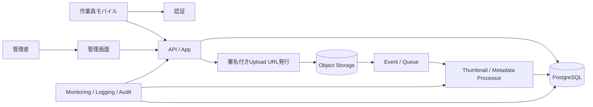

---
tags:
  - cloud
  - aws
  - oci
  - gcp
  - architecture
  - daily
---

[[Home]]

# 2026-07-06 10-15 Cloud Engineer Magazine

## 1) 今日のアプリ
**現場写真報告アプリ（作業写真アップロード / コメント / 承認フロー / 検索）**

建設・設備保守・点検業務向けに、作業員がスマホから写真とコメントを送信し、管理者が承認・差し戻しできるアプリを考える。今日は **画像アップロード、非同期処理、メタデータ管理、権限制御、監査ログ** を、AWS / OCI / GCP の実装に落として整理する。

---

## 2) 要件整理

### 機能要件
- 作業員が写真・現場ID・作業種別・コメントを登録
- 写真アップロード後にサムネイル生成、必要なら OCR/画像解析を追加可能
- 管理者が報告を一覧・検索し、承認 / 差し戻し
- 日付・現場・担当者・ステータスで絞り込み
- 承認履歴・操作履歴を監査向けに保持

### 非機能要件
- **可用性:** 写真アップロード失敗時に再試行できること
- **性能:** 画像登録後、数秒〜十数秒以内に一覧へ反映
- **セキュリティ:** 署名付きアップロード、最小権限IAM、保存時暗号化、管理者と作業員の権限分離
- **コスト:** 初期はサーバレス中心、画像保存と転送量を最適化

---

## 3) 推奨アーキテクチャ（なぜその構成か）
**推奨:** `Auth + API + Object Storage + Event/Queue + Function/Container + RDB + Monitoring`

### なぜその構成か
- 画像本体は **オブジェクトストレージ**、検索や承認状態は **RDB** に分離すると扱いやすい
- モバイルからアプリAPIを経由して大きな画像を中継すると重いので、**署名付きURLで直接アップロード** する方が効率的
- サムネイル生成やメタデータ抽出は **イベント駆動の非同期処理** にすると、アップロード体験を速く保てる
- 承認ワークフローは業務データなので、トランザクション制御しやすい **PostgreSQL 系** が相性良い

### トレードオフ
- **完全サーバレス** は初期コストを抑えやすいが、複雑な画像処理が増えるとコンテナ実行基盤の方が運用しやすい
- **NoSQL中心** にするとスケールしやすいが、承認履歴・検索条件・帳票用途ではRDBがわかりやすい
- **CDN配信** は便利だが、社内限定アプリならまずは非公開バケット + 署名付きURLで十分なことも多い

---

## 4) クラウド別実装マップ

### AWS での実装サービス
- **認証:** Amazon Cognito
- **API:** Amazon API Gateway
- **アプリ処理:** AWS Lambda
- **画像保存:** Amazon S3
- **非同期処理:** Amazon SQS
- **画像処理:** AWS Lambda（サムネイル生成）
- **業務DB:** Amazon Aurora PostgreSQL
- **監視/監査:** Amazon CloudWatch / AWS CloudTrail
- **秘密情報:** AWS Secrets Manager

**向いている理由:** S3 イベント、SQS、Lambda の連携が強く、写真アップロード後の非同期処理を最短で組みやすい。

### OCI での実装サービス
- **認証:** OCI IAM Identity Domains
- **API:** OCI API Gateway
- **アプリ処理:** OCI Functions
- **画像保存:** OCI Object Storage
- **非同期処理:** OCI Queue
- **画像処理:** OCI Functions または Container Instances
- **業務DB:** OCI PostgreSQL
- **監視/監査:** OCI Monitoring / Logging / Audit
- **秘密情報:** OCI Vault

**向いている理由:** API Gateway + Functions + Object Storage を軸に、比較的シンプルなサーバレス構成を作りやすい。画像処理負荷が重くなったら Container Instances へ寄せやすい。

### GCP での実装サービス
- **認証:** Identity Platform
- **API / アプリ処理:** Cloud Run
- **画像保存:** Cloud Storage
- **非同期処理:** Pub/Sub
- **画像処理:** Cloud Run functions または Cloud Run
- **業務DB:** Cloud SQL for PostgreSQL
- **監視/監査:** Cloud Monitoring / Cloud Logging / Cloud Audit Logs
- **秘密情報:** Secret Manager

**向いている理由:** Cloud Run + Pub/Sub + Cloud Storage の組み合わせで、HTTP API と非同期画像処理を同じ実行モデルに寄せやすい。

---

## 5) システム構成図（Mermaidで簡易図）

---

## 6) データフロー / 認証・認可 / 監視運用の要点

### データフロー
1. モバイルユーザーがログイン
2. API が **署名付きアップロードURL** を発行
3. クライアントが画像を直接オブジェクトストレージへアップロード
4. ストレージイベントを契機にキュー/イベントへ連携
5. 非同期処理でサムネイル生成、必要なら EXIF/OCR 抽出
6. 処理結果を PostgreSQL に反映
7. 管理画面は DB を参照して一覧・承認を実行

### 認証・認可
- 作業員と管理者は **ロール分離**（例: uploader / approver / auditor）
- オブジェクトストレージは **非公開** を基本にし、閲覧も署名付きURLで制御
- API 実行ロールは、DB・キュー・ストレージに **必要最小権限のみ**
- 管理操作は監査ログを残し、誰が承認/差し戻ししたか追跡可能にする

### 監視運用
- API の 4xx / 5xx、アップロード失敗率、キュー滞留、画像処理失敗数を監視
- 画像処理は **DLQ 相当** を用意し、失敗イベントを再実行可能にする
- DB 接続数、ストレージ容量、転送量も月次レビュー対象にする

---

## 7) コスト最適化ポイント（初期・成長期）

### 初期
- API / 画像処理はサーバレス優先で **アイドルコストを削減**
- 画像は原本・サムネイルのライフサイクルルールを分ける
- まずは OCR や高価な解析を必須にせず、後付けにする

### 成長期
- 画像処理件数が増えたら、短時間関数より **コンテナ実行** の方が安いケースを比較
- 閲覧頻度の低い原本は低コスト階層へ移行
- DB は検索要件が増えたらインデックス設計を見直し、読み取り負荷を API キャッシュや検索基盤へ逃がす

---

## 8) 障害時の設計（DR / バックアップ / フェイルオーバー）
- **オブジェクトストレージ:** バージョニングとクロスリージョン複製を検討
- **DB:** 自動バックアップ + PITR（Point-in-Time Recovery）を有効化
- **非同期処理:** キュー滞留で一時吸収し、処理系障害時もアップロード受付を止めにくくする
- **リージョン障害:** 重要度が高ければ、API と DB の別リージョンDRを用意。写真は複製済みストレージから再処理可能な設計にする
- **運用ポイント:** “画像はあるがDB反映失敗” を検出する整合性チェックバッチを定期実行すると事故に強い

---

## 9) 学習ポイント（今日覚えるクラウド機能）
- **署名付きURL / Signed URL** は「大きなファイルをアプリサーバー経由で受けない」ための基本パターン
- **イベント駆動非同期処理** は UX とスケーラビリティを両立しやすい
- **Object Storage + RDB の役割分担** は実務で頻出
- **最小権限IAM** は、アップロード権限・閲覧権限・承認権限を混ぜないのがコツ

---

## 10) 30〜60分ミニ演習
1. 1クラウド選ぶ（AWS / OCI / GCP のどれでも可）
2. 次の最小構成を図にする
   - 認証
   - 署名付きURL発行API
   - オブジェクトストレージ
   - 非同期処理
   - PostgreSQL
3. 「作業員はアップロードのみ、管理者は承認可能」の IAM ロールを2種類書き出す
4. キュー滞留が発生したときのアラート条件を3つ考える
5. 余力があれば、OCR を後付けする場合にどこへ組み込むか追記する

---

## 11) 公式ドキュメント参照リンク（AWS / OCI / GCP）

### AWS
- Amazon S3 User Guide: https://docs.aws.amazon.com/AmazonS3/latest/userguide/Welcome.html
- AWS Lambda Developer Guide: https://docs.aws.amazon.com/lambda/latest/dg/welcome.html
- Amazon API Gateway Developer Guide: https://docs.aws.amazon.com/apigateway/latest/developerguide/welcome.html
- Amazon SQS Developer Guide: https://docs.aws.amazon.com/AWSSimpleQueueService/latest/SQSDeveloperGuide/welcome.html
- Amazon Aurora User Guide: https://docs.aws.amazon.com/AmazonRDS/latest/AuroraUserGuide/CHAP_AuroraOverview.html
- Amazon Cognito Developer Guide: https://docs.aws.amazon.com/cognito/latest/developerguide/what-is-amazon-cognito.html

### OCI
- OCI Object Storage: https://docs.oracle.com/en-us/iaas/Content/Object/Concepts/objectstorageoverview.htm
- OCI API Gateway: https://docs.oracle.com/en-us/iaas/Content/APIGateway/Concepts/apigatewayoverview.htm
- OCI Functions: https://docs.oracle.com/en-us/iaas/Content/Functions/Concepts/functionsoverview.htm
- OCI Queue: https://docs.oracle.com/en-us/iaas/Content/queue/overview.htm
- OCI PostgreSQL: https://docs.oracle.com/en-us/iaas/Content/postgresql/home.htm
- OCI IAM Identity Domains: https://docs.oracle.com/en-us/iaas/Content/Identity/home.htm

### GCP
- Cloud Storage documentation: https://docs.cloud.google.com/storage/docs
- Cloud Run documentation: https://docs.cloud.google.com/run/docs
- Pub/Sub documentation: https://docs.cloud.google.com/pubsub/docs
- Cloud SQL for PostgreSQL: https://docs.cloud.google.com/sql/docs/postgres
- Identity Platform documentation: https://docs.cloud.google.com/identity-platform/docs
- Cloud Monitoring documentation: https://docs.cloud.google.com/monitoring/docs
