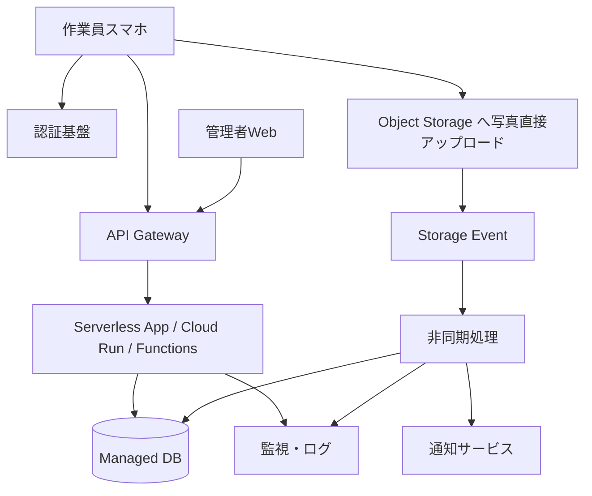

---
tags:
  - cloud
  - aws
  - oci
  - gcp
  - architecture
  - daily
---
[[Home]]

# Cloud Engineer Magazine — 2026-07-07

## 1) 今日のアプリ
**写真付き設備点検アプリ**  
現場作業員がスマホから点検結果・写真・位置情報を登録し、管理者がダッシュボードで確認、異常時は通知を受ける業務アプリ。

---

## 2) 要件整理
### 機能要件
- 作業員ログイン
- 点検票入力（設備ID、チェック項目、コメント、位置情報）
- 写真アップロード
- 異常判定時の通知
- 管理者向け検索・一覧・監査ログ

### 非機能要件
- **可用性**: 営業時間中は止めにくい。AZ/AD 冗長が望ましい
- **性能**: 写真アップロードは数MB、API 応答は通常 1 秒以内
- **セキュリティ**: 作業員/管理者の権限制御、保存データ暗号化、監査証跡
- **コスト**: 初期は従量課金優先、利用増加後に DB/実行基盤を最適化

---

## 3) 推奨アーキテクチャ（なぜその構成か）
**推奨:** API Gateway + サーバレス実行基盤 + オブジェクトストレージ + マネージドDB + 通知/監視

### 理由
- **モバイル/API 中心**なので API Gateway で認証・制御を集約しやすい
- **写真アップロード**はオブジェクトストレージが最適。アプリから直接アップロードさせると API サーバの負荷を減らせる
- **点検データ**は検索・集計・履歴管理が必要なので、最初は RDB が扱いやすい
- **異常通知**はイベント駆動にすると拡張しやすい
- **サーバレス**は小規模開始に強く、日次変動にも追従しやすい

### ざっくりした設計判断
- **認証**: ワークフォース向けなので IdP 連携可能な managed auth を優先
- **DB**: 初期は PostgreSQL/MySQL 系の managed DB、将来の高書込時に NoSQL も検討
- **画像処理**: 必須でなければ同期処理せず、アップロード完了イベントで非同期処理

---

## 4) クラウド別実装マップ

### AWS での実装サービス
- フロント/API: **Amazon API Gateway**
- 認証: **Amazon Cognito**
- 実行基盤: **AWS Lambda**
- 写真保存: **Amazon S3**
- 業務DB: **Amazon Aurora Serverless v2 (PostgreSQL互換)**
- 通知: **Amazon SNS**
- 監視/ログ: **Amazon CloudWatch**, **AWS CloudTrail**
- 秘密情報: **AWS Secrets Manager**

**向いている理由:** モバイル認証、イベント駆動、S3 連携が非常に強い。小さく始めやすい。

### OCI での実装サービス
- フロント/API: **OCI API Gateway**
- 認証: **OCI Identity Domains**
- 実行基盤: **OCI Functions**
- 写真保存: **OCI Object Storage**
- 業務DB: **MySQL HeatWave** または **Base Database / Autonomous Database**
- 通知: **OCI Notifications**
- 監視/ログ: **OCI Monitoring**, **OCI Logging**, **OCI Audit**
- 秘密情報: **OCI Vault**

**向いている理由:** API Gateway + Functions + Object Storage の構成が素直。Oracle 系DB運用に寄せたい場合も強い。

### GCP での実装サービス
- フロント/API: **API Gateway**
- 認証: **Identity Platform**
- 実行基盤: **Cloud Run**（HTTP/API 向けで扱いやすい）
- 写真保存: **Cloud Storage**
- 業務DB: **Cloud SQL for PostgreSQL**
- 通知: **Pub/Sub**
- 監視/ログ: **Cloud Monitoring**, **Cloud Logging**, **Cloud Audit Logs**
- 秘密情報: **Secret Manager**

**向いている理由:** Cloud Run はコンテナで実装自由度が高い。将来 BFF やバッチをまとめやすい。

### 一言トレードオフ
- **AWS Lambda**: 最小運用しやすいが、複雑化すると関数分割管理が増える
- **OCI Functions**: Oracle 環境との親和性が高いが、サンプル/情報量は AWS/GCP より少なめ
- **GCP Cloud Run**: コンテナ前提で柔軟だが、完全FaaSよりイメージ管理の責務が増える

---

## 5) システム構成図（Mermaidで簡易図）

---

## 6) データフロー / 認証・認可 / 監視運用の要点
### データフロー
1. 作業員が認証
2. API がアップロード用URL/権限を発行
3. 写真をオブジェクトストレージへ直接保存
4. 点検データを API 経由で DB へ登録
5. 写真保存イベントで非同期処理を起動
6. 異常時は通知、正常時はログ記録のみ

### 認証・認可
- 作業員と管理者で **ロール分離**
- API 実行基盤には **最小権限 IAM** のみ付与
- オブジェクトストレージは **非公開バケット** を基本にする
- DB 接続情報は Secrets/Vault/Secret Manager で管理
- 監査ログは有効化し、管理操作を追跡可能にする

### 監視運用
- API エラー率、関数失敗数、DB 接続数、ストレージイベント失敗を監視
- 重要アラートは通知基盤へ連携
- 構造化ログに `inspection_id`, `user_id`, `site_id` を含めて追跡しやすくする

---

## 7) コスト最適化ポイント（初期・成長期）
### 初期
- サーバレス中心で **アイドルコストを最小化**
- 画像はライフサイクルポリシーで低頻度アクセス層へ移行
- DB は最小構成で開始し、過剰な HA 構成を最初から盛りすぎない

### 成長期
- API 高負荷時はキャッシュや read replica を検討
- 画像サムネイル生成をバッチ最適化
- DB コストが増えたら、アクセス特性に応じて NoSQL 分離も検討
- Cloud Run は最小インスタンス、Lambda/Functions はメモリ設定見直しで単価最適化

---

## 8) 障害時の設計（DR/バックアップ/フェイルオーバー）
- **DB**: 自動バックアップを有効化。重要度に応じて Multi-AZ / AD 冗長やレプリカを使用
- **オブジェクトストレージ**: バージョニング/オブジェクト保護を検討
- **API/実行基盤**: マネージド冗長に乗る。状態は持たない
- **障害分離**: 写真処理失敗が点検登録本体を止めないよう非同期分離
- **DR レベル**:
  - 初期: 同一リージョン冗長 + バックアップ
  - 成長後: クロスリージョン複製、DB 復旧手順、定期リストア訓練

---

## 9) 学習ポイント（今日覚えるクラウド機能）
- **AWS**: S3 への直接アップロードでアプリサーバを経由しない設計
- **OCI**: Identity Domains + API Gateway で認証境界をきれいに作る
- **GCP**: Cloud Run を API/BFF の中心に据えるとコンテナ標準化しやすい

**今日の要点:** 画像やファイルを扱う業務アプリは、**API とファイル転送を分離**すると性能・コスト・保守性が大きく改善する。

---

## 10) 30〜60分ミニ演習
### 演習テーマ
「写真アップロードを API 経由ではなくストレージ直接アップロードにする理由を説明できるようになる」

### 手順
1. AWS/OCI/GCP それぞれで API Gateway と Object Storage 系サービスの役割を確認
2. 次の2案を比較する
   - A案: スマホ → API → 写真保存
   - B案: スマホ → ストレージ直接保存、API はメタデータのみ
3. 比較観点を3つ書く
   - レイテンシ
   - API サーバ負荷
   - セキュリティ制御
4. 最後に「自分ならどの案を採用するか」を 5 行でまとめる

---

## 11) 公式ドキュメント参照リンク（AWS/OCI/GCP）
### AWS
- API Gateway: https://docs.aws.amazon.com/apigateway/
- Amazon Cognito: https://docs.aws.amazon.com/cognito/
- AWS Lambda: https://docs.aws.amazon.com/lambda/
- Amazon S3: https://docs.aws.amazon.com/s3/
- Amazon Aurora: https://docs.aws.amazon.com/aurora/
- Amazon SNS: https://docs.aws.amazon.com/sns/
- Amazon CloudWatch: https://docs.aws.amazon.com/cloudwatch/
- AWS CloudTrail: https://docs.aws.amazon.com/cloudtrail/

### OCI
- OCI API Gateway: https://docs.oracle.com/en-us/iaas/Content/APIGateway/home.htm
- OCI Identity Domains: https://docs.oracle.com/en-us/iaas/Content/Identity/home.htm
- OCI Functions: https://docs.oracle.com/en-us/iaas/Content/Functions/home.htm
- OCI Object Storage: https://docs.oracle.com/en-us/iaas/Content/Object/home.htm
- OCI MySQL HeatWave: https://docs.oracle.com/en-us/iaas/mysql-database/
- OCI Notifications: https://docs.oracle.com/en-us/iaas/Content/Notification/home.htm
- OCI Monitoring: https://docs.oracle.com/en-us/iaas/Content/Monitoring/home.htm
- OCI Logging: https://docs.oracle.com/en-us/iaas/Content/Logging/home.htm
- OCI Vault: https://docs.oracle.com/en-us/iaas/Content/KeyManagement/home.htm

### GCP
- API Gateway: https://docs.cloud.google.com/api-gateway/docs
- Identity Platform: https://docs.cloud.google.com/identity-platform/docs
- Cloud Run: https://docs.cloud.google.com/run/docs
- Cloud Storage: https://docs.cloud.google.com/storage/docs
- Cloud SQL: https://docs.cloud.google.com/sql/docs
- Pub/Sub: https://docs.cloud.google.com/pubsub/docs
- Cloud Monitoring: https://docs.cloud.google.com/monitoring/docs
- Cloud Logging: https://docs.cloud.google.com/logging/docs
- Cloud Audit Logs: https://docs.cloud.google.com/logging/docs/audit
- Secret Manager: https://docs.cloud.google.com/secret-manager/docs
