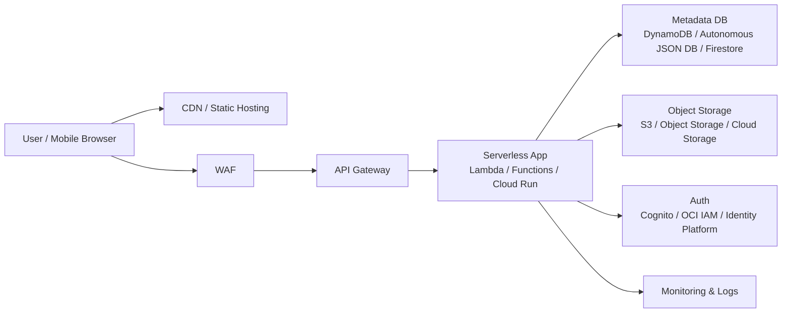

---
tags:
  - cloud
  - aws
  - oci
  - gcp
  - architecture
  - daily
---
[[Home]]

# Cloud Engineer Magazine — 2026-07-08

## 1) 今日のアプリ
**現場写真ナレッジ共有アプリ**

スマホで撮った作業写真・スクリーンショット・図面キャプチャをアップロードすると、
- 画像を保存
- メタデータを登録
- コメントやタグを付与
- 後から検索
できる社内向けアプリを想定する。

今日の視点は **マルチクラウド比較**。同じアプリを AWS / OCI / GCP でどう組むかを実務目線で整理する。

---

## 2) 要件整理

### 機能要件
- ユーザーが画像をアップロードできる
- タイトル、説明、タグ、撮影日時、現場IDを保存できる
- 画像一覧・詳細表示ができる
- タグ・現場ID・期間で検索できる
- 将来的に自動要約やOCRを追加しやすい

### 非機能要件
- **可用性**: 単一AZ障害で止まりにくい構成
- **性能**: 数百〜数千ユーザー、画像一覧は低遅延
- **セキュリティ**: 社内限定、最小権限IAM、暗号化、WAF、監査ログ
- **コスト**: 初期はサーバレス中心、成長後にCDN/キャッシュ/ライフサイクル最適化

---

## 3) 推奨アーキテクチャ（なぜその構成か）
**推奨方針: フロント分離 + API + オブジェクトストレージ + サーバレス実行 + マネージドNoSQL/JSON DB**

理由:
1. **初期構築が速い**: 画像保管はオブジェクトストレージ、APIはマネージドゲートウェイ、処理は関数 or コンテナで開始しやすい
2. **コストを抑えやすい**: アイドル時の固定費を減らせる
3. **拡張しやすい**: OCR、要約、イベント連携をあとから足しやすい
4. **セキュアにしやすい**: 署名付きアップロードURL、WAF、IAM、監査ログを標準パターン化しやすい

**設計の肝**
- 画像本体はDBに入れずオブジェクトストレージへ
- メタデータだけDBへ
- 直接アップロードはアプリ経由ではなく**署名付きURL**で帯域節約
- API認証はIdP連携またはマネージド認証基盤を利用
- 監査ログと操作ログは必ず残す

---

## 4) クラウド別実装マップ

### AWS での実装サービス
- フロント配信: **Amazon CloudFront + Amazon S3**
- API公開: **Amazon API Gateway**
- 認証: **Amazon Cognito**
- アプリ処理: **AWS Lambda**
- 画像保管: **Amazon S3**
- メタデータ: **Amazon DynamoDB**
- セキュリティ: **AWS WAF**, **IAM**, **KMS**
- 監視: **Amazon CloudWatch**, **CloudTrail**

**向いている理由**
- DynamoDB と Lambda の相性がよく、初期のCRUDアプリを速く作りやすい
- S3 + CloudFront は静的配信の定番

**トレードオフ**
- DynamoDB は柔軟だが、クエリ設計を先に考えないと後から苦しくなる
- 検索条件が複雑化するなら OpenSearch など追加を検討

### OCI での実装サービス
- フロント配信: **Object Storage + Load Balancer/CDN 方針**
- API公開: **OCI API Gateway**
- 認証/認可: **OCI IAM**
- アプリ処理: **OCI Functions**
- 画像保管: **OCI Object Storage**
- メタデータ: **Autonomous JSON Database** または **Base Database / ATP系**
- セキュリティ: **OCI WAF**, **Vault**, **Security Zones(必要に応じて)**
- 監視: **Monitoring**, **Logging**, **Audit**

**向いている理由**
- API Gateway + Functions + Object Storage の組み合わせが素直
- JSONベースのメタデータを Autonomous JSON Database に寄せると運用が軽い

**トレードオフ**
- AWS/GCPほど事例の母数は多くないが、Oracle系DB運用に慣れた組織とは相性が良い
- フロント配信は要件に応じてLB/CDN設計を明確にしたい

### GCP での実装サービス
- フロント配信: **Cloud Storage + Load Balancing/CDN**
- API公開: **API Gateway**
- 認証: **Identity Platform** または **IAM/IAP設計**
- アプリ処理: **Cloud Run**
- 画像保管: **Cloud Storage**
- メタデータ: **Firestore**
- セキュリティ: **Cloud Armor**, **Cloud KMS**, **IAM**
- 監視: **Cloud Monitoring**, **Cloud Logging**, **Cloud Audit Logs**

**向いている理由**
- Cloud Run が扱いやすく、コンテナでAPIを作る流れが実務的
- Firestore は小〜中規模アプリで立ち上がりが速い

**トレードオフ**
- Firestore はアクセスパターンを意識した設計が必要
- 画像検索や全文検索が重くなるなら別検索基盤追加を検討

---

## 5) システム構成図（Mermaid）

---

## 6) データフロー / 認証・認可 / 監視運用の要点

### データフロー
1. ユーザーがログイン
2. フロントが API へアップロード要求
3. API が**署名付きアップロードURL**を発行
4. クライアントが画像を直接オブジェクトストレージへ送信
5. 完了後、メタデータを API 経由で DB 登録
6. 一覧取得時は DB からメタデータ取得、画像は署名付きURL or 配信URLで参照

### 認証・認可
- 認証は **Cognito / OCI IAM連携 / Identity Platform** を使う
- API は未認証アクセスを原則禁止
- サービス間権限は**最小権限IAM**
- オブジェクトストレージは公開バケットにしない
- アプリ実行基盤からだけ書き込める設計にする

### 監視運用
- API レイテンシ、4xx/5xx、関数エラー率、DBスロットリング、ストレージ書込失敗を監視
- 監査ログは有効化して、誰が何を変えたか追えるようにする
- コスト監視でストレージ増加率と外向き転送量を追う

---

## 7) コスト最適化ポイント（初期・成長期）

### 初期
- サーバレス優先で固定費を抑える
- 画像は標準ストレージから開始、早すぎるアーカイブは避ける
- DB は最小スループット/オンデマンド寄りで始める

### 成長期
- CDN キャッシュを強化して配信コストを抑える
- オブジェクトストレージのライフサイクルで低頻度アクセス層へ移行
- DB アクセスパターンを見直し、二次インデックスや集約ビューを追加
- 画像変換サムネイルを事前生成してAPI負荷を下げる

---

## 8) 障害時の設計（DR / バックアップ / フェイルオーバー）
- **オブジェクトストレージ**: バージョニング、必要に応じてクロスリージョン複製
- **DB**: マネージドバックアップを有効化、RPO/RTOを事前定義
- **API/実行基盤**: 複数AZ/リージョン展開可能な構成を選ぶ
- **認証基盤**: 外部IdP依存時は障害時のログイン影響を確認
- **運用手順**: 失効した署名URL再発行、障害時の画像再登録手順、監査ログ確認フローを用意

**実務ポイント**
- 初期は「リージョン内高可用」で十分なことが多い
- DRを最初から過剰実装せず、重要データから優先的に守る

---

## 9) 学習ポイント（今日覚えるクラウド機能）
- **AWS**: API Gateway + Lambda + DynamoDB の定番サーバレス構成
- **OCI**: API Gateway と Functions を起点にした軽量アプリ構成
- **GCP**: Cloud Run を中心にしたコンテナベースのサーバレスAPI
- **共通**: 画像本体はオブジェクトストレージ、メタデータはDB、アップロードは署名付きURL

---

## 10) 30〜60分ミニ演習
1. 3クラウドのどれか1つを選ぶ
2. 次のリソースだけで最小構成を紙に書く
   - 認証
   - API Gateway
   - 実行基盤
   - Object Storage
   - Metadata DB
   - Monitoring
3. 「画像アップロード」「一覧取得」「タグ検索」の3APIを定義する
4. IAMポリシーを考える
   - フロント利用者
   - アプリ実行ロール
   - 運用者ロール
5. 余力があれば、将来のOCR追加ポイントを図に追記する

---

## 11) 公式ドキュメント参照リンク（AWS / OCI / GCP）

### AWS
- API Gateway: https://docs.aws.amazon.com/apigateway/latest/developerguide/welcome.html
- Lambda と API Gateway チュートリアル: https://docs.aws.amazon.com/lambda/latest/dg/services-apigateway-tutorial.html
- API Gateway + Lambda + DynamoDB CRUD: https://docs.aws.amazon.com/apigateway/latest/developerguide/http-api-dynamo-db.html

### OCI
- API Gateway 概要: https://docs.oracle.com/en-us/iaas/Content/APIGateway/Concepts/apigatewayoverview.htm
- API Gateway メトリクス: https://docs.oracle.com/en-us/iaas/Content/APIGateway/Reference/apigatewaymetrics.htm
- OCI ドキュメントホーム: https://docs.oracle.com/en-us/iaas/Content/home.htm

### GCP
- API Gateway 概要: https://docs.cloud.google.com/api-gateway/docs/about-api-gateway
- API Gateway ドキュメント: https://docs.cloud.google.com/api-gateway/docs
- API Gateway + Cloud Run 入門: https://docs.cloud.google.com/api-gateway/docs/get-started-cloud-run
- Cloud Run から Google Cloud サービス利用: https://docs.cloud.google.com/run/docs/integrate/using-gcp-services

---

## ひとこと
今日の学びは、**同じアプリでも「オブジェクト保存」「API保護」「サーバレス実行」「メタデータ保存」の4点に分解すると、3クラウド比較が一気にしやすくなる**こと。まずはサービス名を丸暗記するより、役割で対応づけると強い。