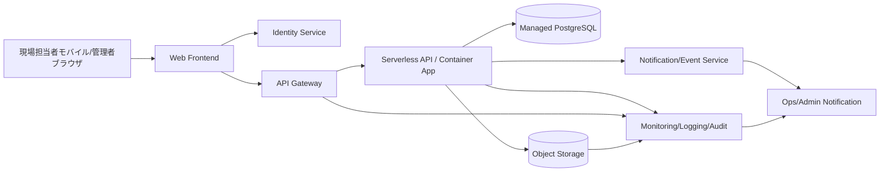

---
tags:
  - cloud
  - aws
  - oci
  - gcp
  - architecture
  - daily
---

[[Home]]

# Cloud Engineer Magazine — 2026-07-10

## 1) 今日のアプリ
**写真付き現場点検レポートアプリ**

想定ユースケース:
- 作業員がスマホから点検写真をアップロード
- 点検項目ごとのチェック結果を保存
- 管理者がWebダッシュボードで進捗・異常を確認
- 異常時は通知を飛ばす

今日は **「モバイルからの画像アップロード + API + 集計ダッシュボード」** を、AWS / OCI / GCP でどう組むかを比較します。

---

## 2) 要件整理

### 機能要件
- 現場担当者のログイン
- 点検レポート作成（テキスト、チェック項目、写真）
- 写真の安全なアップロード
- 管理者向け一覧・検索・ステータス更新
- 異常レポート通知

### 非機能要件
- **可用性:** 営業時間中は止めにくい。AZ/AD をまたぐ冗長化が望ましい
- **性能:** 写真アップロードは高遅延になりやすい。API とファイル転送を分離する
- **セキュリティ:** 認証必須、最小権限 IAM、オブジェクトストレージは非公開、監査ログ有効化
- **コスト:** 初期は小さく始め、利用増加時に API/DB/画像配信を段階的にスケール

---

## 3) 推奨アーキテクチャ（なぜその構成か）

**推奨方針: フロント + サーバレス API + マネージド DB + オブジェクトストレージ**

理由:
1. **画像本体はオブジェクトストレージへ直接保存**した方が、API サーバの帯域負荷を避けられる
2. 点検レポートのメタデータは **RDB** に置くと、検索・集計・管理画面実装がやりやすい
3. 初期フェーズは **サーバレス/コンテナ従量課金** が合いやすい
4. 認証はクラウド標準の ID サービスを使うと、パスワード管理を自前実装しなくて済む

**設計のキモ:**
- クライアントは API から **署名付きアップロード URL** を取得
- 画像は直接 Object Storage / S3 / Cloud Storage に PUT
- API はレポート情報と画像キーだけ保存
- 異常フラグ付きレポートはイベントで通知

---

## 4) クラウド別実装マップ

### AWS での実装サービス
- フロントエンド: **AWS Amplify Hosting** または **S3 + CloudFront**
- 認証: **Amazon Cognito**
- API: **Amazon API Gateway**
- アプリ実行: **AWS Lambda** または **Amazon ECS on Fargate**
- 画像保存: **Amazon S3**
- DB: **Amazon Aurora Serverless v2 (PostgreSQL互換)**
- 通知: **Amazon SNS**
- 監視: **Amazon CloudWatch**, **AWS CloudTrail**
- 秘密情報: **AWS Secrets Manager**

**AWS を選ぶ理由:**
- S3 の署名付き URL パターンが定番
- Lambda で小さく始めやすい
- 将来バッチや分析を足す時に EventBridge / SQS / Athena へ伸ばしやすい

**トレードオフ:**
- Lambda は短時間 API に強いが、画像処理や重い依存が増えると Fargate の方が運用しやすい

### OCI での実装サービス
- フロントエンド: **Object Storage + CDN**
- 認証: **OCI IAM Identity Domains**
- API: **OCI API Gateway**
- アプリ実行: **OCI Functions** または **Container Instances** / **OKE**
- 画像保存: **OCI Object Storage**
- DB: **Autonomous Database** または **MySQL HeatWave**
- 通知: **OCI Notifications**
- 監視: **OCI Monitoring**, **Logging**, **Audit**
- 秘密情報: **OCI Vault**

**OCI を選ぶ理由:**
- Object Storage + API Gateway + Functions の構成がシンプル
- 企業系ワークロードでは Identity Domains と Vault の組み合わせが扱いやすい
- Container Instances は「Kubernetes まではいらない」時の中間解として便利

**トレードオフ:**
- Functions で済む範囲は軽快だが、継続接続や複雑なアプリ層が増えるなら Container Instances / OKE を検討

### GCP での実装サービス
- フロントエンド: **Firebase Hosting** または **Cloud Storage + Cloud CDN**
- 認証: **Identity Platform** または **Firebase Authentication**
- API: **API Gateway**
- アプリ実行: **Cloud Run**
- 画像保存: **Cloud Storage**
- DB: **Cloud SQL for PostgreSQL**
- 通知: **Pub/Sub** + Cloud Run / Functions、または Firebase Cloud Messaging
- 監視: **Cloud Monitoring**, **Cloud Logging**, **Cloud Audit Logs**
- 秘密情報: **Secret Manager**

**GCP を選ぶ理由:**
- Cloud Run がこの種の API にかなり相性が良い
- Cloud Storage 連携、監視、IAM がまとまりやすい
- 将来 BigQuery 分析へつなげやすい

**トレードオフ:**
- 高度な API 管理が必要なら Apigee も候補だが、日次業務アプリなら API Gateway の方が軽い

---

## 5) システム構成図（Mermaidで簡易図）

---

## 6) データフロー / 認証・認可 / 監視運用の要点

### データフロー
1. ユーザがログインして ID トークン取得
2. フロントが API に「アップロード開始」を要求
3. API が **署名付き URL** を発行
4. クライアントが画像を **オブジェクトストレージへ直接アップロード**
5. クライアントがレポート本文と画像キーを API に送信
6. API が DB 保存、必要なら通知イベント発火

### 認証・認可
- 一般ユーザと管理者を **ロール分離**
- API は JWT/OIDC トークンを検証
- ストレージバケットは **非公開** を基本にする
- 署名付き URL は短寿命（例: 5〜15分）
- 実行サービスには最小権限 IAM を付与
  - DB 接続
  - 特定バケットへの read/write
  - 通知送信
  - 秘密情報読み取り

### 監視運用
- API レイテンシ、5xx、認証失敗率をアラート化
- ストレージ PUT エラー、DB 接続失敗、通知失敗を可視化
- 監査ログは有効化して、管理操作を追跡可能にする
- 画像アップロード量増加を見て、CDN/ライフサイクル/圧縮を調整

---

## 7) コスト最適化ポイント（初期・成長期）

### 初期
- API は **Lambda / Functions / Cloud Run** など従量課金を優先
- DB は最小構成から始める
- 画像は標準ストレージに置き、古い画像はライフサイクルで低頻度層へ移行
- 管理画面は静的配信中心にして常時稼働サーバを減らす

### 成長期
- 画像配信に CDN を追加
- 非同期処理（サムネイル生成、AI分類、通知再試行）をキュー化
- DB 読み取り負荷が増えたら read replica / 接続プールを検討
- レポート検索要件が重くなれば OpenSearch / Search Service 系を追加

---

## 8) 障害時の設計（DR / バックアップ / フェイルオーバー）

- **DB:** 自動バックアップ有効化、PITR を確認
- **オブジェクトストレージ:** バージョニング有効化、必要ならクロスリージョン複製
- **API 層:** マルチ AZ / マルチ AD 構成を前提にマネージド実行基盤を利用
- **Secrets:** Vault / Secrets Manager / Secret Manager でローテーション設計
- **通知:** 失敗時リトライ、DLQ 相当の仕組みを用意

**DR レベルの考え方:**
- 小規模開始: 同一リージョン高可用性 + バックアップ
- 中規模以降: 別リージョンに DB/オブジェクト複製、IaC で再展開可能に

---

## 9) 学習ポイント（今日覚えるクラウド機能）

1. **署名付き URL** は「API を経由せず安全に大きいファイルを上げる」基本パターン
2. **認証基盤とアプリ権限は分けて考える**
3. **Object Storage は非公開が基本**。必要な時だけ短時間アクセスを発行
4. **監査ログ** はセキュリティだけでなく運用トラブル解析にも効く
5. **サーバレス = いつでも最安** ではない。継続高負荷ならコンテナ常駐の方が安定することもある

---

## 10) 30〜60分ミニ演習

### 演習テーマ
「画像アップロード付き点検レポート API を 1 クラウドで設計してみる」

### やること
1. AWS / OCI / GCP のどれか1つを選ぶ
2. 次の 6 サービスを紙か Mermaid で接続する
   - 認証
   - API Gateway
   - アプリ実行基盤
   - Object Storage
   - RDB
   - Monitoring
3. 次の問いに答える
   - 画像を API 経由ではなく直接保存する理由は？
   - 管理者だけ削除可能にするにはどこで制御する？
   - 障害時に最低限守るべきデータは何か？
4. 余裕があれば、通知を非同期に変更してみる

---

## 11) 公式ドキュメント参照リンク（AWS / OCI / GCP）

### AWS
- Amazon S3 User Guide  
  https://docs.aws.amazon.com/AmazonS3/latest/userguide/Welcome.html
- Amazon API Gateway Developer Guide  
  https://docs.aws.amazon.com/apigateway/latest/developerguide/welcome.html
- Amazon Cognito Developer Guide  
  https://docs.aws.amazon.com/cognito/latest/developerguide/what-is-amazon-cognito.html
- AWS Lambda Developer Guide  
  https://docs.aws.amazon.com/lambda/latest/dg/welcome.html
- Amazon ECS Developer Guide  
  https://docs.aws.amazon.com/AmazonECS/latest/developerguide/Welcome.html
- Amazon Aurora User Guide  
  https://docs.aws.amazon.com/AmazonRDS/latest/AuroraUserGuide/CHAP_AuroraOverview.html
- Amazon CloudWatch User Guide  
  https://docs.aws.amazon.com/AmazonCloudWatch/latest/monitoring/WhatIsCloudWatch.html
- AWS Backup Developer Guide  
  https://docs.aws.amazon.com/aws-backup/latest/devguide/whatisbackup.html

### OCI
- OCI Object Storage  
  https://docs.oracle.com/en-us/iaas/Content/Object/Concepts/objectstorageoverview.htm
- OCI API Gateway  
  https://docs.oracle.com/en-us/iaas/Content/APIGateway/Concepts/apigatewayoverview.htm
- OCI Functions  
  https://docs.oracle.com/en-us/iaas/Content/Functions/Concepts/functionsoverview.htm
- OCI Identity Domains  
  https://docs.oracle.com/en-us/iaas/Content/Identity/home.htm
- OCI Autonomous Database  
  https://docs.oracle.com/en-us/iaas/autonomous-database-serverless/doc/autonomous-introduction.html
- OCI Monitoring  
  https://docs.oracle.com/en-us/iaas/Content/Monitoring/Concepts/monitoringoverview.htm
- OCI Vault  
  https://docs.oracle.com/en-us/iaas/Content/KeyManagement/Concepts/keyoverview.htm
- OCI Block Volume Backups / Backup concepts  
  https://docs.oracle.com/en-us/iaas/Content/Block/Concepts/blockvolumebackups.htm

### GCP
- Cloud Run documentation  
  https://docs.cloud.google.com/run/docs/overview/what-is-cloud-run
- Cloud Storage documentation  
  https://docs.cloud.google.com/storage/docs
- API Gateway documentation  
  https://docs.cloud.google.com/api-gateway/docs
- Identity Platform documentation  
  https://docs.cloud.google.com/identity-platform/docs
- Cloud SQL for PostgreSQL  
  https://docs.cloud.google.com/sql/docs/postgres
- Cloud Monitoring documentation  
  https://docs.cloud.google.com/monitoring/docs
- Secret Manager documentation  
  https://docs.cloud.google.com/secret-manager/docs
- Backup and DR documentation  
  https://docs.cloud.google.com/backup-disaster-recovery/docs

---

## ひとこと
この手の業務アプリは、**「画像はストレージ直送、業務データはRDB、認証はマネージド」** を軸に考えると大きく外しません。クラウドが違っても、設計原則はかなり共通です。