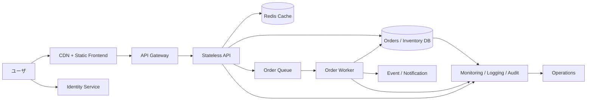

---
tags:
  - cloud
  - aws
  - oci
  - gcp
  - architecture
  - daily
---

[[Home]]

# Cloud Engineer Magazine — 2026-07-11

## 1) 今日のアプリ
**フラッシュセール対応 EC 在庫同期アプリ**

想定ユースケース:
- セール開始直後に注文が短時間で集中する
- 商品一覧、在庫表示、カート、注文確定を提供する
- 在庫の二重引当を避けたい
- 運用チームは売上・在庫逼迫・失敗注文を監視したい

今日は **「高トラフィックな読み取り + 整合性が必要な在庫更新」** をどう設計するかを、AWS / OCI / GCP で比較します。視点は **単一クラウドで完結する実装を基本** にしつつ、最後に **マルチクラウドでどこまで分けるべきか** も触れます。

---

## 2) 要件整理

### 機能要件
- 商品一覧表示
- ユーザ認証
- カート投入
- 注文確定
- 在庫の引当・減算
- 決済連携（今回は外部決済サービス自体は詳細対象外）
- 運用者向け注文・在庫監視

### 非機能要件
- **可用性:** セール時間中の停止は売上損失が大きい。AZ/AD をまたぐ冗長化が必要
- **性能:** 商品一覧は低遅延、在庫確認と注文確定はピーク時でも安定させる
- **セキュリティ:** 認証必須、最小権限 IAM、秘密情報は Secret/Vault 管理、管理系 API は権限分離
- **コスト:** 通常時は低コスト、セール時だけ大きくスケールできる構成が望ましい

---

## 3) 推奨アーキテクチャ（なぜその構成か）

**推奨方針: CDN + stateless API + キャッシュ + 注文キュー + トランザクション DB**

理由:
1. 商品一覧は読み取りが多いため、**CDN とキャッシュ** で DB 負荷を下げる
2. 注文確定は瞬間的に集中するため、**キューで平滑化** してアプリと DB を守る
3. 在庫は「速さ」より **正しく減算されること** が重要なので、整合性を持てる DB 更新を中心に設計する
4. API は stateless にして **オートスケール** しやすくする

**設計のキモ:**
- 商品閲覧系は CDN / キャッシュ優先
- 注文受付は API で即時バリデーション後、キューへ投入
- 在庫引当はワーカーで順序立てて処理
- 在庫不足時は即失敗ではなく、アプリ側で明確な注文失敗/再試行 UX を設ける

**トレードオフ:**
- API で同期的に全部処理すると実装は単純だが、ピーク負荷で DB が詰まりやすい
- キューを挟むと少し複雑になるが、セール時の耐性がかなり上がる

---

## 4) クラウド別実装マップ

### AWS での実装サービス
- フロントエンド: **Amazon S3 + Amazon CloudFront**
- 認証: **Amazon Cognito**
- API: **Amazon API Gateway**
- アプリ実行: **AWS Lambda** または **Amazon ECS on Fargate**
- キャッシュ: **Amazon ElastiCache for Redis**
- 注文キュー: **Amazon SQS**
- 在庫/注文 DB: **Amazon Aurora PostgreSQL**
- 非同期イベント連携: **Amazon EventBridge**
- 監視: **Amazon CloudWatch**, **AWS CloudTrail**
- 秘密情報: **AWS Secrets Manager**

**AWS を選ぶ理由:**
- SQS + Lambda / Fargate の組み合わせが定番で、バースト吸収がしやすい
- CloudFront + S3 で商品ページ配信を軽くできる
- Aurora は在庫更新のようなトランザクション処理に向く

**短い比較:**
- **Lambda** は小さく始めやすい
- **Fargate** は接続制御やライブラリ依存が重いときに楽

### OCI での実装サービス
- フロントエンド: **Object Storage + OCI CDN**
- 認証: **OCI IAM Identity Domains**
- API: **OCI API Gateway**
- アプリ実行: **Container Instances** または **OCI Functions** / **OKE**
- キャッシュ: **OCI Cache**
- 非同期メッセージング: **OCI Queue**
- 在庫/注文 DB: **Autonomous Database** または **MySQL HeatWave**
- イベント連携: **OCI Events**
- 監視: **OCI Monitoring**, **Logging**, **Audit**
- 秘密情報: **OCI Vault**

**OCI を選ぶ理由:**
- API Gateway + Queue + Container Instances の組み合わせで、Kubernetes なしでも段階的に組みやすい
- OCI Cache と Queue でバースト対策を取りやすい
- Identity Domains + Vault で認証/秘密管理を分けやすい

**短い比較:**
- **Functions** は軽量 API に向く
- **Container Instances** は常駐ワーカーや柔軟なランタイムで扱いやすい

### GCP での実装サービス
- フロントエンド: **Cloud Storage + Cloud CDN**
- 認証: **Identity Platform**
- API: **API Gateway**
- アプリ実行: **Cloud Run**
- キャッシュ: **Memorystore for Redis**
- 注文キュー: **Pub/Sub**
- 在庫/注文 DB: **Cloud SQL for PostgreSQL**
- 非同期処理: **Cloud Run jobs / Cloud Run consumers**
- 監視: **Cloud Monitoring**, **Cloud Logging**, **Cloud Audit Logs**
- 秘密情報: **Secret Manager**

**GCP を選ぶ理由:**
- Cloud Run がスケールしやすく、API とワーカーを分けやすい
- Pub/Sub で疎結合な非同期処理を作りやすい
- Cloud CDN + Cloud Storage で静的配信が分かりやすい

**短い比較:**
- Pub/Sub はイベント駆動に強い
- 厳密な順序や単純なワークキュー運用を重視するなら設計上の補助が必要

---

## 5) システム構成図（Mermaidで簡易図）

---

## 6) データフロー / 認証・認可 / 監視運用の要点

### データフロー
1. ユーザがログインして ID トークン取得
2. 商品一覧は CDN とキャッシュ経由で取得
3. 注文確定時に API が入力検証と認可確認を実施
4. API は注文要求をキューへ投入し、受付 ID を返す
5. ワーカーがキューを読み、DB トランザクションで在庫引当・注文確定を実行
6. 成功/失敗イベントを通知または注文ステータス更新へ反映

### 認証・認可
- 一般ユーザ、運用者、管理者をロール分離
- 管理画面 API は別スコープ/別ロールで保護
- API 実行ロールには必要最小限だけ付与
  - キュー送信
  - 特定 DB への接続
  - 特定キャッシュ利用
  - シークレット読み取り
- DB 管理者権限をアプリ実行基盤に直接持たせない
- セキュアバイデフォルトとして、公開は CDN / API Gateway までに限定

### 監視運用
- 監視すべき主要指標
  - API 4xx/5xx
  - キュー滞留件数
  - ワーカー処理遅延
  - DB 接続数 / CPU / ロック待ち
  - キャッシュヒット率
- セール前に負荷試験を行い、キューと DB の閾値アラートを事前設定
- 監査ログで IAM 変更・秘密情報アクセス・運用操作を追跡可能にする

---

## 7) コスト最適化ポイント（初期・成長期）

### 初期
- フロントは静的配信で固定費を抑える
- API は Lambda / Functions / Cloud Run など従量課金を優先
- DB は最小構成から開始し、まずはキャッシュで読み取り負荷を逃がす
- セール対象商品のみキャッシュ TTL を短くし、全件過剰更新を避ける

### 成長期
- ワーカー数をキュー長に応じてスケール
- DB 負荷が増えたら、閲覧系を read replica やキャッシュへ逃がす
- 在庫引当テーブルや注文履歴にパーティショニング/インデックス最適化を行う
- マルチリージョンを入れる前に、まず同一リージョン内でのボトルネックを潰す

**マルチクラウドの現実的な使い分け:**
- 注文コア DB を 3 クラウドで同時更新するのは複雑で高コスト
- まずは **単一クラウドで注文系を完結** させ、分析・BI・バックアップ配布などからマルチクラウドを始める方が実務的

---

## 8) 障害時の設計（DR / バックアップ / フェイルオーバー）

- **DB:** 自動バックアップ、PITR、有効なフェイルオーバー構成を確認
- **キュー:** メッセージ再試行方針とデッドレターキュー相当を用意
- **キャッシュ:** 落ちても注文コアが止まらないよう、キャッシュダウン時の縮退運転を設計
- **静的配信:** CDN キャッシュで一時的なバックエンド劣化を緩和
- **秘密情報:** Secrets Manager / Vault / Secret Manager でローテーション管理

**DR の考え方:**
- 小規模開始: 同一リージョン高可用性 + バックアップ
- 事業影響が大きい段階: 別リージョンへ DB バックアップ複製、IaC による再構築、RTO/RPO 定義

---

## 9) 学習ポイント（今日覚えるクラウド機能）

1. **キューはバースト吸収装置**。ピーク時に API と DB を直接ぶつけない
2. **キャッシュは在庫の正本ではない**。正本はトランザクション DB に置く
3. **CDN は性能だけでなくコストにも効く**
4. **IAM 最小権限** はアプリ、ワーカー、運用者で分ける
5. **マルチクラウドは注文コアより周辺機能から** 始める方が失敗しにくい

---

## 10) 30〜60分ミニ演習

### 演習テーマ
「フラッシュセールで在庫を守る注文経路を 1 クラウドで描く」

### やること
1. AWS / OCI / GCP のどれか 1 つを選ぶ
2. 次の 7 要素を Mermaid か紙で接続する
   - CDN
   - 認証
   - API Gateway
   - アプリ実行基盤
   - キュー
   - Redis
   - PostgreSQL 系 DB
3. 次の問いに答える
   - なぜ注文を即 DB 書き込みだけで処理しないのか？
   - 在庫の正本を Redis にしない理由は？
   - キューが滞留した時、最初に見るメトリクスは何か？
4. 余裕があれば、管理者向け API だけ別ロールにする IAM 設計を書く

---

## 11) 公式ドキュメント参照リンク（AWS / OCI / GCP）

### AWS
- Amazon CloudFront Developer Guide  
  https://docs.aws.amazon.com/AmazonCloudFront/latest/DeveloperGuide/Introduction.html
- Amazon API Gateway Developer Guide  
  https://docs.aws.amazon.com/apigateway/latest/developerguide/welcome.html
- Amazon Cognito Developer Guide  
  https://docs.aws.amazon.com/cognito/latest/developerguide/what-is-amazon-cognito.html
- AWS Lambda Developer Guide  
  https://docs.aws.amazon.com/lambda/latest/dg/welcome.html
- Amazon ECS Developer Guide  
  https://docs.aws.amazon.com/AmazonECS/latest/developerguide/Welcome.html
- Amazon ElastiCache User Guide  
  https://docs.aws.amazon.com/AmazonElastiCache/latest/dg/WhatIs.html
- Amazon SQS Developer Guide  
  https://docs.aws.amazon.com/AWSSimpleQueueService/latest/SQSDeveloperGuide/welcome.html
- Amazon Aurora User Guide  
  https://docs.aws.amazon.com/AmazonRDS/latest/AuroraUserGuide/CHAP_AuroraOverview.html
- AWS CloudWatch User Guide  
  https://docs.aws.amazon.com/AmazonCloudWatch/latest/monitoring/WhatIsCloudWatch.html
- AWS Backup Developer Guide  
  https://docs.aws.amazon.com/aws-backup/latest/devguide/whatisbackup.html

### OCI
- OCI CDN  
  https://docs.oracle.com/en-us/iaas/Content/CDN/Concepts/cdnoverview.htm
- OCI API Gateway  
  https://docs.oracle.com/en-us/iaas/Content/APIGateway/Concepts/apigatewayoverview.htm
- OCI Identity and Access Management / Identity Domains  
  https://docs.oracle.com/en-us/iaas/Content/Identity/home.htm
- OCI Functions  
  https://docs.oracle.com/en-us/iaas/Content/Functions/Concepts/functionsoverview.htm
- OCI Container Instances  
  https://docs.oracle.com/en-us/iaas/Content/container-instances/home.htm
- OCI Queue  
  https://docs.oracle.com/en-us/iaas/Content/queue/overview.htm
- OCI Cache  
  https://docs.oracle.com/en-us/iaas/Content/redis/overview.htm
- OCI Autonomous Database  
  https://docs.oracle.com/en-us/iaas/autonomous-database-serverless/doc/autonomous-introduction.html
- OCI Monitoring  
  https://docs.oracle.com/en-us/iaas/Content/Monitoring/Concepts/monitoringoverview.htm
- OCI Vault  
  https://docs.oracle.com/en-us/iaas/Content/KeyManagement/Concepts/keyoverview.htm

### GCP
- Cloud CDN documentation  
  https://docs.cloud.google.com/cdn/docs/overview
- API Gateway documentation  
  https://docs.cloud.google.com/api-gateway/docs
- Identity Platform documentation  
  https://docs.cloud.google.com/identity-platform/docs
- Cloud Run documentation  
  https://docs.cloud.google.com/run/docs/overview/what-is-cloud-run
- Memorystore for Redis documentation  
  https://docs.cloud.google.com/memorystore/docs/redis
- Pub/Sub documentation  
  https://docs.cloud.google.com/pubsub/docs/overview
- Cloud SQL for PostgreSQL  
  https://docs.cloud.google.com/sql/docs/postgres
- Cloud Monitoring documentation  
  https://docs.cloud.google.com/monitoring/docs
- Secret Manager documentation  
  https://docs.cloud.google.com/secret-manager/docs
- Backup and DR documentation  
  https://docs.cloud.google.com/backup-disaster-recovery/docs

---

## ひとこと
フラッシュセール系は、**「読ませる経路」と「在庫を減らす経路」を分離する** と設計がかなり安定します。速さだけでなく、在庫を壊さないことが本番ではもっと重要です。