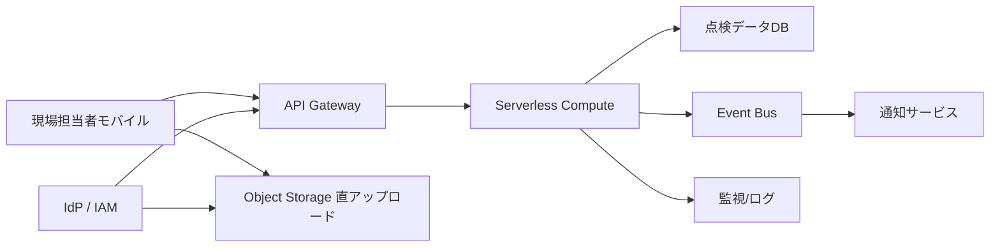

---
tags:
  - cloud
  - aws
  - oci
  - gcp
  - architecture
  - daily
---

[[Home]]

# Cloud Engineer Magazine — 2026-07-12 10:15

## 1) 今日のアプリ
**現場向け設備点検アプリ**

スマホで設備写真を撮り、チェックリストを入力し、異常時は即時に保守チームへ通知するアプリ。

- 想定ユーザー: 工場・ビル管理・店舗運営の現場担当
- 主な操作: 点検記録登録、写真アップロード、異常報告、履歴参照、日次集計
- 今日の視点: **3クラウドで同じ要件をどう実装するか**

## 2) 要件整理
### 機能要件
- モバイル/ブラウザから点検結果を登録
- 写真付きで設備ごとの記録を保存
- 異常時は通知を飛ばす
- 過去の点検履歴を検索
- 管理者は設備マスタと点検項目を管理

### 非機能要件
- **可用性:** 営業時間中は止めにくい。API とデータ層はマネージド優先
- **性能:** 1件の登録は数秒以内。画像アップロードは直列でも耐える
- **セキュリティ:** 認証必須、設備ごとの閲覧権限、最小権限 IAM、保管時暗号化
- **コスト:** 初期はサーバレス中心、成長後にアクセス増へ段階対応

## 3) 推奨アーキテクチャ
**推奨: API Gateway + サーバレス実行基盤 + NoSQL/JSON DB + オブジェクトストレージ + 通知 + 監視**

理由:
- 点検業務はアクセスの波が大きく、常時高負荷ではないためサーバレスが合う
- 写真はオブジェクトストレージ、点検メタデータは JSON/NoSQL に分離すると運用しやすい
- 異常報告だけイベント駆動にすると、通常登録と通知処理を疎結合にできる
- モバイル直アップロード用に**事前署名 URL / 短命資格情報**を使うと API サーバ負荷を減らせる

**トレードオフ**
- フルサーバレスは速く作れるが、複雑なトランザクションや重い集計は苦手
- 将来、分析需要が増えたら DWH/分析基盤へ複製する方が安全
- Cloud Run / Container 系は柔軟だが、最小運用コストだけ見ると FaaS の方が有利な場面が多い

## 4) クラウド別実装マップ
### AWS での実装サービス
- フロント/API: **Amazon API Gateway**
- 認証: **Amazon Cognito**
- 業務ロジック: **AWS Lambda**
- 点検データ: **Amazon DynamoDB**
- 写真保存: **Amazon S3**
- イベント通知: **Amazon EventBridge** + **Amazon SNS**
- 監視: **Amazon CloudWatch** + **AWS CloudTrail**
- セキュリティ補助: **AWS IAM**, **AWS WAF**, **AWS KMS**, **AWS Backup**

**向いている理由**
- DynamoDB + Lambda + API Gateway の相性がよく、初期構築が速い
- EventBridge で異常通知や後続処理を分離しやすい

### OCI での実装サービス
- フロント/API: **OCI API Gateway**
- 認証: **OCI Identity and Access Management (IAM)** + 必要に応じて **Identity Domains**
- 業務ロジック: **OCI Functions**
- 点検データ: **Autonomous JSON Database** または **Autonomous Database**
- 写真保存: **OCI Object Storage**
- イベント通知: **OCI Events** + **OCI Notifications**
- 監視: **OCI Monitoring**, **Logging**, **Audit**
- セキュリティ補助: **OCI Vault**, **Web Application Firewall**, **Cloud Guard**, **Security Zones**

**向いている理由**
- JSON 主体の業務データを Autonomous JSON Database で扱いやすい
- Security Zones / Cloud Guard を組み込むとガードレールを置きやすい

### GCP での実装サービス
- フロント/API: **API Gateway**
- 認証: **Identity Platform** または **IAM / IAP 構成**
- 業務ロジック: **Cloud Run**
- 点検データ: **Firestore**
- 写真保存: **Cloud Storage**
- イベント通知: **Eventarc** + **Pub/Sub**
- 監視: **Cloud Monitoring**, **Cloud Logging**, **Cloud Audit Logs**
- セキュリティ補助: **IAM**, **Cloud Armor**, **Secret Manager**, **Cloud KMS**, **Backup and DR**

**向いている理由**
- Cloud Run はコンテナ柔軟性が高く、画像処理や将来のライブラリ追加にも強い
- Firestore はモバイル寄りワークロードで扱いやすい

## 5) システム構成図（Mermaid）

## 6) データフロー / 認証・認可 / 監視運用の要点
### データフロー
1. ユーザーがログイン
2. API が点検登録用メタデータを受け取る
3. 画像は直アップロード URL でオブジェクトストレージへ保存
4. 業務ロジックが点検レコードを DB に保存
5. 異常フラグありならイベント発行
6. 通知サービスが保守担当へ通知

### 認証・認可
- エンドユーザー認証はマネージド IdP を使う
- ロール例:
  - 点検担当: 自部署設備のみ登録・参照
  - 監督者: 承認・全件参照
  - 管理者: 設備マスタ更新
- ストレージ権限は**バケット全権限を配らず**、短命トークン/署名 URL を発行
- サービス間は最小権限 IAM。DB/通知/秘密情報ごとに分離

### 監視運用
- 監視対象:
  - API 4xx/5xx
  - 関数/コンテナ失敗率
  - DB レイテンシ
  - 通知失敗数
  - ストレージアップロード失敗
- 監査ログは必ず有効化
- 異常時は「登録失敗」「通知失敗」を別アラートにする

## 7) コスト最適化ポイント
### 初期
- 常時稼働 VM を置かず、API + サーバレス中心
- 画像はライフサイクルルールで低頻度層へ移行
- 監視メトリクスとログ保持期間を最初から設計

### 成長期
- DB アクセスパターンを見てインデックス最適化
- 画像サムネイル生成を非同期化
- 通知や集計をイベント駆動へ寄せ、同期 API を軽く保つ
- GCP なら Cloud Run の最小インスタンス、AWS なら Lambda メモリ、OCI なら Functions 実行設定を計測ベースで調整

## 8) 障害時の設計
- **DR:** 重要データは別リージョン複製またはバックアップ方針を定義
- **バックアップ:** DB 定期バックアップ、オブジェクトストレージのバージョニング/保護設定を検討
- **フェイルオーバー:**
  - API 層はマネージドサービスで吸収
  - DB はサービスごとのクロスリージョン/復旧機能を活用
  - 通知失敗は DLQ または再試行設計を持つ
- **実務上の優先順位:**
  1. 点検記録を失わない
  2. 写真を失わない
  3. 通知は遅延しても再送できる

## 9) 学習ポイント（今日覚えるクラウド機能）
- **AWS:** EventBridge は業務イベント分離に強い。Lambda 直結より拡張しやすい
- **OCI:** Security Zones / Cloud Guard は「危険な構成を作りにくくする」設計に向く
- **GCP:** Cloud Run はコンテナ互換性が高く、サーバレスでも実装自由度が高い

## 10) 30〜60分ミニ演習
**お題:** 「異常報告だけ通知する API」を1本設計する

やること:
1. 入力 JSON を定義する
   - `inspectionId`
   - `assetId`
   - `status` (`ok` / `warning` / `critical`)
   - `photoUrl`
   - `comment`
2. 3クラウドで以下を1つずつ書き出す
   - API 入口サービス
   - 実行基盤
   - データ保存先
   - 通知サービス
3. 次を判断する
   - 同期レスポンスに通知結果を含めるか
   - イベント分離するか
   - 写真アップロードを API 経由にするか直アップロードにするか
4. 最後に IAM ポリシー観点を3つメモ
   - ストレージ書き込み権限
   - DB 更新権限
   - 通知発行権限

## 11) 公式ドキュメント参照リンク（AWS/OCI/GCP）
### AWS
- API Gateway: https://docs.aws.amazon.com/apigateway/latest/developerguide/welcome.html
- Lambda: https://docs.aws.amazon.com/lambda/latest/dg/welcome.html
- DynamoDB: https://docs.aws.amazon.com/amazondynamodb/latest/developerguide/Introduction.html
- S3: https://docs.aws.amazon.com/AmazonS3/latest/userguide/Welcome.html
- Cognito: https://docs.aws.amazon.com/cognito/latest/developerguide/what-is-amazon-cognito.html
- EventBridge: https://docs.aws.amazon.com/eventbridge/latest/userguide/eb-what-is.html
- CloudWatch: https://docs.aws.amazon.com/AmazonCloudWatch/latest/monitoring/WhatIsCloudWatch.html

### OCI
- API Gateway: https://docs.oracle.com/en-us/iaas/Content/APIGateway/Concepts/apigatewayoverview.htm
- Functions: https://docs.oracle.com/en-us/iaas/Content/Functions/Concepts/functionsoverview.htm
- Object Storage: https://docs.oracle.com/en-us/iaas/Content/Object/Concepts/objectstorageoverview.htm
- Autonomous JSON Database: https://docs.oracle.com/en-us/iaas/autonomous-database-serverless/doc/autonomous-json-database.html
- Events: https://docs.oracle.com/en-us/iaas/Content/Events/Concepts/eventsoverview.htm
- Notifications: https://docs.oracle.com/en-us/iaas/Content/Notification/Concepts/notificationoverview.htm
- Monitoring: https://docs.oracle.com/en-us/iaas/Content/Monitoring/Concepts/monitoringoverview.htm
- IAM: https://docs.oracle.com/en-us/iaas/Content/Identity/Concepts/overview.htm

### GCP
- API Gateway: https://docs.cloud.google.com/api-gateway/docs
- Cloud Run: https://docs.cloud.google.com/run/docs/overview/what-is-cloud-run
- Firestore: https://docs.cloud.google.com/firestore/docs/overview
- Cloud Storage: https://docs.cloud.google.com/storage/docs/introduction
- Pub/Sub: https://docs.cloud.google.com/pubsub/docs/overview
- Eventarc: https://docs.cloud.google.com/eventarc/docs/overview
- Cloud Monitoring: https://docs.cloud.google.com/monitoring/docs/monitoring-overview
- IAM: https://docs.cloud.google.com/iam/docs/overview
