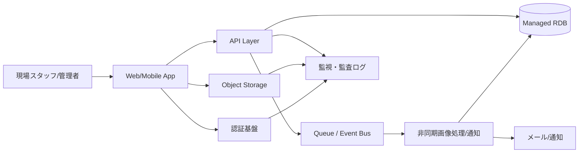

---
tags:
  - cloud
  - aws
  - oci
  - gcp
  - architecture
  - daily
---
[[Home]]

# Cloud Engineer Magazine — 2026-07-14

## 1) 今日のアプリ
**写真付き設備点検アプリ**

現場スタッフがモバイルから設備の点検結果・写真・チェックリストを登録し、管理者がWeb画面で承認・是正指示・履歴検索を行うアプリ。

---

## 2) 要件整理
### 機能要件
- 点検チェックリスト入力
- 写真アップロード
- 点検結果の保存・検索
- 承認ワークフロー
- 通知（差し戻し/承認）
- 監査ログ保持

### 非機能要件
- **可用性**: 業務時間帯に高可用、単一AZ障害に耐える
- **性能**: 写真アップロードは数MB〜20MB程度、一覧画面は低レイテンシ
- **セキュリティ**: SSO/社内ID連携、最小権限IAM、保存時暗号化、監査ログ
- **コスト**: 初期はサーバレス優先、利用増加時にDB/コンテナを段階的最適化

---

## 3) 推奨アーキテクチャ（なぜその構成か）
**推奨方針: API + オブジェクトストレージ + マネージドDB + 非同期処理**

理由:
- 写真本体はDBではなくオブジェクトストレージに置く方が安い
- 点検登録と画像処理を分離すると、アップロード時の体感性能が良い
- 承認ワークフローや通知はイベント駆動にすると拡張しやすい
- 社内アプリなので、公開範囲・認証を厳密に制御しやすい構成が重要

**基本構成**
- フロント: SPA もしくは軽量Webアプリ
- API: サーバレス関数 or コンテナ
- 画像保存: オブジェクトストレージ
- 業務データ: マネージドRDB
- 非同期処理: キュー/イベント
- 認証: マネージドID基盤 + 企業IdP連携
- 監視: ログ、メトリクス、監査証跡

---

## 4) クラウド別実装マップ
### AWS での実装サービス
- フロント: **AWS Amplify Hosting** または **S3 + CloudFront**
- API: **Amazon API Gateway** + **AWS Lambda**
- 写真保存: **Amazon S3**
- 業務DB: **Amazon Aurora PostgreSQL Serverless v2** または **Amazon RDS for PostgreSQL**
- 非同期処理: **Amazon SQS** + Lambda
- 認証: **Amazon Cognito**（必要に応じて企業IdP連携）
- 秘密情報: **AWS Secrets Manager**
- 監視/監査: **Amazon CloudWatch**, **AWS CloudTrail**

**選定理由**
- 初期は Lambda 中心で運用負荷を下げやすい
- S3 presigned URL でアプリサーバを経由せず安全に写真アップロードしやすい
- ワークフローが複雑化したら Step Functions も追加しやすい

### OCI での実装サービス
- フロント: **Object Storage** + **Load Balancer** + 静的配信、または **Container Instances/OKE** 上のWebアプリ
- API: **Oracle Functions** または **OKE (Oracle Kubernetes Engine)**
- 写真保存: **OCI Object Storage**
- 業務DB: **Autonomous Database** または **Base Database Service (PostgreSQL/MySQL選択方針次第)**
- 非同期処理: **OCI Queue** / **OCI Events**
- 認証: **OCI IAM**（フェデレーション含む）
- 秘密情報: **OCI Vault**
- 監視/監査: **OCI Monitoring**, **Logging**, **Audit**

**選定理由**
- OCIは IAM/Vault/Object Storage/Audit を組み合わせた堅実な業務系構成が作りやすい
- DB重視なら Autonomous Database を軸にしやすい
- コンテナ標準化したい場合は OKE が素直

### GCP での実装サービス
- フロント: **Firebase Hosting** または **Cloud Storage + Cloud CDN**
- API: **Cloud Run**
- 写真保存: **Cloud Storage**
- 業務DB: **Cloud SQL for PostgreSQL**
- 非同期処理: **Pub/Sub** と必要に応じて **Cloud Tasks**
- 認証: **Identity Platform** または **Cloud Identity/IAM連携**
- 秘密情報: **Secret Manager**
- 監視/監査: **Cloud Monitoring**, **Cloud Logging**, **Cloud Audit Logs**

**選定理由**
- Cloud Run は HTTP API を小さく始めるのに向く
- Pub/Sub で画像後処理や通知を疎結合化しやすい
- GCP は運用観測性が比較的まとめやすい

**短いトレードオフ**
- **AWS**: サービス選択肢が多く細かく設計できるが、設計判断点も増える
- **OCI**: 業務系・統制寄りの設計がしやすいが、採用事例ベースの情報は AWS/GCP より少なめ
- **GCP**: Cloud Run/Pub/Sub でシンプルに作りやすいが、細かな企業認証要件は設計確認が必要

---

## 5) システム構成図（Mermaid）


---

## 6) データフロー/認証・認可/監視運用の要点
### データフロー
1. ユーザーが認証
2. API がアップロード用一時URLを発行
3. クライアントが写真を直接オブジェクトストレージへ保存
4. API が点検メタデータをDBへ保存
5. 保存イベントで非同期処理を起動
6. サムネイル生成・通知・監査記録を実行

### 認証・認可
- ユーザー認証はマネージドID基盤を使用
- API はロール別認可（点検者/承認者/監査者）
- ストレージは**公開禁止**、アップロード/ダウンロードは署名付きURLや短命トークン利用
- DB接続情報は Secret Manager/Vault/Secrets Manager に格納
- IAM はサービス単位で最小権限

### 監視運用
- API エラー率、レイテンシ、キュー滞留、DB接続数、ストレージイベント失敗を監視
- 監査ログは削除不可ポリシーや長期保存を検討
- アラートは「ユーザー影響指標」を優先（API 5xx、承認遅延、アップロード失敗率）

---

## 7) コスト最適化ポイント（初期・成長期）
### 初期
- API は Lambda / Functions / Cloud Run など従量課金を優先
- 画像はライフサイクルポリシーで低頻度アクセス層へ移行
- DB は最小構成、ただしバックアップは削らない

### 成長期
- 高頻度APIはコンテナ化して常時起動最適化を比較
- DB の読み取り負荷が増えたらリードレプリカやキャッシュ導入を検討
- 写真配信が多ければ CDN を利用
- ログ保持期間を用途別に分離して無駄を削減

---

## 8) 障害時の設計（DR/バックアップ/フェイルオーバー）
- DB は自動バックアップを有効化
- 重要テーブルは PITR（ポイントインタイムリカバリ）を前提にする
- オブジェクトストレージはバージョニング/保持ポリシーを有効化
- API 層はマルチAZ/リージョン設計の前に**ステートレス化**を徹底
- RTO/RPO を業務要件に合わせる。点検アプリなら例として **RTO 4時間 / RPO 15分** から設計開始しやすい
- マルチリージョンは最初から必須ではない。監査要件・停止コストが高まってから段階的に導入

---

## 9) 学習ポイント（今日覚えるクラウド機能）
- **Presigned URL / Signed URL** の考え方
- **イベント駆動**でアップロード処理を疎結合化する設計
- **監査ログ**を最初から設計に入れる重要性
- **最小権限IAM**は「人」だけでなく「サービス間通信」にも必要

---

## 10) 30〜60分ミニ演習
**演習テーマ: 画像アップロードを安全に設計する**

1. AWS / OCI / GCP のどれか1つを選ぶ
2. 次を紙またはObsidianに書く
   - 認証方式
   - アップロードURL発行の流れ
   - DB に保存するメタデータ項目
   - 非同期処理で実行する内容
   - 監視項目 5つ
3. 最後に「アプリサーバ経由アップロード」と「直接オブジェクトストレージアップロード」の違いを3点比較する

---

## 11) 公式ドキュメント参照リンク（AWS/OCI/GCP）
### AWS
- API Gateway: https://docs.aws.amazon.com/apigateway/
- AWS Lambda: https://docs.aws.amazon.com/lambda/
- Amazon S3: https://docs.aws.amazon.com/s3/
- Amazon Cognito: https://docs.aws.amazon.com/cognito/
- Amazon RDS: https://docs.aws.amazon.com/rds/
- Amazon Aurora: https://docs.aws.amazon.com/aurora/
- Amazon SQS: https://docs.aws.amazon.com/AWSSimpleQueueService/
- AWS CloudTrail: https://docs.aws.amazon.com/cloudtrail/
- Amazon CloudWatch: https://docs.aws.amazon.com/cloudwatch/

### OCI
- Oracle Functions: https://docs.oracle.com/en-us/iaas/Content/Functions/home.htm
- Object Storage: https://docs.oracle.com/en-us/iaas/Content/Object/home.htm
- Queue: https://docs.oracle.com/en-us/iaas/Content/queue/home.htm
- Events: https://docs.oracle.com/en-us/iaas/Content/Events/home.htm
- IAM: https://docs.oracle.com/en-us/iaas/Content/Identity/home.htm
- Vault: https://docs.oracle.com/en-us/iaas/Content/KeyManagement/home.htm
- Monitoring: https://docs.oracle.com/en-us/iaas/Content/Monitoring/home.htm
- Logging: https://docs.oracle.com/en-us/iaas/Content/Logging/home.htm
- Audit: https://docs.oracle.com/en-us/iaas/Content/Audit/home.htm
- OKE: https://docs.oracle.com/en-us/iaas/Content/ContEng/home.htm
- Autonomous Database: https://docs.oracle.com/en-us/iaas/autonomous-database-serverless/doc/

### GCP
- Cloud Run: https://docs.cloud.google.com/run/docs
- Cloud Storage: https://docs.cloud.google.com/storage/docs
- Cloud SQL: https://docs.cloud.google.com/sql/docs
- Pub/Sub: https://docs.cloud.google.com/pubsub/docs
- Cloud Tasks: https://docs.cloud.google.com/tasks/docs
- Secret Manager: https://docs.cloud.google.com/secret-manager/docs
- Cloud Monitoring: https://docs.cloud.google.com/monitoring/docs
- Cloud Logging: https://docs.cloud.google.com/logging/docs
- Cloud Audit Logs: https://docs.cloud.google.com/logging/docs/audit
- Identity Platform: https://docs.cloud.google.com/identity-platform/docs
```