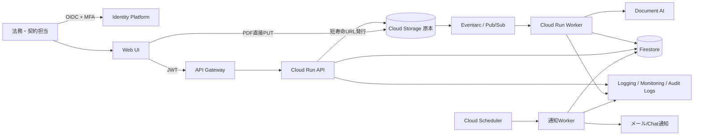

---
tags:
  - cloud
  - aws
  - oci
  - gcp
  - architecture
  - daily
---
[[Home]]

# Cloud Engineer Magazine — 2026-07-15

## 1) 今日のアプリ

**契約書の義務・更新期限トラッカー**

PDF契約書から契約先、開始・終了日、自動更新、解約通知期限、金額を抽出し、担当者が確認・承認した期限を通知する社内Webアプリ。今回は **GCP単一クラウドを推奨**し、AWS・OCIでの等価実装も比較する。

## 2) 要件整理

### 機能要件

- PDFアップロード、版管理、原本ダウンロード
- OCR・項目抽出、信頼度表示、担当者による修正・承認
- 契約・期限・担当部署の検索、期限の30/14/7日前通知
- RBAC（閲覧者、法務承認者、管理者）と監査証跡

### 非機能要件

- **可用性:** 月間99.9%を目標。単一ゾーン障害で停止しないマネージドサービスを優先
- **性能:** 20MB/100ページ程度のPDFを非同期受付し、APIは2秒以内にジョブIDを返す
- **セキュリティ:** HTTPS、保存時暗号化、MFA、原本バケット非公開、最小権限、ログへの契約本文出力禁止
- **コスト:** 低頻度利用を想定してリクエスト課金・スケールゼロを優先。OCR再実行を抑制

## 3) 推奨アーキテクチャ（なぜその構成か）

**GCP: API Gateway + Cloud Run + Cloud Storage + Pub/Sub + Document AI + Firestore**

1. 大容量PDFはAPI経由で中継せず、短寿命の署名付きURLでCloud Storageへ直接送る。
2. アップロードイベントをPub/Subへ流し、Cloud RunワーカーがDocument AIを非同期実行する。受付APIと重い文書処理を分離でき、再試行もしやすい。
3. 抽出結果と状態はFirestore、原本はバージョニングを有効にしたCloud Storageへ分離保存する。
4. 抽出値は信頼度に関係なく `DRAFT` とし、法務担当の承認後だけ通知対象にする。AI誤認識による解約期限事故を防ぐ。

**トレードオフ:** Cloud Runはコンテナ自由度とスケールゼロが利点。単機能ならCloud Functionsが簡潔だが、PDF処理ライブラリや複数エンドポイントが増える本件はCloud Runが扱いやすい。Firestoreは運用が軽い一方、複雑な契約横断集計が主目的ならCloud SQLが適する。

## 4) クラウド別実装マップ

|機能|AWS|OCI|GCP（推奨）|
|---|---|---|---|
|Web/API|CloudFront + S3 / API Gateway + Lambda|Object Storage + CDN / API Gateway + Functions|Cloud Storage + Cloud CDN / API Gateway + Cloud Run|
|認証|Cognito User Pools（OIDC/MFA）|IAM Identity Domains（OIDC/MFA）|Identity Platform（OIDC/MFA）|
|原本|S3（Versioning、SSE-KMS）|Object Storage（Versioning、Vault鍵）|Cloud Storage（Object Versioning、CMEK）|
|非同期化|EventBridge + SQS|Events + Queue|Eventarc + Pub/Sub|
|文書抽出|Textract（複数ページは非同期）|Document Understanding|Document AI|
|メタデータ|DynamoDB|NoSQL Database Cloud Service|Firestore|
|通知|EventBridge Scheduler + SNS|Scheduled Functions + Notifications|Cloud Scheduler + Pub/Sub/通知ワーカー|
|監視・監査|CloudWatch + CloudTrail|Monitoring + Logging + Audit|Cloud Monitoring + Cloud Logging + Audit Logs|

## 5) システム構成図

## 6) データフロー／認証・認可／監視運用の要点

### データフロー

1. APIが `documentId` と5分有効のアップロードURLを発行。クライアントはPDFを直接アップロード。
2. イベントをPub/Subに投入。メッセージには本文を含めず、バケット・オブジェクトID・世代番号だけを載せる。
3. Workerは `documentId + objectGeneration` を冪等キーにし、重複配信でも二重OCRしない。
4. Document AI結果を `DRAFT` 保存。担当者承認で `APPROVED` に遷移し、期限通知へ参加させる。

### 認証・認可

- Identity PlatformでMFAを必須化し、短命JWTをAPI Gatewayで検証する。
- API層でも `tenantId`、部署、役割を検査する。URLのIDだけを信用しない。
- Cloud Runごとに専用サービスアカウントを作成。APIはFirestore限定、WorkerだけにDocument AI呼出しと対象バケット読取を許可する。
- 原本バケットはPublic Access Preventionを有効化。署名付きURLは単一オブジェクト・短時間・PUT限定にする。

### 監視運用

- SLI: API p95、5xx率、OCR処理時間、Pub/Sub未処理最古時間、抽出失敗率、通知失敗率。
- アラート: 5xx率>2%（5分）、未処理最古>15分、期限通知DLQ>0。相関IDをAPI→メッセージ→Workerへ引き継ぐ。
- 監査ログとアプリの「誰がどの項目を変更・承認したか」を別保存し、改変防止の保持期間を設定する。

## 7) コスト最適化ポイント

### 初期

- Cloud Runは最小インスタンス0、同時実行数を適切に設定。開発環境は夜間停止ではなくスケールゼロを活用。
- PDFのSHA-256を保存し、同一ファイルのOCR再実行を回避。失敗時は指数バックオフ、上限後はDLQへ送る。
- 原本は一定期間後に低頻度ストレージへ移すライフサイクルルールを設定する。

### 成長期

- Document AIの処理量上限と料金を監視し、小さい単一ページは同期、大量・複数ページはバッチに振り分ける。
- 検索要件を計測し、Firestoreの複合インデックスは実クエリに限定。全文検索が必要になった段階で専用検索基盤を追加する。
- 常時高負荷になればCloud Runの最小インスタンスを1以上にし、コールドスタートと固定費を比較する。

## 8) 障害時の設計（DR／バックアップ／フェイルオーバー）

- **RPO 24時間、RTO 4時間**を初期目標とする。Cloud Storageのバージョニングと保持ポリシー、FirestoreのPITR/定期エクスポートを有効化。
- Pub/Subはat-least-once前提。冪等キーと状態遷移の条件付き更新で再処理可能にする。恒久エラーはDLQから手動再投入。
- Document AI停止時もアップロード受付は継続し、状態を `QUEUED` に保つ。復旧後にバックログを消化する。
- リージョン障害時はIaCで待機リージョンへAPI/Workerを展開し、復元済みデータへ切替。四半期ごとに「復元して検索・通知できるか」を演習する。
- **注意:** バックアップの存在ではなく、復元テスト成功をDR完了条件にする。

## 9) 学習ポイント（今日覚えるクラウド機能）

- **AWS Textract非同期処理:** S3上の複数ページPDFをStart APIで開始し、完了をSNS/SQSで受ける。Get APIのポーリング連打を避ける。
- **OCI Document Understanding:** API/CLIからOCR、表、キー項目を抽出でき、日本語OCRはモデル/バージョンの対応言語を事前確認する。
- **GCP Document AI Processor:** 文書とモデルの間にProcessorを作り、OCR・分類・抽出を用途別に選ぶ。
- 3社共通の設計原則は「原本をオブジェクトストレージへ置き、抽出を非同期化し、低信頼度だけでなく重要項目は人が承認する」。

## 10) 30〜60分ミニ演習

**目標:** GCP上で「アップロード受付→非同期ジョブ投入」まで作る（Document AI実呼出しはモック可）。

1. Cloud Storageバケットを作成し、公開アクセス防止・バージョニングを有効化（10分）。
2. Pub/SubトピックとDLQ用トピックを作成（5分）。
3. `POST /documents` でUUIDと署名付きPUT URLを返すCloud Run APIを作る（15分）。
4. Pub/Sub pushを受け、`documentId + generation` をログ出力するWorkerを作る（15分）。
5. API用/Worker用サービスアカウントを分け、Workerだけに対象オブジェクト読取権限を付与（10分）。
6. 同じメッセージを2回送り、冪等キーで2回目をスキップできることを確認（5分）。

**完了条件:** バケットが非公開、URLが5分で失効、重複メッセージで処理が増えず、ログにPDF本文や署名付きURLが残らない。

## 11) 公式ドキュメント参照リンク

### AWS

- [Amazon Textractとは](https://docs.aws.amazon.com/textract/latest/dg/what-is.html)
- [Textractの非同期文書処理](https://docs.aws.amazon.com/textract/latest/dg/api-async.html)
- [Amazon Cognito User Pools](https://docs.aws.amazon.com/cognito/latest/developerguide/cognito-user-pools.html)
- [DynamoDBのポイントインタイムリカバリ](https://docs.aws.amazon.com/amazondynamodb/latest/developerguide/Point-in-time-recovery.html)

### OCI

- [OCI Document Understanding](https://docs.oracle.com/en-us/iaas/Content/document-understanding/using/home.htm)
- [Document Understanding: 対応形式・言語](https://docs.oracle.com/en-us/iaas/Content/document-understanding/using/getting_started.htm)
- [OCI API Gateway](https://docs.oracle.com/en-us/iaas/Content/APIGateway/)
- [OCI Monitoring概要](https://docs.oracle.com/en-us/iaas/Content/Monitoring/Concepts/monitoringoverview.htm)

### GCP

- [Document AI概要](https://docs.cloud.google.com/document-ai/docs/overview)
- [API Gateway + Cloud Run](https://docs.cloud.google.com/api-gateway/docs/get-started-cloud-run)
- [Cloud RunのサービスID](https://docs.cloud.google.com/run/docs/securing/service-identity)
- [Identity Platform](https://docs.cloud.google.com/identity-platform/docs)

---

**今日の設計判断:** AI抽出の精度を上げること以上に、誤抽出が業務上の確定値にならない状態遷移・承認・監査証跡を設計する。
