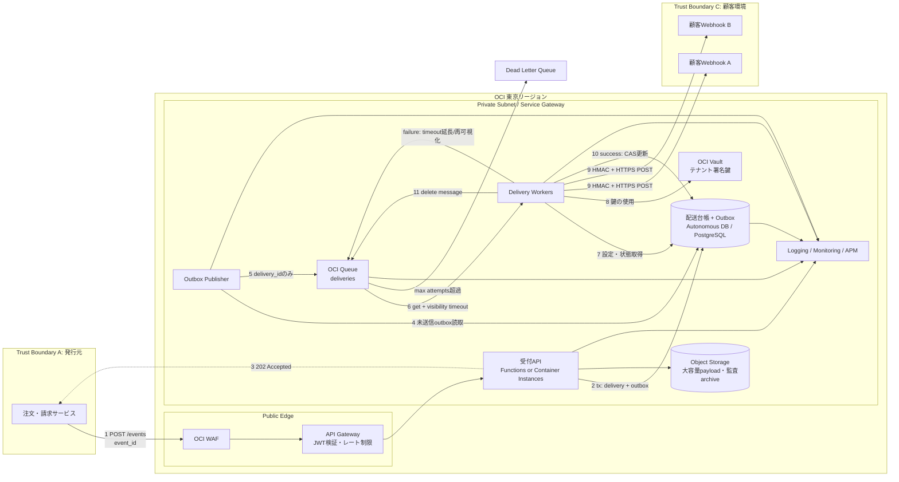

[[Home]]

# Weekly Cloud Engineer Magazine — 2026-07-17

> [!warning] 費用・安全
> ラボでクラウド資源を作成すると課金が発生する可能性がある。開始前に予算アラートを設定し、終了後は「クリーンアップ」を実行すること。実在する顧客URL、認証情報、個人情報は使わない。サンプル値と動的グループの最小権限ポリシーだけを使う。

# 1. 今週の設計テーマ

## アプリ、主クラウド、焦点

- **アプリ:** B2B Webhook配信基盤。注文・請求・配送イベントを契約企業のHTTPSエンドポイントへ確実に通知する。
- **主実装クラウド:** **Oracle Cloud Infrastructure (OCI)**
- **主判定基準:** **Messaging** — at-least-once配信下で、順序、再試行、冪等性、バックプレッシャー、DLQをどう成立させるか。
- **難易度シグナル:** **Intermediate**。学習順序の門ではなく、必要な概念量の目安である。

## 必要知識・ツール・環境・先行概念

- 必要知識: HTTPステータス、指数バックオフ、JSON、ハッシュ、データベースの一意制約、SLI/SLO。
- 先行概念: 同期APIと非同期ワーカーの分離、at-least-onceは「重複し得る」、配信成功と業務処理成功は別物、キューはデータベースではない。
- ツール: OCI ConsoleまたはCloud Shell、OCI CLI、Terraform 1.7+（設計のみなら不要）、Python 3.11+、`curl`、OpenSSL、Mermaid対応エディタ。
- 環境: 学習専用OCIコンパートメント、東京リージョン、空のVCN、テスト用HTTPS受信サーバー。実資格情報をコードやキューメッセージに入れない。

## 測定可能な到達目標

1. APIがイベント受付を **p95 300ms以内**で完了し、外部宛先の遅さから切り離される設計を説明できる。
2. 同じ `event_id` を3回投入しても、受信側の業務更新が1回になることを検証できる。
3. 429/500/タイムアウトを再試行し、恒久的400系を隔離する分類を実装できる。
4. 5回失敗したイベントがDLQへ移り、運用者が原因を確認して安全に再投入できる。
5. キュー滞留時間から「SLO違反までの余裕」を算出できる。

## 学習レイヤー

1. **Foundation:** 配信保証、visibility timeout、ack/delete、冪等性。
2. **Practical implementation:** OCI Queue + Functions/Container Instances + Autonomous DatabaseまたはPostgreSQLで配送状態を管理。
3. **Production concerns:** テナント分離、署名、負荷制御、観測、DLQ運用、コスト。
4. **Optional advanced challenge:** テナント単位の順序保証と公平性、リージョンDR。

# 2. 要件と制約

## 機能要件

- 発行元サービスから `event_type`, `event_id`, `tenant_id`, `occurred_at`, `payload` を受け付ける。
- テナントごとにWebhook URL、購読イベント、署名鍵参照、最大送信率を管理する。
- HMAC署名付きPOSTを送信し、成功・失敗・試行回数・応答コードを検索できる。
- 失敗を自動再試行し、DLQから選択的に再投入できる。
- 鍵更新時は旧鍵と新鍵の重複有効期間を設ける。

## 非機能要件と仮定

|項目|目標・仮定|
|---|---|
|平均/ピーク|平均50イベント/秒、5分間ピーク500イベント/秒|
|サイズ|平均2KB、p99 16KB、上限64KB。大きい本文はObject Storage参照|
|宛先数|1イベント平均1.4宛先、最大3|
|受付SLO|月間99.95%、p95 300ms|
|配信SLO|受理イベントの99.9%を5分以内に成功または明示的DLQ化|
|RTO/RPO|RTO 60分、RPO 5分。受付停止時は発行元が再送|
|保持|配送メタデータ30日、監査ログ365日、キュー本文最大7日以内|
|コンプライアンス|個人情報・カード情報はpayloadに含めない。データ所在地は日本。監査証跡必須|
|予算枠|学習環境は月20 USD相当以内、本番小規模は月150 USD相当以内を初期ガードレールとする（見積り、契約通貨・税・リージョンで要再計算）|

SLOは「相手先が常に成功を返す」ことまでは保証しない。自社が制御できる受付、キュー投入、規定回数の配送試行、DLQ化を測る。相手先の長期停止は顧客別指標として分離する。

# 3. Architecture Decision Record: ADR-001

## 文脈

外部Webhookを同期送信すると、遅い顧客1社が注文APIを遅延させる。配信の重複と順序要求はテナントごとに異なり、無制限再試行は障害を増幅する。

## 検討した選択肢

|選択肢|長所|短所|
|---|---|---|
|A. APIから同期HTTP送信|単純、即時結果|外部障害が本線へ伝播、ピーク吸収不可|
|B. OCI Queue + stateless worker + 配送台帳|運用が軽い、スケール、再試行/DLQ、REST/STOMP|at-least-once前提、グローバルな厳密順序は持たない|
|C. OCI Streaming/Kafka互換中心|パーティション順序、高スループット、再読込|今回のタスクキュー用途には運用・消費位置管理が過剰|
|D. DBテーブルをポーリング|トランザクションと一体化しやすい|ロック、掃除、ポーリング負荷、スケール設計を自前化|

## 決定

**Bを採用する。** 受付APIは配送レコードを作成し、Outboxレコードと同一トランザクションで確定する。Outbox publisherがOCI Queueへ `delivery_id` だけを投入する。Workerは台帳から宛先とpayload参照を取得し、HTTP送信後に状態を条件付き更新してからメッセージを削除する。

重要なのは「exactly-once transport」を期待せず、**at-least-once transport + idempotent effect** を作ること。送信先には `X-Webhook-Id` を冪等キーとして保持してもらう。自社側も `delivery_id + attempt_no` の一意制約と状態遷移CASで多重ワーカーを防ぐ。

## トレードオフと却下理由

- 同じテナント内の全イベントを厳密直列化しない。`aggregate_id` 単位の順序が必要なイベントだけ別channel/論理レーンへ振り分ける。全体順序はスループットと障害隔離を悪化させる。
- Queueの保持上限に業務履歴を依存しない。正本は配送台帳とObject Storageに置く。
- 4xxを一律再試行しない。408/409/425/429は再試行候補、その他400系は設定/契約エラーとしてDLQへ送る。顧客契約で上書き可能にする。
- DBポーリング案は小規模PoCなら許容するが、本番のピーク500/sとテナント公平性には採用しない。

# 4. 詳細アーキテクチャとフロー

## リクエスト/データフロー

1. 発行元は安定した `event_id` を付ける。API GatewayがJWT、audience、時刻、発行元スコープを検証する。
2. APIは `(producer_id, event_id)` の一意制約で重複受付を統合し、配送台帳とOutboxを同一DBトランザクションで保存する。
3. DB確定後に202を返す。Queue投入の一時障害はOutboxが吸収する。
4. Publisherは未発行Outboxを短いleaseで取得しQueueへバッチ投入する。成功後に `published_at` を記録する。クラッシュによる二重投入は許容する。
5. Workerは最大20件をロングポーリングし、処理時間のp99より長いvisibility timeoutを設定する。長処理では更新APIで延長する。
6. 配送前に `timestamp + '.' + raw_body` をVault鍵でHMAC-SHA256署名する。URL、鍵、本文はログに出さない。
7. 2xxなら配送台帳を `DELIVERED` に条件付き更新し、その後Queueメッセージを削除する。DB更新後・delete前に落ちても再配送は冪等キーで無害化する。
8. 一時エラーは `min(cap, base*2^attempt)+jitter` で再試行。恒久エラーまたは最大回数超過はDLQと台帳 `DEAD` に記録する。

# 5. セキュリティ、境界、暗号化、ネットワーク、観測

## IAMと信頼境界

- 人間管理者: Identity Domains + MFA。閲覧者、運用者、鍵管理者を分離する。
- API dynamic group: 対象DBへの接続、限定Object Storage bucketへの書込みのみ。Queue consume権限は与えない。
- Publisher dynamic group: 配送QueueへのputとOutbox更新のみ。
- Worker dynamic group: Queue get/update/delete、配送台帳の限定操作、指定Vault secret bundleの読取りのみ。
- Break-glass運用者: 時限承認を必須とし、DLQ再投入と鍵参照を別権限にする。
- Queue、Vault、Object Storageは専用コンパートメントへ置き、`manage all-resources` は使わない。

## 暗号化・ネットワーク・秘密

- 外部通信はTLS 1.2+。顧客が対応できる場合はmTLSをオプションにする。
- Queue、DB、Object Storageは保存時暗号化。規制要件がある場合のみVaultの顧客管理鍵へ切替え、鍵停止が配信停止を招くことをrunbook化する。
- Workerはprivate subnet。OCIサービスへの通信はService Gateway、顧客Webhookへの外向き通信はNAT Gateway経由。受信インバウンドを持たない。
- 宛先URLはSSRF対策としてHTTPS限定、DNS解決後のprivate/link-local/metadataアドレスを拒否し、リダイレクトを無効化する。
- HMAC鍵はメッセージや環境変数に置かずVault参照。ログには `secret_id` も不要なら残さない。

## ログ・メトリクス・トレース

- 構造化ログ: `delivery_id`, `tenant_hash`, `event_type`, `attempt`, `result_class`, `latency_ms`, `trace_id`。payload、URLクエリ、Authorization、署名は除外する。
- メトリクス: 受付率、Queue visible/in-flight、最古メッセージ年齢、試行/成功/DLQ率、宛先別429率、Worker並列数、Outbox未発行数。
- Trace: API受付 span と非同期配送 span を `traceparent` またはリンクで関連付ける。外部送信には内部トレース情報を必要最小限だけ渡す。
- アラート: 最古年齢>120秒（warning）、>240秒（critical）、DLQ>0、成功率<99.9%、Outbox最古>60秒。

# 6. キャパシティとコストモデル

## 明示的仮定と計算

**以下は設計見積りであり、実測値ではない。**

- 平均50 events/s × 1.4配送 = **70 deliveries/s**。
- 1か月を2,592,000秒とすると、約 **181.4M deliveries/月**。
- 1配送あたり Queue操作を put 1 + get 1 + delete 1 = 3、15%が1回再試行すると update/get/delete相当を約3操作追加。
- 概算操作数 = 181.4M × (3 + 0.15×3) = **約626M操作/月**。バッチAPIで呼出し回数は減らせても、料金上の64KB request換算とサービス仕様を必ず確認する。
- 平均ペイロード2KBなら配送本文をQueueへ入れても上限内だが、再送と機微情報を考え、メッセージは1KB未満のID中心とする。
- ピーク700 deliveries/s（500×1.4）。外部HTTP p95が400msなら必要並列度は `700×0.4=280`。余裕2倍で **最大560 concurrent deliveries** を上限とし、テナント別token bucketで公平化する。
- 5分ピークの流入210,000件をWorkerが平常70/sまで落として処理すると50分かかる。配信SLO 5分を守るには、ピーク時は少なくとも700/s相当に自動拡張する。

## コストの見方

- OCI Queue公式価格ページでは **最初の100万requests/月が無料**、1 requestは64KBとして扱われる。626M操作規模は無料枠外なので、契約通貨のOCI Cost Estimatorで当日再計算する。
- 主な変動費はQueue操作、WorkerのCPU/メモリ時間、DB I/O、Logging、NAT経由データ、Vault API、外向き転送。Queueだけを見て予算判断しない。
- 学習環境は1000件以下に制限し、Workerを停止できる構成にする。本番はログサンプリングではなく、payload除外と保持階層化で監査性を保ちながら削減する。
- **計画予算は小規模150 USD/月相当だが、上記181M配送/月は小規模ではない。** このワークロードは別途負荷試験と正式見積りが必要。価格を本文へ固定せず、2026-07-17に確認した公式価格ページを参照する。

# 7. 150分ガイドラボ

> [!warning] 実行前チェック
> 学習専用コンパートメントを使い、予算アラートを設定する。実顧客URL・実鍵は禁止。削除操作は最後に作成OCIDを照合してから行う。

## 0–20分: Foundation設計

1. イベント契約を作る: `event_id`, `tenant_id`, `type`, `occurred_at`, `payload_ref`, `schema_version`。
2. 配送状態を `PENDING → IN_FLIGHT → DELIVERED | DEAD` と定義する。
3. 冪等性表の主キーを `(consumer_id, event_id)` にする。

**Checkpoint A:** 状態図に「DB更新後、Queue delete前のクラッシュ」があり、再配送時の結果を説明できる。

## 20–50分: Queueと最小権限

1. `webhook-deliveries-lab` Queueを作成。retention 1日、visibility 30秒、最大試行5回を設定する。
2. Publisher/Worker用dynamic groupを分ける。
3. Publisherはputのみ、Workerはget/update/deleteのみのポリシー案を作る。
4. Oracle-managed keyを使用する。CMEKはこのラボでは追加しない。

**期待結果:** Queue OCID、messages endpoint、DLQが確認できる。Publisher資格ではconsumeできない。

## 50–85分: Producer/Consumer

1. Cloud Shellの一時サンプルから架空イベント10件をバッチputする。
2. Consumerは最大20件を取得し、`delivery_id` と試行回数だけを表示する。
3. 成功を模擬した8件をdelete、2件はdeleteせずvisibility timeout後の再配信を確認する。
4. 30秒を超える模擬処理ではvisibilityを60秒へ更新する。

**Checkpoint B:** 未削除2件のdelivery countが増え、削除8件は戻らない。本文や鍵がログに出ていない。

## 85–115分: 冪等性・再試行・DLQ

1. SQLiteまたは学習DBに `processed_events(consumer_id,event_id,processed_at)` を作り、一意制約を付ける。
2. 同じeventを3回投入し、INSERT成功時だけ副作用カウンタを増やす。
3. 架空500応答を5回発生させ、メッセージがDLQへ移ることを確認する。
4. 400は即時DEAD、429はRetry-Afterを上限付きで尊重する分類テストを書く。

**期待結果:** 受信3回、業務副作用1回。DLQには原因コードと `delivery_id` があるが、秘密やpayload本文はない。

## 115–140分: 可観測性と負荷

1. 1000件を投入し、visible/in-flight、処理率、最古年齢を記録する。
2. Consumerを1→4並列に増やし、処理率と宛先の模擬429を比較する。
3. `oldest_age > 120s` と `DLQ > 0` のアラーム設計を作る。

**Checkpoint C:** 並列度を上げるとキューは減るが、テナント単位制限がなければ429が増えることを説明できる。

## 140–150分: 検証とクリーンアップ

- 検証: 重複、副作用1回、DLQ、visibility延長、ログ秘匿、最小権限を証跡化する。
- クリーンアップ: Consumer/Functionを停止し、テストQueue、テストDB、ログ、dynamic group、policyを作成OCIDと照合して削除する。共有コンパートメントの資源は削除しない。
- 予算画面で残存資源がないことを確認する。

# 8. 障害シナリオ、DR演習、Runbook

## シナリオ: 大口顧客が60分間429を返す

症状は顧客Aの再試行増加、Queue最古年齢上昇、他顧客の配信遅延。原因は顧客Aへの無制限並列送信がWorker枠を占有すること。

### 対応

1. **検知:** 最古年齢、顧客別429率、in-flight、Worker飽和を確認。
2. **封じ込め:** 顧客Aのtoken bucketを1–5 rpsへ下げ、専用channel/論理レーンへ隔離。他顧客の予約枠を保護。
3. **回復:** `Retry-After` を尊重し、full jitterで再試行。5回後はDLQへ移し無限ループを止める。
4. **検証:** 他顧客のp99配信遅延が5分以内、Aのイベントが紛失せず台帳とDLQの合計に一致することを照合。
5. **事後:** 顧客別サーキットブレーカー、契約レート、runbook連絡先、負荷試験を更新。

## DR演習

- 前提: IaC、配送台帳の5分以内バックアップ/レプリカ、payloadの別リージョンコピー、発行元のevent_id付き再送。
- 演習: 東京リージョンの受付停止を宣言し、DNS/API経路を待機リージョンへ切替。RPO時点以降を発行元から再送し、一意制約で重複を吸収する。
- 成功条件: 60分以内に受付再開、欠損0、重複副作用0、監査照合差分0。
- 戻し: backlogが安定し、二重Publisherが停止していることを確認してから実施する。

## 運用Runbook（短縮版）

|症状|確認|安全な初動|エスカレーション|
|---|---|---|---|
|Queue age上昇|流入率/処理率、429、Worker制限|並列度を上限内で増加、悪性テナント隔離|10分で改善なし|
|DLQ増加|status分類、schema_version|自動再投入禁止、代表件を検査|機密漏えい疑いはSecurity|
|重複副作用|idempotency key、一意制約|対象consumerを一時停止|データ補正責任者へ|
|署名失敗|鍵version、時計ずれ、raw body|旧新鍵の重複期間確認|鍵管理者へ。鍵値を共有しない|
|リージョン障害|OCI status、自社synthetic|発行元再送を維持、DR宣言|Incident Commander|

# 9. AWS / OCI / GCP対応と可搬性

|責務|OCI（主実装）|AWS|GCP|
|---|---|---|---|
|タスクキュー|OCI Queue + channels/DLQ|Amazon SQS Standard/FIFO + DLQ|Pub/Sub subscription + dead-letter topic|
|ワーカー|Functions / Container Instances / OKE|Lambda / ECS Fargate|Cloud Run functions/jobs/services|
|イベント入口|API Gateway|API Gateway|API Gateway|
|配送台帳|Autonomous DB / OCI Database with PostgreSQL|Aurora PostgreSQL / DynamoDB|Cloud SQL PostgreSQL / Spanner|
|秘密|OCI Vault|Secrets Manager + KMS|Secret Manager + Cloud KMS|
|観測|Logging, Monitoring, APM|CloudWatch, X-Ray|Cloud Logging, Monitoring, Trace|

## 等価ではない点

- OCI QueueとSQS Standardはat-least-once前提で冪等性が必要。SQS FIFOはmessage group単位の順序・重複排除機能を持つが、アプリ副作用のexactly-onceを自動保証しない。
- GCP Pub/Subはpull subscriptionでリージョン条件を満たす場合にexactly-once deliveryを選べる。ただしpublish側の重複や外部HTTP副作用は別問題で、冪等キーは依然必要。pushではexactly-onceを使えない。
- OCI Queueは最大メッセージ256KB、retention最大7日、可視性最大12時間という設計上限を公式ドキュメントで確認する。payloadを外部化すれば移行しやすい。

## 可搬性とロックイン

- CloudEvents風のvendor-neutral envelope、HTTP受信契約、Outbox、冪等性表、再試行分類をアプリ層に置く。
- Queue SDKは `put/get/extend/delete` の小さいport interfaceで包む。DLQ再投入は標準化しにくいため運用アダプタに分離する。
- 順序保証、channels、FIFO group、Pub/Sub ordering keyはロックイン点。必要なaggregateだけに限定する。
- 最小公倍数へ過度に寄せず、主クラウドの運用性を優先する。移植テストは半年ごとに100件の契約テストで行う。

# 10. Well-Architected風レビューと本番準備

## レビュー

- **Operational Excellence:** DLQ owner、再投入承認、schema互換、ゲームデイは定義済みか。
- **Security:** 最小権限、MFA、SSRF防止、署名鍵rotation、ログ秘匿がテスト済みか。
- **Reliability:** Outbox、冪等性、visibility延長、有限再試行、バックプレッシャーがあるか。
- **Performance:** Little's Lawで並列度を見積り、顧客別公平性と接続プール上限を負荷試験したか。
- **Cost:** QueueだけでなくNAT、ログ、DB、外向き転送を含めたunit costを追跡しているか。
- **Sustainability:** 無駄な再送、過剰保持、無制限ログを削減しているか。

## Production-readiness checklist

- [ ] 受付APIの一意制約とOutboxが同一トランザクション
- [ ] `event_id` と `delivery_id` の生成責任が明確
- [ ] p99処理時間に基づくvisibility timeoutと延長
- [ ] HTTP応答分類、指数バックオフ、full jitter、最大試行回数
- [ ] 顧客別rate limit、circuit breaker、bulkhead
- [ ] DLQにowner、SLA、検索、再投入承認、監査証跡
- [ ] HMAC raw-body検証、timestamp許容幅、replay防止
- [ ] SSRF防止、HTTPS限定、redirect禁止、egress制御
- [ ] Queue本文・ログ・traceに秘密/個人情報なし
- [ ] 最古メッセージ年齢を中心にしたSLOアラート
- [ ] 1x/3x/10x負荷試験とpoison message試験
- [ ] バックアップの復元試験と発行元再送契約
- [ ] OCI limits/quota、予算、タグ、責任者を確認
- [ ] Terraform planとdestroy対象をレビュー

# 11. 具体的な成果物

1. `ADR-001-webhook-messaging.md`
2. Mermaid構成図とtrust boundary一覧
3. JSON Schema v1と互換性ルール
4. Queue/Worker/台帳のTerraform設計（秘密値なし）
5. 冪等性・再試行・DLQの自動テスト結果
6. 1000件負荷試験レポート（流入、処理率、最古年齢、429）
7. 顧客別rate-limit表と容量計算シート
8. 障害Runbook、DR演習記録、クリーンアップ証跡
9. AWS/OCI/GCP portability contract test

# 12. 理解度チェック

1. **なぜQueueの「at-least-once」をアプリのexactly-once副作用と同一視できないか。**
   

答え
Workerが副作用実行後、ack/delete前に停止すると再配信される。Queueが配信を制御できても外部DBやHTTPの副作用は跨るため、受信側冪等キー、一意制約、条件付き更新が必要。

2. **visibility timeoutを短くしすぎた場合の症状は何か。**
   

答え
処理中にメッセージが再可視化され、並行重複、delivery count増加、DLQ誤送、外部負荷増幅が起きる。p99処理時間と延長機構で設計する。

3. **429と400を同じ再試行ポリシーにしてはいけない理由は。**
   

答え
429は時間経過で回復し得る過負荷、一般的400はpayloadや契約の恒久エラーであることが多い。後者の反復はコストと障害を増幅する。

4. **Queue投入前にAPIが落ちてもイベントを失わない方法は。**
   

答え
業務/配送レコードとOutboxを同一DBトランザクションで確定し、別Publisherが再試行可能にQueueへ送る。

5. **最も利用者影響に近いQueue指標はどれか。**
   

答え
単純な件数より最古メッセージ年齢。処理遅延SLOの残り時間を直接示す。流入率・処理率・DLQ率と併用する。

## 設計・面接質問

「ある顧客だけが24時間停止し、他顧客は正常である。配信順序、保持7日、顧客別SLO、再投入時の重複をどう設計するか。」回答ではbulkhead、有限再試行、台帳正本、顧客別レーン、RPO、冪等性、手動承認のトレードオフを説明する。

## フォローアップ課題

**Optional advanced challenge:** `tenant_id + aggregate_id` 単位の順序を保ちながら、ホットテナントが全体を塞がないschedulerを設計する。OCI Queue channels、SQS FIFO message group、Pub/Sub ordering keyで、スループット、障害隔離、移植性を比較し、100テナントのfairness指標（p95 lag比）を測る。

# 13. 公式リファレンス（2026-07-17確認）

## OCI（主実装）

- [OCI Queue overview](https://docs.oracle.com/en-us/iaas/Content/queue/overview.htm)
- [Creating a Queue](https://docs.oracle.com/iaas/Content/queue/queue-create.htm)
- [Consuming Messages](https://docs.oracle.com/en-us/iaas/Content/queue/consume-messages.htm)
- [Dead Letter Queues](https://docs.oracle.com/en-us/iaas/Content/queue/deadletterqueues.htm)
- [Getting Queue Statistics](https://docs.oracle.com/en-us/iaas/Content/queue/queue-statistics.htm)
- [OCI Queue pricing](https://www.oracle.com/cloud/queue/pricing/)
- [OCI IAM policy reference](https://docs.oracle.com/en-us/iaas/Content/Identity/policyreference/)
- [OCI Vault](https://docs.oracle.com/en-us/iaas/Content/KeyManagement/home.htm)
- [OCI Monitoring](https://docs.oracle.com/en-us/iaas/Content/Monitoring/Concepts/monitoringoverview.htm)

## AWS

- [Amazon SQS visibility timeout](https://docs.aws.amazon.com/AWSSimpleQueueService/latest/SQSDeveloperGuide/sqs-visibility-timeout.html)
- [Amazon SQS dead-letter queues](https://docs.aws.amazon.com/AWSSimpleQueueService/latest/SQSDeveloperGuide/sqs-dead-letter-queues.html)
- [Amazon SQS message deduplication and grouping](https://docs.aws.amazon.com/AWSSimpleQueueService/latest/SQSDeveloperGuide/best-practices-message-deduplication.html)
- [Amazon SQS pricing](https://aws.amazon.com/sqs/pricing/)
- [AWS Well-Architected Framework](https://docs.aws.amazon.com/wellarchitected/latest/framework/welcome.html)

## GCP

- [Pub/Sub subscription overview](https://cloud.google.com/pubsub/docs/subscription-overview)
- [Exactly-once delivery](https://cloud.google.com/pubsub/docs/exactly-once-delivery)
- [Dead-letter topics](https://cloud.google.com/pubsub/docs/dead-letter-topics)
- [Pub/Sub ordering messages](https://cloud.google.com/pubsub/docs/ordering)
- [Pub/Sub pricing](https://cloud.google.com/pubsub/pricing)
- [Google Cloud Architecture Framework](https://cloud.google.com/architecture/framework)

---

**今週の一文:** メッセージを「一度だけ運ぶ」ことより、何度運ばれても「副作用を一度だけにする」設計の方が、クラウド間で通用する。
