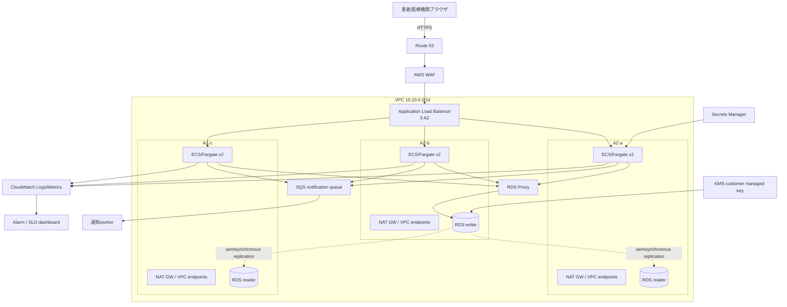
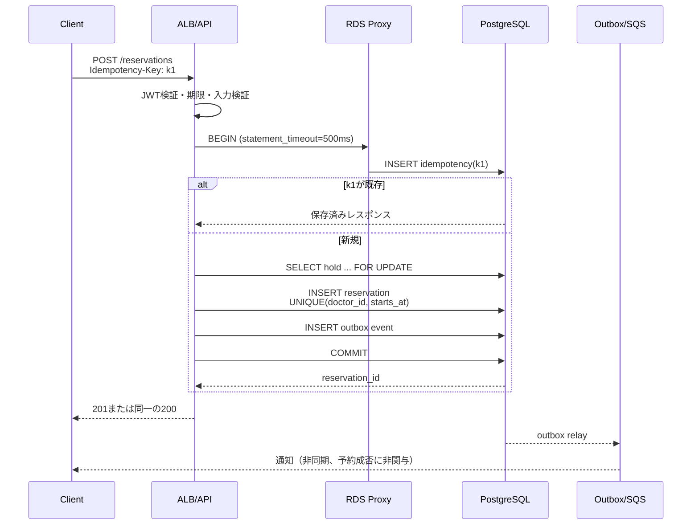

[[Home]]

# Weekly Cloud Engineer Magazine — 2026-07-24

#cloud #aws #oci #gcp #architecture #weekly #deep-dive

> [!warning] 課金・破壊的操作・認証情報
> 標準ラボはローカルで完結する。AWS上でALB、NAT Gateway、ECS/Fargate、RDSを作ると、アクセスがなくても課金される。作成前にAWS Budgetsを設定し、対象アカウントとリージョンを確認すること。削除、フェイルオーバー、タスク停止は検証環境だけで行い、終了後は「クリーンアップ」を実施する。実在患者の情報、実パスワード、アクセスキーを使わない。IAMは最小権限、短期認証情報を使用する。

## 1. 今週のテーマ

- **アプリ:** オンライン診療の予約枠確保API。患者が医師・日時を検索し、5分間の仮押さえ後に予約を確定する。
- **主クラウド:** AWS（`ap-northeast-1`を想定。料金の数値例だけは比較しやすい`us-east-1`公開単価を使用）
- **主軸:** 可用性／SLO。単一リージョン・マルチAZで「止めない」だけでなく、測定、エラーバジェット、劣化運転、復旧判断まで設計する。
- **難易度シグナル:** **Specialized**。参加条件ではなく、DB整合性とSREの基礎を同時に扱うという目安。
- **所要時間:** 150分

### 必要知識・ツール・環境・先行概念

- 必要知識: HTTPステータス、Docker、PostgreSQLのトランザクションと一意制約、VPC/サブネット/SG、SLI/SLO。
- ツール: Docker Compose、`curl`、`jq`、任意のエディタ、Mermaid対応ビューア。任意でAWS CLI v2、Terraform 1.8+。
- 環境: 2 CPU、4 GB RAM、空き2 GB程度。クラウド演習はサンドボックスAWSアカウントだけを使う。
- 先行概念: 冪等性、タイムアウト、指数バックオフ、ヘルスチェック、同期レプリケーション。「リトライは可用性を上げるが、無制限リトライは障害を増幅する」ことを理解しているとよい。

### 測定可能な到達目標

1. 可用性SLIを「成功レスポンス数 / 有効リクエスト数」と定義し、除外条件を説明できる。
2. 月間99.95% SLOのエラーバジェットを約21.6分と計算できる。
3. 3 AZのアプリ層とDB層について、単一AZ障害時に残る容量を数値で示せる。
4. 30並列の同一枠予約で確定成功が1件だけになることを検証できる。
5. 障害検知から劣化運転、復旧、事後確認までをランブックとして実行できる。

### 学習レイヤー

1. **Foundation:** SLI/SLO、エラーバジェット、障害ドメイン、整合性。
2. **Practical implementation:** 冪等な予約API、競合制御、メトリクス、負荷試験。
3. **Production concerns:** 3 AZ、容量余裕、DBフェイルオーバー、劣化運転、運用判断。
4. **Optional advanced challenge:** セル分割、リージョンDR、合成監視からの自動判定。

## 2. 要件と制約

### 機能要件

- 医師と日付から空き枠を検索する。
- `POST /holds`で5分間仮押さえする。
- `POST /reservations`で仮押さえを確定する。同じ`Idempotency-Key`の再送は同一結果を返す。
- 期限切れ仮押さえを解放し、監査履歴を残す。
- 通知障害が予約確定を巻き戻さないよう、通知はoutboxから非同期送信する。

### 非機能要件と負荷仮定

| 項目 | 仮定 |
|---|---|
| 登録患者 | 20万人 |
| 平常時 | 40 req/s、読み取り:書き込み = 8:2 |
| 朝9時ピーク | 400 req/sを15分、瞬間600 req/s |
| ペイロード | 平均3 KB、p99 20 KB |
| 同時予約競合 | 人気枠に最大30リクエスト/秒 |
| データ増加 | 予約3万件/月、監査イベント15万件/月 |
| 可用性SLI | 有効な予約・検索要求のうち、5xx/タイムアウトでない割合 |
| レイテンシSLI | 検索p95 < 300 ms、確定p95 < 700 ms |
| SLO | 月間可用性99.95%、レイテンシ達成率99.0% |
| エラーバジェット | 30日で43,200分 × 0.05% = **21.6分** |
| RTO/RPO | AZ障害: RTO 5分/RPO 0を目標。リージョン災害: RTO 4時間/RPO 15分 |

**SLO上の有効リクエスト:** 認証済みで仕様に合う要求。明白な4xx、クライアント切断、計画済み合成テストは可用性SLIの分母から除外する。ただし429は容量不足を隠さないため分母に含め、失敗として数える。

**コンプライアンス仮定:** 診療内容は保存せず予約メタデータだけを扱う。それでも患者識別子は機微情報として、保存期間7年、国内リージョン、操作監査、職務分離を前提とする。実案件では法務・セキュリティ・医療情報ガイドライン担当者の判断が必要。

**予算枠:** 本番の初期目標は月額 **USD 1,200以下（税・サポート・インターネット転送を除く概算）**。可用性のための常時冗長化を先に確保し、余剰ログとNAT経路を最適化する。

## 3. ADR-001: 単一リージョン3 AZを可用性の基本単位にする

### 検討した選択肢

| 選択肢 | 長所 | 短所 |
|---|---|---|
| A. Lambda + DynamoDB | 運用面が小さく、AZ分散がサービス側に内包 | 予約競合・検索・監査を単一テーブル設計に寄せる学習コスト。将来の複雑な診療枠規則でロックインが強い |
| B. ECS/Fargate + RDS PostgreSQL Multi-AZ DB cluster | SQL制約で二重予約を防げる。アプリを3 AZに明示配置し、障害容量を説明しやすい | 常時稼働費、接続管理、スケーリングとフェイルオーバー試験が必要 |
| C. EKS + Aurora PostgreSQL | ポータビリティと拡張性が高い | 今回の規模では制御プレーン・アドオン・運用認知負荷が過大 |
| D. 2リージョンactive-active | リージョン障害にも低RTO | 同一予約枠のグローバル直列化が難しく、費用と誤動作面が大幅増 |

### 決定

**Bを採用**する。ALBを3つのAZに関連付け、ECS/Fargateタスクは通常6個（各AZ 2個）、最小6・最大30とする。DBはPostgreSQL Multi-AZ DB cluster（writer 1 + reader 2、3 AZ）とRDS Proxyを使う。予約確定は`(doctor_id, starts_at)`の一意制約、短いトランザクション、冪等キー一意制約で守る。

### 重要なトレードオフ

- 「AZを3つ使う」だけでは不十分。1 AZ喪失後の4タスクがピーク600 req/sを処理するには、1タスク当たり150 req/s以上の検証済み能力が必要。
- 同期/準同期レプリケーションはRPOを改善するが、書き込みレイテンシと費用を増やす。
- RDS Proxyは接続嵐を緩和するが、DB障害や長いトランザクションを解決するものではない。
- マルチリージョンは今回見送る。月間99.95%とRTO 4時間なら、まず単一リージョンの障害運用を成熟させる方が費用対効果が高い。

### 却下理由

- 単一AZはエラーバジェット21.6分に対して保守・障害余地が小さすぎる。
- Kubernetesは「可用性機能が多い」こと自体が運用上の可用性を保証しない。
- アプリ内分散ロックはネットワーク分断時の正当性が難しいため、予約の最終整合性をDB一意制約に集約する。

## 4. 詳細アーキテクチャとフロー



### 予約確定のリクエスト／データフロー



## 5. 信頼境界、IAM、暗号化、ネットワーク、秘密、テレメトリ

### IAMと信頼境界

- 外部境界: Internet → WAF → ALB。ALBだけが公開サブネット。ECSとDBはprivate subnetでpublic IPなし。
- アプリ境界: ECS task execution roleはECR pullとログ送信のみ。task roleは特定secretの`GetSecretValue`、特定KMS keyの`Decrypt`、対象SQS queueの`SendMessage`だけ。
- 運用境界: 人の本番アクセスはIAM Identity Center + MFA + 期限付きpermission set。DBへの常設管理者経路を置かず、承認付きSession Manager/踏み台相当を使う。
- CI/CDはOIDCフェデレーションで、長期アクセスキーを置かない。デプロイroleとインフラ変更roleを分離する。

### 暗号化・ネットワーク・秘密

- TLS 1.2以上、ACM証明書。ALB→ECSも必要に応じてTLS化。
- RDS、SQS、ログ、バックアップをKMSで暗号化。鍵管理者と利用者を分離し、削除待機期間を設定する。
- SGは`Internet→ALB:443`、`ALB SG→ECS SG:8080`、`ECS SG→Proxy SG:5432`、`Proxy SG→DB SG:5432`だけ。
- AWSサービス向けはECR、CloudWatch Logs、Secrets Manager等のVPC endpointを検討。NATはAZごとに置くか、外向き依存を除去する。単一NATはSPOFとクロスAZ費用を生む。
- DB認証情報はSecrets Managerでローテーション。環境変数に平文秘密を焼き込まず、ログにも出さない。

### ログ・メトリクス・トレース

- ログ: JSONで`request_id`、`trace_id`、`route`、`status`、`duration_ms`、`error_class`を記録。患者ID・JWT・予約本文は出さない。
- メトリクス: ALB `HTTPCode_Target_5XX_Count`、`TargetResponseTime`、healthy targets、ECS CPU/memory/task count、RDS connections/CPU/replica lag、Proxy borrow latency、キュー最古メッセージ。
- アプリSLI: `valid_requests_total`と`successful_requests_total`をルート別に記録。クラウド部品の稼働率をユーザー可用性の代用にしない。
- トレース: OpenTelemetryでALB以降を伝播。SQL本文や個人情報をattributeに入れず、遅い区間とリトライ増幅を確認する。
- アラート: 1時間でエラーバジェット14.4倍消費、6時間で6倍消費のmulti-window burn-rateをページ対象にする。単発CPU高騰だけでは起こさない。

## 6. 容量・コストモデル

### 容量モデル（明示的仮定）

- 負荷試験で1タスク（1 vCPU/2 GB）がSLO内で**180 req/s**処理できたと仮定。
- 通常6タスク: 理論1,080 req/s。安全係数0.6を掛けた運用容量は648 req/s。
- 1 AZ喪失後4タスク: 理論720 req/s、安全係数0.8で576 req/s。ピーク600 req/sに少し届かないため、障害中は空き検索キャッシュを60秒に延長し、管理系APIを停止して書き込み容量を確保する。
- 平常40 req/sなら平均利用率は低い。朝ピーク前のscheduled scalingで9タスク、通常は6を下回らない。Spotは予約APIには使わず、通知workerだけに使う。
- DB接続: 6タスク × 最大20 pool = 120論理接続。Proxy側で多重化し、トランザクションを1秒以内に保つ。

### 月額概算

> [!note] 料金の扱い
> 以下は**2026-07-24確認時点の公開ページに基づく学習用概算**。FargateとRDSの実額はリージョン、CPUアーキテクチャ、DBクラス、IO、バックアップ、為替で変わる。AWS Pricing Calculatorと実利用リージョンの見積書で再検証すること。税、Support、インターネット転送は除外。

| 項目 | 仮定と式 | 月額概算 |
|---|---|---:|
| Fargate API | Linux/x86、1 vCPU/2 GB、6 task、730h。公開単価例`$0.04048/vCPU-h + $0.004445/GB-h` | `(0.04048+2×0.004445)×6×730 ≈ $216` |
| ALB | us-east-1公開例 `$0.0225/h + $0.008/LCU-h`、平均1 LCU | `(0.0225+0.008)×730 ≈ $22` |
| NAT Gateway | 3 AZ、公開例`$0.045/h`、処理100 GB/月 | `3×0.045×730 + 100×0.045 ≈ $103` |
| RDS PostgreSQL Multi-AZ cluster | writer+reader 2台、対応クラス、storage/IO込み | **見積 $500–750** |
| RDS Proxy/Secrets/KMS | 接続容量、API呼出し、鍵 | **見積 $40–80** |
| CloudWatch | 30 GB取込、30日保持、メトリクス/アラーム | **見積 $30–60** |
| SQS・S3バックアップ等 | 低トラフィック | **見積 $10–30** |
| **合計** | 余裕込み | **約$921–1,261/月** |

予算$1,200を超えそうなら、最初にNAT通信をVPC endpointへ移し、ログの高カーディナリティと保持を削る。DBをSingle-AZへ落としてSLOを偽らない。安定負荷が確認できた後にSavings Plans/Reserved Instancesを評価する。

## 7. 150分ラボ: 二重予約を防ぎ、SLOを壊して測る

標準コースはローカルDockerで実施する。クラウド構築は設計成果物までとし、課金資源を作らない。

### 0–15分: 前提とSLOを固定

1. 可用性SLIの分子・分母、4xx/429の扱いを書く。
2. 99.95%の月間エラーバジェットを計算する。
3. `reservation`, `hold`, `idempotency`, `outbox`の4テーブルを紙上設計する。

**Checkpoint:** 429を失敗に含める理由と、AZ障害RTO 5分/RPO 0の意味を説明できる。  
**期待結果:** エラーバジェット21.6分。  
**検証:** `43200 * (1 - 0.9995)`を計算する。

### 15–45分: DB制約を実装

最小DDL:

```sql
CREATE TABLE reservation (
  id uuid PRIMARY KEY,
  doctor_id uuid NOT NULL,
  starts_at timestamptz NOT NULL,
  patient_ref text NOT NULL,
  created_at timestamptz NOT NULL DEFAULT now(),
  UNIQUE (doctor_id, starts_at)
);
CREATE TABLE idempotency (
  key text PRIMARY KEY,
  response_code int,
  response_body jsonb,
  expires_at timestamptz NOT NULL
);
CREATE TABLE outbox (
  id uuid PRIMARY KEY,
  event_type text NOT NULL,
  payload jsonb NOT NULL,
  sent_at timestamptz
);
```

`BEGIN`→冪等キーINSERT→枠ロック→予約INSERT→outbox INSERT→結果保存→`COMMIT`の順で実装する。`lock_timeout=200ms`、`statement_timeout=500ms`を設定する。

**Checkpoint:** 同じ医師・開始時刻のINSERTを2回実行。  
**期待結果:** 2回目は一意制約違反。  
**検証:** 予約件数が1であり、アプリが競合を409へ変換する。

### 45–75分: API、ヘルスチェック、テレメトリ

- `/livez`: プロセス生存だけを返す。DBを見ない。
- `/readyz`: 新規トラフィックを安全に受けられるかを返す。DB接続枯渇時は失敗。
- `/metrics`: route別のrequest/success/durationを公開。
- 予約APIに`Idempotency-Key`必須、DB処理全体に1秒の期限を設ける。

**Checkpoint:** DB停止時に`/livez=200`、`/readyz=503`となる。  
**期待結果:** オーケストレータはプロセスを無限再起動せず、LBだけが対象を外す。  
**検証:** 失敗ログに秘密や患者参照がない。

### 75–105分: 競合・負荷試験

同じ枠に30並列、別枠に合計600 req/s相当の短いテストを行う。失敗時に無制限リトライせず、ジッター付き最大2回とする。

```bash
seq 1 30 | xargs -P30 -I{} curl -sS \
  -H "Idempotency-Key: test-{}" \
  -H "Content-Type: application/json" \
  -d '{"doctor_id":"00000000-0000-0000-0000-000000000001","starts_at":"2026-08-01T09:00:00+09:00","patient_ref":"dummy"}' \
  http://localhost:8080/reservations
```

**Checkpoint:** 30件のうち確定成功1、競合29。  
**期待結果:** DBには予約1件、outbox 1件。  
**検証:** p95、5xx率、DB接続数、lock waitを記録。409は期待された競合で5xxにしない。

### 105–130分: AZ障害を机上＋ローカル模擬

- 6 replicaのうち2つを停止した想定で、残存容量を計算。
- DBレスポンスを300ms遅延させ、タイムアウト、pool待ち、burn rateを見る。
- 劣化運転フラグで検索キャッシュTTLを60秒にし、管理系APIを503で閉じる。

**Checkpoint:** 予約確定を優先し、ユーザーに古い可能性を明示した検索結果を返せる。  
**期待結果:** 依存遅延が全タスクの接続枯渇へ連鎖しない。  
**検証:** タイムアウトが1秒以内、キュー長と5xxが復旧後に減少する。

### 130–145分: AWS設計へ写像

Terraformまたは設計表に、3 AZ subnet、ALB、ECS service desired=6/max=30、AZ rebalancing、RDS Multi-AZ cluster、Proxy、SG、alarmsを書く。`minimumHealthyPercent=100`、`maximumPercent=200`を検討する。

**Checkpoint:** 各AZに最低1タスク、通常2タスクとなる配置を説明。  
**期待結果:** デプロイとAZ再均衡時に先に新taskがhealthyになってから旧taskが止まる。  
**検証:** `terraform plan`に公開DBや`0.0.0.0/0:5432`がない。

### 145–150分: クリーンアップ

- ローカル: `docker compose down -v`（**DBボリュームを削除する破壊操作**。テストデータだけと確認してから実行）。
- AWSを任意で作成した場合: 対象workspaceとtagを確認し、`terraform plan -destroy`をレビューしてから削除。ALB、NAT Gateway、EIP、RDS snapshot、CloudWatch log groupの残存を確認する。
- テスト用secret、ローカル`.env`、一時JWTを破棄する。

## 8. 障害シナリオ、復旧演習、運用ランブック

### シナリオ: 朝9時に1 AZ断 + DBフェイルオーバー

ALBからAZ-bのtargetsが外れ、同AZのwriterも失われる。残る4タスクへ負荷が集中し、RDSがreaderをwriterへ昇格する間に接続エラーが発生する。クライアントの一斉リトライで障害が増幅しうる。

### 復旧/DR演習

1. 検証環境でECSの1 AZ相当タスクを停止する。
2. RDSのreboot with failover相当は、対象・影響・課金を確認して承認された演習時間にだけ実行する。
3. 予約成功率、p95、Proxy borrow latency、DB接続、ALB healthy targetを時系列保存。
4. 同じ冪等キーの再送で二重予約がないことをSQLで確認。
5. RTOストップウォッチを開始し、SLO復帰とデータ整合性確認の両方で停止する。

### ランブック

1. **検知（0–2分）:** burn-rate、ALB targets、ECS events、RDS eventsを確認。変更凍結。
2. **判定（2–5分）:** AZ局所かDBか外部依存かを切り分ける。患者影響とエラーバジェット消費をincident channelへ記録。
3. **緩和:** 検索TTL延長、管理API停止、通知worker縮小。APIの一律リトライを増やさない。
4. **容量:** healthy AZのtask数とDB接続余裕を確認してスケール。壊れたAZへの強制配置を避ける。
5. **DB:** RDS eventで昇格完了を確認。手動昇格は自動処理と競合させない。
6. **整合性:** 重複予約、孤児outbox、期限切れholdを照合。RPO 0の主張は件数比較だけでなく業務キーで検証。
7. **復旧:** 5xxとp95が30分安定後、機能フラグを段階解除。AZ復帰時の再均衡で容量が一時増える点を監視。
8. **事後:** 24時間以内にタイムライン、ユーザー影響、budget消費、改善owner/期限を書く。

リージョン災害では、最新のクロスリージョンsnapshot/PITRからDRリージョンへ復元し、整合性確認後にDNSを切り替える。これはRTO 4時間/RPO 15分の別演習であり、AZ HAと混同しない。

## 9. AWS / OCI / GCP対応表とポータビリティ

| 能力 | AWS（主実装） | OCI | GCP |
|---|---|---|---|
| L7入口 | Application Load Balancer + WAF | OCI Load Balancer + WAF | External Application Load Balancer + Cloud Armor |
| コンテナ | ECS on Fargate | Container Instances または OKE Virtual Nodes | Cloud Run |
| AZ/障害分散 | ECS AZ rebalancing、3 AZ | AD + Fault Domain、regional subnet | Cloud Run regional zonal redundancy |
| PostgreSQL HA | RDS PostgreSQL Multi-AZ DB cluster + Proxy | PostgreSQL Database Service / Base DB + HA構成 | Cloud SQL for PostgreSQL regional HA |
| キュー | SQS | Queue | Pub/Sub / Cloud Tasks |
| 秘密・鍵 | Secrets Manager / KMS | Vault Secrets / Vault Keys | Secret Manager / Cloud KMS |
| 観測 | CloudWatch / X-Ray / OTel | Monitoring / Logging / APM | Cloud Monitoring / Logging / Trace |

### 等価ではない点

- AWSのMulti-AZ DB clusterはwriter 1 + reader 2を3 AZに置く。Cloud SQL HAはprimary/standbyを2 zoneへ同期複製するため、読み取り拡張とHAの構成単位が異なる。
- Cloud Runはリージョナルでゾーン冗長がサービス側に内包される。ECSはtask数、subnet、再均衡、deployment設定を利用者がより明示的に扱う。
- OCIは複数ADリージョンと単一ADリージョンがあり、後者ではFault Domain分散の意味が大きい。AWS AZと名称だけ対応させない。

### ポータビリティとロックイン

- **持ち運べる:** OCI準拠コンテナ、HTTP/OpenAPI、PostgreSQL SQL、一意制約、OpenTelemetry、SLO式、runbook。
- **ロックイン:** IAM policy、ALB health/target model、ECS deployment/AZ rebalancing、RDS Proxy、CloudWatch alarm式。
- 移植コストを下げるため、予約整合性はAWS APIでなくPostgreSQL制約に置く。一方、各社のマネージドHAを最低公倍数に落とすと運用品質が下がるため、インフラadapterとrunbookはクラウド別に保つ。

## 10. Well-Architected風レビュー

### 運用上の優秀性

- SLO、burn-rate、incident owner、変更凍結条件が定義済みか。
- デプロイ、AZ障害、DBフェイルオーバー、復元を定期演習しているか。
- 自動化に手動の安全確認点とrollback条件があるか。

### セキュリティ

- 人とworkloadの権限が分離され、長期鍵がないか。
- DBは非公開で、SG参照による最小通信だけか。
- ログ、trace、backupに患者識別情報が漏れないか。

### 信頼性

- 各AZの残存容量を測定済みか。
- 冪等キー、一意制約、タイムアウト、bounded retryがあるか。
- HAとバックアップ、AZ障害とリージョンDRを分けて試験したか。

### 性能効率

- peak前scaleとscale-in cooldownが実測に基づくか。
- DB pool上限、slow query、lock waitを監視しているか。
- キャッシュが古い情報を返す際のUXが明示されるか。

### コスト最適化

- 可用性要件を落とさずNAT、ログ、アイドル容量を先に最適化したか。
- tag、budget、cost anomaly detection、月次unit cost（予約1件あたり）を持つか。
- 長期割引はベースライン確定後か。

### 本番準備チェックリスト

- [ ] SLO、SLI、分母除外、429扱いが承認済み
- [ ] 1 AZ喪失時の600 req/s試験に合格
- [ ] 同一枠30並列で予約1件
- [ ] 同一冪等キー再送が同一結果
- [ ] DB failoverでRTO 5分、業務RPO 0を検証
- [ ] 3 AZすべてにhealthy target
- [ ] 公開DB、public ECS IP、広すぎるSGなし
- [ ] secret rotationとbreak-glass監査を試験
- [ ] multi-window burn-rate alertを試験
- [ ] PITR復元とリージョンDR手順を別途検証
- [ ] restore後の業務整合性SQLあり
- [ ] 予算通知、所有者tag、cleanup ownerあり

## 11. 具体的成果物

1. 1ページのADR（選択肢、決定、却下理由、見直し条件）。
2. Mermaid構成図と予約確定sequence図。
3. SLI/SLO定義、21.6分のerror budget計算シート。
4. DDL、競合試験結果、p95/5xx/lock waitの記録。
5. 3 AZ容量表（通常、1 AZ断、デプロイ中）。
6. IAM/SG通信マトリクスとsecret一覧。
7. AZ障害＋DB failoverのrunbookと演習タイムライン。
8. 月額概算と、NAT/ログ/DBの感度分析。
9. 本番準備チェックリストの証跡リンク。

## 12. 理解度チェック

### Q1. 99.95%の30日月間エラーバジェットは何分か

<details><summary>回答</summary>

43,200分 × 0.0005 = **21.6分**。ただし連続21.6分停止してよいという意味ではなく、短時間の高burn-rateも早期検知する。

</details>

### Q2. 429を可用性SLIの失敗に含める理由は

<details><summary>回答</summary>

有効な患者要求を容量不足で拒否しているため。除外するとスロットリングで見かけのSLOを守れてしまい、ユーザー体験と乖離する。

</details>

### Q3. 6タスクを3 AZへ均等配置した場合、1 AZ断で何%残るか

<details><summary>回答</summary>

4/6で約66.7%。ただし「タスク数66.7%」は「処理能力66.7%」を自動的には意味しない。DB、接続pool、クロスAZ経路も負荷試験する。

</details>

### Q4. リトライだけで予約APIの可用性を上げられないのはなぜか

<details><summary>回答</summary>

重複実行と負荷増幅を起こすから。冪等キー、一意制約、短い期限、指数バックオフ、回数上限を組み合わせる必要がある。

</details>

### Q5. Multi-AZとバックアップはどう違うか

<details><summary>回答</summary>

Multi-AZは主に進行中の局所障害へ短時間でフェイルオーバーする仕組み。バックアップ/PITRは誤削除、論理破壊、災害から過去時点へ戻す仕組み。HA複製は誤操作も複製するため代替にならない。

</details>

### 設計／面接質問

「事業が月間99.99%、リージョン障害RTO 15分/RPO 1分を要求した。どこを変え、二重予約をどう防ぐか。」

良い回答は、単に2リージョン化と言わず、home-region/cellによる予約枠所有、単一writer、非同期複製のRPO、DNS/Global Accelerator、フェンシング、復旧時のsplit-brain防止、費用と演習頻度を扱う。

### Optional advanced challenge

医師をhashで8セルに分け、セルごとにECS service、DB schema/cluster、SLOを持つ案を作る。1セル障害のblast radius、rebalancing時の予約枠所有権、共通検索indexのstaleness、セル単位error budgetを定量化する。

## 13. 公式リファレンス（2026-07-24確認）

### AWS

- [Amazon ECS: Availability Zone rebalancing](https://docs.aws.amazon.com/AmazonECS/latest/developerguide/service-rebalancing.html)
- [Amazon ECS: load balancing](https://docs.aws.amazon.com/AmazonECS/latest/developerguide/service-load-balancing.html)
- [Amazon RDS Multi-AZ DB clusters](https://docs.aws.amazon.com/AmazonRDS/latest/UserGuide/multi-az-db-clusters-concepts.html)
- [Amazon RDS Multi-AZ deployments](https://docs.aws.amazon.com/AmazonRDS/latest/UserGuide/Concepts.MultiAZ.html)
- [AWS Fargate pricing](https://aws.amazon.com/fargate/pricing/)
- [Elastic Load Balancing pricing](https://aws.amazon.com/elasticloadbalancing/pricing/)
- [Amazon RDS pricing](https://aws.amazon.com/rds/pricing/)
- [Amazon VPC pricing](https://aws.amazon.com/vpc/pricing/)
- [Amazon CloudWatch pricing](https://aws.amazon.com/cloudwatch/pricing/)
- [AWS documentation](https://docs.aws.amazon.com/)

### OCI

- [OCI High Availability](https://docs.oracle.com/en-us/iaas/Content/cloud-adoption-framework/high-availability.htm)
- [Regions and Availability Domains](https://docs.oracle.com/en-us/iaas/Content/General/Concepts/regions.htm)
- [Getting Started with Load Balancing](https://docs.oracle.com/en-us/iaas/Content/GSG/Tasks/loadbalancing.htm)
- [OCI documentation](https://docs.oracle.com/en-us/iaas/Content/home.htm)

### GCP

- [Cloud Run zonal redundancy](https://cloud.google.com/run/docs/zonal-redundancy)
- [Cloud Run: serving traffic from multiple regions](https://cloud.google.com/run/docs/multiple-regions)
- [Cloud SQL for PostgreSQL high availability](https://cloud.google.com/sql/docs/postgres/high-availability)
- [Google Cloud documentation](https://cloud.google.com/docs)

