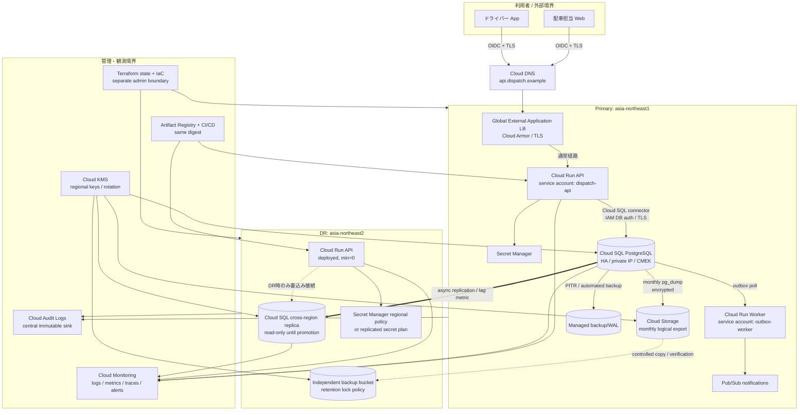

[[Home]]

# Weekly Cloud Engineer Magazine — 2026-07-31

#cloud #aws #oci #gcp #architecture #weekly #deep-dive

> [!warning] 課金・破壊的操作・認証情報
> Cloud SQLのHAインスタンス、クロスリージョン・レプリカ、Cloud Run、外部HTTPSロードバランサ、Cloud DNSを作成すると、アクセスがなくても課金される資源がある。プロジェクトとリージョンを指差し確認し、予算通知を設定してから作成すること。レプリカ昇格、DNS切替、DB削除、PITRは検証環境だけで行う。標準ラボはローカルDockerで完結する。実在の顧客・配送先・運転者情報、実パスワード、サービスアカウント鍵を使わない。クラウド操作には短期認証と最小権限を使う。

## 1. 今週のテーマ

- **アプリ:** 地域配送の配車・ルート確定システム。受注を便へ割り当て、ドライバーへ確定ルートを配布し、配送状態を更新する。
- **主実装クラウド:** **Google Cloud**。通常系は東京 `asia-northeast1`、DR先は大阪 `asia-northeast2` を想定する。
- **主軸:** **Backup / Disaster Recovery**。高可用性とDRを混同せず、「誤削除」「ゾーン障害」「リージョン障害」を別の復旧経路で扱う。
- **難易度シグナル:** **Specialized**。参加条件ではなく、データ整合性、復旧手順、運用判断を同時に扱う目安。
- **推定ラボ時間:** 150分。

### 必要知識・ツール・環境・先行概念

- 必要知識: PostgreSQLのACID、WAL、バックアップ、DNS TTL、非同期レプリケーション、RTO/RPO。
- ツール: Docker Engine + Compose、PostgreSQL 16クライアント、`curl`、`jq`、`sha256sum`、任意のエディタ、Mermaid対応ビューア。任意でGoogle Cloud CLIとTerraform 1.8+。
- 環境: 2 CPU、4 GB RAM、空き5 GB。クラウド拡張は請求先を分離した学習用GCPプロジェクトのみ。
- 先行概念: 「レプリカはバックアップではない」「HAはリージョンDRではない」「復元できることを検証して初めてバックアップである」。前号のSLO、冪等性、outboxの理解があるとよいが必須ではない。

### 測定可能な到達目標

1. 誤削除、ゾーン障害、リージョン障害ごとに、適切な復旧機構と責任者を選べる。
2. 受注確定データに **RPO 5分、RTO 45分** を割り当て、その達成条件を数値で説明できる。
3. バックアップを新しいDBへ復元し、行数・業務不変条件・ハッシュで完全性を検証できる。
4. DNS切替前の書き込み凍結、レプリカ遅延確認、昇格、スモークテスト、再開をランブック化できる。
5. 月次DR訓練から実測RTO/RPOを算出し、目標との差を記録できる。

### 学習レイヤー

1. **Foundation:** 障害分類、RTO/RPO、HA・レプリカ・バックアップの役割分担。
2. **Practical implementation:** 論理バックアップ、PITR模擬、復元検証、切替判定。
3. **Production concerns:** クロスリージョンDR、split-brain防止、鍵・IaC・DNS・運用証跡。
4. **Optional advanced challenge:** 復旧訓練の自動化、データ整合性証明、定量的DRティア選択。

## 2. 要件、前提、復旧目標

### 機能要件

- 注文を配送便と車両へ割り当て、確定済みルートを配布する。
- 同一注文を2便へ確定できないよう、一意制約と状態遷移を守る。
- ドライバーは配送開始・完了・持戻りを更新できる。
- オペレーターは変更履歴を追跡し、誤操作時は復旧対象時刻を特定できる。
- 外部通知はtransactional outboxへ記録し、DBコミット後に非同期送信する。

### 非機能要件とワークロード見積り

| 項目 | 仮定・目標 |
|---|---|
| 拠点・利用者 | 80拠点、配車担当400人、ドライバー4,000人 |
| 注文 | 平均20万件/日、繁忙日50万件/日 |
| 通常/ピーク | 平均80 req/s、朝ピーク800 req/sを30分、瞬間1,200 req/s |
| 読み書き比 | 70:30、ピーク書込み約360 req/s |
| DB増加 | 業務表8 GB/月、監査・outbox 12 GB/月、合計20 GB/月 |
| API SLO | 月間99.9%、配車確定p95 < 800 ms |
| データ完全性 | `order_id`は高々1つの確定便に所属。確定済み状態の巻き戻しは承認操作のみ |
| ゾーン障害 | RTO 5分、RPO 0を目標。Cloud SQL HAの対象 |
| リージョン障害 | **RTO 45分、RPO 5分**。非同期DRレプリカと手動統制の対象 |
| 論理破損・誤削除 | RTO 60分、RPO 5分。PITRで新規インスタンスへ復元 |
| バックアップ保持 | PITR 35日を設計値、月次論理エクスポート12か月、監査データ7年 |
| コンプライアンス仮定 | 国内データ所在、個人情報保護、操作証跡、職務分離。PCI DSS対象外 |
| 本番予算枠 | **月1,500 USD相当以内**を初期ガードレール。税・為替・割引を除く概算 |

RPO 5分は「最後の正常なコミット時刻」と「DR側で利用可能な最新コミット時刻」の差で測る。レプリカ遅延が5分を超えたら、目標を満たせない状態としてアラートする。RTOはインシデント宣言から、DR側で書込みを再開し主要スモークテストが成功するまでとする。

### コンプライアンス上の境界

- 住所・電話番号は運用DBに必要最小限だけ保持し、分析データはトークン化する。
- DBバックアップ、監査ログ、IaC状態、暗号鍵は同じ障害・同じ管理者誤操作に巻き込まれない管理境界を持つ。
- バックアップ削除権限と復元実行権限を分離する。緊急時のbreak-glassはMFA、時限付与、承認、全操作記録を必須とする。

## 3. Architecture Decision Record — ADR-031

### 文脈

東京リージョンのゾーン障害だけでなく、リージョン長期停止とアプリの誤更新に耐えたい。配送開始前の配車確定は業務継続上重要だが、無損失の同期クロスリージョン構成に伴う遅延と費用は許容しにくい。RTO 45分、RPO 5分を満たし、月次訓練可能であることを優先する。

### 検討した選択肢

| 選択肢 | RPO/RTOの性質 | 長所 | 短所 |
|---|---|---|---|
| A. バックアップのみ（pilot light） | RPOはバックアップ/WAL、RTOは数時間になり得る | 安価、単純 | 45分RTOが不安定。復旧時に容量確保と構築が集中 |
| B. Cloud SQL HA + 大阪クロスリージョンDRレプリカ | 非同期。遅延監視でRPOを管理、手動切替 | 低いRTO、平時に検証可能、PostgreSQL互換 | DR DBの常時費用、昇格後の再構成、split-brain統制が必要 |
| C. Spannerマルチリージョン | 構成次第で同期的な高耐障害性 | 水平拡張、強整合性 | SQL/スキーマ移行、費用、アプリ変更が大きい |
| D. 自前PostgreSQL + Patroni/論理レプリケーション | 自由度が高い | 詳細な制御、移植性 | 24/7運用、パッチ、フェンシング、バックアップ責任が増大 |

### 決定

**Bを採用する。** 東京のCloud SQL for PostgreSQLをHA構成にし、大阪にクロスリージョンDRレプリカを常時配置する。Cloud SQLのPITRと自動バックアップは論理破損用、月次の暗号化論理エクスポートは製品・管理面の独立性を高める補助線とする。Cloud Runは両リージョンへ同一イメージを配置するが、大阪は最小インスタンス0のwarm application / warm database構成とする。

Cloud SQLのクロスリージョン・レプリカ昇格は意図的な手動操作であり、ゾーンHAの自動フェイルオーバーとは異なる。Enterprise PlusでDR replicaを指定する選択肢もあるが、本号ではエディション固有機能に依存しすぎない「read replica + 明示的昇格」を基準にする。

### 受け入れるトレードオフ

- 非同期レプリケーションなので、リージョン瞬断時に最大5分の確定データを失う可能性を受容する。
- DRレプリカは独立インスタンス相当で課金される。RTO短縮の保険料として扱う。
- フェイルバックは単なるDNS巻戻しではない。DR側を新プライマリとして、旧リージョンに新レプリカを作り直す。
- バックアップとレプリカは両方必要。レプリカは誤削除も素早く複製するため、過去時点復元の代わりにならない。

### 却下した代替案

- **Cloud SQL HAだけ:** ゾーン障害には強いが、リージョン災害の境界を越えないため却下。
- **毎晩の`pg_dump`だけ:** 最大24時間のRPOになり、復元時間も不確実なため却下。
- **自動DNSフェイルオーバー:** レプリカ遅延、旧主系の生存、業務判断を確認せず書込みを開始するとsplit-brainになるため却下。
- **3クラウド同時書込み:** アプリ整合性、運用、費用がRTO/RPO要求に対して過剰なため却下。

## 4. 詳細アーキテクチャとデータフロー



### 通常リクエストフロー

1. 利用者はOIDCで認証し、ロードバランサでTLS終端、Cloud Armorの制限を通る。
2. Cloud Run APIは注文更新をDBトランザクションで実行する。同時にoutbox行をコミットし、外部通知の二重書込みを避ける。
3. Cloud SQL HAはゾーン障害を同一リージョン内で処理する。大阪レプリカへWALが非同期転送される。
4. Workerがoutboxを冪等送信する。通知障害で配車確定をロールバックしない。
5. 構造化ログ、レイテンシ、エラー、DB接続数、レプリカ遅延、最終復元訓練時刻をMonitoringへ送る。

### リージョン障害時フロー

1. インシデント指揮官が「東京リージョン障害」を宣言し、変更凍結と書込み停止を指示する。
2. DRオペレーターは監視値と最終トランザクション時刻から推定データ損失を記録する。
3. 旧主系が到達可能なら書込みを遮断し、レプリカ遅延が0に近づくまで待つ。到達不能なら承認者が最大5分の損失を明示的に受容する。
4. 大阪レプリカを昇格し、DB健全性と業務不変条件を検査する。
5. 大阪Cloud Runへ接続先を切り替え、内部スモークテスト後にロードバランサ経路を有効化する。
6. 外部書込みを段階再開し、outbox、重複、欠番を照合する。旧主系が復帰しても書込みを許可しない。

## 5. IAM、信頼境界、暗号化、ネットワーク、秘密、観測

### IAMと職務分離

| 主体 | 許可 | 明示的に許可しない |
|---|---|---|
| `dispatch-api` SA | 対象Cloud SQLへの接続、必要な秘密の読取、トレース送信 | DB管理、バックアップ削除、IAM変更 |
| `outbox-worker` SA | DB接続、指定Pub/Sub topicへのpublish | Secretの管理、レプリカ昇格 |
| Backup operator | バックアップ作成・一覧・復元先作成 | 本番DB削除、IAM付与 |
| DR operator | レプリカ状態参照、承認済み昇格、Cloud Run切替 | 監査ログ削除、KMS鍵破棄 |
| DR approver | break-glassの時限承認 | 日常アプリ操作 |
| Auditor | Audit Logs、訓練証跡、バックアップ一覧の閲覧 | 復元・変更 |

- 人に恒久的Ownerを与えない。Google Group + 条件付き/時限アクセス、MFA、二者承認を使う。
- サービスアカウント鍵JSONは作らない。Cloud Runのアタッチ済みIDとWorkload Identity Federationを使う。
- `cloudsql.instances.promoteReplica`相当を通常運用ロールから分離し、緊急ワークフローだけで付与する。

### 信頼境界とネットワーク

- Cloud SQLはPrivate IPのみ。Cloud RunからVPC経路またはコネクタ/Direct VPC egressで接続する。
- DBはインターネットへ公開しない。ロードバランサだけを公開入口にし、管理APIはIAMと組織ポリシーで制限する。
- 主リージョンとDRリージョンは同じ共有VPCでも、サブネット、サービスアカウント、ファイアウォールポリシーを分ける。
- DNS TTLは通常300秒。障害時だけ短縮しても既存キャッシュには効かないため、平時から切替目標と整合させる。
- 旧主系への書込みを止めるフェンシングは、DNSより先にアプリingress無効化、DB権限剥奪または接続拒否で行う。

### 暗号化と秘密

- 通信はTLS。Cloud SQL connectorを使い、可能ならIAM Database Authenticationを採用する。
- DB、バックアップ、論理エクスポートは保存時暗号化。CMEKを採用する場合、**DRリージョンで利用できる鍵と復旧権限**を別途設計する。
- KMS鍵の破棄予約は二者承認。鍵を失えば暗号化バックアップも失うため、鍵のDRをデータDRと同格に訓練する。
- DBパスワードが必要な場合はSecret Managerに置き、バージョン固定、ローテーション、アクセスログを有効化する。秘密をバックアップファイル、Terraform、ログへ書かない。

### ログ・メトリクス・トレース

- ログ: 認証主体、`request_id`、`order_id`の非可逆トークン、変更前後の状態、DR操作、バックアップ作成・復元。住所や電話番号は出力しない。
- メトリクス: API成功率/p95、DB CPU/接続/容量、レプリカ遅延、WAL増加率、outbox最古年齢、バックアップ経過時間、復元訓練成功時刻。
- トレース: LB → Cloud Run → PostgreSQL → Pub/Subを相関IDで追う。SQL本文やPIIを属性に入れない。
- アラート: レプリカ遅延60秒超でWarning、300秒超でCritical。バックアップ失敗、7日以上訓練なし、KMS無効化、レプリカ停止も通知する。
- 監査ログは集約プロジェクトのログバケットへルーティングし、アプリ運用者に削除権限を与えない。

## 6. 容量・コストモデル

> [!info] 見積りの扱い
> 以下は**設計見積り**であり請求額ではない。2026-07-31時点の公式Cloud SQL、Cloud Run、Cloud Storage料金ページを確認した。Cloud SQLはリージョン、エディション、vCPU/メモリ、HA、ストレージ、ネットワークで変動し、read/failover replicaは独立インスタンス相当で課金される。契約通貨、税、CUD、無料枠、ログ量を含め、作成直前に公式Pricing Calculatorで再計算すること。

### 容量仮定

- 初期DB 500 GB、月20 GB純増、インデックス・膨張係数1.5、12か月後は `500 + 20×12×1.5 = 860 GB`。
- 安全余裕30%を加え、12か月後の必要容量は約1.12 TB。初期1 TB、70%到達で拡張計画を起票する。
- ピーク書込み360 req/s、1トランザクション平均3 SQL、約1,080 SQL/s。負荷試験で4 vCPUがCPU 70%を超える場合は8 vCPUへ。
- DRレプリカは切替直後に本番ピークを処理するため、主系と同等の4 vCPU / 16 GBを基準とする。小型化する場合、RTO内に拡張できることを訓練で証明する。
- 論理エクスポートは月次フル約500 GBから開始。圧縮率40%なら200 GB/月、12世代で単純2.4 TB。保持階層と削除ポリシーを設定する。

### 月額モデル（USD、設計レンジ）

| 項目 | 算定式 | 月額見積り |
|---|---|---:|
| 東京Cloud SQL HA | 4 vCPU/16 GB × 730h × HA係数 + 1 TB SSD + backup | 550–850 |
| 大阪DRレプリカ | 4 vCPU/16 GB × 730h + 1 TB SSD | 300–500 |
| Cloud Run 2リージョン | リクエスト/CPU秒/メモリ秒、DR min=0 | 40–120 |
| LB、DNS、監視 | 転送量、ルール、query、ログ取り込み量 | 50–180 |
| バックアップ用Storage | 圧縮2.4 TB × 選択クラス + 操作/取得 | 30–90 |
| リージョン間転送 | WAL/バックアップコピー量 × 該当単価 | 20–100 |
| **合計** | 税・CUDなし | **990–1,840** |

上限側が1,500 USDを超えるため、採用前に次を決める。

1. RTOを維持したままDRレプリカを2 vCPUへ縮小できるか、拡張所要時間を実測する。
2. 監査ログを除き、デバッグログのサンプリングと保持を短くする。
3. 1年CUDは安定稼働後に検討し、DR要件変更による余剰コミットを避ける。
4. バックアップ階層をNearline/Coldlineへ移す場合、最小保管期間、取得費、DR訓練頻度を総コストに含める。

### 復旧可能性を容量に含める

通常時の空き容量だけでなく、DR先のクォータ、IP、KMS、Cloud Run最大インスタンス、DB接続上限を予約・監視する。バックアップから「新規DBをもう1台作る」余地がない構成は、保存容量が足りていても復旧不能である。

## 7. 150分ガイドラボ：復元可能性を証明する

標準ラボはローカルDockerで実施する。クラウド資源は作成しない。

### 0–15分: 設計と安全確認

1. 作業ディレクトリを作り、`primary`、`restore`の2つのPostgreSQL 16コンテナを起動するComposeを用意する。
2. パスワードはシェル履歴へ直接書かず、学習用`.env`にランダム値を置く。Gitへ追加しない。
3. 復旧目標を紙に書く: 論理誤削除RPO 5分、ラボRTO 30分、検証対象は件数・一意制約・金額合計・ハッシュ。

**Checkpoint A:** `primary`だけが書込み可能で、`restore`は空。コンテナ名、ポート、ボリュームを説明できる。

### 15–40分: 業務不変条件を作る

以下の最小スキーマを作る。

```sql
CREATE TABLE orders (
  order_id bigint PRIMARY KEY,
  customer_token text NOT NULL,
  status text NOT NULL CHECK (status IN ('READY','ASSIGNED','DELIVERING','DONE')),
  amount_yen integer NOT NULL CHECK (amount_yen >= 0),
  updated_at timestamptz NOT NULL DEFAULT now()
);

CREATE TABLE route_assignments (
  route_id bigint NOT NULL,
  order_id bigint PRIMARY KEY REFERENCES orders(order_id),
  assigned_at timestamptz NOT NULL DEFAULT now()
);

CREATE TABLE outbox (
  event_id uuid PRIMARY KEY,
  aggregate_id bigint NOT NULL,
  event_type text NOT NULL,
  payload jsonb NOT NULL,
  created_at timestamptz NOT NULL DEFAULT now(),
  delivered_at timestamptz
);
```

10,000注文を生成し、7,000件を便へ割り当てる。基準値を保存する。

```sql
SELECT count(*) AS orders, sum(amount_yen) AS total FROM orders;
SELECT count(*) AS assignments FROM route_assignments;
SELECT count(*) FROM (
  SELECT order_id FROM route_assignments GROUP BY order_id HAVING count(*) > 1
) violations;
```

一貫したスナップショットでハッシュ用CSVを出力する。

```bash
psql "$PRIMARY_URL" -X -v ON_ERROR_STOP=1 \
  -c "\\copy (SELECT order_id,status,amount_yen FROM orders ORDER BY order_id) TO STDOUT WITH CSV" \
  | sha256sum
```

**Checkpoint B:** 注文10,000、割当7,000、重複違反0、基準ハッシュを記録できた。

### 40–65分: バックアップとマニフェスト

カスタム形式の論理バックアップを取得する。

```bash
pg_dump "$PRIMARY_URL" --format=custom --no-owner --no-acl \
  --file=dispatch.dump
sha256sum dispatch.dump > dispatch.dump.sha256
pg_restore --list dispatch.dump > dispatch.dump.manifest
```

マニフェストへ、作成時刻、PostgreSQLバージョン、スキーマバージョン、想定行数、暗号化方式、保管期限、復元手順の版を記録する。本番ではファイルをCMEK付きオブジェクトストレージへ送り、保持・削除権限を分離する。

**Checkpoint C:** `sha256sum -c dispatch.dump.sha256`が成功し、マニフェストに3表と制約が存在する。

### 65–80分: 障害注入

時刻 `T0` を記録してから、バックアップ後の正常更新を100件加え、その後にオペレーター誤操作を模擬する。

```sql
BEGIN;
UPDATE orders SET status='DONE', updated_at=now()
WHERE order_id BETWEEN 1 AND 3000;
COMMIT;
```

これは配送中でない注文まで完了扱いにする論理破損である。**本番で同様のSQLを実行してはいけない。**

**Checkpoint D:** 影響件数3,000と誤操作時刻をインシデント記録へ残し、「レプリカでは救えない」理由を説明できる。

### 80–110分: 別DBへ復元

既存DBへ上書きせず、空の`restore`へ復元する。

```bash
sha256sum -c dispatch.dump.sha256
createdb "$RESTORE_ADMIN_URL" dispatch_restore
pg_restore --dbname="$RESTORE_URL" --clean --if-exists \
  --no-owner --no-acl --exit-on-error dispatch.dump
```

本番PITRも同様に**新規Cloud SQLインスタンス**へ復元し、検証後に接続を切り替える。元インスタンスをその場で破壊しない。

**Checkpoint E:** 復元コマンドが0で終了し、アプリ接続ユーザーはまだ付与されていない。

### 110–135分: 完全性検証と差分判定

1. 表件数、合計金額、重複違反、外部キー違反を検査する。
2. 基準CSVを再生成しハッシュを比較する。
3. `pg_restore --list`と実DBの拡張、ロール、権限を照合する。
4. バックアップ後の正常100件は論理dumpだけでは失われることを確認し、PITR/WALの必要性を説明する。
5. APIスモークテストとして「未割当注文を1便へ割当」「同じ注文の二重割当が失敗」「outboxが1件増える」を確認する。

**期待結果:** バックアップ時点の10,000注文と7,000割当、違反0、同一ハッシュ。誤更新3,000件は消える。バックアップ後の100件を回収するには、元DBの変更履歴から選別再適用するかPITR時刻を選び直す必要がある。

### 135–150分: RTO/RPO評価とクリーンアップ

- RTO = 障害宣言から検証済みrestore DBを利用可能にするまで。
- 実測RPO = 最後に復元できた正常コミットと障害時刻の差。
- 目標未達なら「dump頻度を増やす」で終わらせず、PITR、WAL、検証自動化、担当待ち時間を分解する。
- コンテナと専用ボリュームをComposeで停止・削除する。削除対象がこのラボ専用であることを確認し、`docker compose down -v`の前に必要な証跡を退避する。

**Checkpoint F:** 実測RTO/RPO、失敗点、次回の改善1件、クリーンアップ完了を記録した。

## 8. 障害シナリオ、DR演習、運用ランブック

### シナリオ

月曜06:50、東京リージョンのAPIとDBが広範に到達不能。大阪レプリカの最後の受信WALは06:48:30、障害宣言は06:55。07:30までに朝便の配車変更を再開しなければならない。

- 推定データ損失: 最大90秒。RPO 5分以内。
- 残RTO: 宣言から35分。目標45分以内。
- 最大リスク: 東京が部分復旧して書込みを受け、大阪昇格後に二つの主系ができること。

### DR演習手順

1. **宣言（0–5分）:** IC、DR operator、approver、communicationsを任命。変更凍結、チケット、タイムラインを開始。
2. **分類（5–10分）:** 単一サービス、ゾーン、リージョン、論理破損を区別。Google Cloudステータスは補助情報であり、自系の合成監視と併用。
3. **フェンス（10–15分）:** 東京Cloud Run ingressを無効化し、書込みDBロールを剥奪。到達不能なら「フェンス未確認」と記録し、二者承認を要求。
4. **RPO判定（15–18分）:** 最終WAL/レプリカ遅延、最終業務イベントを記録。5分超なら事業責任者へデータ損失幅を提示。
5. **昇格（18–25分）:** 大阪レプリカを昇格。これは不可逆的なトポロジ変更として扱い、操作IDと実行者を監査ログへ残す。
6. **検証（25–32分）:** DB read/write、件数、一意制約、直近100件、outbox、KMS、Secret、アプリのreadinessを確認。
7. **経路切替（32–37分）:** 大阪Cloud Runの最大インスタンスとDB接続poolを確認し、LB backendを有効化。内部→5%→25%→100%と段階開放。
8. **再開（37–45分）:** 書込みスモークテスト成功後に利用者へ再開通知。重複要求はidempotency keyで吸収。
9. **安定化:** 欠番・重複・未送信outboxを照合。旧東京DBは隔離し、直接再利用しない。
10. **フェイルバック:** 東京復旧後、大阪を新ソースとして東京に新しいレプリカを作成。同期、計画switchover、検証を別変更として実行する。

### 中止条件

- 大阪レプリカの破損、不変条件違反、KMS/Secret利用不能。
- 推定RPOが5分を超え、事業側の損失受容がない。
- 旧主系をフェンスできず、二者承認も得られない。
- DR先のCPU、接続、ストレージ、クォータが予想ピークを処理できない。

### 運用ランブックの必須記録

- 事件番号、判断者、各時刻、レプリカ遅延、最終コミット、推定損失。
- 実行したコマンド/Console操作の監査ID。秘密値は記録しない。
- DNS/LBの変更前後、Cloud Run revision digest、DB instance ID、KMS key version。
- 検証SQLと結果、外部再開時刻、実測RTO/RPO、未解決差分。

## 9. AWS / OCI / GCP対応表とポータビリティ

| 能力 | GCP（主実装） | AWS | OCI |
|---|---|---|---|
| コンテナAPI | Cloud Run | ECS on Fargate / App Runner | Container Instances / OKE |
| PostgreSQL HA | Cloud SQL HA | RDS for PostgreSQL Multi-AZ | OCI Database with PostgreSQL multi-node |
| クロスリージョンDR | Cloud SQL cross-region read/DR replica + promotion | RDS cross-Region read replica + promotion | PostgreSQL Replication with Warm Standby + manual promotion |
| PITR | Cloud SQL PITR | RDS PITR | OCI PostgreSQL PITR |
| 自動バックアップ | Cloud SQL automated backups | RDS automated backups/snapshots | PostgreSQL management-policy backups |
| オブジェクト保管 | Cloud Storage + retention policy | S3 + Object Lock | Object Storage + retention rules |
| DNS/入口 | Cloud DNS + Global External ALB | Route 53 + ALB/CloudFront | DNS + Load Balancer |
| 秘密/鍵 | Secret Manager / Cloud KMS | Secrets Manager / KMS | Vault |
| 監査/観測 | Cloud Audit Logs / Monitoring | CloudTrail / CloudWatch | Audit / Logging / Monitoring |
| IaC | Terraform / Config Controller | Terraform / CloudFormation | Terraform Resource Manager |

### 等価ではない点

- GCPのCloud SQL HAとcross-region replica、AWSのMulti-AZとcross-Region replica、OCIのmulti-nodeとWarm Standbyは、それぞれ**同一ゾーン/リージョン障害、昇格方法、RPO制御、SLA**が異なる。名前の対応だけでRTO/RPO達成を主張しない。
- OCI PostgreSQL Warm Standbyは非同期で、公式には手動昇格。RPO enforcementを有効にすると、遅延が閾値を超えた際に主系をread-onlyへする設計が可能で、可用性とデータ損失の選好がGCP/AWSの標準read replica運用と異なる。
- AWS RDS PostgreSQLのcross-Region replicaも非同期で、昇格時に再起動を伴い数分以上かかり得る。Cloud SQLもクロスリージョン昇格後に追加レプリカを再作成する運用が必要。

### ロックインと移植性

- **移植しやすい:** PostgreSQLスキーマ、Flyway/Liquibase migration、`pg_dump`、OpenTelemetry、コンテナ、SLO/ランブック、Terraform moduleのインターフェース。
- **ロックインが強い:** IAM DB認証、Cloud SQL connector、CMEK権限モデル、Cloud Monitoring指標名、DR replica API、LB切替方法。
- 抽象化は「最小公倍数API」を自作することではない。業務データ形式、検証SQL、復旧ステップ、SLOをクラウド非依存にし、クラウド固有の制御面は薄いadapter/runbookとして隔離する。
- 本当にマルチクラウドDRが必要なら、PostgreSQLメジャーバージョン、拡張、照合順序、型、シーケンス、large object、権限、ネットワーク、転送費を検証する。バックアップファイルを置けることと、RTO内に復旧できることは別である。

## 10. Well-Architected形式レビュー

### Operational Excellence

- DRランブックに所有者、承認、中止条件、フェイルバックがあるか。
- 月次restore、四半期region failoverを実施し、実測RTO/RPOを残しているか。
- IaCから両リージョンを再現でき、イメージdigestが一致するか。

### Security

- バックアップ削除、レプリカ昇格、KMS鍵破棄が職務分離されているか。
- 人の恒久Owner、サービスアカウント鍵、公開DB IPがないか。
- ログにPII/秘密がなく、監査ログの削除境界が分離されているか。

### Reliability

- HA、DR replica、PITR、論理exportの対象障害が明確か。
- レプリカ遅延と最終復元訓練時刻にアラートがあるか。
- DNSより前に旧主系をフェンスし、split-brainを防ぐか。
- DB以外にKMS、Secret、IAM、Artifact、IaC、クォータも復旧できるか。

### Performance Efficiency

- DR先が切替直後のピークを処理できるか、負荷試験済みか。
- DB接続pool × Cloud Run最大instance数が接続上限を超えないか。
- 大容量restoreとindex再構築の時間を実データ量で測ったか。

### Cost Optimization

- DRのRTO短縮価値と常時レプリカ費用を比較したか。
- バックアップ保持、ストレージ階層、取得費、転送費、訓練費を含めたか。
- CUD前に負荷とサイズを実測し、予算アラートを設定したか。

### Sustainability

- 不要な全量export、重複ログ、過大なDR容量を避けているか。
- 保持期限を法令・業務要件に結び付け、無期限保存を既定にしていないか。

### Production-readiness checklist

- [ ] RTO/RPOの定義、時計、測定開始/終了条件が合意済み
- [ ] 東京HAと大阪DRレプリカが稼働し、遅延アラートが試験済み
- [ ] 35日PITR設計値と月次export保持が設定・検証済み
- [ ] 新規DBへのrestoreが自動化され、元DBを上書きしない
- [ ] 件数、合計、一意制約、ハッシュ、APIスモークテストが機械実行可能
- [ ] 旧主系フェンシングと二者承認が実地訓練済み
- [ ] DR側のKMS、Secret、IAM、ネットワーク、クォータが確認済み
- [ ] outboxの再送、重複、欠番の照合手順がある
- [ ] フェイルバックを独立変更として訓練済み
- [ ] 監査ログとバックアップの削除権限がアプリ運用から分離
- [ ] 価格計算を最新公式Calculatorで更新し、予算内または例外承認済み
- [ ] 顧客・運転者への障害連絡テンプレートと責任者が決定済み

## 11. 具体的な成果物

1. `ADR-031-backup-dr.md`: 選択肢、決定、RTO/RPO、受容リスク。
2. `architecture.mmd`: 通常系、DR系、信頼境界を含むMermaid。
3. `backup-policy.md`: PITR、月次export、保持、暗号化、削除権限。
4. `restore-validation.sql`: 件数、合計、制約、不変条件、ハッシュ対象query。
5. `region-failover-runbook.md`: 宣言、フェンス、昇格、検証、切替、中止、フェイルバック。
6. `dr-exercise-report-YYYY-MM.md`: 実測RTO/RPO、タイムライン、証跡、改善項目。
7. `capacity-cost.xlsx`またはMarkdown: 12か月容量、単価出典、レンジ、感度分析。
8. Terraform plan: 東京/大阪のDB、Cloud Run、ネットワーク、IAM、監視。実適用は任意で、レビューなしに実行しない。

## 12. 理解度チェック

### Q1. なぜクロスリージョン・レプリカだけでは誤削除に備えられないか

<details>
<summary>解答</summary>

レプリカは通常、正しい更新だけでなく誤削除や論理破損も非同期に複製する。過去の正常時点へ戻すには、PITRや世代を持つバックアップが必要である。
</details>

### Q2. RTO 45分、RPO 5分で監視すべき最重要値は何か

<details>
<summary>解答</summary>

RPOにはレプリカ遅延とDR側で利用可能な最終コミット時刻、RTOには宣言、承認待ち、フェンシング、昇格、検証、経路切替、再開の各所要時間が必要。単にDB昇格時間だけを測ってはいけない。
</details>

### Q3. DNS TTLを短くすればsplit-brainを防げるか

<details>
<summary>解答</summary>

防げない。DNSは接続先を案内するだけで、旧主系の書込み能力を止めない。先にingress、DB権限、ネットワーク等で旧主系をフェンスし、その後に新主系を公開する。
</details>

### Q4. バックアップ成功ログがあるのに復旧不能になる例を3つ挙げよ

<details>
<summary>解答</summary>

暗号鍵を利用できない、DR先の容量/クォータがない、バックアップが破損または必要なロール/拡張を含まない、復元権限がない、手順が古い、復元にRTO以上かかる、など。作成成功は復元成功を保証しない。
</details>

### Q5. DRレプリカを主系より小さくしてよい条件は何か

<details>
<summary>解答</summary>

切替時の拡張時間を含めてもRTO内であり、拡張前後の容量・接続・レイテンシが業務の最低水準を満たすことを実測済みであること。平時の費用削減だけを根拠にしてはいけない。
</details>

### 設計・面接質問

「RPOを5分から0へ、RTOを45分から10分へ変更したい」と事業側が要求した。アプリ、DB、ネットワーク、運用、費用、データ整合性にどんな変更が必要か。同期レプリケーションまたはマルチリージョンDBを選ぶ条件、書込みレイテンシ、障害判定、フェンシング、自動化の危険、費用差を含めて説明せよ。

### Follow-up challenge

月次restoreをCloud BuildまたはCIで自動化し、隔離プロジェクトへ最新バックアップを復元する。検証SQL、APIスモークテスト、証跡生成まで行い、成功時だけ「last_verified_restore_timestamp」を更新する。削除は別の承認付きジョブに分離し、対象project IDとラベルを検証してから実行する。

## 13. 現行の公式リファレンス

参照・価格確認日: **2026-07-31**。仕様、対応リージョン、料金は変更されるため、実装直前に再確認する。

### Google Cloud（主実装）

- [Cloud SQL for PostgreSQL: cross-region replicaの昇格とDR](https://cloud.google.com/sql/docs/postgres/replication/cross-region-replicas)
- [Cloud SQL: バックアップとPITR](https://cloud.google.com/sql/docs/postgres/backup-recovery/backups)
- [Cloud SQL: point-in-time recovery](https://cloud.google.com/sql/docs/postgres/backup-recovery/restore)
- [Cloud SQL: high availability](https://cloud.google.com/sql/docs/postgres/high-availability)
- [Cloud SQL pricing](https://cloud.google.com/sql/pricing)
- [Cloud Run pricing](https://cloud.google.com/run/pricing)
- [Cloud Storage pricing](https://cloud.google.com/storage/pricing)
- [Cloud SQL IAM roles and permissions](https://cloud.google.com/sql/docs/postgres/iam-roles)
- [Cloud Audit Logs](https://cloud.google.com/logging/docs/audit)

### AWS（等価機能の確認）

- [RDS: cross-Region read replica](https://docs.aws.amazon.com/AmazonRDS/latest/UserGuide/USER_ReadRepl.XRgn.html)
- [RDS: read replicaの昇格](https://docs.aws.amazon.com/AmazonRDS/latest/UserGuide/USER_ReadRepl.Promote.html)
- [RDS: automated backupsとPITR](https://docs.aws.amazon.com/AmazonRDS/latest/UserGuide/USER_WorkingWithAutomatedBackups.html)
- [RDS for PostgreSQL](https://docs.aws.amazon.com/AmazonRDS/latest/UserGuide/CHAP_PostgreSQL.html)
- [AWS Backup: security best practices](https://docs.aws.amazon.com/aws-backup/latest/devguide/security-best-practices.html)

### OCI（等価機能の確認）

- [OCI Database with PostgreSQL: Replication with Warm Standby](https://docs.oracle.com/en-us/iaas/Content/postgresql/cross-region-replication.htm)
- [OCI PostgreSQL: backups for disaster recovery](https://docs.oracle.com/en-us/iaas/Content/postgresql/backups-for-dr.htm)
- [OCI PostgreSQL: point-in-time recovery](https://docs.oracle.com/en-us/iaas/Content/postgresql/point-time-recovery.htm)
- [OCI PostgreSQL: HA and business continuity](https://docs.oracle.com/en-us/iaas/Content/postgresql/high-availability.htm)
- [OCI Cloud Adoption Framework: disaster recovery](https://docs.oracle.com/en-us/iaas/Content/cloud-adoption-framework/disaster-recovery.htm)

---

## 今週の結論

DRの設計単位はサービス一覧ではなく、**障害シナリオ → 許容損失 → 復旧経路 → 検証証跡**である。Cloud SQL HAはゾーン障害、cross-region replicaはリージョン障害、PITRは論理破損、独立した論理exportは追加の回復手段を担当する。最も重要な成果物は「バックアップが存在する」という画面ではなく、誰が、どの順で、何分で、どのデータまで戻し、どう正しさを証明したかという最新の訓練記録である。
