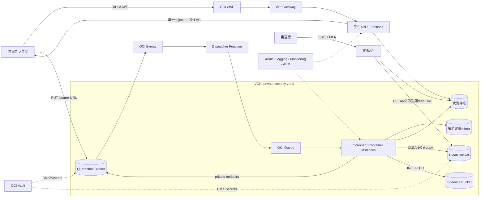

[[Home]]

# Weekly Cloud Engineer Magazine — 2026-08-07

#cloud #aws #oci #gcp #architecture #weekly #deep-dive

> [!warning] 課金・破壊的操作・認証情報
> 標準ラボはローカルDockerだけで完結する。OCI上でWAF、API Gateway、Functions、Container Instances、Queue、Vault、Logging、Object Storageを作成すると課金が発生し得る。作成前に学習用テナンシ／コンパートメント、予算アラート、リージョンを確認すること。感染ファイルの削除、バケット削除、鍵削除は検証環境だけで行い、鍵は即時削除せず待機期間を使う。実在住民の情報、実マルウェア、実パスワード、APIキーを使わない。EICARテスト文字列も組織のセキュリティ手順に従う。OCI CLIは短期セッション、ワークロードはリソース・プリンシパルと最小権限を使う。

## 1. 今週のテーマ

- **アプリ:** 自治体の電子申請添付ファイル受付。住民が申請書PDF・本人確認補助資料をアップロードし、検疫合格後だけ審査担当者が閲覧できる。
- **主実装クラウド:** **Oracle Cloud Infrastructure (OCI)**、東京リージョン、単一リージョン・複数AD/FDを想定。
- **主軸:** **Security — 未信頼ファイルの隔離、マルウェア検疫、安全側に倒れる公開判定**。一般的な「暗号化しています」ではなく、アップロード直後から閲覧許可までの信頼状態遷移を設計する。
- **難易度シグナル:** **Intermediate**。参加条件ではなく、IAM・ネットワーク・非同期処理を横断する目安。
- **推定ラボ時間:** **150分**。

### 必要知識・ツール・環境・先行概念

- 必要知識: HTTP/JWT、MIMEとファイル拡張子の違い、SHA-256、least privilege、VCN/NSG、at-least-onceイベント。
- ツール: Docker Engine + Compose、`curl`、`jq`、`sha256sum`、ClamAV/`clamdscan`、Mermaid対応ビューア。クラウド拡張はOCI CLI 3.x、Terraform 1.8+。
- 環境: 2 CPU、4 GB RAM、空き5 GB。クラウド拡張は請求先を分離した学習用コンパートメントのみ。
- 先行概念: 「アップロード成功≠安全」「拡張子≠内容」「署名付きURL/PARはBearer token」「イベントは重複・遅延し得る」「WAFはファイル内容の完全なマルウェア検査器ではない」。

### 測定可能な到達目標

1. `QUARANTINED → SCANNING → CLEAN | INFECTED | ERROR` の状態機械を実装し、`CLEAN`以外を取得不能にする。
2. スキャナーIDには検疫バケット読取、結果台帳更新、クリーンバケットへのコピーだけを許可する。
3. 正常PDFとEICARテストファイルを投入し、正常だけが公開側へ移動することを再現する。
4. 10分以内の検疫完了99.9%、誤公開0件というSLIを計算できる。
5. スキャナー停止、定義更新失敗、イベント重複時にfail closedで復旧できる。

### 学習レイヤー

1. **Foundation:** 信頼境界、状態遷移、検疫、fail closed、最小権限。
2. **Practical implementation:** ローカルでアップロード、ハッシュ、ClamAV検査、昇格、冪等性を検証。
3. **Production concerns:** OCIのコンパートメント、VCN、Vault、PAR、イベント、監査、定義更新、容量と運用。
4. **Optional advanced challenge:** CDR、複数エンジン、ZIP bomb対策、組織横断の隔離アカウント設計。

## 2. 要件、負荷、SLO、予算

### 機能要件

- 認証済み住民が申請IDに対して最大10ファイルを登録する。
- APIは許可拡張子、宣言サイズ、申請所有権を確認し、単一オブジェクト・短寿命のアップロードURLを発行する。
- アップロード後に実サイズ、magic bytes、SHA-256、マルウェア、展開後サイズを検査する。
- 合格ファイルだけをクリーン領域へ昇格し、審査担当者へ短寿命のダウンロードURLを発行する。
- 感染・タイムアウト・解析不能は閲覧不可のまま保持し、セキュリティ運用者へ通知する。
- 申請者、審査者、セキュリティ担当、プラットフォーム管理者の操作を監査する。

### 非機能要件と明示的な見積り前提

| 項目 | 仮定・目標 |
|---|---|
| 利用者 | 登録20万人、繁忙期DAU 2万人、審査者300人 |
| 受付量 | 平均2万ファイル/日、繁忙日8万、ピーク15ファイル/秒 |
| サイズ | 平均4 MB、p95 15 MB、上限25 MB。ZIPは原則禁止 |
| 日次流入 | 通常約80 GB、繁忙日約320 GB |
| 保存 | クリーン180日、検疫7日、感染90日（法務承認の暗号化隔離）、監査7年 |
| API SLO | 月間99.9%、アップロードURL発行p95 < 500 ms |
| 検疫SLO | 受領済みの99.9%を10分以内に`CLEAN/INFECTED/ERROR`へ確定 |
| セキュリティSLI | `CLEAN`未満で取得成功した件数 = **0**。検査スキップ件数 = **0** |
| RTO/RPO | 受付RTO 60分、台帳RPO 5分。ファイル本体はアップロード再試行可能 |
| コンプライアンス仮定 | 個人情報保護、国内保存、操作証跡、職務分離。マイナンバー本体は対象外 |
| 予算枠 | 本番初期 **月USD 700相当以内**（税・サポート・外向き転送・契約割引を除く概算） |

**境界条件:** 25 MBを超えるファイル、暗号化PDF、パスワード付きアーカイブ、壊れたコンテナ、展開比100倍超は自動合格させず`ERROR`にする。可用性のために「検査を飛ばす」フォールバックは禁止する。

## 3. ADR-032 — 検疫バケットと公開バケットを物理分離する

### 検討した選択肢

| 選択肢 | 長所 | 短所 |
|---|---|---|
| A. 同一バケットでタグだけ変更 | コピー不要、安価 | ポリシー条件の誤りが即時漏えいにつながり、境界が見えにくい |
| B. 検疫/クリーンを別バケットにし、専用スキャナーが昇格 | IAM・ログ・保持を分離、fail closed、説明可能 | コピーI/O、二重保存時間、状態整合の設計が必要 |
| C. APIサーバーの同期処理で全ファイルを検査 | 実装の入口が一つ | 大容量でタイムアウト、スパイク吸収不可、API侵害時の権限が大きい |
| D. WAFだけで遮断 | 運用が軽い | WAFはHTTP攻撃対策であり、保存ファイル全体のAV判定を代替しない |

### 決定

**B**を採用する。インターネットから書けるのは検疫バケット内の一意なオブジェクトだけ。審査アプリは検疫を読めず、クリーンバケットだけを読む。OCI EventsでObject Createを検知し、薄いFunctionがQueueへ正規化メッセージを投入、プライベート・サブネットのContainer InstancesワーカーがClamAVで検査する。ワーカーは`file_id + sha256`を冪等キーとして台帳を条件更新し、合格時だけサーバー側コピーして元を削除する。

### トレードオフと却下理由

- 二重保存時間を許容し、IAM事故のblast radiusを小さくする。
- Container InstancesはFunctionsより常駐コストがあるが、AV定義、メモリ、25 MB超の一時領域、検査時間を制御しやすい。低頻度ならイベント起動Functionsも再評価する。
- PARは単一オブジェクト、write-only、10分、1回の業務状態で失効扱いにする。ただしURL自体の強制即時失効に依存せず、推測不能なobject keyと台帳状態で再利用を拒否する。
- 感染ファイルの自動削除はインシデント証跡を失うため却下。暗号化隔離し、アクセスをセキュリティ担当に限定する。

## 4. 詳細アーキテクチャとフロー

### リクエスト／データフロー

1. 受付APIは申請所有権と許可形式を確認し、`file_id`、ランダムobject key、`QUARANTINED`行を作る。
2. APIは検疫バケットのそのobjectだけへPUTできる10分PARを返す。PAR文字列をログへ出さない。
3. ブラウザは直接PUTし、`Content-Length`とチェックサムを送る。完了APIはHEAD結果と申告値を照合する。
4. Object Createイベントは重複し得る。Dispatcherは`event_id`を保存し、Queueへ`bucket/key/version/file_id`だけを送る。
5. Scannerは条件更新で`QUARANTINED→SCANNING`を獲得。サイズ、magic bytes、展開比、AV、SHA-256を検査する。
6. 合格ならクリーンへコピーし、コピー先ハッシュ確認後に`CLEAN`へ更新。感染はEvidenceへ、解析不能は`ERROR`へ送る。
7. 審査APIは台帳が`CLEAN`で、申請の担当権限がある場合だけ5分read URLを発行する。

## 5. セキュリティと観測設計

### IAMと信頼境界

| 主体 | 許可 | 明示的に持たせないもの |
|---|---|---|
| 受付Function | 検疫object用PAR作成、台帳create | object読取、Clean/Evidenceアクセス、IAM管理 |
| Dispatcher Function | イベント受信、Queue put | object本文読取、コピー、Vault鍵管理 |
| Scanner動的グループ | Quarantine read/delete、Clean create、Evidence create、台帳条件更新 | Clean read、PAR作成、bucket/IAM管理 |
| 審査API | Cleanの対象object read URL、CLEAN台帳read | Quarantine/Evidenceアクセス、状態強制変更 |
| Security Ops | Evidence read、再検査承認、監査read | IAM/Vault管理、Clean一括取得 |

動的グループはスキャナー専用コンパートメントとresource typeを両方で絞る。人のAPIキーをコンテナへ置かず、リソース・プリンシパルを使う。break-glassはMFA、二者承認、1時間、全操作記録とする。

### 暗号化、ネットワーク、秘密

- TLS 1.2+。Object Storageは保存時暗号化し、Security Zoneで公開バケット禁止とVault CMK利用を強制する。
- Quarantine/Clean/Evidenceは別CMK。Evidence鍵管理者と証拠閲覧者を分離する。
- Scannerはprivate subnet、public IPなし。Object Storage private endpointのaccess targetを対象bucketへ限定し、IAM network sourceも併用する。
- AV定義取得は許可済みmirrorへのみService/NAT Gateway経由。任意インターネットへのegressは禁止する。
- DB資格情報や通知WebhookはVault Secrets。PAR、JWT、ファイル名、個人情報をログに出さない。
- WAFはサイズ・rate limit・既知Web攻撃を入口で落とすが、検疫判定の代替にはしない。

### ログ、メトリクス、トレース

- 監査: IAM/Vault/PAR/bucket policy変更、object read/delete、状態強制変更をOCI Auditへ。
- 構造化ログ: `trace_id,file_id,event_id,state_from,state_to,engine_version,signature_age_ms,scan_ms,result,size_bucket`。object keyはハッシュ化。
- メトリクス: queue oldest age、状態別件数、scan p50/p95/p99、signature age、ERROR率、重複率、CLEAN未満のdownload許可件数。
- トレース: URL発行→完了通知→event→queue→scan→昇格を`trace_id`で連結。ファイル本文はspan属性に載せない。
- アラーム: oldest age 5分警告/8分重大、定義24時間超、`unauthorized_download_total > 0`は即時SEV-1。

## 6. 容量とコストモデル

### 容量計算（すべて設計上の見積り）

- 通常流入: `20,000 × 4 MB = 80,000 MB ≒ 80 GB/日`。
- ピーク帯: `15 files/s × 4 MB = 60 MB/s`。25 MB上限が連続すると375 MB/sなので、WAF/APIでユーザー別並列数を制限する。
- 1ワーカーが平均4 MBを3秒で検査すると0.333 files/s。15 files/sには`15 / 0.333 ≒ 45`並列。ヘッドルーム33%込みで**60並列**。
- 1 vCPUコンテナあたり2並列を実測できるなら30 vCPU、できなければ60 vCPU。これは負荷試験で決める値で、机上値を本番予約にしない。
- 通常月の新規データは`80 GB × 30 = 2.4 TB`。Cleanの平均滞留を90日と仮定すると約7.2 TB。Quarantineは10分SLOなら平常時1 GB未満だが、障害7日分560 GBを確保。
- Queue保持と台帳を使い、Scanner停止時もアップロード本体を失わない。oldest ageから復旧必要並列数を逆算する。

### 月額概算（2026-08-07時点の公開価格を使う箇所）

> [!note] 価格の扱い
> 下記は**見積り**であり請求額ではない。税、リージョン差、無料枠、ログ量、API Gateway/WAF、DB、Vault、ネットワーク、サポートを別途OCI Cost Estimatorで確認する。Oracle公開価格ページではFunctionsは最初の200万呼出/月と400,000 GB秒/月が無料、超過はそれぞれUSD 0.0000002/呼出、USD 0.00001417/GB秒と掲載されている。Object Storageの例示公開単価USD 0.0334203/GB月、リクエストUSD 0.00445604/1万件を検算に使う。

| 項目 | 仮定 | 概算 |
|---|---:|---:|
| Clean Object Storage | 平均7,200 GB × $0.0334203 | **$240.63/月** |
| Quarantine + Evidence | 平均600 GB × $0.0334203 | **$20.05/月** |
| Object requests | 200万/月 ÷ 1万 × $0.00445604 | **$0.89/月** |
| Dispatcher Functions | 60万呼出/月、無料枠内と仮定 | **$0（条件付き）** |
| Scanner compute | 需要連動。30 vCPU常時稼働は避け、繁忙帯スケール | **$120–250/月の設計枠** |
| Logging/Queue/WAF/API/DB/Vault | ログ50 GB/月等、Estimatorで再計算 | **$120–180/月の設計枠** |
| 合計 | 転送、税、サポート除外 | **約$502–692/月** |

最適化順は、検査省略ではなく、保存期間、ログの高カーディナリティ、ワーカーの起動時間、同一リージョン内経路、Lifecycle tieringを見直す。

## 7. 150分ガイド付きラボ

### 0–15分: 安全確認と状態機械

**標準環境:** ローカルの空ディレクトリ、Docker、架空の申請ID。クラウド資源や実認証情報は不要。

1. `quarantine/ clean/ evidence/ metadata/`を作る。
2. 台帳JSONの許可遷移を定義する。
3. 許可されない`QUARANTINED→CLEAN`直接更新をテストで失敗させる。

**Checkpoint A:** `CLEAN`はスキャン結果とSHA-256が揃わない限り設定できない。

### 15–40分: アップロード受付

1. ミニAPIまたはシェルで`file_id`とランダムobject keyを発行する。
2. 許可拡張子をPDF/JPEG/PNG、上限25 MBにする。ただし拡張子判定は入口の早期拒否だけとする。
3. `sha256sum`と`file --mime-type`を記録し、検疫へ移す。

**期待結果:** 台帳は`QUARANTINED`、cleanは空。元ファイル名は表示用メタデータとしてエスケープされ、パスには使われない。

### 40–80分: ClamAV検査と昇格

1. 公式または組織承認済みClamAVイメージを固定digestで起動し、定義を更新する。
2. Scannerに`QUARANTINED→SCANNING`のcompare-and-setを実装する。
3. magic bytes、実サイズ、AV結果を確認する。
4. 正常ならcleanへコピー後にハッシュを再確認し`CLEAN`、感染ならevidenceへ移し`INFECTED`にする。

**検証:** 無害な小PDFはcleanへ。組織で許可された場合だけEICAR標準テスト文字列を使い、evidenceへ移ることを確認する。実マルウェアは禁止。

**Checkpoint B:** 同じイベントを3回実行してもclean objectは1つ、状態履歴に不正遷移がない。

### 80–105分: 認可とfail closed

1. `download(file_id, reviewer_id)`を作り、担当申請かつ`CLEAN`の場合だけパスを返す。
2. `QUARANTINED/SCANNING/INFECTED/ERROR`の全ケースを403または409にする。
3. Scannerを止め、新規アップロードが検疫に滞留し、cleanへ流れないことを確認する。

**Checkpoint C:** 可用性低下時にも未検査ファイルが公開されない。

### 105–130分: 観測と障害注入

1. 構造化ログと`scan_duration_seconds`,`queue_oldest_age_seconds`,`state_total`を出す。
2. AVコマンドをタイムアウトさせ、3回後に`ERROR`へ遷移するようにする。
3. `trace_id`で一件のライフサイクルを再構成する。

**期待結果:** ERRORは審査者から取得不能で、再検査対象一覧に現れる。

### 130–150分: OCI設計への写像とクリーンアップ

1. ローカル各要素をOCIサービスへ対応付け、必要な動的グループとIAM policyを疑似コード化する。
2. 検疫、clean、evidence、ログ、台帳の保持期間を表にする。
3. 作成したローカルコンテナを停止し、テストデータだけを削除する。

**クラウド拡張を実施した場合:** PARを列挙・削除し、Queue/Functions/Container Instances/API Gateway/WAFを停止・削除、バケットを空にして削除し、Vault鍵は待機削除を申請する。Auditで削除完了を確認する。共有VCN、共有鍵、実ログは削除しない。

## 8. 障害シナリオ、DR演習、ランブック

### シナリオ: AV定義更新失敗 + Scanner停止

09:00に定義mirrorの証明書更新不備でfreshclamが失敗。09:08にqueue oldest ageが8分を超え、1,200件がQUARANTINED。受付APIは正常だが審査へ流れない。ここで旧定義のまま合格させると未知の脅威を通すため、fail closedを維持する。

### 復旧手順

1. **宣言:** SEV-2、Incident Commanderを指名。受付継続と審査遅延を告知する。
2. **封じ込め:** download guardと状態別件数を確認し、未検査取得が0であることを証明する。
3. **診断:** signature age、mirror TLS、egress NSG、Container health、Queue oldest ageを確認する。ログへPARが出ていないことも確認。
4. **復旧:** 承認済み定義mirrorを修復し、単一canary workerで正常/EICARを検証する。
5. **排出:** 必要並列数を`backlog / 目標解消秒 × 1件処理秒`で計算し、段階スケール。DBとObject Storageの制限を監視する。
6. **検証:** backlog 0、定義24時間以内、ERROR再検査、CLEAN未満download 0、重複昇格0を確認。
7. **事後:** 実測RTO、10分SLO違反件数、根因、証明書更新手順、テスト不足を記録する。

### DR演習

台帳のPITR復元を新規DBへ行い、Object Storage inventoryと突合する。`CLEAN`なのにclean objectがない行、clean objectがあるのに台帳がCLEANでない孤児を抽出する。後者は公開せず再検査する。RPOは最新復元済み台帳時刻、RTOは受付と安全なdownload再開までを測る。

## 9. AWS / OCI / GCP対応とポータビリティ

| 能力 | OCI（主実装） | AWS | GCP |
|---|---|---|---|
| 公開入口 | WAF + API Gateway | AWS WAF + API Gateway/ALB | Cloud Armor + API Gateway/HTTPS LB |
| 隔離保存 | Object Storage別bucket + PAR | S3別bucket + presigned URL | Cloud Storage別bucket + signed URL |
| イベント | Events → Functions → Queue | S3 EventBridge → SQS/Lambda | Eventarc/Pub/Sub → Cloud Run |
| 検査 | Container Instances + ClamAV | GuardDuty Malware Protection for S3またはECS/Fargate | Cloud Run/GKE + ClamAV等の検査パイプライン |
| ワークロードID | Dynamic Group / Resource Principal | IAM Role / task role | Service Account / Workload Identity |
| 境界強制 | Security Zones、network source、private endpoint | Block Public Access、bucket policy、S3 VPC endpoint | Public Access Prevention、VPC Service Controls、Private Google Access |
| 鍵・秘密 | Vault | KMS + Secrets Manager | Cloud KMS + Secret Manager |
| 観測 | Audit/Logging/Monitoring/APM | CloudTrail/CloudWatch/X-Ray | Audit Logs/Cloud Logging/Monitoring/Trace |

**移植しやすい部分:** 状態機械、CloudEvents風envelope、SHA-256、ClamAV、OpenTelemetry、`file_id`冪等キー、別バケット境界。

**ロックイン:** OCI PAR/IAM policy構文、Dynamic Group、Security Zone recipe、Events filter、private endpointのaccess target。これらはTerraform moduleとpolicyテストの境界へ閉じ込める。

**トレードオフ:** AWSはS3向けのマネージドなGuardDuty Malware Protectionを選べるため自前定義運用を減らせる。GCPはVPC Service Controlsでデータ持出し境界を強く表現できるが、perimeter設計と例外運用が重い。OCIはSecurity Zonesで違反操作を予防でき、Oracle系組織に馴染む一方、今回のAVエンジン運用責任は利用者側に残る。

## 10. Well-Architected形式レビュー

| 柱 | 評価 | 残課題 |
|---|---|---|
| Security | 別bucket、CMK、最小権限、fail closed | AV品質、CDR、供給網署名、定期侵入試験 |
| Reliability | Queue、冪等性、再検査 | リージョンDR、イベント欠落照合、容量予約 |
| Performance | 直接upload、並列scan | 実ファイル分布でCPU/メモリを測定 |
| Cost | 需要連動worker、Lifecycle | ログ量と二重保存時間を実測 |
| Operations | 状態機械、SLI、runbook | 24/7責任者、定義mirror SLO、訓練頻度 |
| Sustainability | スケールダウン、保持最適化 | 不要な再検査とコピーの削減 |

### Production readiness checklist

- [ ] Public bucket作成をSecurity Zoneで拒否し、Cloud Guard検知も有効
- [ ] Quarantine/Clean/EvidenceのIAMを相互に最小化
- [ ] 単一object・短寿命PAR、URLのログマスキング、再利用防止
- [ ] `CLEAN`以外のdownload拒否を統合テスト
- [ ] AVイメージdigest固定、SBOM/署名検証、定義更新監視
- [ ] size、magic bytes、暗号化文書、archive depth/ratio、timeout制限
- [ ] event重複、順序逆転、欠落のreconciliation job
- [ ] CMK rotation、secret rotation、break-glass訓練
- [ ] Auditの改ざん耐性、保持、PIIマスキング
- [ ] queue backlogと必要並列数の負荷試験
- [ ] RTO/RPO復元演習、孤児object突合
- [ ] 予算アラート、タグ、所有者、クリーンアップ手順

## 11. 具体的な成果物

1. 1ページの脅威モデル（資産、主体、境界、STRIDE上位5件）。
2. Mermaid構成図とADR-032。
3. 状態遷移表と禁止遷移テスト。
4. 最小権限IAM policy疑似コードとDynamic Group条件。
5. 正常/EICAR/巨大/暗号化/重複イベントの検証記録。
6. 容量・コスト計算シート。
7. SEV-2ランブックとDR突合クエリ。
8. Production readiness checklistの担当者・期限入り版。

## 12. アセスメント

1. なぜWAFだけでは添付ファイル検疫を完了したことにならないか。

回答
WAFは主にHTTPリクエストの攻撃パターン、Bot、rate limitを扱う。保存後の完全なファイル、圧縮内容、AV定義による判定、状態台帳、昇格制御は別の検疫パイプラインが必要。

2. 同一バケットのタグ方式より別バケット方式を選んだ最大の理由は何か。

回答
IAMや条件式の誤りが未検査データの読取へ直結する範囲を縮め、検疫と公開の信頼境界を物理的・監査可能にするため。

3. Object Createイベントが3回届いた場合、どう安全にするか。

回答
`file_id + sha256`を冪等キーにし、compare-and-setでSCANNINGを一つだけ獲得する。コピー先も決定的keyを使い、状態遷移とハッシュを再確認する。

4. Scannerが停止したとき、なぜ受付を継続できるのか。何を監視するか。

回答
未信頼ファイルはQuarantineとQueueに耐久保存され、公開経路と分離されるから。queue oldest age、QUARANTINED件数、検疫SLO、保存容量を監視し、限界前には受付制限する。

5. PARの主なリスクと緩和策は何か。

回答
URLを知る者が使えるBearer tokenであり、漏えい・ログ記録・再利用がリスク。単一object、write-only、短寿命、推測不能key、TLS、ログマスキング、台帳による一回性、異常なPAR作成監視で緩和する。

### 設計／面接質問

「暗号化PDFを業務上受け付け必須にしたい」と言われた。パスワードを収集・保管・利用する方式、クライアント側復号、手動審査、受付拒否を比較し、信頼境界、監査、UX、法的責任を含めて推奨を説明せよ。

### フォローアップ課題

ファイル無害化（CDR）を追加し、「原本」「無害化版」「審査表示版」の系譜をハッシュで証明する。AV合格でもマクロ・JavaScript・埋込ファイルを除去し、原本はEvidence境界へ、審査者には無害化版だけを公開する。

## 13. 現行の公式リファレンス

### OCI（主実装）

- [OCI Documentation](https://docs.oracle.com/en-us/iaas/Content/home.htm)
- [Object Storage private endpoints](https://docs.oracle.com/en-us/iaas/Content/Object/Tasks/private-endpoints.htm)
- [Securing Object Storage](https://docs.oracle.com/en-us/iaas/Content/Security/Reference/objectstorage_security.htm)
- [Object Storage Pre-Authenticated Requests](https://docs.oracle.com/en-us/iaas/Content/Object/Tasks/usingpreauthenticatedrequests.htm)
- [Security Zones overview](https://docs.oracle.com/en-us/iaas/Content/security-zone/using/security-zones.htm)
- [OCI Events overview](https://docs.oracle.com/en-us/iaas/Content/Events/Concepts/eventsoverview.htm)
- [OCI IAM overview / Dynamic Groups](https://docs.oracle.com/en-us/iaas/Content/Identity/Concepts/overview.htm)
- [OCI WAF and rate limiting](https://docs.oracle.com/en-us/iaas/Content/WAF/)
- [OCI public price list](https://www.oracle.com/cloud/price-list/)

### AWS（等価性確認）

- [AWS Documentation](https://docs.aws.amazon.com/)
- [GuardDuty Malware Protection for S3](https://docs.aws.amazon.com/guardduty/latest/ug/malware-protection-s3.html)
- [Amazon S3 security best practices](https://docs.aws.amazon.com/AmazonS3/latest/userguide/security-best-practices.html)
- [Using presigned URLs](https://docs.aws.amazon.com/AmazonS3/latest/userguide/using-presigned-url.html)

### GCP（等価性確認）

- [Google Cloud Documentation](https://cloud.google.com/docs)
- [Cloud Storage security overview](https://cloud.google.com/storage/docs/security)
- [Use VPC Service Controls with Cloud Run](https://cloud.google.com/run/docs/securing/using-vpc-service-controls)
- [Eventarc Cloud Storage events](https://cloud.google.com/eventarc/docs/run/route-trigger-cloud-storage)

> 参照確認日: 2026-08-07。サービス仕様と価格は変更されるため、実装直前にリンク先とOCI Cost Estimatorを再確認すること。
