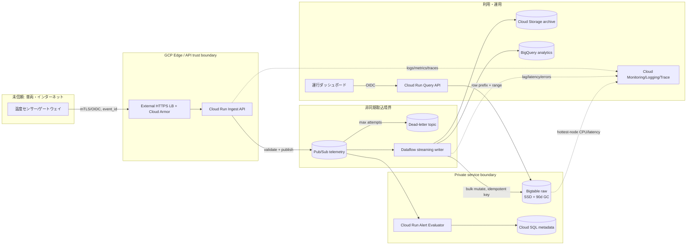

[[Home]]

# Weekly Cloud Engineer Magazine — 2026-08-14

#cloud #aws #oci #gcp #architecture #weekly #deep-dive

> [!warning] 課金・破壊的操作・認証情報
> 標準ラボはローカルDockerだけで完結する。GCPでBigtable、Pub/Sub、Cloud Run、Dataflow、Cloud Storageを作ると、アイドル時を含め課金され得る。特にBigtableのプロビジョンドノードは最低1時間単位で課金される。作成前に学習用プロジェクト、リージョン、予算通知、クォータを確認し、終了後に明示したクリーンアップを実施すること。テーブル削除、GCポリシー変更、クラスタ縮退は検証環境だけで行う。実在車両・顧客・位置情報、実APIキー、サービスアカウント鍵を使わず、Workload Identityと最小権限を使う。

## 1. 今週のテーマ

- **アプリ:** コールドチェーン配送の温度テレメトリ監視。冷蔵車・保冷箱から5秒ごとの温度、湿度、扉開閉、位置セルを受け取り、車両別の直近履歴と温度逸脱アラートを提供する。
- **主実装クラウド:** **Google Cloud**（東京 `asia-northeast1`、本番は単一リージョン複数ゾーン）。
- **主軸:** **Scalability / Performance — Bigtableのrow key設計でホットスポットを防ぎ、車両別範囲検索を維持する**。サービス一覧ではなく、「書込み分散」と「読みたいデータの局所性」の衝突を扱う。
- **難易度シグナル:** **Specialized**。参加条件ではなく、NoSQL物理設計と負荷検証を同時に扱う目安。
- **推定ラボ時間:** **150分**。

### 必要知識・ツール・環境・先行概念

- 必要知識: HTTP、JSON、時系列データ、辞書順ソート、ハッシュ、p95/p99、at-least-once、冪等性。
- ツール: Docker Engine、Python 3.11+、`curl`、`jq`、GNU `sort`/`awk`、任意のエディタ、Mermaid対応ビューア。クラウド拡張はGoogle Cloud CLIとTerraform 1.8+。
- 環境: 2 CPU、4 GB RAM、空き3 GB。クラウド拡張は請求先を分離したサンドボックスだけを使う。
- 先行概念: Bigtableはrow keyで辞書順に並び、joinはなく、トランザクションは単一行に限定される。時刻を先頭にした単調増加キーは最新書込みを狭い範囲へ集中させる。オートスケールは悪いキー設計の代用品ではない。

### 測定可能な到達目標

1. `timestamp#device` と `shard#tenant#device#reverse_timestamp` の分布差を、上位1%バケットの書込み比率で説明できる。
2. 10万デバイス、20,000 events/sを想定し、日次データ量、保持容量、必要処理余力を計算できる。
3. 車両1台の直近30分を1つの連続row rangeで取得できるキーを設計する。
4. 重複`event_id`を業務上1件として扱い、遅延・再送がアラートを二重発報しないことを検証する。
5. p99書込みレイテンシ、hottest-node CPU、エラー率、consumer lagからスケール判断を行える。

### 学習レイヤー

1. **Foundation:** row key、tablet、ホットスポット、アクセスパターン、時系列保持。
2. **Practical implementation:** 悪いキーと良いキーを生成し、分布・範囲検索・重複排除をローカルで比較。
3. **Production concerns:** Bigtable autoscaling、Key Visualizer、IAM、暗号化、VPC、SLO、容量・費用。
4. **Optional advanced challenge:** 二次アクセスパターン用派生テーブル、跨リージョンDR、オンライン再キーイング。

## 2. 要件、負荷、SLO、復旧、予算

### 機能要件

- デバイスは5秒ごとに測定値を送信し、切断時は最大6時間を端末に蓄積して再送する。
- 運行管理者はテナントと車両を指定し、直近30分を2秒以内に表示する。
- 温度が許容範囲を連続3回外れたら1分以内にアラートを作る。同一逸脱区間の通知は1回だけ。
- 90日分をオンライン検索し、7年保存が必要な確定集計はCloud Storageへ出力する。
- 管理者はデバイス失効、保持期間変更、監査検索を行える。

### 非機能要件と明示的な見積り

| 項目 | 仮定・目標 |
|---|---|
| デバイス | 平常10万台、3年後30万台 |
| 送信周期 | 5秒。平常20,000 events/s、再接続バースト60,000 events/sを10分 |
| イベントサイズ | wire 350 B、Bigtable物理保存はキー・列・複製前で平均220 Bと仮定 |
| 読取り | ダッシュボード200 QPS、1回あたり360行（30分/5秒） |
| 日次イベント | 20,000 × 86,400 = **17.28億件/日** |
| 日次論理量 | 17.28億 × 220 B ≈ **380 GB/日** |
| 90日論理量 | **34.2 TB**。圧縮率、GC遅延、複製数を別途掛ける |
| 取込SLO | 有効イベントの99.9%を受領から60秒以内に検索可能 |
| API SLO | 月間99.95%、車両30分検索 p95 < 500 ms、p99 < 1.5 s |
| 書込みSLO | Bigtable mutation p99 < 100 ms、エラー率 < 0.1%（アプリ観測） |
| RTO/RPO | リージョン内障害 RTO 10分/RPO 0目標。リージョン災害 RTO 4時間/RPO 15分 |
| コンプライアンス仮定 | 位置情報は個人情報相当。国内保存、テナント分離、操作証跡7年。PCI対象外 |
| 予算枠 | 初期本番 **月USD 8,000相当以内**。税、為替、サポート、割引、インターネット転送を除く概算 |

**重要:** 平均20k events/sだけで設計しない。端末の一斉再接続は3倍、将来台数は3倍なので、入口は60k events/sを短時間吸収し、データ層は計測に基づき段階増強する。SLO対象外にできるのは不正署名・仕様外ペイロードであり、429や内部タイムアウトは容量不足として失敗に数える。

## 3. Architecture Decision Record（ADR-033）

### 判断事項

大量時系列データを、車両別の時間範囲検索を保ちながら偏りなく書く物理データモデルを選ぶ。

### 検討した選択肢

| 選択肢 | 長所 | 弱点 |
|---|---|---|
| Cloud SQL/PostgreSQLの時刻パーティション | SQL、制約、運用知識が豊富 | 数十億行/日ではsharding、VACUUM、索引、接続管理が主課題になる |
| BigQueryへ直接保存 | 大規模分析と圧縮に強い | 車両別の対話的な最新値APIの主ストアには不向き。ストリーミングと検索費用の形も異なる |
| Firestore | 開発しやすくリアルタイムUIと相性がよい | この規模の連続時系列スキャンと書込み単価では主用途に合いにくい |
| **Bigtable + Pub/Sub** | 高スループット、row range読取り、GC、水平拡張 | キー設計が性能を支配。join/任意検索がなく、最低運用費が大きい |

### 決定

主ストアはBigtable。rawテーブルのrow keyを次とする。

```text
{bucket2}#{tenant_id}#{device_id}#{reverse_ts_19d}#{event_id_8}

bucket2 = hex(SHA-256(tenant_id + ":" + device_id))[0:2]
reverse_ts = 9999999999999999999 - epoch_microseconds
```

同一車両の`bucket2/tenant/device`は固定され、最新順の範囲読取りができる。デバイスIDが十分多いため書込みは256 prefixへ分散する。`event_id_8`は同一時刻衝突を避ける短縮表現で、完全なevent IDはセルにも保存する。PIIをrow keyに入れず、tenant/deviceは不透明IDにする。

### トレードオフと却下

- ハッシュprefixは「全テナントの時刻範囲」という横断検索を256 rangeへ分散させる。このアクセスは運用APIから外し、DataflowでBigQuery/Cloud Storageへ派生する。
- 時刻先頭キーは単一range検索が簡単でも最新書込みが末尾へ集中するため却下。
- 完全ランダムevent ID先頭は均等だが、車両別検索が散らばるため却下。
- 時間bucketを行にまとめるwide-row案は圧縮効率が高い一方、同一車両への頻繁な行更新と再送競合が増えるため、まずは1イベント1行を採用する。実測後に15分bucketを再評価する。

## 4. アーキテクチャとデータフロー



### リクエスト／データフロー

1. デバイスは`event_id`、`device_id`、測定時刻、連番、測定値を署名付きで送る。APIはデバイス状態と時刻ずれを確認する。
2. Ingest APIはPub/Subへのpublish成功後に202を返す。Bigtable書込み完了を待たない。
3. Dataflowはeventを正規化しrow keyを生成、バルクmutationする。同一`event_id`は同じキーへ上書きするため再送を収束させる。
4. Query APIはtenant/deviceからbucketを再計算し、reverse timestampの開始・終了をrow rangeへ変換する。全表scanは禁止。
5. アラート評価はイベント時刻と連番で遅延・逆順を扱い、`tenant#device#excursion_start`の一意キーで通知を重複排除する。

## 5. セキュリティ、ネットワーク、テレメトリ

### IAMと信頼境界

- デバイスは短期トークンまたは相互TLS。1台の失効が他車両へ影響しないIDを持つ。
- Ingest SA: 対象topicへのpublisherと、必要最小限のメタデータ読取りだけ。Bigtable権限なし。
- Dataflow worker SA: subscription subscriber、対象Bigtable tableへのdata editor、archive bucketへのobject creator。プロジェクトEditorは禁止。
- Query SA: Bigtable readerのみ。テナントIDは認証済みclaimから導出し、リクエスト本文を信用しない。
- 運用者: 閲覧、再送、スキーマ変更、IAM管理を別ロールに分離。Break-glassは期限付き承認と監査を必須にする。

### 暗号化、ネットワーク、秘密

- TLS 1.2+。保存時はGoogle管理鍵を標準とし、規制要件があればBigtable/StorageにCMEKを採用し、鍵管理者とデータ管理者を分離。
- Cloud RunからGoogle APIはPrivate Google Access/Private Service Connectを検討。管理面への公開IP依存を減らし、VPC Service Controlsでデータ持出し境界を作る。
- API秘密を環境変数へ直書きせずSecret Manager参照。サービスアカウント鍵ファイルは発行しない。
- Cloud Armorは粗いレート制限と既知攻撃遮断。正当な再接続バーストはdevice/tenant単位のquotaとPub/Subで吸収する。

### ログ、メトリクス、トレース

- 構造化ログ: `trace_id,event_id_hash,tenant_hash,device_hash,result,latency_ms`。生の位置・token・payloadは記録しない。
- メトリクス: ingress RPS/429/5xx、Pub/Sub oldest-unacked-age、Dataflow backlog、Bigtable mutation latency/error、cluster CPU、**hottest-node CPU**、storage utilization、query row count。
- トレース: LB→Cloud Run→publishまで。非同期部分はtrace contextを属性で引継ぐ。
- アラート: 5分窓で取込SLI <99.5%、oldest-unacked >60秒、p99 >100ms、hottest-node CPU高止まり。平均CPUだけでホットスポットを隠さない。

## 6. 容量・性能・費用モデル

### 容量モデル（すべて設計見積り）

```text
events/s = devices / interval = 100,000 / 5 = 20,000
events/day = 20,000 × 86,400 = 1.728B
logical/day = 1.728B × 220B = 380.16GB
90d logical = 34.2TB
physical estimate = logical × compression(0.65) × GC/compaction headroom(1.2)
                  ≈ 26.7TB / cluster
two clustersなら保存コピーは約53.4TB
```

ノード数は公開QPSの一般値から決め打ちしない。ペイロード、バッチ、キー分布、GC、同居tableで変わるため、最低30 GBの本番相当データを入れ、重い負荷を数分、通常シミュレーションを1時間行い、Key Visualizerとhottest-node CPUで決める。初期仮置きはEnterprise 6 nodes、autoscaling 6–18 nodes、CPU target 60%。60k events/sと検索200 QPSでSLOを満たすまで増減する。

### 費用モデル（2026-08-14確認、USD、税・割引除外）

Google公式Bigtable pricingの東京を含む表示ではEnterprise nodeは **$0.65/node-hour**、SSDは **$0.000232877/GiB-hour**。料金は変更され得るためデプロイ直前にPricing CalculatorとCloud Billing SKUで再確認する。

| 項目 | 算式 | 月額概算 |
|---|---:|---:|
| Bigtable compute | 6 nodes × 730h × $0.65 | **$2,847** |
| SSD storage | 26,700 GiB × 730h × $0.000232877 | **$4,537** |
| Bigtable小計 | 上記合計 | **$7,384** |
| Pub/Sub/Dataflow/Cloud Run/Logging | 実測前の予備枠 | **別途** |

したがって初期予算$8,000は**単一クラスタでも余裕が薄い**。30日raw + 90日集計、Bigtable tiered storage、列削減、圧縮実測、古いrawのCloud Storage退避をADRで比較する。二クラスタ化は保存コピーとcomputeを増やし予算超過するため、DR要件と費用を経営判断に上げる。無料枠前提にしない。

## 7. 150分ガイドラボ

標準ラボはBigtableを作らず、row key分布とクエリ性をローカルで再現する。

### 0–15分: 準備と仮説

作業ディレクトリを作り、Python 3.11を確認する。架空の256 tenants、20,000 devices、各100 eventsを対象にする。

**チェックポイント:** 「timestamp先頭は最新時刻へ集中」「device先頭は車両検索に強い」を予測し記録。

### 15–45分: キー生成器

次の3案を出力する小さなスクリプトを作る。

```python
bad = f"{ts:019d}#{device}#{event_id[:8]}"
good = f"{sha256((tenant+':'+device).encode()).hexdigest()[:2]}#{tenant}#{device}#{MAX_TS-ts:019d}#{event_id[:8]}"
randomized = f"{event_id}#{tenant}#{device}#{ts:019d}"
```

1イベントをJSONLで出し、同じevent IDを1%再送する。

**期待結果:** goodは同一イベントのキーが同じ。bad/randomizedも一意にはなるが検索・分布の性質が違う。

### 45–75分: 分布テスト

先頭2文字を仮想tablet bucketとして件数を集計し、最大bucket比率、上位1%比率、変動係数を算出する。badは時刻prefixなので、時間窓を狭めると少数bucketへ集中する。goodはデバイスハッシュで概ね分散する。

**合格基準:** goodの最大bucketが平均の2倍未満。生成数が少ない場合は標本誤差を説明する。

**検証:** device IDの末尾だけが増える偏った入力、単一大口tenant、再接続で同一車両が100倍送る入力も試す。「ハッシュすれば必ず安全」ではなく、1台の極端なhot rowは別の制御が必要と確認する。

### 75–105分: 範囲検索と重複排除

1台・30分のstart/end reverse timestampを計算し、goodキーを辞書順で範囲抽出する。event IDの集合でも件数を確認する。

**期待結果:** goodは固定prefix配下の1 rangeで最新順に得られ、1%再送後も業務イベント数は元件数と一致。randomizedは全event ID空間をscanしないと同じ検索ができない。

### 105–130分: 障害注入

consumerを30秒停止した想定でbacklogを増やし、復帰時を通常の3倍で処理する計算を行う。処理能力が60k/sなら20k/s流入に対する純減は40k/sで、30秒×20k=600k件を15秒で解消できる。

**チェックポイント:** oldest-unacked ageが60秒未満へ戻る、重複しても件数とアラートが増えない、CPU targetだけでなくp99を確認する。

### 130–150分: 設計レビューとクリーンアップ

- ADRに実測分布、query range、失敗条件を追記。
- ローカルコンテナと生成JSONLだけを削除。削除対象パスを表示してから実行する。
- 任意クラウド拡張を行った場合、Dataflow job停止、subscription/topic、table、instance、Cloud Run、bucketの順で**リソース名とproject IDを確認**して削除し、Billing画面で残存課金を確認する。

> [!danger] クラウド拡張
> Bigtable instance/table削除は破壊的で復旧不能になり得る。学習用project以外では実行しない。CLIの`--quiet`は使わず、削除前に一覧とproject IDを保存する。

## 8. 障害・復旧訓練・ランブック

### シナリオ: 一斉再接続でhotspotとconsumer lagが同時発生

症状はingress正常、Pub/Sub backlog増、Bigtable p99悪化、平均CPU 55%だがhottest-node CPU 95%。原因は一部旧ファームウェアが`timestamp#device`形式へ書く互換経路を通り、最新キー範囲へ集中したこと。

### ランブック

1. **宣言:** Incident Commanderを指名。SLO burn、oldest-unacked、hottest-node、エラー分類を記録。
2. **保護:** 問題firmware cohortをdevice単位で制限。全体遮断は避け、Pub/Subへ正常受付を継続する。
3. **容量:** autoscaling上限到達とノード再配置待ちを確認。必要なら上限を一時的に上げるが、費用上限と承認を記録。
4. **経路修正:** writer feature flagで全書込みをgood keyへ固定。bad tableへの二重書込みを止める。
5. **整合性:** backlog解消後、event ID、device sequence gap、時間窓件数を突合。アラートの一意キーを検査。
6. **再キーイング:** Dataflow batchでbad rowsをgood tableへcopyし、読取りをdual-read、差分ゼロ確認後に切替。
7. **回復判定:** 30分間、lag <60秒、p99 <100ms、error <0.1%、hottest-node CPU <70%。
8. **事後:** 旧schema書込みを組織policy/CI contract testで禁止し、Key Visualizer画像と実測RTO/RPOを残す。

### DR演習

単一リージョン構成ではBigtableバックアップとCloud Storage archiveから別リージョンへ復元する手順を四半期実施する。書込み凍結時刻、最後にarchiveされたevent time、復元件数、query smoke testから実RPO/RTOを算出する。RPO 15分が復元方式で満たせなければ、2クラスタ複製または二重publishを予算付きで再ADR化する。

## 9. AWS / OCI / GCPマッピングと移植性

| 能力 | GCP（主実装） | AWS等価候補 | OCI等価候補 |
|---|---|---|---|
| HTTPS入口 | External LB + Cloud Armor + Cloud Run | API Gateway/ALB + WAF + ECS/Lambda | API Gateway + WAF + Functions/Container Instances |
| バッファ | Pub/Sub | Kinesis Data Streams または SQS | Streaming または Queue |
| 時系列wide-column/KV | Bigtable | DynamoDB | NoSQL Database Cloud Service |
| stream処理 | Dataflow | Managed Service for Apache Flink / Lambda | Functions / Data Flow |
| archive/analytics | Cloud Storage + BigQuery | S3 + Athena/Redshift | Object Storage + Autonomous Data Warehouse |
| 可観測性 | Cloud Monitoring/Logging/Trace, Key Visualizer | CloudWatch, Contributor Insights | Monitoring, Logging, APM |

GCP固有のlock-inはBigtable row-range、column family GC、Key Visualizer、Dataflow connector。移植性を上げるにはCanonical EventをProtobuf/JSON Schemaで管理し、row-key関数を独立ライブラリ＋golden testにし、archiveをParquetで保存する。ただし「最小公倍数API」でBigtableのrange性能を捨てない。

AWS DynamoDBではpartition keyへ均等な活動を分散し、sort keyで時刻範囲を表す。1 partitionの設計上限やadaptive capacityを理解し、大口deviceにはwrite shardingを検討する。OCI NoSQLではon-demand capacityが動的負荷を扱うが、上限を事前検証し、消費RU/WUをアプリ監査ログへ残す。各クラウドのautoscaling課金単位、強整合読取り、TTL/GC、バックアップ、跨リージョン整合性は同一ではない。

## 10. Well-Architected形式レビュー

### Operational Excellence

- schema versionをeventとrowに持ち、互換性テストと段階展開があるか。
- Key Visualizer、hottest-node、lagを週次レビューし、変更前後を保存するか。
- 容量増強、DLQ replay、再キーイング、DRが承認済みrunbookか。

### Security

- サービスごとにSAを分け、鍵ファイルなし、最小権限か。
- tenantは認証claimから確定し、row keyにPIIを入れていないか。
- ログredaction、CMEK責任分離、VPC Service Controlsの要否を判断したか。

### Reliability

- Pub/Sub再送、逆順、重複、6時間遅延を正常系として扱うか。
- バックアップの作成ではなく別instanceへの復元を測ったか。
- autoscaling上限、quota、リージョン障害時の書込み方針が明示されているか。

### Performance Efficiency

- 全queryがrow keyまたは狭いrangeへ落ち、scanがないか。
- 30GB以上の代表データ＋1時間通常負荷で検証したか。
- 平均CPUだけでなくhottest-nodeとp99を見ているか。

### Cost Optimization

- raw保持日数、cell version、GC、圧縮率、複製数を毎月確認するか。
- node-hour、storage、Dataflow、Pub/Sub、Loggingをtag/labelで配賦できるか。
- autoscaling最小値がアイドルを含む固定費になることを予算化したか。

### Production-readiness checklist

- [ ] 主要3アクセスパターンと禁止scanをADRに記録
- [ ] row-key golden testとschema version互換テスト
- [ ] 60k events/s、1時間、代表30GB以上の負荷試験
- [ ] p95/p99、hottest-node、lag、errorのdashboardとSLO alert
- [ ] quota、autoscaling min/max、費用alert、緊急増強承認
- [ ] device/tenant rate limit、DLQ、replayの冪等性
- [ ] IAM分離、短期資格情報、秘密redaction、監査保持
- [ ] GC policy、backup、restore、archive完全性検証
- [ ] RTO/RPO実測と四半期DR演習
- [ ] 一部tenantが全体を圧迫しないfairness test

## 11. 具体的な成果物

1. ADR-033（選択肢、キー形式、却下理由、再評価条件）。
2. 3方式のrow key生成器とgolden test。
3. 分布レポート（最大bucket、上位1%、変動係数、偏りケース）。
4. 車両30分queryのstart/end key例と計測結果。
5. 容量・費用シート（台数、周期、サイズ、保持、圧縮、cluster数を変数化）。
6. SLO dashboard仕様とalert一覧。
7. hotspot＋lag障害runbook、DR訓練記録テンプレート。
8. production-readiness checklistの判定と未解決リスク一覧。

## 12. 理解度チェック

### Q1. なぜ`timestamp#device`は危険か

<details><summary>回答</summary>
Bigtableはrow keyの辞書順で配置するため、単調増加する時刻を先頭にすると最新書込みが狭い末尾rangeへ集中し、ノード追加前後でもhotspotを作る。時刻は高cardinalityなdevice等の後ろへ置く。
</details>

### Q2. ランダムUUID先頭なら十分か

<details><summary>回答</summary>
書込み分散には有利だが、車両別30分検索が多数のrangeまたは全scanになる。キーは分布だけでなく主要queryから逆算する。
</details>

### Q3. 平均CPU 55%なら健全か

<details><summary>回答</summary>
断定できない。hottest-nodeが95%、p99悪化、lag増加ならhotspotである。平均は偏りを隠す。
</details>

### Q4. 30秒停止後、流入20k/s、復帰処理60k/sなら600k backlogは何秒で解消するか

<details><summary>回答</summary>
復帰中も20k/s流入するので純減40k/s。600k ÷ 40k = 15秒。起動・再balance・再送の余裕は別に加える。
</details>

### Q5. autoscalingを有効にすれば悪いrow keyは直るか

<details><summary>回答</summary>
直らない。ノード追加は総容量を増やすが、狭いkey rangeへ集中する負荷は均等利用できない。schema修正、rate limit、再キーイングが必要。
</details>

### 設計／面接質問

最大顧客1社が全書込みの40%を占め、さらに1台が10分間で通常の1,000倍を送る。既存queryを壊さず、tenant fairnessとsingle-device hotspotをどう抑えるか。キー、quota、隔離table/instance、replay、SLO、費用の観点で説明せよ。

### フォローアップ challenge

`device_id`が分からず「倉庫セル×時刻」で検索する新要件を追加する。主tableをscanせず、Dataflowで派生index tableを構築し、dual-writeではなく再処理可能なイベントログから生成する。遅延SLO、整合性、再構築時間、追加費用をADRに追記する。

## 13. 現行公式リファレンス（2026-08-14確認）

### Google Cloud（主実装）

- [Bigtable schema design best practices](https://docs.cloud.google.com/bigtable/docs/schema-design)
- [Schema design for time series data](https://docs.cloud.google.com/bigtable/docs/schema-design-time-series)
- [Design a schema and test with Key Visualizer](https://docs.cloud.google.com/bigtable/docs/schema-design-steps)
- [Bigtable pricing](https://cloud.google.com/bigtable/pricing)
- [Pub/Sub documentation](https://cloud.google.com/pubsub/docs)
- [Dataflow documentation](https://cloud.google.com/dataflow/docs)
- [Cloud Run documentation](https://cloud.google.com/run/docs)
- [Google Cloud Architecture Framework](https://cloud.google.com/architecture/framework)

### AWS（等価性）

- [DynamoDB partition key best practices](https://docs.aws.amazon.com/amazondynamodb/latest/developerguide/bp-partition-key-design.html)
- [DynamoDB burst and adaptive capacity](https://docs.aws.amazon.com/amazondynamodb/latest/developerguide/burst-adaptive-capacity.html)
- [Kinesis Data Streams documentation](https://docs.aws.amazon.com/streams/latest/dev/introduction.html)
- [AWS Well-Architected Framework](https://docs.aws.amazon.com/wellarchitected/latest/framework/welcome.html)

### OCI（等価性）

- [Oracle NoSQL Database Cloud Service — Plan your service](https://docs.oracle.com/en/cloud/paas/nosql-cloud/fkdyw/)
- [OCI Streaming documentation](https://docs.oracle.com/en-us/iaas/Content/Streaming/home.htm)
- [OCI Monitoring documentation](https://docs.oracle.com/en-us/iaas/Content/Monitoring/home.htm)
- [OCI Architecture Center](https://docs.oracle.com/en/solutions/)

### 公式入口

- [AWS Documentation](https://docs.aws.amazon.com/)
- [OCI Documentation](https://docs.oracle.com/en-us/iaas/Content/home.htm)
- [Google Cloud Documentation](https://cloud.google.com/docs)
